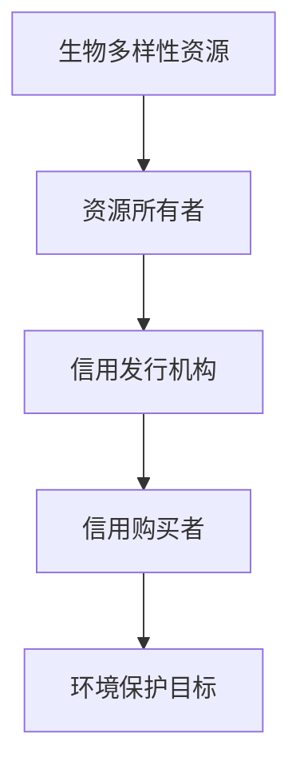
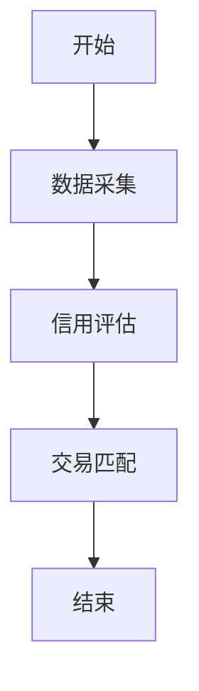
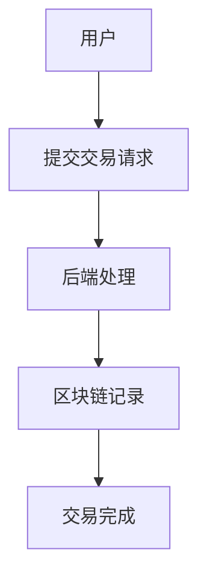

                 


# 生物多样性信用交易机制的可行性研究

## 关键词：生物多样性、信用交易、环境保护、经济机制、可持续发展

## 摘要：  
生物多样性信用交易机制是一种结合市场机制与生态保护的创新模式，旨在通过经济手段激励各方参与生物多样性保护。本文从概念、可行性分析、算法原理、系统设计等方面深入探讨该机制的可行性，结合实际案例和项目实现，提出改进建议和未来发展方向。

---

## 第一部分：生物多样性信用交易机制的背景与概念

### 第1章：生物多样性与信用交易机制概述

#### 1.1 生物多样性的概念与重要性
- **1.1.1 生物多样性的定义**  
  生物多样性是指地球上所有生物的多样性，包括遗传多样性、物种多样性和生态系统多样性。它是地球生态系统稳定性和功能性的基础。

- **1.1.2 生物多样性的重要性与价值**  
  生物多样性为人类提供了食物、药物、工业原料等资源，同时也是维持生态平衡、气候调节和水土保持的关键因素。

- **1.1.3 生物多样性保护的现状与挑战**  
  当前，生物多样性面临严重威胁，如栖息地破坏、气候变化、过度开发等。传统的保护手段依赖政府和非营利组织，效果有限，亟需引入市场机制。

#### 1.2 信用交易机制的基本概念
- **1.2.1 信用交易机制的定义**  
  信用交易机制是一种通过市场手段分配资源或权利的经济工具，广泛应用于碳交易、排污权交易等领域。

- **1.2.2 生物多样性信用交易机制的核心要素**  
  - 信用单位：以生物多样性价值为基础，量化为可交易的信用额度。  
  - 参与主体：包括信用发行者（保护者）、信用购买者（开发者）和监管机构。  
  - 交易流程：包括信用生成、评估、交易和监管。

- **1.2.3 生物多样性信用交易机制的独特性**  
  与碳交易不同，生物多样性信用交易涉及多物种和生态系统的复杂性，信用价值难以直接量化。

#### 1.3 生物多样性信用交易机制的提出背景
- **1.3.1 全球生物多样性危机的加剧**  
  生物多样性的丧失速度远超自然淘汰速度，威胁生态系统的稳定性。

- **1.3.2 可持续发展与环境保护的需求**  
  联合国《生物多样性公约》要求各国采取行动保护生物多样性，但缺乏有效的激励机制。

- **1.3.3 市场机制在环境保护中的作用**  
  市场机制通过经济激励，引导企业和个人参与环境保护，提高保护效率。

---

### 第2章：生物多样性信用交易机制的核心概念与联系

#### 2.1 核心概念原理
- **2.1.1 生物多样性信用的基本原理**  
  信用生成基于生态保护的投入，如保护面积、物种恢复等，通过评估其生态价值，转化为信用额度。

- **2.1.2 信用交易的经济机制**  
  通过市场交易，将保护者的信用额度转移到开发者手中，实现环境保护与经济发展的双赢。

- **2.1.3 机制与生态保护目标的关联**  
  生物多样性信用交易机制通过经济手段，将保护目标转化为可量化的信用价值，推动生态保护的实际行动。

#### 2.2 核心概念属性特征对比表
- 表2-1: 生物多样性信用与其他信用类型属性对比  
| 属性         | 生物多样性信用 | 碳信用 | 排污权信用 |
|--------------|---------------|--------|-----------|
| 核心资源     | 生物多样性    | 碳排放 | 污染物    |
| 参与主体     | 保护者、开发者 | 企业和政府 | 企业和政府 |
| 交易目的     | 生态保护      | 减少碳排放 | 污染控制 |
| 信用价值     | 生态价值      | 碳价值 | 污染处理成本 |

#### 2.3 实体关系图（ER图）


---

### 第3章：生物多样性信用交易机制的算法原理

#### 3.1 算法原理概述
- **3.1.1 信用生成算法**  
  通过评估生态保护项目的投入和产出，生成相应的信用额度。

- **3.1.2 信用评估模型**  
  基于生态价值、经济成本和项目效果，建立信用评估模型。

- **3.1.3 交易匹配机制**  
  根据供需匹配算法，将买方和卖方匹配，实现信用交易。

#### 3.2 算法流程图


#### 3.3 算法实现代码
```python
def calculate_credit(biodiversity_value):
    # 生物多样性价值评估（单位：公顷）
    credit = biodiversity_value * 0.1  # 假设信用价值为生态价值的10%
    return credit

# 示例数据
biodiversity_value = 100  # 每公顷的生态价值
credit = calculate_credit(biodiversity_value)
print(f"生成的信用额度为: {credit}")
```

---

### 第4章：数学模型与公式分析

#### 4.1 生物多样性信用评估模型
- **4.1.1 模型公式**  
  信用价值 = 生物多样性价值 × 信用转换系数  
  $$ \text{信用价值} = \text{生物多样性价值} \times \text{信用转换系数} $$  

- **4.1.2 示例分析**  
  假设某生态保护项目面积为10公顷，生态价值为50万元/公顷，信用转换系数为0.1，则信用价值为50万元 × 0.1 = 5万元。

---

## 第二部分：生物多样性信用交易机制的系统分析与架构设计

### 第5章：系统分析与架构设计

#### 5.1 问题场景介绍
- 系统目标：构建一个支持生物多样性信用交易的在线平台，实现信用生成、评估、交易和监管的全流程管理。  
- 项目介绍：基于区块链技术的信用交易平台，确保信用的透明性和不可篡改性。

#### 5.2 系统功能设计
- 功能模块：
  - 数据采集：采集生态保护项目的数据，如面积、物种种类等。  
  - 信用评估：基于模型计算信用额度。  
  - 交易管理：实现买方和卖方的匹配与交易。  
  - 监管与审核：确保交易的合规性和透明性。

#### 5.3 系统架构设计


#### 5.4 系统接口设计
- 典型接口：
  - `/api/generate_credit`：生成信用额度。  
  - `/api/transaction`：处理交易请求。  
  - `/api/validate`：验证信用的真实性。

#### 5.5 系统交互流程图


---

## 第三部分：生物多样性信用交易机制的项目实战

### 第6章：项目实战

#### 6.1 环境搭建
- 技术栈：Python、Django、区块链框架（如Hyperledger Fabric）。  
- 工具安装：安装Python环境、Django框架和区块链节点。

#### 6.2 核心代码实现
```python
# models.py
from django.db import models

class BiodiversityCredit(models.Model):
    identifier = models.CharField(max_length=100, unique=True)
    value = models.DecimalField(max_digits=10, decimal_places=2)
    issuer = models.CharField(max_length=100)
    issue_date = models.DateTimeField(auto_now_add=True)

    def __str__(self):
        return f"{self.identifier} - {self.value}"
```

```python
# views.py
from django.shortcuts import render, redirect
from .models import BiodiversityCredit

def create_credit(request):
    if request.method == 'POST':
        identifier = request.POST['identifier']
        value = request.POST['value']
        issuer = request.POST['issuer']
        BiodiversityCredit.objects.create(
            identifier=identifier,
            value=value,
            issuer=issuer
        )
        return redirect('credit_list')
    return render(request, 'create_credit.html')

def credit_list(request):
    credits = BiodiversityCredit.objects.all()
    return render(request, 'credit_list.html', {'credits': credits})
```

#### 6.3 案例分析
- 示例场景：某企业购买信用额度用于抵消其开发项目的生态影响。  
- 实施步骤：  
  1. 保护者申请信用额度，提交项目数据。  
  2. 平台评估信用价值，生成信用记录。  
  3. 企业购买信用额度，完成交易。  
  4. 平台记录交易，确保信用的透明性和可追溯性。

---

## 第四部分：总结与展望

### 第7章：总结与展望

#### 7.1 研究总结
- 生物多样性信用交易机制通过市场机制激励生态保护，具有较高的可行性和发展潜力。  
- 当前实现的关键技术包括区块链、智能合约和大数据分析。

#### 7.2 未来发展方向
- 技术优化：引入人工智能算法，提高信用评估的精准性。  
- 政策支持：推动相关法律法规的制定，规范信用交易市场。  
- 拓展应用：探索信用交易在更广泛生态领域的应用，如湿地保护和海洋生态修复。

#### 7.3 最佳实践 tips
- 数据采集：确保数据的准确性和完整性，建立多方验证机制。  
- 技术实现：采用区块链技术，确保信用的透明性和不可篡改性。  
- 政策配合：与政府和相关机构合作，推动机制的规范化和规模化。

---

## 作者：AI天才研究院/AI Genius Institute & 禅与计算机程序设计艺术 /Zen And The Art of Computer Programming

