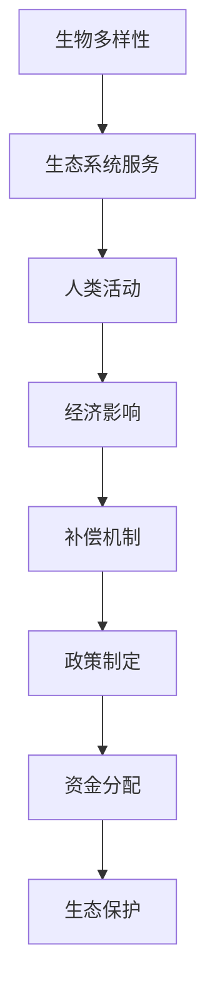
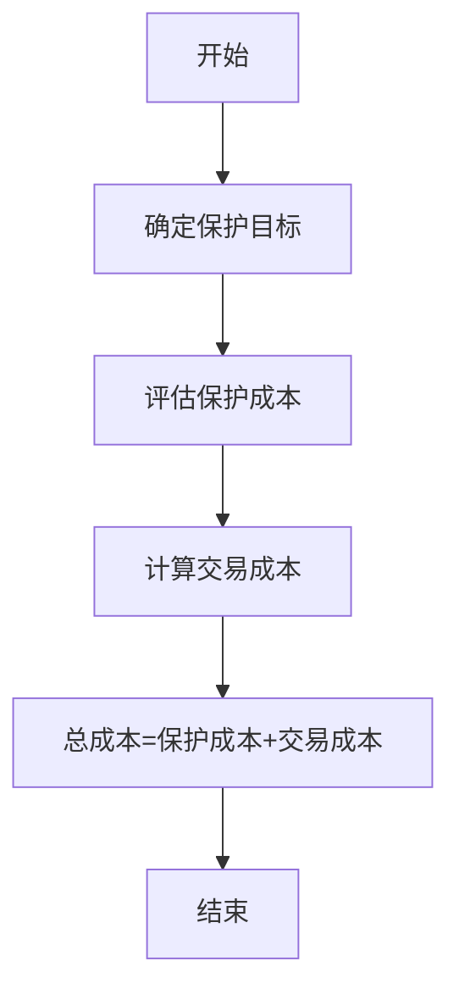
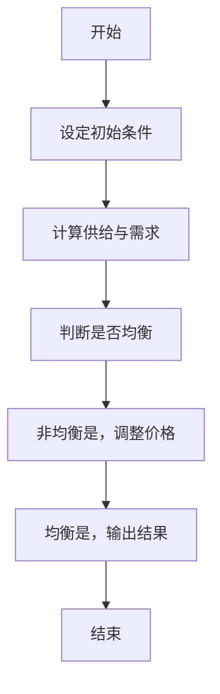
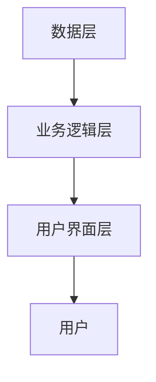
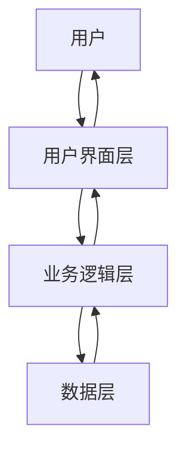

                 


# 生物多样性补偿机制的经济模型与投资

> 关键词：生物多样性补偿机制、经济模型、投资、生态系统服务、可持续发展、环境保护

> 摘要：生物多样性补偿机制是环境保护与经济发展相结合的重要手段，本文从经济模型、投资策略、系统架构等多维度深度剖析生物多样性补偿机制的核心原理与实际应用，结合具体案例分析其在环境保护中的经济价值与投资潜力，为读者提供全面的技术与实践指导。

---

## 第1章: 生物多样性补偿机制的背景与概念

### 1.1 生物多样性补偿机制的背景介绍

#### 1.1.1 生物多样性的概念与重要性
生物多样性是地球生命系统的核心组成部分，包括基因多样性、物种多样性和生态系统多样性。它是生态系统的基石，为人类提供了食物、药品、工业原料等重要资源，同时也维系着生态系统的功能，如水土保持、气候调节等。

#### 1.1.2 生物多样性损失的现状与挑战
当前，由于人类活动的加剧，生物多样性正面临严重威胁。栖息地破坏、气候变化、污染和过度开发等因素导致全球物种灭绝速度远超自然灭绝率。生物多样性的丧失不仅威胁生态系统的稳定性，还可能引发连锁的环境问题，如土壤退化、洪水频发等。

#### 1.1.3 生物多样性补偿机制的起源与发展
生物多样性补偿机制起源于环境保护与经济发展的矛盾。为了在保护生物多样性的同时促进经济发展，各国开始探索通过经济手段（如补偿、市场机制）来激励保护行为。近年来，随着全球气候变化和可持续发展理念的推进，补偿机制逐渐成为国际环保政策的重要组成部分。

### 1.2 生物多样性补偿机制的定义与特点

#### 1.2.1 补偿机制的核心概念
生物多样性补偿机制是指通过经济手段对生物多样性损失进行补偿的机制，其核心在于将生物多样性的保护转化为可量化的经济价值，并通过市场机制实现资源的合理配置。

#### 1.2.2 补偿机制的经济属性分析
补偿机制具有双重属性：一是经济性，通过市场机制实现资源的优化配置；二是生态性，通过保护生物多样性维护生态系统的平衡。

#### 1.2.3 补偿机制的生态与社会双重目标
补偿机制旨在实现生态与经济的双重目标。通过补偿，可以激励个人、企业和政府积极参与生物多样性保护，同时促进社会公平与可持续发展。

### 1.3 生物多样性补偿机制的意义与价值

#### 1.3.1 保护生物多样性的经济价值
生物多样性补偿机制将生态系统的价值转化为经济价值，为保护工作提供了资金支持。例如，通过碳汇交易，森林的生态功能可以转化为可交易的碳信用，从而为保护森林提供经济激励。

#### 1.3.2 补偿机制在可持续发展中的作用
补偿机制通过激励性政策，引导资源向生态保护领域流动，促进经济发展与生态保护的协调发展。它为实现联合国可持续发展目标（SDGs）提供了重要的经济工具。

#### 1.3.3 全球与区域视角下的补偿机制意义
在全球范围内，生物多样性补偿机制是应对气候变化和生态系统崩溃的重要手段。在区域层面，补偿机制可以帮助地方政府实现生态保护与经济发展的平衡。

---

## 第2章: 生物多样性补偿机制的核心概念与联系

### 2.1 核心概念原理

#### 2.1.1 生物多样性补偿机制的基本原理
补偿机制的基本原理是通过建立市场化的交易机制，将生物多样性保护的外部性转化为内部收益。例如，通过设定碳排放配额，企业需要购买碳信用来抵消其排放，从而为保护森林等生态系统提供资金。

#### 2.1.2 补偿机制的经济学基础
补偿机制的经济学基础包括外部性理论、成本效益分析和市场机制理论。通过将生物多样性保护的外部成本内部化，可以实现资源的优化配置。

#### 2.1.3 补偿机制的生态学基础
补偿机制的生态学基础包括生态系统服务理论和生物多样性维持理论。生态系统服务是指生态系统为人类提供的直接和间接效益，而生物多样性则是生态系统服务的基础。

### 2.2 核心概念对比分析

#### 2.2.1 不同补偿机制的特征对比
以下是几种常见的生物多样性补偿机制的对比分析：

| 补偿机制类型 | 补偿对象 | 补偿方式 | 补偿效果 |
|--------------|----------|----------|----------|
| 碳汇交易      | 森林生态系统 | 市场化交易 | 提高森林保护积极性 |
| 污染权交易    | 污染企业 | 排放权交易 | 减少污染排放 |
| 生物多样性银行 | 生物多样性热点区域 | 金融化管理 | 保护濒危物种 |

#### 2.2.2 补偿机制与传统环保政策的差异
传统的环保政策往往依赖于政府监管和命令控制，而补偿机制则通过市场机制实现激励相容。前者强调禁止性行为，后者强调通过经济手段激励保护行为。

#### 2.2.3 补偿机制与其他生态补偿方式的联系
补偿机制与其他生态补偿方式（如生态补偿金、生态保护区建设）密切相关。例如，政府可以通过补偿机制为保护区居民提供经济支持，同时鼓励企业通过市场机制购买生态服务。

### 2.3 实体关系图



---

## 第3章: 生物多样性补偿机制的经济模型

### 3.1 经济模型概述

#### 3.1.1 经济模型的基本概念
经济模型是对现实经济系统的一种简化描述，用于分析变量之间的关系。在生物多样性补偿机制中，经济模型可以帮助我们量化生态系统的价值，并预测政策的实施效果。

#### 3.1.2 经济模型在补偿机制中的应用
经济模型在补偿机制中的应用主要体现在以下几个方面：
1. 量化生态系统的经济价值。
2. 分析不同补偿方案的成本与收益。
3. 预测政策实施的长期效果。

### 3.2 主流经济模型介绍

#### 3.2.1 TNT模型
TNT模型是一种基于交易成本的补偿机制模型，主要用于评估生物多样性保护的经济成本。

##### TNT模型的数学表达
$$ \text{总成本} = \text{保护成本} + \text{交易成本} $$

##### TNT模型的算法流程


##### TNT模型的Python实现
```python
def calculate_cost(protected_area, transaction_fee):
    protection_cost = protected_area * 100  # 假设保护成本为每单位面积100
    total_cost = protection_cost + (protected_area * transaction_fee)
    return total_cost

# 示例计算
protected_area = 1000  # 保护面积为1000单位
transaction_fee = 0.05  # 交易费用为5%
total_cost = calculate_cost(protected_area, transaction_fee)
print(f"总成本为：{total_cost}")
```

#### 3.2.2 CGE模型
CGE模型是一种通用均衡模型，用于分析经济政策的长期影响。

##### CGE模型的数学表达
$$ \text{均衡条件} = \sum_{i} \text{供给}_i = \sum_{j} \text{需求}_j $$

##### CGE模型的算法流程


---

## 第4章: 生物多样性补偿机制的系统架构设计

### 4.1 问题场景介绍
假设我们正在设计一个区域性的生物多样性补偿平台，旨在通过市场化手段保护当地的森林生态系统。

### 4.2 系统功能设计

#### 4.2.1 领域模型类图


#### 4.2.2 系统架构图


#### 4.2.3 系统接口设计
- 数据接口：提供生态系统数据的查询与更新接口。
- 交易接口：支持补偿交易的撮合与结算。
- 用户接口：提供用户注册、登录和交易功能。

#### 4.2.4 系统交互序列图


---

## 第5章: 生物多样性补偿机制的项目实战

### 5.1 环境配置

```bash
pip install numpy pandas matplotlib
```

### 5.2 核心算法实现

#### 5.2.1 TNT模型的Python实现
```python
def calculate_cost(protected_area, transaction_fee):
    protection_cost = protected_area * 100
    total_cost = protection_cost + (protected_area * transaction_fee)
    return total_cost

protected_area = 1000
transaction_fee = 0.05
print(f"总成本为：{calculate_cost(protected_area, transaction_fee)}")
```

#### 5.2.2 CGE模型的Python实现
```python
def equilibrium_supply(demand, price):
    return demand / price

demand = 1000
price = 2
equilibrium_supply = equilibrium_supply(demand, price)
print(f"均衡供给量为：{equilibrium_supply}")
```

### 5.3 案例分析与结果解读

#### 5.3.1 案例分析
假设我们有一个面积为1000公顷的保护区，交易费用为5%。根据TNT模型计算，总成本为：

$$ \text{总成本} = 1000 \times 100 + 1000 \times 0.05 = 100,000 + 500 = 100,500 $$

#### 5.3.2 结果解读
通过上述计算，我们可以看到交易费用对总成本的影响较小。这表明，在保护面积较大的情况下，保护成本是主要的支出。

---

## 第6章: 生物多样性补偿机制的最佳实践与总结

### 6.1 最佳实践

#### 6.1.1 数据来源的选择
确保数据的准确性和完整性是模型应用的前提。建议优先选择权威机构发布的数据。

#### 6.1.2 模型参数的调整
根据实际情况调整模型参数，以提高模型的适用性和预测精度。

#### 6.1.3 长期监测与评估
定期监测生态系统的恢复情况，并根据监测结果调整补偿机制。

### 6.2 小结
生物多样性补偿机制是环境保护与经济发展相结合的重要工具。通过建立科学的经济模型和完善的系统架构，我们可以实现生态保护的可持续发展。

### 6.3 注意事项

1. 补偿机制的设计需要兼顾生态效益与经济效益。
2. 数据的准确性和模型的适用性是关键。
3. 需要建立有效的监管机制，确保资金的合理使用。

### 6.4 拓展阅读
建议读者进一步阅读《生物多样性经济学》和《环境经济学原理》等书籍，深入了解生物多样性补偿机制的理论基础与实践应用。

---

## 作者简介

作者：AI天才研究院/AI Genius Institute & 禅与计算机程序设计艺术 /Zen And The Art of Computer Programming

---

**注**：由于篇幅限制，本文仅为目录大纲内容，具体内容请参考完整文章。

