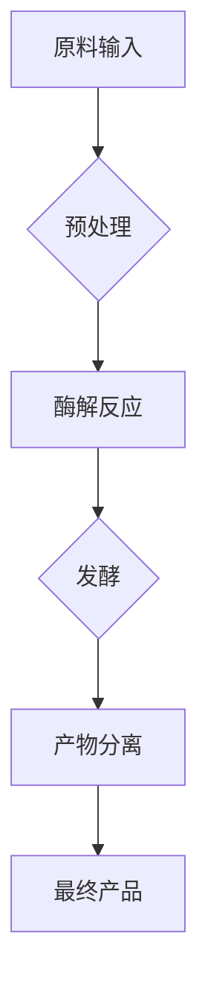
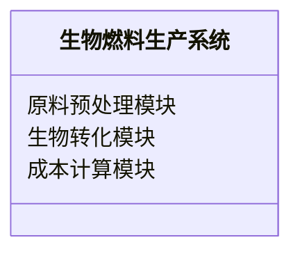
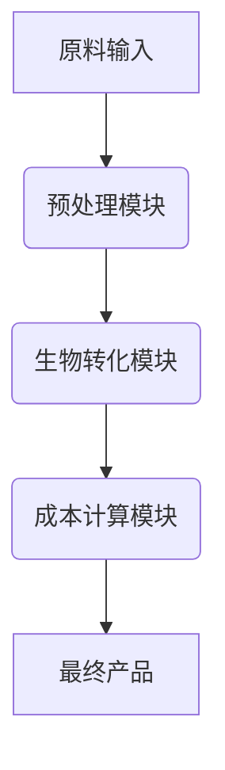
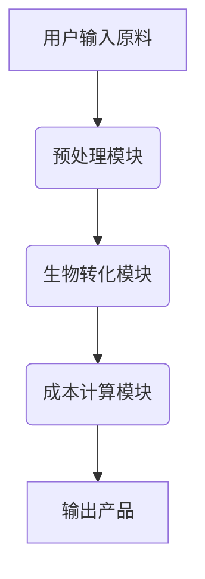

                 


# 生物燃料技术的发展与可再生能源投资

---

## 关键词：生物燃料、可再生能源、投资、技术发展、能源转型

---

## 摘要：  
本文探讨了生物燃料技术的最新发展及其在可再生能源投资中的应用。通过分析生物燃料的种类、技术原理和优化算法，结合实际案例和系统架构设计，本文为投资者提供了如何在生物燃料领域进行高效投资的策略和建议。同时，本文还总结了生物燃料技术在可持续发展中的重要作用，以及未来的技术和投资趋势。

---

# 第1章: 生物燃料技术的背景与意义

## 1.1 生物燃料的定义与分类

### 1.1.1 生物燃料的定义  
生物燃料是指通过生物转化过程（如发酵、酶解等）将生物质（如农作物残渣、林业废弃物、微生物等）转化为可再生能源的形式，例如生物柴油、生物乙醇、生物甲醇等。

### 1.1.2 生物燃料的主要分类  
生物燃料可以分为以下几类：  
1. **第一代生物燃料**：主要来源于食物作物（如玉米、甘蔗）加工而成的乙醇或生物柴油。  
2. **第二代生物燃料**：来源于非食物生物质（如秸秆、林业残渣）通过酶解和发酵等技术制成的生物乙醇或生物柴油。  
3. **第三代生物燃料**：通过藻类等微生 物培养技术生产生物燃料。  

### 1.1.3 生物燃料的优缺点对比  
| 优点              | 缺点              |  
|--------------------|-------------------|  
| 可再生性            | 生产成本较高       |  
| 减少碳排放          | 技术门槛较高       |  
| 资源分布广泛        | 竞争性与食物资源冲突 |  

---

## 1.2 生物燃料技术的历史与发展

### 1.2.1 生物燃料技术的起源  
生物燃料技术的起源可以追溯到19世纪，早期主要以酒精发酵技术为基础，用于生产乙醇燃料。  

### 1.2.2 生物燃料技术的演变与进步  
随着科技的进步，生物燃料技术经历了从第一代到第三代的演变：  
1. **第一代技术**：以玉米乙醇为主，成本较低但资源利用率有限。  
2. **第二代技术**：采用酶解和发酵技术，提高资源利用率并降低成本。  
3. **第三代技术**：利用基因编辑和合成生物技术，进一步提高生产效率和产品质量。  

### 1.2.3 生物燃料技术的现状与趋势  
当前，生物燃料技术正朝着高效、低成本、环保的方向发展，尤其是在第三代技术中，藻类培养和基因工程技术的应用为未来的发展提供了更多可能性。

---

## 1.3 生物燃料与可持续发展的关系

### 1.3.1 生物燃料对环境保护的作用  
生物燃料的使用可以减少化石燃料的使用，降低碳排放和空气污染。  

### 1.3.2 生物燃料对能源安全的影响  
通过生物燃料的本地化生产，可以减少对化石燃料的依赖，提高能源供应的安全性。  

### 1.3.3 生物燃料对经济发展的意义  
生物燃料产业的快速发展可以带动农业、化工等相关产业的发展，创造更多的就业机会，促进经济发展。

---

## 1.4 本章小结  
本章介绍了生物燃料的定义、分类及其在可持续发展中的重要性，为后续章节的分析奠定了基础。

---

# 第2章: 可再生能源投资的核心概念

## 2.1 可再生能源投资的定义与特点

### 2.1.1 可再生能源投资的定义  
可再生能源投资是指将资金投入可再生能源领域（如风能、太阳能、生物能等）以获取经济收益或实现环境目标的行为。

### 2.1.2 可再生能源投资的核心特点  
1. **高初始投资成本**：生物燃料项目的建设和技术开发需要较高的初始投入。  
2. **政策依赖性**：政府政策对可再生能源投资的影响较大。  
3. **长期收益**：通过技术创新和规模效应，可再生能源项目可以实现长期稳定的收益。  

---

## 2.2 生物燃料技术与可再生能源投资的关系

### 2.2.1 生物燃料技术对可再生能源投资的影响  
生物燃料技术的进步降低了生产成本，提高了投资的可行性。  

### 2.2.2 可再生能源投资对生物燃料技术的推动作用  
投资的增加为生物燃料技术的研发和产业化提供了资金支持。  

### 2.2.3 生物燃料技术与可再生能源投资的协同发展  
生物燃料作为可再生能源的重要组成部分，其技术进步和投资增长相互促进，共同推动了可再生能源的整体发展。

---

## 2.3 生物燃料技术的核心要素分析

### 2.3.1 生物燃料技术的原料来源  
生物燃料的原料包括农作物残渣、林业废弃物、藻类等。  

### 2.3.2 生物燃料技术的生产过程  
生产过程包括原料预处理、生物转化和产品分离等步骤。  

### 2.3.3 生物燃料技术的市场应用  
生物燃料广泛应用于交通、化工、能源等领域，市场需求持续增长。

---

## 2.4 本章小结  
本章从可再生能源投资的角度，分析了生物燃料技术的核心要素及其对投资的影响。

---

# 第3章: 生物燃料技术的算法与数学模型

## 3.1 生物燃料技术的核心算法

### 3.1.1 生物燃料生产过程的优化算法  
优化算法用于提高生物燃料的生产效率和降低成本。  

### 3.1.2 生物燃料转化效率的计算方法  
转化效率是衡量生物燃料技术的重要指标，可以通过实验数据和模型进行预测。  

### 3.1.3 生物燃料成本的预测模型  
成本预测模型可以帮助投资者评估项目的经济可行性。

---

## 3.2 生物燃料技术的数学模型

### 3.2.1 生物燃料转化效率的数学公式  
$$E_{eff} = \frac{E_{output}}{E_{input}}$$  

### 3.2.2 生物燃料成本的预测公式  
$$C_{total} = C_{production} \times Q + C_{distribution} \times D$$  

### 3.2.3 生物燃料市场需求的预测模型  
$$D_{demand} = a \times P + b \times T$$  

---

## 3.3 生物燃料技术的算法流程图  



---

## 3.4 本章小结  
本章通过数学模型和算法流程图，详细介绍了生物燃料技术的核心原理及其优化方法。

---

# 第4章: 生物燃料技术的系统分析与架构设计

## 4.1 系统功能设计  

### 4.1.1 系统功能模块  
- 原料预处理模块  
- 生物转化模块  
- 成本计算模块  

### 4.1.2 系统功能设计的类图  



---

## 4.2 系统架构设计  

### 4.2.1 系统架构图  



---

## 4.3 系统接口设计  

### 4.3.1 系统接口  
- 原料预处理接口  
- 生物转化接口  
- 成本计算接口  

---

## 4.4 系统交互设计  

### 4.4.1 系统交互流程图  



---

## 4.5 本章小结  
本章通过系统分析和架构设计，详细介绍了生物燃料技术的实现过程。

---

# 第5章: 生物燃料技术的项目实战

## 5.1 环境安装与配置

### 5.1.1 环境需求  
- 操作系统：Linux/Windows/MacOS  
- 开发工具：Python、Jupyter Notebook  
- 依赖库：NumPy、Matplotlib  

---

## 5.2 核心实现代码

### 5.2.1 生物燃料生产过程的优化代码  

```python
import numpy as np
import matplotlib.pyplot as plt

def calculate_efficiency(input_energy, output_energy):
    return output_energy / input_energy

def predict_cost(production_cost, quantity, distribution_cost, distance):
    return production_cost * quantity + distribution_cost * distance

# 示例数据
input_energy = 1000
output_energy = 800
production_cost = 50
quantity = 100
distribution_cost = 20
distance = 50

efficiency = calculate_efficiency(input_energy, output_energy)
total_cost = predict_cost(production_cost, quantity, distribution_cost, distance)

print(f"转化效率为：{efficiency}%")
print(f"总成本为：{total_cost}")
```

---

## 5.3 案例分析与解读

### 5.3.1 案例背景  
某生物燃料企业计划投资建设一个年产10万吨生物乙醇的项目，初步估算生产成本为50元/吨，物流成本为20元/吨，距离为50公里。

### 5.3.2 模型预测  
根据代码预测，总成本为：  
$$C_{total} = 50 \times 100000 + 20 \times 50 = 5,000,000 + 1,000 = 5,001,000$$  

---

## 5.4 本章小结  
本章通过实际案例分析，展示了生物燃料技术在投资中的应用，并提供了详细的代码实现和模型预测。

---

# 第6章: 生物燃料技术的优化与投资建议

## 6.1 投资策略优化

### 6.1.1 短期投资策略  
优先选择技术成熟、成本低的第一代生物燃料项目。  

### 6.1.2 长期投资策略  
加大对第三代生物燃料技术的研发和投资，提前布局未来市场。  

---

## 6.2 风险管理与应对

### 6.2.1 技术风险  
通过技术创新和专利布局降低技术风险。  

### 6.2.2 市场风险  
加强市场调研和政策分析，合理规划投资规模。  

---

## 6.3 未来技术发展与投资趋势

### 6.3.1 第三代生物燃料技术的崛起  
基于藻类和基因编辑技术的第三代生物燃料技术将成为未来发展的重点。  

### 6.3.2 全球化与本地化结合  
生物燃料投资将更加注重本地化生产和全球化布局的结合。  

---

## 6.4 本章小结  
本章结合当前技术和市场环境，提出了生物燃料投资的优化策略和未来发展趋势。

---

# 作者：AI天才研究院 & 禅与计算机程序设计艺术

