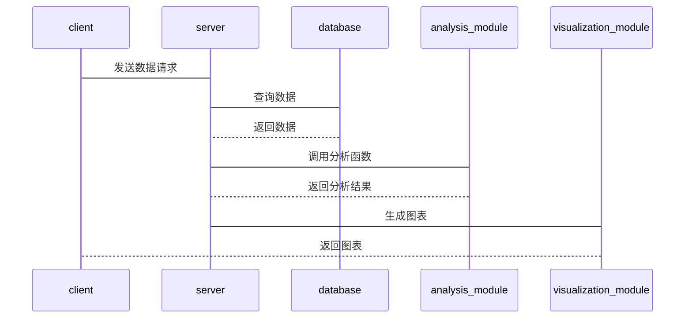

                 


# 监管政策变化对投资环境的影响

> 关键词：监管政策、投资环境、政策变化、经济影响、投资策略

> 摘要：本文探讨了监管政策变化对投资环境的影响，分析了不同类型的监管政策及其对投资决策的传导机制，提出了应对策略和实际案例，以帮助投资者更好地应对监管变化带来的挑战。

---

## 第一章：背景介绍

### 1.1 监管政策的基本概念

#### 1.1.1 什么是监管政策
监管政策是指政府或其他监管机构为规范市场行为、保护消费者权益、促进公平竞争而制定的一系列规则和措施。这些政策涵盖金融、环保、反垄断等多个领域。

#### 1.1.2 监管政策的变化原因
监管政策的变化通常由经济发展、社会需求、技术进步或全球事件驱动。例如，金融危机后，全球监管机构加强了对金融机构的监管。

#### 1.1.3 监管政策对企业的影响
监管政策的变化直接影响企业的经营环境。例如，环保政策的收紧可能导致企业生产成本上升，而金融监管的加强可能影响企业的融资渠道。

### 1.2 投资环境的定义

#### 1.2.1 投资环境的概念
投资环境是指投资者在特定市场中进行投资活动所面临的外部条件，包括政策、经济、法律、社会等多个因素。

#### 1.2.2 投资环境的构成要素
- **政策环境**：政府的法规和政策。
- **经济环境**：GDP增长率、通货膨胀率等经济指标。
- **法律环境**：法律法规的完善程度。
- **社会环境**：社会文化、消费者行为等。

#### 1.2.3 投资环境与经济发展的关系
良好的投资环境能够吸引更多的投资，促进经济增长；反之，恶劣的投资环境可能导致投资减少，影响经济发展。

### 1.3 监管政策变化对投资环境的影响

#### 1.3.1 监管政策变化的类型
- **宽松型**：减少监管，降低企业负担。
- **严格型**：加强监管，提高企业合规成本。
- **适应型**：根据市场变化调整监管力度。

#### 1.3.2 监管政策变化对投资环境的影响路径
1. **直接影响**：政策变化直接影响企业的投资决策。
2. **间接影响**：通过影响市场预期或行业竞争格局，间接影响投资环境。

#### 1.3.3 监管政策变化对投资环境的长期影响
长期来看，合理的监管政策有助于维护市场秩序，促进可持续发展；而过度或不当的监管可能抑制市场活力，阻碍经济增长。

---

## 第二章：核心概念与联系

### 2.1 监管政策与投资环境的核心要素

#### 2.1.1 监管政策的核心要素
- **目标**：规范市场行为，保护公众利益。
- **手段**：法律法规、行政处罚、经济激励等。
- **执行机构**：政府 agencies、行业协会等。

#### 2.1.2 投资环境的核心要素
- **政策稳定性**：政策是否稳定影响投资者信心。
- **政策透明度**：政策是否透明影响投资决策。
- **政策可预期性**：政策是否可预期影响投资规划。

### 2.2 监管政策与投资环境的相互作用

#### 2.2.1 监管政策对投资环境的影响机制
1. **市场准入**：监管政策影响企业的市场准入条件。
2. **成本结构**：监管政策影响企业的运营成本。
3. **投资回报**：监管政策影响投资项目的预期回报率。

#### 2.2.2 投资环境对监管政策的反馈机制
1. **市场压力**：投资者的诉求推动政策调整。
2. **经济表现**：经济表现不佳可能促使政府调整监管政策。

### 2.3 监管政策变化对投资环境的影响模型

#### 2.3.1 监管政策变化的传导路径
1. 监管政策变化 → 企业经营成本变化 → 投资决策变化 → 投资环境变化。

#### 2.3.2 监管政策变化对不同类型投资的影响
- **高合规成本行业**：如金融、环保行业，监管加强可能导致投资减少。
- **低合规成本行业**：如制造业，监管放松可能促进投资增加。

---

## 第三章：算法原理

### 3.1 监管政策变化对投资环境影响的预测模型

#### 3.1.1 模型概述
使用回归分析模型，根据历史数据预测监管政策变化对投资环境的影响。

#### 3.1.2 模型假设
- 投资环境指数与监管政策指数呈线性关系。
- 其他变量对模型的影响较小。

#### 3.1.3 数学模型
$$ Y = \beta_0 + \beta_1 X + \epsilon $$
其中：
- $Y$：投资环境指数。
- $X$：监管政策指数。
- $\beta_0$：截距。
- $\beta_1$：回归系数。
- $\epsilon$：误差项。

#### 3.1.4 代码实现
```python
import statsmodels.api as sm

# 假设X为监管政策指数，Y为投资环境指数
X = sm.add_constant(X)
model = sm.OLS(Y, X).fit()
print(model.summary())
```

#### 3.1.5 模型解读
通过回归分析，可以得出监管政策变化对投资环境的具体影响程度。例如，回归系数$\beta_1$为0.8，意味着监管政策每增加1点，投资环境指数预计增加0.8点。

---

## 第四章：系统分析与架构设计

### 4.1 系统分析

#### 4.1.1 问题场景介绍
假设我们希望构建一个监管政策变化对投资环境影响的监测系统。

#### 4.1.2 系统功能需求
- 数据采集：收集监管政策和投资环境数据。
- 数据分析：分析监管政策变化对投资环境的影响。
- 可视化：生成图表展示分析结果。

#### 4.1.3 系统架构设计
使用分层架构：
- 数据层：数据存储和管理。
- 业务逻辑层：数据分析和处理。
- 表现层：用户界面和可视化。

#### 4.1.4 实体关系图
```mermaid
erDiagram
    reg_entity {
        reg_id : integer
        reg_policy : string
        effective_date : date
    }
    inv_env {
        env_id : integer
        env_index : float
        date : date
    }
    reg_entity --> inv_env : 影响
```

### 4.2 系统架构设计

#### 4.2.1 系统架构图


#### 4.2.2 系统接口设计
- 数据接口：从数据库获取监管政策和投资环境数据。
- 分析接口：调用分析模块进行数据处理。
- 可视化接口：生成图表并展示结果。

#### 4.2.3 系统交互图


---

## 第五章：项目实战

### 5.1 环境安装

#### 5.1.1 安装Python
```bash
python --version
pip install numpy pandas matplotlib
```

#### 5.1.2 安装数据可视化工具
```bash
pip install matplotlib seaborn
```

### 5.2 核心实现

#### 5.2.1 数据采集
```python
import pandas as pd
data = pd.read_csv('reg_policy.csv')
```

#### 5.2.2 数据分析
```python
import statsmodels.api as sm
X = data[['reg_policy']]
Y = data['inv_env']
X = sm.add_constant(X)
model = sm.OLS(Y, X).fit()
```

#### 5.2.3 结果可视化
```python
import matplotlib.pyplot as plt
plt.scatter(X['reg_policy'], Y)
plt.plot(X['reg_policy'], model.predict(X))
plt.xlabel('监管政策指数')
plt.ylabel('投资环境指数')
plt.show()
```

### 5.3 案例分析

#### 5.3.1 案例背景
假设我们分析某国金融监管政策变化对投资环境的影响。

#### 5.3.2 数据分析结果
回归分析结果显示，监管政策变化对投资环境的影响系数为0.7，即监管政策每增加1点，投资环境指数增加0.7点。

#### 5.3.3 结果解读
这表明该国加强金融监管可能会导致投资环境的改善，但需要权衡监管成本对企业的影响。

---

## 第六章：结论与展望

### 6.1 结论

- 监管政策变化对投资环境的影响是多方面的，需要从政策、经济、法律等多个角度进行分析。
- 通过建立数学模型和系统分析，可以更准确地预测监管政策变化对投资环境的影响。
- 投资者和企业应积极适应监管政策的变化，制定灵活的投资策略。

### 6.2 未来展望

- 进一步研究监管政策变化对不同类型投资的影响，如技术创新型企业和传统制造业的差异。
- 开发更复杂的模型，考虑更多变量，如政策执行力度、市场预期等。
- 探讨监管政策变化的国际协调与合作，应对全球化背景下的监管挑战。

---

## 作者：AI天才研究院 & 禅与计算机程序设计艺术

---

通过本文的分析，读者可以全面了解监管政策变化对投资环境的影响，并掌握应对策略。希望本文能为投资者和政策制定者提供有价值的参考。

