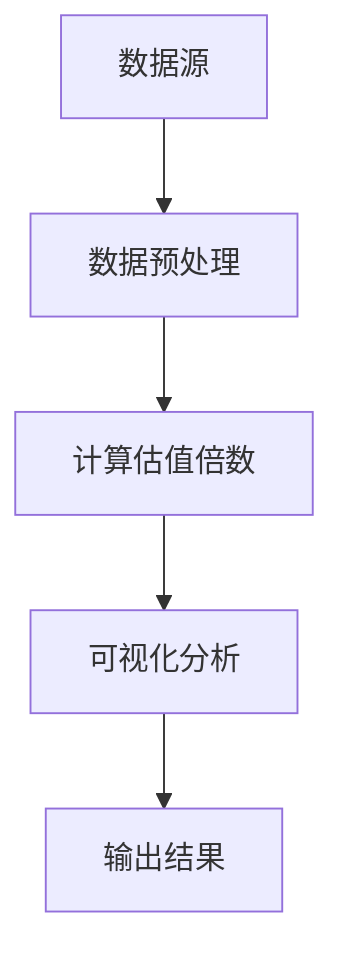
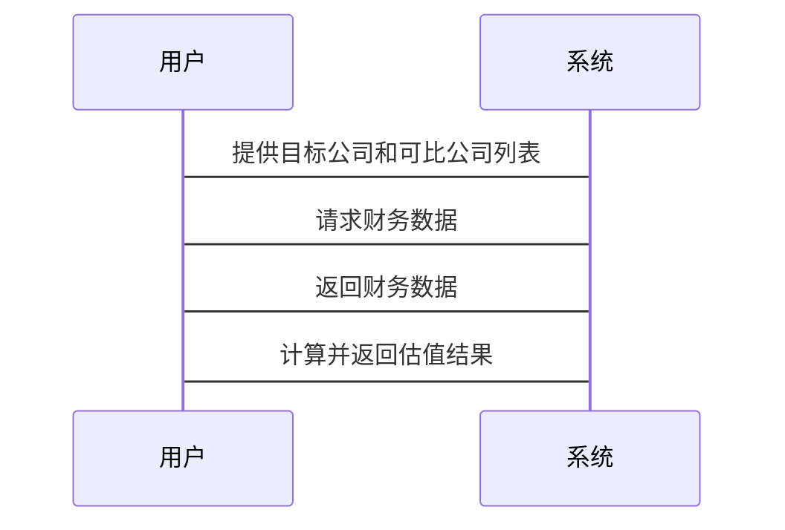

                 


# 相对估值法：市场比较视角下的资产定价

## 关键词：相对估值法，资产定价，市场比较，可比公司分析，估值模型，投资分析

## 摘要：  
相对估值法是一种基于市场比较的资产定价方法，通过分析可比公司的估值指标来确定目标资产的合理价值。本文从背景、概念、算法、数学模型、系统架构、项目实战到最佳实践，全面解析相对估值法的核心原理和应用技巧，帮助读者掌握这一重要投资工具。

---

## 第一部分：相对估值法的背景与核心概念

### 第1章：相对估值法的背景与定义

#### 1.1 传统估值方法的局限性
传统的绝对估值方法（如DCF模型）依赖于对公司未来现金流的预测，但在市场波动较大或信息不充分的情况下，这种方法往往难以提供可靠的估值。此外，绝对估值法对预测的准确性要求较高，且计算过程复杂，难以快速应用于市场比较场景。

#### 1.2 相对估值法的定义与特点
相对估值法是一种基于市场数据的估值方法，通过比较目标公司与可比公司的估值指标（如市盈率、市净率等），推导出目标公司的合理价值。其特点包括：
- **简单易用**：相对估值法依赖于市场数据，计算过程相对简单，适合快速分析。
- **市场敏感性**：估值结果受市场情绪和市场参与者行为的影响较大。
- **相对性**：通过比较可比公司，避免了对单个公司未来现金流预测的高要求。

#### 1.3 相对估值法的适用场景
- **市场流动性充足**：在市场流动性较好的情况下，相对估值法能够提供可靠的参考。
- **可比公司充足**：需要有足够的可比公司数据支持。
- **短期估值参考**：适合用于短期资产定价或市场比较分析。

### 第2章：相对估值法的核心概念与理论基础

#### 2.1 相对估值法的理论基础
相对估值法的理论基础是市场有效性的假设，即市场价格反映了所有可获得的信息。通过比较可比公司的估值指标，可以推断目标公司的合理价值。

#### 2.2 相对估值法的关键指标
相对估值法的核心在于可比公司的估值指标，常用的指标包括：
- **市盈率（P/E）**：公司股价与每股收益的比率。
- **市净率（P/B）**：公司股价与每股净资产的比率。
- **企业价值倍数（EV/EBITDA）**：企业价值与息税折旧及摊销前利润的比率。

#### 2.3 相对估值法的核心步骤
1. **筛选可比公司**：选择与目标公司具有相似业务模式、规模、行业地位的公司。
2. **计算可比公司的估值倍数**：根据可比公司的财务数据，计算其市盈率、市净率等指标。
3. **确定目标公司的合理价值**：通过可比公司倍数的平均值或中位数，推导出目标公司的估值。

---

## 第二部分：相对估值法的数学模型与算法原理

### 第3章：相对估值法的数学模型

#### 3.1 市盈率模型
市盈率（P/E）是相对估值中最常用的指标之一，公式为：
$$P/E = \frac{\text{股价}}{\text{每股收益}}$$  
通过比较目标公司与可比公司的市盈率，可以判断目标公司的估值是否合理。

#### 3.2 市净率模型
市净率（P/B）适用于资产密集型行业，公式为：
$$P/B = \frac{\text{股价}}{\text{每股净资产}}$$  
市净率反映了公司股价与资产价值之间的关系。

#### 3.3 企业价值倍数模型
企业价值倍数（EV/EBITDA）是另一种常用的相对估值指标，公式为：
$$EV/EBITDA = \frac{\text{企业价值}}{\text{息税折旧及摊销前利润}}$$  
企业价值包括公司的债务和股权，适用于跨行业比较。

### 第4章：相对估值法的算法原理

#### 4.1 确定可比公司
筛选可比公司时，需要考虑以下因素：
- 行业：目标公司与可比公司应处于同一行业。
- 规模：可比公司与目标公司在收入、利润等方面应具有可比性。
- 市场地位：可比公司应与目标公司具有相似的市场地位。

#### 4.2 计算可比公司的估值倍数
假设我们选择了一组可比公司，计算它们的市盈率：
$$\text{平均市盈率} = \frac{\sum P/E_{\text{可比公司}}}{\text{可比公司数量}}$$  

#### 4.3 应用倍数到目标公司
目标公司的合理股价可以表示为：
$$\text{目标公司股价} = \text{平均市盈率} \times \text{目标公司每股收益}$$  

---

## 第三部分：相对估值法的系统分析与架构设计

### 第5章：系统分析与架构设计

#### 5.1 系统功能设计
相对估值法的系统需要实现以下功能：
1. 数据收集：获取目标公司和可比公司的财务数据。
2. 估值指标计算：计算目标公司和可比公司的估值倍数。
3. 可视化分析：展示可比公司和目标公司的估值结果。

#### 5.2 系统架构设计
以下是系统架构的Mermaid图：



#### 5.3 系统接口设计
系统需要以下接口：
1. 数据接口：从数据库或API获取目标公司和可比公司的财务数据。
2. 计算接口：计算目标公司和可比公司的估值倍数。
3. 可视化接口：展示估值结果。

#### 5.4 系统交互设计
以下是系统交互的Mermaid图：



---

## 第四部分：相对估值法的项目实战

### 第6章：项目实战

#### 6.1 环境安装
需要安装以下工具：
- Python 3.8+
- Pandas、NumPy、Matplotlib库

#### 6.2 核心代码实现
以下是Python代码示例：

```python
import pandas as pd
import matplotlib.pyplot as plt

# 假设我们有一个包含目标公司和可比公司的数据框
data = {
    '公司': ['目标公司', '可比公司1', '可比公司2', '可比公司3'],
    '股价': [50, 60, 55, 58],
    '每股收益': [5, 6, 5.5, 5.8],
    '每股净资产': [10, 12, 11, 10.5],
    'EBITDA': [100, 120, 110, 105]
}

df = pd.DataFrame(data)

# 计算市盈率
df['P/E'] = df['股价'] / df['每股收益']
average_pe = df['P/E'].mean()

# 计算目标公司股价
target_pe = average_pe
target_stock_price = target_pe * df.iloc[0]['每股收益']

print(f"目标公司合理股价：{target_stock_price}")
```

#### 6.3 代码解读与分析
代码中，我们首先计算了可比公司的市盈率平均值，然后根据目标公司的每股收益，计算了其合理股价。

#### 6.4 案例分析
假设目标公司是某科技公司，我们选择了3家可比公司，计算了它们的市盈率平均值为18。目标公司的每股收益为2元，则目标公司的合理股价为：
$$\text{目标公司股价} = 18 \times 2 = 36 \text{元}$$  

#### 6.5 项目小结
通过相对估值法，我们可以快速得到目标公司的合理股价，但需要注意数据质量和可比公司的选择。

---

## 第五部分：相对估值法的最佳实践

### 第7章：最佳实践

#### 7.1 注意事项
- 确保可比公司与目标公司具有高度可比性。
- 考虑市场情绪对估值结果的影响。
- 结合其他估值方法（如绝对估值法）进行验证。

#### 7.2 小结
相对估值法是一种简单有效的资产定价方法，特别适合在市场数据充分的情况下使用。通过本文的讲解，读者可以掌握其核心原理和应用技巧。

#### 7.3 拓展阅读
- 《投资学》——课本中关于相对估值法的详细讲解。
- 《Python金融计算》——学习如何用Python实现相对估值法。

---

## 作者信息

作者：AI天才研究院/AI Genius Institute & 禅与计算机程序设计艺术 /Zen And The Art of Computer Programming

