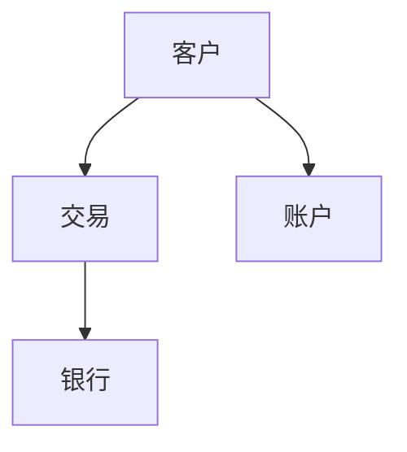
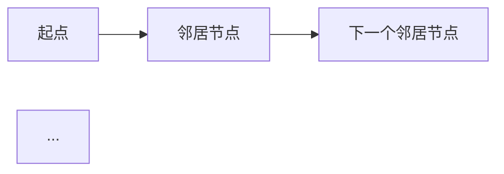
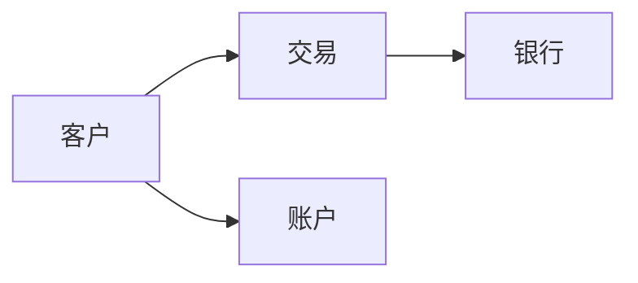

                 


# 知识图谱在金融欺诈检测中的应用

## 关键词：知识图谱，金融欺诈检测，图嵌入，机器学习，实体关系图

## 摘要：知识图谱是一种强大的工具，能够通过构建实体之间的关系网络，帮助金融机构检测欺诈行为。本文详细探讨了知识图谱的核心概念、构建过程及其在金融欺诈检测中的应用。通过分析图嵌入算法和传统机器学习模型，本文展示了如何利用知识图谱的结构信息来提高欺诈检测的准确性和效率。此外，本文还提供了系统架构设计和项目实战案例，帮助读者更好地理解和应用知识图谱技术。

---

## 第一部分: 知识图谱在金融欺诈检测中的应用概述

### 第1章: 知识图谱与金融欺诈检测的背景介绍

#### 1.1 知识图谱的定义与核心概念
知识图谱是一种将实体及其关系以图结构形式表示的知识库。它通过节点（实体）和边（关系）来描述现实世界中的信息。例如，客户、交易、银行、账户等都可以是节点，而交易与客户的关系可以用边表示。

知识图谱的核心在于其结构化和语义化的特性，能够捕捉数据中的深层关联关系。这种关联关系在金融欺诈检测中尤为重要，因为欺诈行为通常涉及复杂的多实体关系。

#### 1.2 金融欺诈检测的背景与挑战
金融欺诈是全球性的难题，涉及信用卡欺诈、洗钱、虚假交易等多种形式。传统的基于规则或单一特征的欺诈检测方法存在以下问题：
- **孤立视角**：无法捕捉跨实体的关联性。
- **特征不足**：难以发现隐藏在复杂关系中的异常行为。
- **动态变化**：欺诈手段不断进化，需要动态更新的检测方法。

知识图谱通过构建完整的金融生态图，能够有效应对上述挑战。

#### 1.3 知识图谱在金融欺诈检测中的解决方法
知识图谱通过以下方式提升金融欺诈检测的效率和准确性：
1. **实体关联分析**：识别异常交易中的关联实体。
2. **图结构信息利用**：通过图嵌入技术捕捉节点的语义信息。
3. **动态更新能力**：支持实时更新和在线检测。

---

### 第2章: 知识图谱的核心概念与联系

#### 2.1 知识图谱的构建原理
知识图谱的构建过程包括以下步骤：
1. **数据采集**：从多个来源（如交易记录、客户信息、账户数据等）获取数据。
2. **数据预处理**：清洗和标准化数据，提取实体和关系。
3. **实体识别与关系抽取**：使用自然语言处理技术识别实体及其关系。
4. **知识图谱存储与管理**：将实体和关系存储到图数据库中。

#### 2.2 知识图谱的特征分析
知识图谱的特征可以通过以下表格进行对比：

| 特征 | 描述 |
|------|------|
| 节点 | 实体，如客户、交易、账户等 |
| 边 | 关系，如“客户进行交易” |
| 属性 | 节点或边的附加信息，如交易金额、时间等 |

#### 2.3 知识图谱的实体关系图
以下是一个简单的实体关系图示例：



---

### 第3章: 知识图谱在金融欺诈检测中的算法原理

#### 3.1 图嵌入算法
图嵌入是一种将图中的节点映射到低维向量空间的技术。常用的图嵌入算法包括：

##### 3.1.1 随机游走
随机游走是一种通过遍历图结构生成节点序列的方法。以下是其实现流程：



随机游走的数学表示为：
$$P(w_i, w_j) = \sum_{k=1}^{n} p(w_i, w_j | k) \cdot P(k)$$

##### 3.1.2 深度学习图嵌入
深度学习图嵌入通过神经网络模型（如图神经网络）生成节点向量。例如，使用以下公式：
$$Z = G \cdot X$$

##### 3.1.3 图神经网络
图神经网络是一种处理图结构数据的深度学习模型。以下是其实现流程：


#### 3.2 传统机器学习算法
传统机器学习算法在知识图谱中的应用包括：

##### 3.2.1 支持向量机
支持向量机是一种常用的分类算法，其优化目标为：
$$\min_{w,b,\xi} \frac{1}{2}||w||^2 + C \sum_{i=1}^{n} \xi_i$$
$$\text{subject to } y_i(w \cdot x_i + b) - 1 + \xi_i \geq 0, \xi_i \geq 0$$$$

##### 3.2.2 随机森林
随机森林是一种基于树的集成算法，适用于高维数据的分类和回归问题。

##### 3.2.3 logistic回归
logistic回归用于二分类问题，其损失函数为：
$$L = -\sum_{i=1}^{n} [y_i \ln p_i + (1-y_i)\ln (1-p_i)]$$

#### 3.3 知识图谱与欺诈检测的结合
通过将知识图谱的节点表示与机器学习模型结合，可以有效检测欺诈行为。例如：
- 使用图嵌入生成节点向量作为模型输入。
- 利用图结构信息发现异常交易模式。

---

### 第4章: 知识图谱在金融欺诈检测中的系统架构与实现

#### 4.1 系统架构设计
以下是系统架构设计图：



#### 4.2 系统功能设计
系统功能包括：
1. **数据采集与预处理**：从多种数据源获取数据并进行清洗。
2. **知识图谱构建**：提取实体和关系，构建金融知识图谱。
3. **欺诈检测**：基于图嵌入或传统算法进行欺诈检测。

---

## 第二部分: 项目实战

### 第5章: 环境安装与核心代码实现
#### 5.1 环境安装
需要安装以下库：
- Python 3.8+
- NetworkX
- Node2Vec
- Scikit-learn

#### 5.2 核心代码实现
以下是基于Node2Vec的图嵌入实现示例：

```python
import networkx as nx
from node2vec import Node2Vec

# 创建图
G = nx.Graph()
G.add_edges_from([("客户1", "交易1"), ("交易1", "银行1"), ("客户1", "账户1")])

# 训练模型
model = Node2Vec(G, walks_per_node=10, num_neg=10)
model.fit()

# 获取节点向量
vector = model.get_vector("客户1")
```

---

### 第6章: 实际案例分析与解读
#### 6.1 案例分析
假设我们检测到一笔异常交易，客户1在短时间内进行了多笔小额交易，涉及多个账户。通过知识图谱分析，发现这些交易与客户1的正常交易模式存在显著差异。

#### 6.2 详细解读
通过图嵌入技术，我们可以将客户、交易等节点表示为低维向量，并使用支持向量机进行分类。如果检测到异常向量，系统会触发报警。

---

## 第三部分: 总结与展望

### 第7章: 总结
知识图谱通过构建金融生态图，有效提升了欺诈检测的准确性和效率。其优势包括：
- **全局视角**：捕捉跨实体的关联性。
- **语义信息**：通过图嵌入捕捉节点的深层语义。
- **动态更新**：支持实时检测和在线更新。

### 第8章: 注意事项与未来展望
#### 8.1 注意事项
- 数据隐私问题需要严格遵守相关法规。
- 知识图谱的构建需要高性能计算资源。

#### 8.2 未来展望
- 结合强化学习进一步优化检测模型。
- 研究动态知识图谱的实时更新方法。

---

## 作者：AI天才研究院 & 禅与计算机程序设计艺术

---

通过以上内容，我们全面介绍了知识图谱在金融欺诈检测中的应用，从理论到实践，为读者提供了详细的指导和案例分析。希望本文能够帮助读者更好地理解知识图谱的技术优势，并将其应用于实际的金融欺诈检测场景中。

