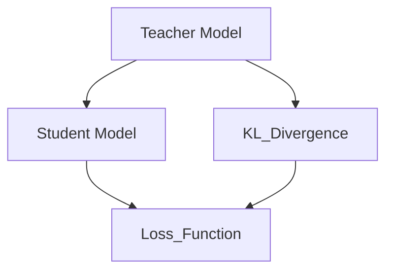
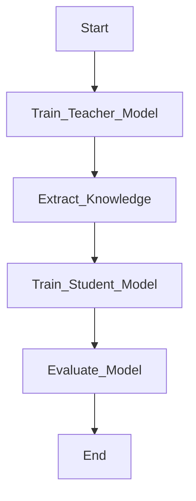
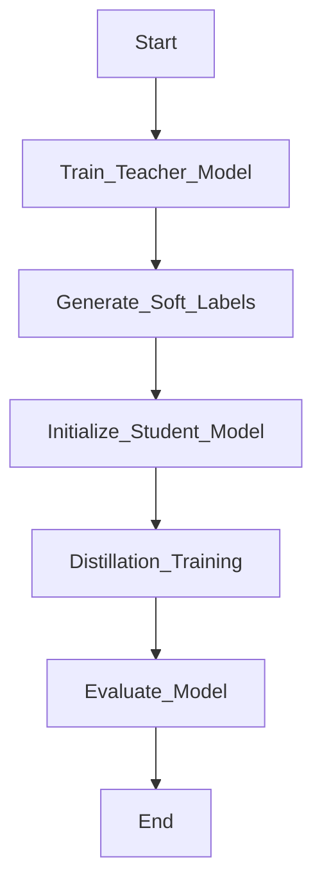
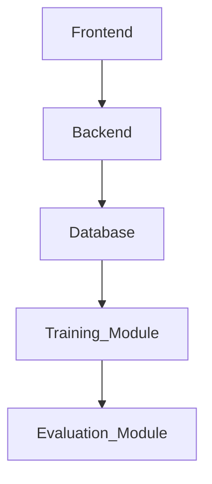

                 


# 知识蒸馏技术在金融模型轻量化中的应用

> 关键词：知识蒸馏、模型轻量化、金融模型、深度学习、模型压缩

> 摘要：本文深入探讨了知识蒸馏技术在金融模型轻量化中的应用，通过分析复杂模型的计算成本和性能需求，提出利用知识蒸馏技术有效降低模型复杂度，同时保持或提升预测精度。文章详细讲解了知识蒸馏的核心原理、算法实现、系统架构设计及实际项目案例，为金融领域的模型优化提供了理论支持和实践指导。

---

## 第一部分：知识蒸馏技术基础

### 第1章：知识蒸馏技术概述

#### 1.1 知识蒸馏技术的背景与问题背景
- 1.1.1 金融模型的复杂性与计算成本  
  金融模型通常涉及复杂的深度学习架构，如 LSTM 和 Transformer，这些模型在处理高维金融数据时表现出色，但其计算成本高昂，尤其是在实时交易和高频数据分析中，资源消耗巨大。  
- 1.1.2 模型轻量化的需求  
  为了在资源受限的环境中（如移动设备或边缘计算）部署金融模型，轻量化成为必然趋势。模型轻量化不仅降低了计算成本，还提高了部署的灵活性。  
- 1.1.3 知识蒸馏技术的提出与目标  
  知识蒸馏技术通过教师模型将知识传递给学生模型，成功地实现了模型压缩，同时保持甚至提升了性能。其核心目标是降低模型复杂度，同时保留关键特征和预测能力。  
- 1.1.4 知识蒸馏技术的边界与外延  
  知识蒸馏技术主要应用于模型压缩和知识转移，其边界包括模型选择、蒸馏策略和性能评估。其外延则涉及领域适应和跨任务迁移。

#### 1.2 知识蒸馏技术的核心概念与问题描述
- 1.2.1 教师模型与学生模型的定义  
  教师模型是一个复杂的预训练模型，负责提取高阶特征；学生模型是一个简单的小模型，通过蒸馏过程学习教师模型的知识。  
- 1.2.2 知识蒸馏技术的核心问题  
  知识蒸馏的核心问题是如何有效地将教师模型的知识转移到学生模型中，同时避免信息损失和过拟合。  
- 1.2.3 知识蒸馏技术的应用场景与限制  
  应用场景包括金融时间序列预测、分类任务等；限制包括对教师模型的依赖和蒸馏过程中的计算开销。

#### 1.3 知识蒸馏技术的核心要素与概念结构
- 1.3.1 教师模型的特征提取  
  教师模型通过复杂的架构提取数据的高层次特征，这些特征是学生模型学习的基础。  
- 1.3.2 学生模型的参数优化  
  学生模型通过蒸馏过程优化其参数，使其能够逼近教师模型的预测能力。  
- 1.3.3 知识蒸馏技术的数学模型  
  知识蒸馏的数学模型基于 KL 散度，用于衡量学生模型预测分布与教师模型软标签之间的差异。  
- 1.3.4 知识蒸馏技术的实现流程  
  知识蒸馏的过程包括教师模型的训练、软标签生成、学生模型的蒸馏训练和最终模型评估。

### 第2章：知识蒸馏技术的核心概念与联系

#### 2.1 知识蒸馏技术的原理
- 2.1.1 教师模型的知识传递  
  教师模型通过软标签生成提供类别概率分布，引导学生模型学习这些概率分布，而非单一标签。  
- 2.1.2 学生模型的学习过程  
  学生模型通过最小化预测分布与软标签之间的 KL 散度，逐步逼近教师模型的预测能力。  
- 2.1.3 知识蒸馏技术的核心算法  
  核心算法包括软标签生成、蒸馏损失计算和学生模型优化。  
- 2.1.4 知识蒸馏技术的实现步骤  
  实现步骤包括教师模型训练、软标签生成、学生模型初始化、蒸馏训练和模型评估。

#### 2.2 知识蒸馏技术的核心概念对比
- 2.2.1 教师模型与学生模型的对比  
  教师模型复杂，学生模型简单；教师模型负责特征提取，学生模型负责预测。  
- 2.2.2 知识蒸馏技术与其他模型压缩技术的对比  
  知识蒸馏与剪枝、量化等技术的优缺点对比，知识蒸馏的优势在于保持模型性能的同时实现压缩。  
- 2.2.3 知识蒸馏技术的优缺点分析  
  优点包括模型压缩、性能提升、适应性强；缺点包括对教师模型的依赖和计算开销。

#### 2.3 知识蒸馏技术的ER实体关系图


#### 2.4 知识蒸馏技术的流程图


## 第二部分：知识蒸馏技术的算法原理

### 第3章：知识蒸馏技术的算法原理

#### 3.1 知识蒸馏技术的数学模型
- 3.1.1 KL散度公式  
  $$ KL(p||q) = \sum p_i \log \frac{p_i}{q_i} $$  
  其中，\( p \) 是教师模型的软标签分布，\( q \) 是学生模型的预测分布。  
- 3.1.2 蒸馏损失函数  
  蒸馏损失函数结合分类损失和蒸馏损失，公式如下：  
  $$ L = \alpha L_{cls} + (1-\alpha) L_{distill} $$  
  其中，\( L_{cls} \) 是交叉熵损失，\( L_{distill} \) 是 KL 散度损失，\( \alpha \) 是平衡系数。  

#### 3.2 知识蒸馏技术的实现步骤
- 3.2.1 教师模型训练  
  使用金融数据训练教师模型，提取高阶特征。  
- 3.2.2 软标签生成  
  教师模型生成软标签，用于指导学生模型学习。  
- 3.2.3 学生模型初始化  
  初始化学生模型参数，通常采用随机初始化或迁移学习。  
- 3.2.4 蒸馏训练  
  在蒸馏阶段，最小化学生模型预测与教师模型软标签之间的 KL 散度。  
- 3.2.5 模型评估  
  使用测试数据评估蒸馏后模型的性能，包括准确率、F1 分数等。

#### 3.3 知识蒸馏技术的流程图


#### 3.4 知识蒸馏技术的Python代码实现
```python
import torch
import torch.nn as nn
import torch.optim as optim
from torch.utils.data import DataLoader

# 定义教师模型和学生模型
class TeacherModel(nn.Module):
    def __init__(self):
        super(TeacherModel, self).__init__()
        self.fc1 = nn.Linear(10, 50)
        self.fc2 = nn.Linear(50, 20)
        self.fc3 = nn.Linear(20, 5)

class StudentModel(nn.Module):
    def __init__(self):
        super(StudentModel, self).__init__()
        self.fc1 = nn.Linear(10, 10)
        self.fc2 = nn.Linear(10, 5)

# 定义损失函数和优化器
criterion = nn.CrossEntropyLoss()
optimizer = optim.Adam(student_model.parameters(), lr=0.001)

# 蒸馏过程
for epoch in range(num_epochs):
    for batch_features, batch_labels in dataloader:
        # 前向传播
        with torch.no_grad():
            teacher_outputs = teacher_model(batch_features)
        student_outputs = student_model(batch_features)
        
        # 计算蒸馏损失
        alpha = 0.5
        loss_cls = criterion(student_outputs, batch_labels)
        loss_distill = kl_div(student_outputs, teacher_outputs)
        total_loss = alpha * loss_cls + (1 - alpha) * loss_distill
        
        # 反向传播和优化
        optimizer.zero_grad()
        total_loss.backward()
        optimizer.step()
```

## 第三部分：系统分析与架构设计

### 第4章：系统分析与架构设计

#### 4.1 系统分析
- 4.1.1 项目背景  
  金融模型的轻量化需求推动了知识蒸馏技术的应用，特别是在高频交易和实时预测中。  
- 4.1.2 系统功能需求  
  系统需要实现教师模型训练、软标签生成、学生模型训练和性能评估。  
- 4.1.3 系统非功能需求  
  包括性能优化、资源利用率和可扩展性。

#### 4.2 系统功能设计
- 4.2.1 领域模型设计  
  使用 Mermaid 类图展示系统功能模块，包括数据预处理、教师模型训练、学生模型训练和性能评估。  
- 4.2.2 系统架构设计  
  使用 Mermaid 架构图展示系统的整体架构，包括前端、后端和数据库的交互关系。  
- 4.2.3 系统接口设计  
  包括数据接口、模型接口和评估接口的设计，确保系统的模块化和可扩展性。  
- 4.2.4 系统交互设计  
  使用 Mermaid 序列图展示系统的交互流程，包括数据输入、模型训练和结果输出。

#### 4.3 系统架构设计


## 第四部分：项目实战

### 第5章：项目实战

#### 5.1 项目背景与目标
- 5.1.1 项目背景  
  本文以股票价格预测为例，展示知识蒸馏技术在金融模型中的应用。  
- 5.1.2 项目目标  
  通过知识蒸馏技术，将复杂的时间序列模型（如 LSTM）压缩为轻量级模型，同时保持预测精度。

#### 5.2 项目实现
- 5.2.1 环境安装  
  安装必要的 Python 库，包括 PyTorch、Scikit-learn 和 Pandas。  
- 5.2.2 核心代码实现  
  包括数据预处理、教师模型训练、学生模型训练和性能评估。  
- 5.2.3 代码解读与分析  
  详细解读代码实现，包括数据加载、模型定义、损失函数和优化器设置。

#### 5.3 项目实战案例分析
- 5.3.1 数据集与数据预处理  
  使用股票价格数据，进行归一化和特征提取。  
- 5.3.2 教师模型训练  
  训练 LSTM 模型，提取时间序列特征。  
- 5.3.3 学生模型训练  
  使用蒸馏过程训练轻量级模型，评估性能。  
- 5.3.4 模型评估与结果分析  
  对比蒸馏前后模型的预测精度和计算效率，展示知识蒸馏技术的有效性。

#### 5.4 项目小结
- 5.4.1 项目成果  
  成功将 LSTM 模型压缩为轻量级模型，预测精度保持在较高水平，计算效率显著提升。  
- 5.4.2 经验总结  
  知识蒸馏技术在金融模型中的应用需要结合具体场景，选择合适的教师模型和蒸馏策略。

## 第五部分：最佳实践与小结

### 第6章：最佳实践与小结

#### 6.1 最佳实践
- 6.1.1 教师模型的选择  
  选择适合蒸馏的教师模型，通常选择性能优秀但参数较多的模型。  
- 6.1.2 蒸馏策略的优化  
  调整蒸馏温度和平衡系数，优化蒸馏过程。  
- 6.1.3 模型评估的注意事项  
  采用多指标评估模型性能，确保评估的全面性。

#### 6.2 小结
- 6.2.1 全文总结  
  知识蒸馏技术是一种有效的模型轻量化方法，能够在保持性能的同时减少模型复杂度。  
- 6.2.2 未来研究方向  
  研究知识蒸馏在多任务学习中的应用，探索更高效的蒸馏策略。

## 第六部分：参考文献与鸣谢

### 6.1 参考文献
- 书籍：《Deep Learning》, Ian Goodfellow, Yoshua Bengio, Aaron Courville  
- 论文：蒸馏在神经网络压缩中的应用，Hinton 等人  

### 6.2 �鸣谢
感谢读者的支持，感谢团队的协作，感谢开源社区的贡献。

---

作者：AI天才研究院/AI Genius Institute & 禅与计算机程序设计艺术/Zen And The Art of Computer Programming

