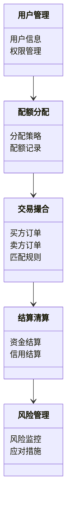
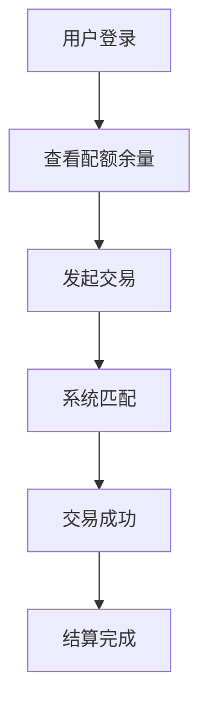
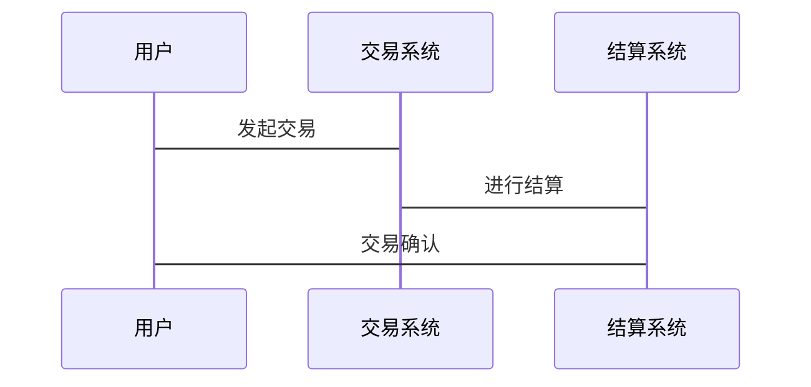

                 

# 碳交易市场的发展与投资机会分析

> 关键词：碳交易、碳配额、碳抵消、碳金融、投资机会、风险管理

> 摘要：碳交易市场作为全球应对气候变化的重要工具，正在快速发展。本文从碳交易市场的背景与发展、经济学分析、投资机会、系统架构设计等多方面展开，深入分析碳交易市场的运作机制、投资潜力及风险管理策略，为投资者和技术开发者提供有价值的参考。

---

## 第一部分：碳交易市场的发展背景与基础

### 第1章：碳交易市场的背景与概念

#### 1.1 碳交易市场的起源与发展

##### 1.1.1 碳交易市场的定义与核心概念
碳交易市场是指通过市场机制将碳排放权（配额）和碳抵消（如碳汇）进行交易的市场。其核心在于将碳排放转化为一种可交易的资产，通过市场机制实现碳排放的低成本控制。碳交易市场的参与者包括政府、企业、金融机构和个人。

碳交易市场的核心概念包括：
1. **碳配额**：政府分配给企业的碳排放上限，超出配额的企业需要通过市场购买额外的配额。
2. **碳抵消**：通过减少碳排放（如植树、使用可再生能源）产生的碳信用，可用于抵消实际排放量。
3. **碳价**：碳配额或碳抵消的市场价格，由市场供需关系决定。

##### 1.1.2 碳交易市场的历史发展与现状
碳交易市场的起源可以追溯到《京都议定书》（1997年），该协议首次引入了碳排放配额机制。随后，欧盟于2005年建立了世界最大的碳交易市场——欧盟碳排放交易系统（EU ETS）。目前，全球多个地区和行业已建立了碳交易市场，如欧盟、美国的RGGI（区域温室气体倡议）、中国的全国碳市场等。

##### 1.1.3 碳交易市场的边界与外延
碳交易市场的边界包括：
1. **覆盖范围**：通常限于能源、工业、交通等高碳排放行业。
2. **交易品种**：包括碳配额、碳抵消、碳期权等金融产品。
3. **地域范围**：从地方试点到全球性市场。

碳交易市场的外延包括碳金融、碳技术、碳服务等相关领域。

#### 1.2 碳交易市场的核心机制

##### 1.2.1 碳配额与碳抵消机制
碳配额机制是碳交易的核心，政府通过设定总量目标，将碳排放配额分配给企业。企业若排放超过配额，需在市场购买额外配额或支付罚款；反之，若排放低于配额，可出售剩余配额。

碳抵消机制允许企业通过实施减排项目（如可再生能源、林业碳汇）产生碳信用，用于抵消实际排放量。

##### 1.2.2 碳市场的供需关系与价格形成
碳市场的价格由供需关系决定。供方包括政府分配的配额和碳抵消项目，需方包括高排放企业。价格波动受政策、经济、技术等因素影响。

##### 1.2.3 碳市场的参与者与角色分析
碳市场的参与者包括：
- **政府**：制定政策、分配配额、监管市场。
- **企业**：购买或出售碳配额，参与碳抵消项目。
- **金融机构**：提供融资、参与碳金融产品交易。
- **个人**：可通过购买碳抵消产品参与。

---

### 第2章：碳交易市场的经济学分析

#### 2.1 碳市场的经济学基础

##### 2.1.1 碳市场的成本收益分析
企业通过碳交易可以降低减排成本。例如，一家企业通过购买碳配额或实施碳抵消项目，可以以更低的成本实现减排目标。

##### 2.1.2 碳市场的均衡模型与数学公式
碳市场的均衡价格可以通过供需模型计算。假设供给函数为 $Q_s = a + bP$，需求函数为 $Q_d = c - dP$，均衡价格 $P^*$ 满足 $a + bP^* = c - dP^*$，解得：

$$
P^* = \frac{c - a}{b + d}
$$

##### 2.1.3 碳市场的外部性与内部化机制
碳市场通过将碳排放的外部性内部化，降低社会成本。企业通过支付碳价，承担减排责任，减少免费搭车问题。

#### 2.2 碳市场的定价机制

##### 2.2.1 碳配额的价格形成模型
碳配额价格由市场供需决定。政府设定总量目标，企业通过交易优化排放成本。价格模型如下：

$$
P = \frac{D}{S}
$$

其中，$D$为需求量，$S$为供给量。

##### 2.2.2 碳市场的供需曲线与均衡价格
需求曲线向右下方倾斜，供给曲线向右上方倾斜，均衡价格为两者交点。

##### 2.2.3 碳市场的波动与风险管理
碳价格波动受政策、经济、技术等因素影响。企业可通过套期保值、多元化投资等方式管理碳价格波动风险。

---

## 第二部分：碳交易市场的投资机会分析

### 第3章：碳交易市场的投资机会

#### 3.1 碳市场的投资领域分析

##### 3.1.1 碳配额交易的投资机会
碳配额价格受政策和市场供需影响，具有波动性。投资者可通过购买配额或参与碳期权交易获利。

##### 3.1.2 碳抵消项目的投资机会
碳抵消项目（如可再生能源、林业碳汇）具有长期收益潜力。投资者可通过投资减排项目，获得碳信用并出售。

##### 3.1.3 碳金融产品的投资机会
碳金融产品（如碳债券、碳基金）为投资者提供了多样化的投资选择。例如，投资于碳基金可通过池子里的项目收益获利。

#### 3.2 碳市场的区域发展与投资潜力

##### 3.2.1 国际碳市场的投资机会
欧盟碳市场是全球最大的碳市场，具有较高的流动性和成熟度。此外，美国、中国、日本等地区也在快速发展碳市场。

##### 3.2.2 国内碳市场的区域发展特点
中国的全国碳市场于2021年启动，主要覆盖电力、化工、建材等高碳行业。地方试点市场（如北京、上海）也提供了多样化的投资机会。

##### 3.2.3 不同行业的碳投资潜力分析
高碳行业（如电力、钢铁）减排需求大，碳配额需求高。可再生能源行业（如风电、光伏）具有较大的碳抵消潜力。

#### 3.3 碳市场的投资策略与风险管理

##### 3.3.1 碳市场的长期投资策略
投资者可通过长期持有碳配额或碳抵消项目，利用碳价格的长期上涨趋势获利。

##### 3.3.2 碳市场的短期交易策略
短期交易策略包括套利、高频交易等，适合熟悉市场机制的专业投资者。

##### 3.3.3 碳市场的组合投资策略
通过组合投资（如同时投资配额和抵消项目），降低风险，提高收益稳定性。

---

### 第4章：碳交易市场的风险管理

#### 4.1 碳市场的价格波动风险

##### 4.1.1 碳价格波动的原因
政策变化、经济波动、技术进步等因素会影响碳价格。

##### 4.1.2 碳价格波动的数学模型
碳价格波动可用随机过程模型描述，例如：

$$
dP = \mu dt + \sigma dW
$$

其中，$\mu$为均值，$\sigma$为波动率，$dW$为随机游走。

##### 4.1.3 碳价格波动的管理策略
投资者可通过对冲、分散投资等方式管理价格波动风险。

#### 4.2 碳市场的信用风险

##### 4.2.1 信用风险的定义
信用风险是指交易对手无法履行合同义务的风险。

##### 4.2.2 信用风险的管理策略
选择信誉良好的交易对手、使用衍生工具对冲信用风险。

#### 4.3 碳市场的政策风险

##### 4.3.1 政策风险的来源
政策变化（如碳配额分配、税收政策）会影响碳市场。

##### 4.3.2 政策风险的管理策略
多元化投资、关注政策动向。

---

## 第三部分：碳交易市场的系统分析与架构设计

### 第5章：碳交易市场的系统架构与实现

#### 5.1 碳交易系统的功能设计

##### 5.1.1 系统功能模块划分
- **用户管理**：管理用户信息，包括企业、机构和个人。
- **配额分配**：根据政策分配碳配额。
- **交易撮合**：匹配买卖双方，完成交易。
- **结算清算**：处理交易资金和碳信用的结算。
- **风险管理**：监控市场风险，制定应对策略。

##### 5.1.2 系统功能的领域模型设计
使用领域模型描述系统功能，如下：

##### 5.1.3 系统功能的流程图设计
描述碳交易的基本流程：

#### 5.2 碳交易系统的架构设计

##### 5.2.1 系统架构的分层设计
- **表现层**：用户界面，提供交易信息展示。
- **业务逻辑层**：处理交易逻辑。
- **数据访问层**：访问数据库，存储交易数据。

##### 5.2.2 系统架构的组件设计
- **用户端**：浏览器或应用程序。
- **交易系统**：处理订单匹配。
- **结算系统**：处理资金和信用结算。
- **监控系统**：实时监控市场风险。

##### 5.2.3 系统架构的交互设计
使用序列图描述交易过程：

---

## 第6章：碳交易市场的数据分析与应用

### 6.1 碳市场的数据采集与处理

#### 6.1.1 数据采集的来源与方法
数据来源包括政府公开数据、企业报告、市场交易数据等。数据采集方法包括爬取、API接口调用等。

#### 6.1.2 数据处理的流程与工具
数据处理流程包括清洗、转换、分析。常用工具包括Python（Pandas）、SQL等。

#### 6.1.3 数据清洗与预处理
数据清洗包括去除重复值、填充缺失值、处理异常值等。

### 6.2 碳交易市场的数据分析与预测

#### 6.2.1 碳价格的预测模型
使用时间序列模型（如ARIMA）预测碳价格：

$$
ARIMA(p, d, q) = \phi(B)(1 - B)^d X_t + \theta(B) \epsilon_t
$$

#### 6.2.2 碳市场的趋势分析
通过数据分析识别碳市场的长期趋势和周期性波动。

#### 6.2.3 碳市场的风险评估
使用统计方法（如VaR）评估碳市场的风险。

---

## 结语

碳交易市场作为应对气候变化的重要工具，正在快速发展。本文从背景、经济学分析、投资机会、系统架构等多方面进行了详细分析，为投资者和技术开发者提供了有价值的参考。未来，碳交易市场将继续与技术进步、政策创新相结合，为全球可持续发展做出更大贡献。

---

**作者：AI天才研究院/AI Genius Institute & 禅与计算机程序设计艺术 /Zen And The Art of Computer Programming**

