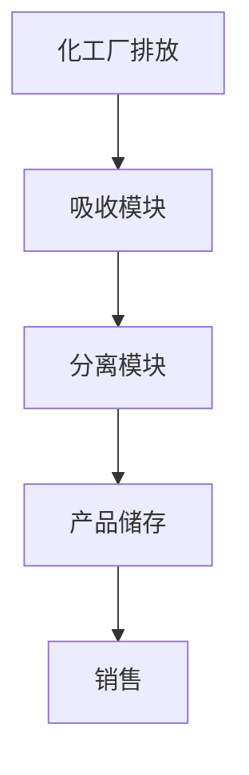

                 

# 碳捕获与利用技术的经济可行性分析

> 关键词：碳捕获，碳利用，经济可行性，环境影响，技术应用

> 摘要：本文详细分析碳捕获与利用技术的经济可行性，探讨其在解决全球气候变化问题中的潜在价值和面临的挑战。通过分析不同捕获技术的成本、效率及利用途径的经济效益，结合实际案例和系统架构设计，评估该技术的商业化潜力。

---

## 第一部分：碳捕获与利用技术的背景介绍

### 第1章：碳捕获与利用技术概述

#### 1.1 碳捕获与利用技术的背景
随着全球气候变化的加剧，碳捕获与利用技术（Carbon Capture and Utilization, CCU）成为减缓温室效应的重要手段。本文将探讨CCU技术的定义、重要性及其在应对气候变化中的作用。

#### 1.2 碳捕获与利用技术的核心概念
- **定义**：CCU技术指将二氧化碳捕获后转化为有用的资源，如燃料、化学品或建筑材料。
- **技术分类**：包括物理吸收、化学吸收、膜分离等多种方法。
- **技术框架**：从捕获到利用的完整流程，涉及多个系统模块的交互。

---

## 第二部分：碳捕获与利用技术的核心概念与联系

### 第2章：碳捕获技术原理与方法

#### 2.1 碳捕获技术的原理
- **吸收法**：利用化学试剂吸收二氧化碳，如胺基溶液。
- **膜分离法**：通过高分子膜的选择透过性分离CO2。
- **化学链法**：通过化学反应将CO2捕获并转化为其他物质。

#### 2.2 碳捕获技术的分类
- **物理吸收法**：基于物理吸附原理，适用于高浓度CO2排放源。
- **化学吸收法**：使用化学反应，如胺类物质吸收CO2。
- **膜分离法**：适用于低浓度CO2的分离。

#### 2.3 碳捕获技术的比较分析
通过表格比较不同捕获技术的成本、效率和适用场景，帮助读者选择最优方案。

| 技术类型 | 成本（美元/吨CO2） | 效率 | 适用场景 |
|----------|------------------|------|----------|
| 吸收法   | 30-50            | 80-90% | 工业废气 |
| 膜分离法 | 50-80            | 70-85% | 低浓度排放 |
| 化学链法 | 40-60            | 75-95% | 高效利用 |

---

## 第三部分：碳捕获与利用技术的经济分析

### 第3章：碳捕获与利用技术的成本结构

#### 3.1 成本构成
- **捕获成本**：设备投资、运营维护。
- **利用成本**：转化工艺、产品销售。
- **间接成本**：环境影响、政策支持。

#### 3.2 经济模型与分析
构建经济模型，计算投资回收期和净现值。

假设年捕获量为10万吨，捕获成本为40美元/吨，利用收益为60美元/吨，则：
- 年净收益 = (60 - 40) * 10,000 = 200万美元。
- 投资回收期 = 初始投资 / 年净收益。

---

## 第四部分：系统架构设计与项目实战

### 第4章：系统架构设计

#### 4.1 项目介绍
以某化工厂为例，设计CCU系统。

#### 4.2 系统功能设计
- 捕获模块：吸收、分离。
- 利用模块：转化为甲醇或其他化学品。
- 监控模块：实时监控捕获效率和收益。

#### 4.3 系统架构图
使用Mermaid绘制系统架构图，展示各模块的交互。

---

## 第五部分：结论与展望

### 第5章：总结与展望

#### 5.1 技术总结
CCU技术在经济和环境效益方面具有潜力，但成本仍需降低。

#### 5.2 未来展望
技术突破和政策支持将推动CCU技术的广泛应用。

---

## 参考文献

- IPCC气候变化报告
- 国际能源署（IEA）CCU技术指南
- 全球碳捕获与封存研究所（GCCSI）报告

---

作者：AI天才研究院 & 禅与计算机程序设计艺术

