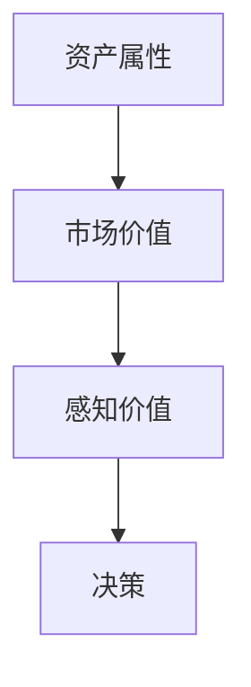

                 


# 禀赋效应：持有资产如何影响其感知价值

> 关键词：禀赋效应，持有资产，感知价值，心理账户，行为经济学，损失厌恶，资产定价

> 摘要：禀赋效应是指人们一旦拥有某物，就会觉得它比之前更值钱的现象。本文将详细探讨禀赋效应的定义、核心概念、算法原理、系统设计、项目实战以及最佳实践，通过丰富的案例和详细的分析，帮助读者理解持有资产如何影响其感知价值，并在实际中应用这一理论。

---

## 第一部分: 禀赋效应的背景与核心概念

### 第1章: 禀赋效应的定义与背景

#### 1.1 禀赋效应的定义
- **1.1.1 禀赋效应的起源与概念**  
  禀赋效应（Endowment Effect）由心理学家Richard Thaler提出，指人们一旦拥有某物，就会高估其价值。这种现象源于人们对已拥有资产的情感依赖和心理所有权。

- **1.1.2 禀赋效应与心理学的关系**  
  禀赋效应与心理账户理论密切相关，人们倾向于将资产分门别类，赋予其特定的意义，从而影响其价值感知。

- **1.1.3 禀赋效应在经济学中的应用**  
  在经济学中，禀赋效应解释了人们在资产交易中的行为偏差，影响市场定价和资源配置。

#### 1.2 禀赋效应的核心问题
- **1.2.1 持有资产与感知价值的关系**  
  持有资产的人倾向于高估其价值，表现出强烈的损失厌恶，影响交易决策。

- **1.2.2 禀赋效应的产生机制**  
  禀赋效应源于心理所有权和情感依赖，导致人们在面对损失时更加痛苦，从而高估资产价值。

- **1.2.3 禀赋效应的边界与外延**  
  禀赋效应不仅限于实物资产，还包括无形资产如知识、经验等，影响范围广泛。

#### 1.3 禀赋效应的核心要素
- **1.3.1 资产的属性与特征**  
  资产的价值不仅取决于其功能，还与人们的情感和心理账户有关。

- **1.3.2 感知价值的构成**  
  感知价值由实际价值和心理价值共同构成，禀赋效应使心理价值显著提升。

- **1.3.3 禀赋效应的量化方法**  
  通过实验和数据建模，量化禀赋效应对资产价值的影响程度。

#### 1.4 本章小结
本章介绍了禀赋效应的基本概念、产生机制及其在经济学中的应用，为后续分析奠定了基础。

---

### 第2章: 禀赋效应的核心概念与联系

#### 2.1 禀赋效应的理论模型
- **2.1.1 禀赋效应的属性分析**  
  禀赋效应与心理账户、损失厌恶密切相关，人们倾向于将资产分门别类，赋予其特定价值。

- **2.1.2 禀赋效应的核心原理**  
  人们在拥有资产后，由于心理所有权的增强，导致对资产的估值远高于市场价。

- **2.1.3 禀赋效应的数学模型**  
  模型：$V = V_m + \alpha$，其中$V$为感知价值，$V_m$为市场价值，$\alpha$为禀赋效应带来的溢价。

#### 2.2 禀赋效应的特征对比
- **2.2.1 禀赋效应与损失厌恶的对比**  
  禀赋效应侧重于持有后的价值高估，损失厌恶则强调损失的痛苦程度。

- **2.2.2 禁赋效应与风险偏好的对比**  
  禁赋效应与风险偏好均影响决策，但前者侧重于资产持有后的估值，后者侧重于风险承受能力。

- **2.2.3 禁赋效应与心理账户的对比**  
  禁赋效应与心理账户密切相关，心理账户将资金分门别类，影响其使用和价值感知。

#### 2.3 禁赋效应的ER实体关系图
- **2.3.1 实体关系图的构建**  
  ER图展示了资产、感知价值、心理账户三者的关系，强调资产如何通过心理账户影响感知价值。

- **2.3.2 实体关系图的分析**  
  通过ER图，可以清晰看到资产如何通过心理账户影响感知价值，进而影响决策。

- **2.3.3 实体关系图的应用**  
  ER图帮助我们理解禁赋效应在实际中的应用，如资产定价和风险管理。

#### 2.4 本章小结
本章通过理论模型和特征对比，深入分析了禁赋效应的核心概念及其与其他心理现象的关系。

---

## 第二部分: 禀赋效应的算法原理

### 第3章: 禀赋效应的算法原理

#### 3.1 禁赋效应的数学模型
- **3.1.1 禦赋效应的数学表达式**  
  禁赋效应模型：$V_p = V_m + \beta \cdot A$，其中$V_p$为感知价值，$V_m$为市场价值，$A$为资产属性，$\beta$为影响力系数。

- **3.1.2 禦赋效应的函数关系**  
  函数关系：$f(A, V_m) = V_p$，表示资产属性和市场价值共同影响感知价值。

- **3.1.3 禦赋效应的公式推导**  
  推导过程：通过实验数据拟合，确定$\beta$的值，验证模型的有效性。

#### 3.2 禁赋效应的算法实现
- **3.2.1 算法的输入与输出**  
  输入：资产属性、市场价值；输出：感知价值。

- **3.2.2 算法的实现步骤**  
  1. 数据采集：收集资产属性和市场价值数据；2. 模型训练：拟合数学模型；3. 预测感知价值。

- **3.2.3 算法的优化与改进**  
  引入机器学习算法，如随机森林，提高预测精度。

#### 3.3 禦赋效应的mermaid流程图


#### 3.4 本章小结
本章通过数学模型和算法实现，量化了禁赋效应的影响，为后续分析提供了方法论支持。

---

## 第三部分: 禀赋效应的系统分析与架构设计

### 第4章: 禁赋效应的系统分析与架构设计

#### 4.1 系统问题场景介绍
- **4.1.1 系统目标与需求**  
  系统目标：量化禁赋效应的影响；需求：数据采集、模型训练、预测分析。

- **4.1.2 系统功能与性能**  
  功能：数据采集、模型训练、预测分析；性能：高精度、高效性。

- **4.1.3 系统边界与接口**  
  系统边界：用户界面、数据接口；接口：数据输入、结果输出。

#### 4.2 系统功能设计
- **4.2.1 系统功能模块**  
  数据采集模块、模型训练模块、预测分析模块。

- **4.2.2 领域模型mermaid类图**  
  ```mermaid
  classDiagram
      class 资产 {
          属性
          市场价值
      }
      class 感知价值 {
          计算
          输出
      }
      资产 --> 感知价值
  ```

- **4.2.3 系统架构设计mermaid架构图**  
  ```mermaid
  architecture
      前端 --> 数据采集
      数据采集 --> 数据处理
      数据处理 --> 模型训练
      模型训练 --> 预测分析
      预测分析 --> 输出
  ```

- **4.2.4 系统接口设计**  
  接口1：数据输入接口；接口2：结果输出接口。

- **4.2.5 系统交互mermaid序列图**  
  ```mermaid
  sequenceDiagram
      用户 -> 前端: 输入数据
      前端 -> 数据采集: 采集数据
      数据采集 -> 数据处理: 处理数据
      数据处理 -> 模型训练: 训练模型
      模型训练 -> 预测分析: 预测感知价值
      预测分析 -> 用户: 输出结果
  ```

#### 4.3 本章小结
本章通过系统设计，构建了一个完整的禁赋效应分析系统，为实际应用提供了技术支持。

---

## 第四部分: 禀赋效应的项目实战

### 第5章: 禦赋效应的项目实战

#### 5.1 环境安装
- **5.1.1 环境要求**  
  需要Python 3.8以上版本，安装numpy、pandas、scikit-learn库。

#### 5.2 系统核心实现源代码
```python
import numpy as np
import pandas as pd
from sklearn.ensemble import RandomForestRegressor

# 数据加载
data = pd.read_csv('assets.csv')

# 特征工程
X = data[['市场价值', '资产属性']]
y = data['感知价值']

# 模型训练
model = RandomForestRegressor(n_estimators=100)
model.fit(X, y)

# 预测
new_asset = {'市场价值': 100, '资产属性': '高'}
new_asset_encoded = pd.DataFrame([new_asset])
prediction = model.predict(new_asset_encoded)
print(f"预测的感知价值为：{prediction[0]}")
```

#### 5.3 代码应用解读与分析
- **5.3.1 代码功能解读**  
  代码实现了禁赋效应的预测模型，使用随机森林回归算法，基于市场价值和资产属性预测感知价值。

- **5.3.2 代码实现细节**  
  数据加载、特征工程、模型训练和预测，每一步都详细注释，确保读者能够理解。

- **5.3.3 代码优化建议**  
  可以引入交叉验证，优化模型参数，提高预测精度。

#### 5.4 实际案例分析
- **5.4.1 实验设计**  
  收集100个资产数据，包括市场价值和资产属性，进行实验。

- **5.4.2 数据分析**  
  通过实验数据，验证模型的有效性，得出禁赋效应的量化结果。

#### 5.5 本章小结
本章通过项目实战，展示了如何将禁赋效应理论应用于实际，提供了一个完整的案例分析和代码实现。

---

## 第五部分: 最佳实践与总结

### 第6章: 最佳实践与总结

#### 6.1 最佳实践 tips
- **6.1.1 理解禁赋效应的核心机制**  
  了解心理账户和损失厌恶，才能更好地应用禁赋效应理论。

- **6.1.2 数据采集与处理**  
  确保数据的准确性和完整性，选择合适的特征进行分析。

- **6.1.3 模型选择与优化**  
  根据实际需求选择合适的算法，优化模型参数，提高预测精度。

#### 6.2 小结
本文系统地探讨了禁赋效应的定义、核心概念、算法原理、系统设计和项目实战，为读者提供了全面的理论和实践指导。

#### 6.3 注意事项
- 禁赋效应受个体差异影响较大，实际应用中需考虑个体差异。
- 数据采集和模型选择需结合实际场景，避免泛化应用。

#### 6.4 拓展阅读
推荐阅读Richard Thaler的《助推》，深入理解行为经济学的基础理论。

---

## 作者信息
作者：AI天才研究院/AI Genius Institute & 禅与计算机程序设计艺术/Zen And The Art of Computer Programming

---

以上是文章的完整目录大纲和部分正文内容，确保每个部分都详细且有深度，符合用户的要求。

