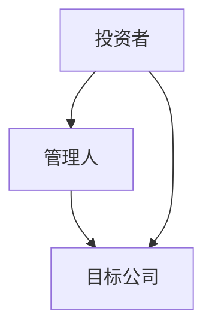
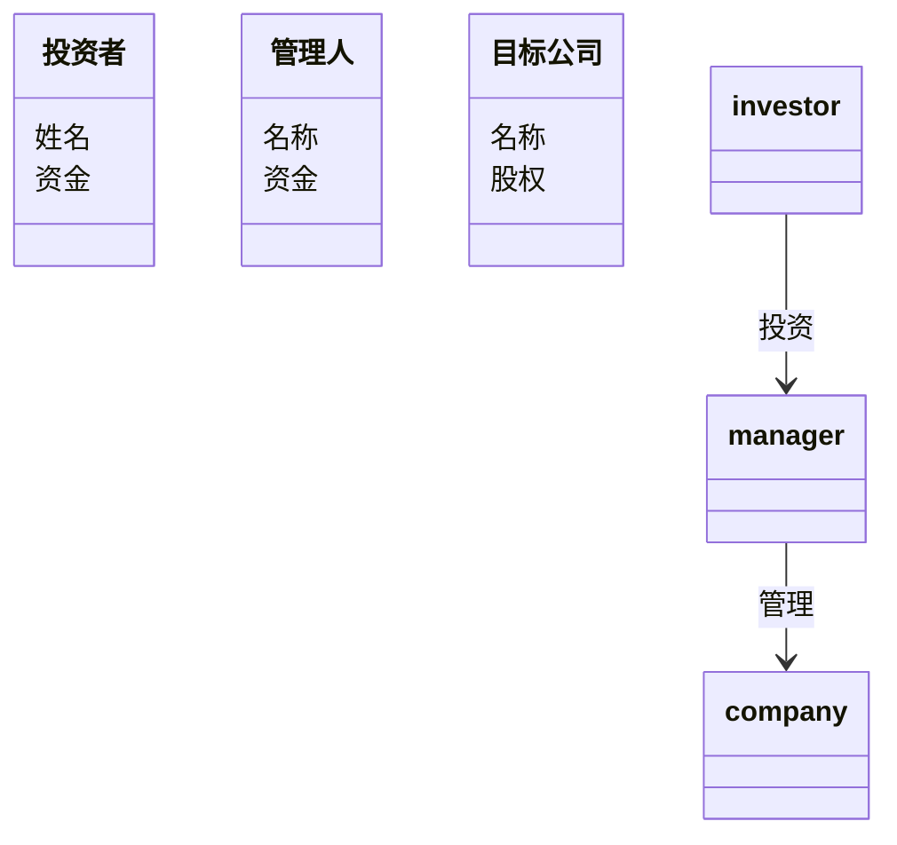
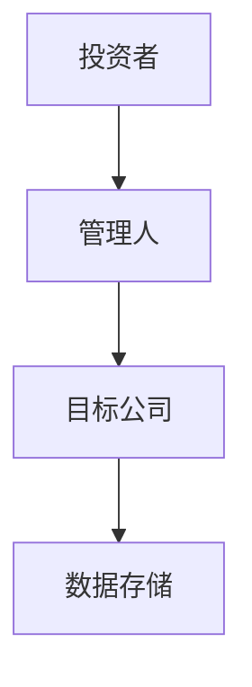
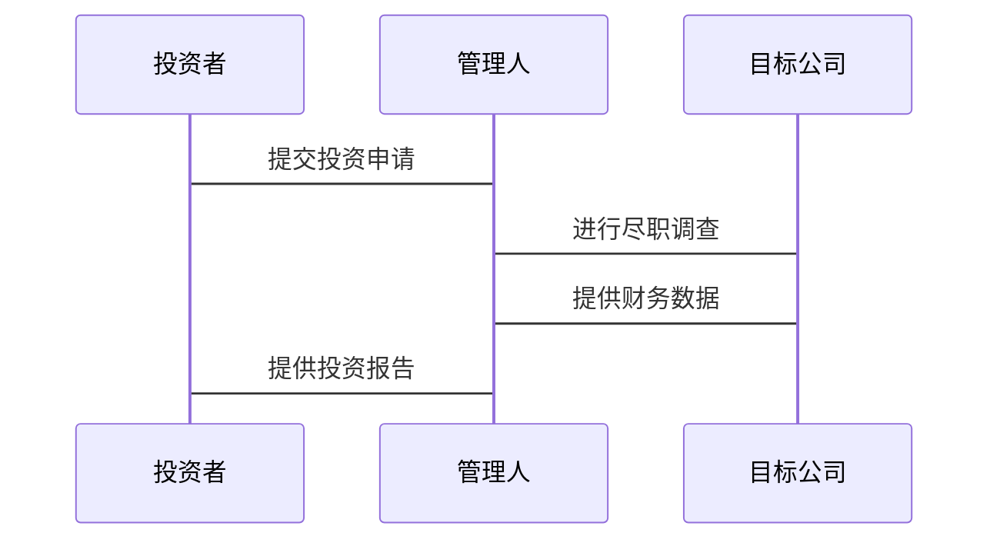

                 


# 私募股权投资：非上市公司的投资机会

## 关键词

私募股权投资，非上市公司，投资机会，DCF模型，风险管理，尽职调查

## 摘要

私募股权投资是一种通过投资于非上市公司以获取资本增值的投资方式。本文深入探讨了私募股权投资的核心概念、策略、评估方法和风险管理，结合实际案例和数学模型，为投资者提供了系统化的知识体系和实践指导。

## 第1章: 私募股权投资概述

### 1.1 私募股权投资的定义与特点

#### 1.1.1 私募股权投资的定义

私募股权投资（Private Equity Investment，简称PE）是指投资者通过私募基金或其他私募投资工具，投资于非上市公司股权的行为。其目的是通过长期持有股权，实现资本增值。

#### 1.1.2 私募股权投资的核心特点

- **私募性**：投资行为不公开，投资者通过私募方式募集资金。
- **高风险高收益**：非上市公司具有较大的增长潜力，但也伴随较高的市场和财务风险。
- **长期性**：投资者通常需要持有股权较长时间，以实现资本增值。
- **分散性**：通过投资多个项目分散风险，降低单一投资的风险。

#### 1.1.3 私募股权投资与公开市场的区别

- **流动性**：公开市场流动性高，私募市场流动性较低。
- **信息透明度**：公开市场信息透明，私募市场信息相对封闭。
- **投资门槛**：公开市场投资门槛低，私募市场投资门槛高。

### 1.2 私募股权投资的历史与发展

#### 1.2.1 私募股权投资的起源

私募股权投资起源于20世纪初的美国，早期主要以杠杆收购为主。

#### 1.2.2 私募股权投资的发展历程

经历了杠杆收购、风险投资、成长资本等不同阶段的发展。

#### 1.2.3 当前私募股权投资的现状

全球私募股权投资市场持续增长，成为重要的融资渠道。

## 第2章: 私募股权投资的核心概念与背景

### 2.1 私募股权投资的背景介绍

#### 2.1.1 问题背景

非上市公司融资需求旺盛，而公开市场融资门槛较高。

#### 2.1.2 问题描述

中小企业融资难，私募股权投资成为重要的融资方式。

#### 2.1.3 问题解决

通过私募股权投资，帮助非上市公司获得资金支持，促进企业发展。

#### 2.1.4 边界与外延

私募股权投资主要集中在非上市公司，边界包括投资工具的选择、投资期限等。

#### 2.1.5 核心要素组成

包括投资者、目标公司、管理人、投资策略等。

### 2.2 私募股权投资的核心概念与联系

#### 2.2.1 核心概念原理

私募股权投资通过投资非上市公司，实现资本增值。

#### 2.2.2 概念属性特征对比表格

| 概念       | 特征                  |
|------------|-----------------------|
| 投资者     | 高净值个人或机构       |
| 目标公司   | 非上市公司             |
| 投资工具   | 私募基金、有限合伙等    |
| 投资期限   | 长期（通常3-7年）      |

#### 2.2.3 ER实体关系图架构



## 第3章: 私募股权投资的策略与目标

### 3.1 私募股权投资的策略

#### 3.1.1 风险投资策略

主要投资于高成长性的初创公司，通过高回报退出。

#### 3.1.2 成长资本策略

投资于已经具备稳定增长的公司，通过股权增值退出。

#### 3.1.3 并购投资策略

通过杠杆收购，将目标公司私有化，进行重组后出售。

#### 3.1.4 控股型投资策略

成为目标公司的控股股东，通过战略整合实现价值提升。

### 3.2 私募股权投资的目标

#### 3.2.1 资本增值目标

通过股权增值实现投资收益。

#### 3.2.2 控制权目标

成为目标公司的控股股东，进行战略整合。

#### 3.2.3 资源整合目标

通过投资整合资源，实现协同效应。

## 第4章: 私募股权投资的数学模型与评估方法

### 4.1 私募股权投资的数学模型

#### 4.1.1 贴现现金流模型

$$DCF = \sum_{t=1}^{n} \frac{CF_t}{(1+r)^t} + \frac{TV}{(1+r)^n}$$

其中，\(CF_t\)是第t年的现金流，\(r\)是折现率，\(TV\)是终值。

#### 4.1.2 内部收益率法

$$IRR = r \text{ 满足 } NPV = 0$$

内部收益率法用于评估项目的回报率。

### 4.2 私募股权投资的评估方法

#### 4.2.1 相对估值法

通过比较可比公司的估值倍数进行评估。

#### 4.2.2 绝对估值法

使用DCF模型等方法进行绝对估值。

## 第5章: 私募股权投资的风险管理

### 5.1 私募股权投资的主要风险

- **市场风险**：市场波动影响投资收益。
- **流动性风险**：非上市公司股权流动性较低。
- **信用风险**：目标公司无法偿还债务的风险。

### 5.2 私募股权投资的风险管理策略

#### 5.2.1 风险分散

通过投资多个项目降低风险。

#### 5.2.2 风险对冲

使用衍生工具对冲市场风险。

#### 5.2.3 风险监控

定期监控投资组合的风险指标。

### 5.3 风险评估模型

#### 5.3.1 VaR模型

$$VaR = \text{在一定置信水平下，可能的损失值}$$

#### 5.3.2 风险价值评估

通过VaR模型评估投资组合的风险价值。

## 第6章: 私募股权投资的系统架构设计

### 6.1 项目介绍

本章将设计一个私募股权投资管理系统，实现投资项目的管理与监控。

### 6.2 系统功能设计

#### 6.2.1 领域模型设计



#### 6.2.2 系统架构设计



#### 6.2.3 系统接口设计

- 投资者与管理人接口
- 管理人与目标公司接口
- 系统与数据存储接口

#### 6.2.4 系统交互设计



## 第7章: 私募股权投资的项目实战

### 7.1 环境安装

安装Python和相关库，如pandas、numpy、scipy。

### 7.2 核心实现源代码

```python
import numpy as np
import pandas as pd
from scipy import optimize

def dcf_model(cash_flows, discount_rate, terminal_value):
    n = len(cash_flows)
    dcf = 0
    for t in range(n):
        dcf += cash_flows[t]/(1+discount_rate)**t
    dcf += terminal_value/(1+discount_rate)**n
    return dcf

# 示例数据
cash_flows = [100, 200, 300]
discount_rate = 0.1
terminal_value = 1000

# 计算DCF值
dcf_value = dcf_model(cash_flows, discount_rate, terminal_value)
print(f"DCF Value: {dcf_value}")
```

### 7.3 实际案例分析

分析一家科技公司的投资价值，使用DCF模型计算其DCF值。

### 7.4 代码应用解读

解释代码实现的DCF模型，及其在实际中的应用。

## 第8章: 最佳实践与注意事项

### 8.1 最佳实践

- **分散投资**：通过投资多个项目降低风险。
- **尽职调查**：全面评估目标公司，避免重大风险。
- **长期视角**：私募股权投资需要长期持有，耐心等待价值实现。

### 8.2 小结

私募股权投资是非上市公司融资的重要方式，通过科学的评估和风险管理，投资者可以在非公开市场中实现资本增值。

### 8.3 注意事项

- **谨慎选择管理人**：管理人能力直接影响投资回报。
- **关注退出策略**：明确退出方式和时机。
- **合规性**：遵守相关法律法规，确保投资合法。

## 作者

作者：AI天才研究院/AI Genius Institute & 禅与计算机程序设计艺术 /Zen And The Art of Computer Programming

---

以上是《私募股权投资：非上市公司的投资机会》的技术博客文章的完整目录和内容概述。通过系统化的结构和详细的讲解，读者可以全面理解私募股权投资的核心概念、策略、评估方法和风险管理，为实际投资提供理论和实践指导。

