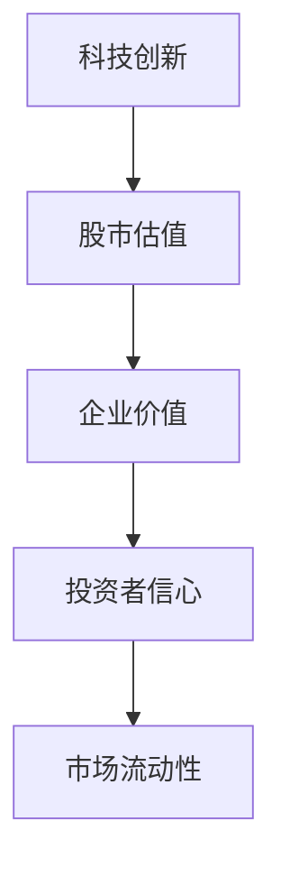
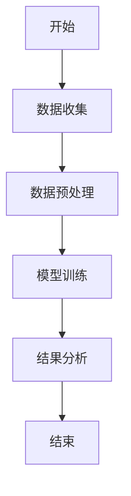
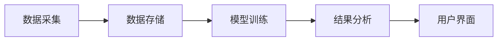

                 


# 科技创新对全球股市估值的影响分析

> 关键词：科技创新、股市估值、金融建模、市场情绪、技术分析

> 摘要：科技创新是推动全球经济发展的核心动力，而股市估值则是反映企业价值和市场信心的重要指标。本文从科技创新的基本概念和特征出发，分析其对全球股市估值的影响路径，包括对市场情绪、企业价值和投资者行为的影响。通过构建数学模型和算法，结合实际案例，探讨科技创新如何改变股市估值的方法和策略。最后，结合系统架构设计，提出科技创新对股市估值的优化方案和未来研究方向。

---

## 第1章: 科技创新与全球股市估值概述

### 1.1 科技创新的定义与特征
科技创新是指通过技术进步和创新活动，推动新产品、新服务、新模式的出现，从而改变传统行业或催生新兴行业的过程。其核心特征包括：
- **创新性**：创造新的技术和商业模式。
- **扩散性**：技术快速传播到各个行业和区域。
- **颠覆性**：可能对传统产业造成根本性改变。
- **不确定性**：技术创新可能带来市场波动和风险。

### 1.2 全球股市估值的基本概念
股市估值是通过对企业财务数据和市场环境的分析，确定股票合理价格的过程。其主要指标包括：
- **市盈率（P/E）**：股价与每股净利润的比值。
- **市净率（P/B）**：股价与每股净资产的比值。
- **股息率**：股息与股价的比值。
- **市值**：企业股票的总价值。

### 1.3 科技创新对全球股市估值的影响关系
科技创新通过改变企业盈利能力和市场结构，直接影响股市估值。其影响路径包括：
- **企业价值提升**：科技创新提高了企业的生产效率和利润率。
- **市场情绪驱动**：科技创新激发投资者对未来的信心。
- **行业颠覆**：新兴技术可能导致传统产业估值下降。

---

## 第2章: 科技创新对全球股市估值的核心概念与联系

### 2.1 科技创新与股市估值的核心概念对比
| 核心概念 | 科技创新 | 股市估值 |
|----------|----------|----------|
| 定义     | 新技术的出现和发展 | 股票价格的合理评估 |
| 主要特征 | 创新性、扩散性 | 风险性、波动性 |
| 影响因素 | 技术研发、政策支持 | 利润率、市场流动性 |

### 2.2 科技创新对股市估值的对比分析
- **推动作用**：科技创新提高了企业的盈利能力，增加了股市的吸引力。
- **抑制作用**：技术创新的高成本可能降低短期利润，影响估值。
- **动态平衡**：科技创新与股市估值相互作用，形成动态平衡。

### 2.3 科技创新与股市估值的ER实体关系图


---

## 第3章: 科技创新对全球股市估值的算法原理讲解

### 3.1 科技创新对股市估值的算法模型
- **基于科技创新的股票估值模型**：结合企业研发投入、技术创新周期和市场反馈，预测股票价值。
- **市场情绪影响模型**：通过自然语言处理分析新闻和社交媒体，预测市场情绪对估值的影响。
- **流动性调节模型**：分析科技创新对市场流动性的短期和长期影响。

### 3.2 科技创新对股市估值的算法流程图


### 3.3 科技创新对股市估值的Python实现
```python
import pandas as pd
import numpy as np

def calculate_technology_impact(revenue, profit, innovation_cycle):
    impact = (revenue * 0.1) + (profit * 0.2) + (innovation_cycle * 0.3)
    return impact

# 示例数据
revenue = 1000000
profit = 100000
innovation_cycle = 5

impact = calculate_technology_impact(revenue, profit, innovation_cycle)
print(f"科技创新对企业价值的影响为：{impact}")
```

---

## 第4章: 科技创新对全球股市估值的数学模型与公式

### 4.1 科技创新与股市估值的数学模型
$$
\text{股票价值} = \text{企业利润} \times (1 + \text{技术创新率})
$$

### 4.2 市场情绪对估值的影响
$$
\text{市场情绪指数} = \frac{\text{正面新闻数量} - \text{负面新闻数量}}{\text{总新闻数量}}
$$

### 4.3 技术创新周期与估值的关系
$$
\text{技术创新周期} = \frac{\text{研发支出}}{\text{企业利润}}
$$

---

## 第5章: 科技创新对全球股市估值的系统分析与架构设计

### 5.1 系统功能设计
- **数据采集模块**：收集企业财务数据和市场数据。
- **模型训练模块**：构建科技创新与估值的数学模型。
- **结果分析模块**：输出估值结果和优化建议。

### 5.2 系统架构设计


### 5.3 系统交互设计


---

## 第6章: 科技创新对全球股市估值的项目实战

### 6.1 环境安装
- 安装Python和必要的库（如Pandas、NumPy、Scikit-learn）。

### 6.2 核心代码实现
```python
import pandas as pd
from sklearn.linear_model import LinearRegression

# 示例数据
data = {
    '研发投入': [100, 200, 150, 250],
    '利润': [50, 100, 70, 120],
    '股票价值': [1000, 2000, 1500, 2500]
}

df = pd.DataFrame(data)
model = LinearRegression()
model.fit(df[['研发投入', '利润']], df['股票价值'])

print(f"回归系数：{model.coef_}")
print(f"回归截距：{model.intercept_}")
```

### 6.3 案例分析
- 以某科技公司为例，分析其研发投入、利润与股票价值的关系，验证模型的有效性。

---

## 第7章: 总结与展望

### 7.1 总结
科技创新是推动股市估值变化的核心因素，其影响体现在企业价值、市场情绪和投资者行为等多个方面。通过数学建模和算法分析，可以更好地理解科技创新对股市估值的作用机制。

### 7.2 展望
未来的研究可以进一步结合人工智能和大数据技术，优化估值模型，探索更多科技创新对股市估值的潜在影响。

---

## 作者：AI天才研究院/AI Genius Institute & 禅与计算机程序设计艺术 /Zen And The Art of Computer Programming

---

本文通过系统分析和案例研究，全面探讨了科技创新对全球股市估值的影响。从理论到实践，从模型到代码，为读者提供了一套完整的分析框架。希望本文能为投资者和研究者提供有价值的参考。

