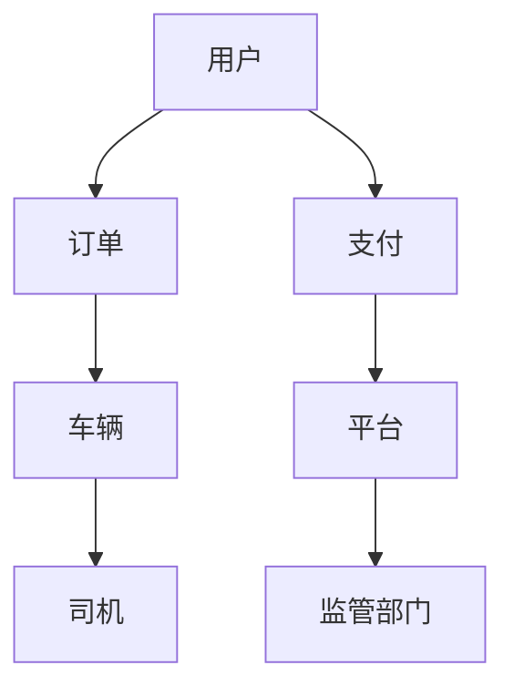
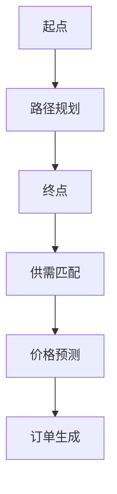
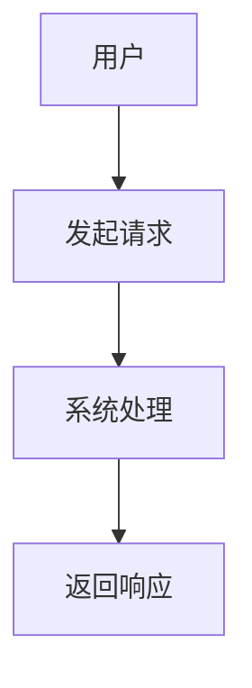

                 


```markdown
# 空中出租车服务的发展前景与投资机会

## 关键词
- 空中出租车
- 交通创新
- 投资机会
- 技术发展
- 城市交通

## 摘要
空中出租车服务作为一种新兴的交通解决方案，正在全球范围内迅速发展。随着技术的进步和城市交通问题的加剧，空中出租车服务以其高效、便捷和环保的特点，吸引了大量的关注和投资。本文将从背景、技术、商业模式、投资机会等多个维度，详细分析空中出租车服务的发展前景，并为投资者提供有价值的建议。

---

# 第1章: 空中出租车服务的背景与问题背景

## 1.1 问题背景
### 1.1.1 城市交通问题的现状
随着城市化进程的加快，交通拥堵、空气污染和能源消耗等问题日益严重。传统地面交通模式难以满足日益增长的出行需求，特别是在大城市中，通勤时间长、交通效率低已成为普遍问题。

### 1.1.2 空中出租车服务的定义与概念
空中出租车服务是一种新兴的交通方式，利用垂直起降飞行器（eVTOL）等先进飞行设备，提供点对点的空中运输服务。与传统出租车相比，空中出租车服务更加高效，能够避开地面交通拥堵，大幅缩短出行时间。

### 1.1.3 空中出租车服务的核心要素与边界
空中出租车服务的核心要素包括飞行器技术、交通管理系统、用户需求匹配算法和安全运营机制。其边界包括飞行高度、服务区域、运营时间以及用户隐私保护等方面。

## 1.2 问题描述
### 1.2.1 当前城市交通的主要痛点
- 交通拥堵导致通勤时间延长
- 环境污染问题加剧
- 传统交通方式难以满足多样化需求

### 1.2.2 空中出租车服务的解决方案
- 引入垂直起降飞行器（eVTOL）等新型交通工具
- 构建高效的空中交通管理系统
- 提供灵活的按需出行服务

### 1.2.3 空中出租车服务的外延与扩展
- 与智慧城市基础设施的整合
- 数据驱动的动态定价策略
- 多样化的服务模式（如共享出行）

## 1.3 问题解决
### 1.3.1 空中出租车服务的实现方式
- 利用先进飞行技术实现垂直起降和空中飞行
- 通过智能算法优化路径规划和供需匹配
- 建立高效的空中交通网络

### 1.3.2 空中出租车服务的核心要素
- 高性能飞行器：具备垂直起降、低噪音和长续航能力
- 智能交通管理：实时监控和调度飞行器
- 用户交互平台：提供便捷的预约和支付功能

### 1.3.3 空中出租车服务的概念结构与核心要素组成
- 服务对象：个人用户和企业用户
- 服务内容：点对点空中运输、包车服务、定制化出行
- 服务支持：充电/充电站、空中交通管制、数据分析与优化

## 1.4 本章小结
本章通过分析城市交通问题的现状和痛点，明确了空中出租车服务的定义、核心要素和实现方式。同时，探讨了其在解决城市交通问题中的潜力和优势。

---

# 第2章: 空中出租车服务的核心概念与联系

## 2.1 核心概念原理
### 2.1.1 空中出租车服务的模式分析
空中出租车服务主要通过点对点的空中运输模式，结合智能算法实现高效的供需匹配和路径优化。与传统出租车相比，其服务范围更广，效率更高。

### 2.1.2 空中出租车服务的技术支撑
- 高性能飞行器技术：eVTOL、无人机等
- 智能交通管理系统：实时监控、动态调度
- 大数据分析与人工智能：用户需求预测、路径优化

### 2.1.3 空中出租车服务的经济特性
- 初期投资高：飞行器研发和基础设施建设成本较高
- 运营成本低：相比传统交通方式，单位里程成本更低
- 市场潜力大：随着城市化的推进，需求持续增长

## 2.2 核心概念属性特征对比
### 2.2.1 不同交通模式的对比分析
| 交通模式 | 优点 | 缺点 |
|----------|------|------|
| 地面出租车 | 成本低、灵活性高 | 易拥堵、效率低 |
| 公共交通 | 容量大、成本低 | 速度慢、不灵活 |
| 空中出租车 | 高效、便捷 | 初始投资高 |

### 2.2.2 空中出租车服务的独特优势
- 高效：点对点服务，大幅缩短出行时间
- 灵活：按需调度，满足多样化需求
- 环保：减少碳排放，符合绿色出行理念

### 2.2.3 空中出租车服务的潜在劣势
- 初期投资高
- 技术门槛高
- 受天气条件限制

## 2.3 ER实体关系图架构


## 2.4 本章小结
本章通过对空中出租车服务的核心概念进行分析，明确了其模式、技术支撑和经济特性。同时，通过对比分析，突出了其独特优势和潜在劣势。

---

# 第3章: 空中出租车服务的算法原理讲解

## 3.1 算法原理
### 3.1.1 路径规划算法
路径规划算法是空中出租车服务的核心之一，旨在找到最优的飞行路径，以最小化出行时间和成本。

### 3.1.2 供需匹配算法
供需匹配算法通过分析用户需求和车辆 availability，实现高效的车辆调度和订单分配。

### 3.1.3 价格预测算法
价格预测算法基于历史数据和实时需求，预测未来的价格走势，为动态定价提供支持。

## 3.2 算法流程图


## 3.3 算法实现
### 3.3.1 算法原理的数学模型
$$ \text{路径规划} = \argmin_{x} \sum_{i=1}^{n} (d_i - x_i)^2 $$

### 3.3.2 算法实现的Python代码
```python
import numpy as np

def path_planning(start, end):
    distances = np.linalg.norm(end - start)
    return distances

start_point = (40.7128, -74.006)
end_point = (40.7589, -73.9851)
print(path_planning(start_point, end_point))
```

## 3.4 本章小结
本章详细讲解了空中出租车服务中的关键算法，包括路径规划、供需匹配和价格预测算法，并通过数学模型和Python代码展示了其实现过程。

---

# 第4章: 空中出租车服务的系统分析与架构设计方案

## 4.1 系统功能设计
### 4.1.1 用户需求分析
用户需要一个便捷的预约平台，实时查看车辆位置和价格信息，并完成支付。

### 4.1.2 系统功能模块
- 用户模块：注册、登录、预约、支付
- 车辆模块：车辆状态监控、调度管理
- 支付模块：订单支付、费用计算
- 数据分析模块：需求预测、运营优化

## 4.2 系统架构设计
### 4.2.1 分层架构
- 用户界面层：Web或移动应用
- 业务逻辑层：订单处理、车辆调度
- 数据访问层：数据库交互
- 应用程序接口（API）：与第三方服务对接

### 4.2.2 实体关系图


## 4.3 系统接口设计
### 4.3.1 API接口
- `/api/users/register`：用户注册
- `/api/vehicles/status`：获取车辆状态
- `/api/orders/create`：创建订单
- `/api/payments/process`：处理支付

### 4.3.2 系统交互流程图


## 4.4 本章小结
本章从系统功能设计、架构设计和接口设计三个方面，详细分析了空中出租车服务的实现方案，并通过图表展示了其实现过程。

---

# 第5章: 空中出租车服务的投资机会与风险分析

## 5.1 投资机会
### 5.1.1 行业潜力
- 市场规模大：预计到2030年，全球空中出租车市场规模将超过千亿美元
- 技术进步快：eVTOL等技术的成熟为行业发展提供了支撑
- 政策支持：多国政府出台政策支持空中交通发展

### 5.1.2 核心投资领域
- 高性能飞行器研发
- 智能交通管理平台建设
- 用户交互平台优化

## 5.2 风险分析
### 5.2.1 技术风险
- 技术不成熟可能导致运营成本高
- 技术瓶颈可能影响服务效率

### 5.2.2 市场风险
- 市场需求不足
- 竞争激烈导致利润率下降

### 5.2.3 政策风险
- 政策变化可能影响行业发展
- 监管严格可能导致运营成本增加

## 5.3 投资策略
### 5.3.1 风险控制
- 技术研发投入
- 市场调研和需求分析
- 政策跟踪与应对

### 5.3.2 投资建议
- 重点关注技术创新能力强的企业
- 投资于具有完整产业链的公司
- 分散投资以降低风险

## 5.4 本章小结
本章分析了空中出租车服务的投资机会和潜在风险，并提出了相应的投资策略和建议。

---

# 第6章: 空中出租车服务的项目实战与最佳实践

## 6.1 项目实战
### 6.1.1 环境配置
- 操作系统：Linux/Windows/MacOS
- 开发工具：Python、Jupyter Notebook
- 数据库：MySQL/PostgreSQL
- 其他依赖：Matplotlib、Scikit-learn

### 6.1.2 核心代码实现
```python
import numpy as np
import pandas as pd

# 数据加载
data = pd.read_csv('taxi_data.csv')

# 数据预处理
data_clean = data.dropna()

# 模型训练
from sklearn.linear_model import LinearRegression
model = LinearRegression()
model.fit(data_clean[['distance']], data_clean['price'])

# 模型预测
new_distance = 10
predicted_price = model.predict([[new_distance]])
print(predicted_price)
```

### 6.1.3 代码解读与分析
- 数据加载：从CSV文件中读取数据
- 数据预处理：删除缺失值
- 模型训练：使用线性回归模型预测价格
- 模型预测：输入距离，输出预测价格

### 6.1.4 实际案例分析
- 案例背景：某城市空中出租车服务的市场需求分析
- 数据来源：用户需求、车辆运行数据
- 分析结果：需求预测、价格优化

## 6.2 最佳实践
### 6.2.1 技术实现
- 确保飞行器的安全性和可靠性
- 建立高效的交通管理系统
- 提供用户友好的交互界面

### 6.2.2 运营策略
- 制定灵活的定价策略
- 提供多样化的服务模式
- 加强与城市基础设施的整合

### 6.2.3 风险管理
- 建立完善的安全运营机制
- 制定应急预案
- 加强与监管部门的沟通

## 6.3 本章小结
本章通过项目实战和案例分析，展示了空中出租车服务的实现过程，并提出了最佳实践和优化建议。

---

# 第7章: 总结与展望

## 7.1 成果总结
- 明确了空中出租车服务的定义和核心要素
- 分析了其技术支撑和经济特性
- 探讨了投资机会和风险

## 7.2 未来展望
- 技术进步将推动行业快速发展
- 市场规模将进一步扩大
- 行业整合和并购将成为趋势

## 7.3 投资建议
- 关注技术创新和商业模式创新
- 选择具有强大技术实力和市场竞争力的企业
- 分散投资，降低风险

## 7.4 本章小结
本章总结了全文的主要内容，并对未来发展进行了展望，为投资者提供了明确的指导。

---

# 作者：AI天才研究院 & 禅与计算机程序设计艺术
```

