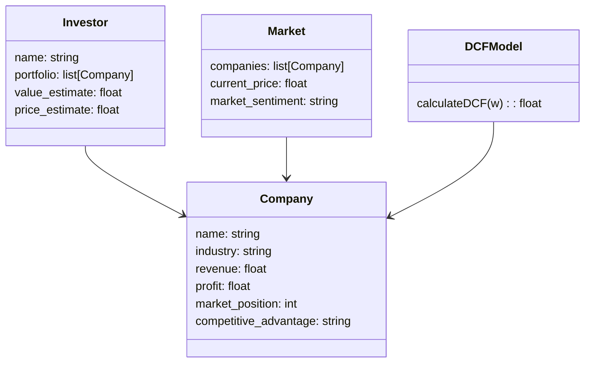
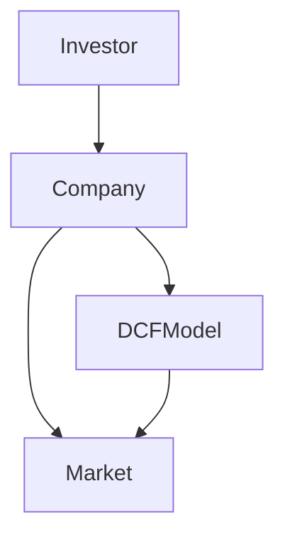
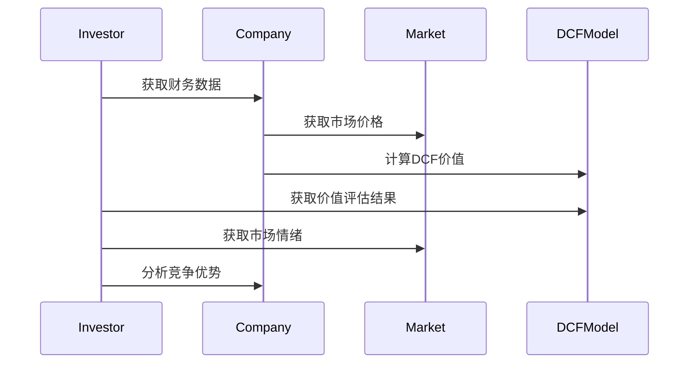

                 


# 约瑟夫·拉科尼克的价值创造投资：关注长期价值增长

> **关键词**：价值投资、长期价值增长、投资策略、价值评估、投资心态  
> **摘要**：本文深入探讨了约瑟夫·拉科尼克的价值投资理念，分析了其核心概念、数学模型和系统架构，结合实际案例，总结了价值投资的最佳实践。

---

# 第一部分: 价值投资的背景与核心理念

## 第1章: 价值投资的起源与核心理念

### 1.1 价值投资的起源

#### 1.1.1 价值投资的定义
价值投资是一种投资策略，强调以低于其内在价值的价格购买优质资产。其核心在于识别市场低估的机会，并长期持有。

#### 1.1.2 价值投资的核心理念
价值投资的核心理念包括：
- **安全边际**：购买价格低于内在价值，以减少风险。
- **长期视角**：关注企业的长期价值，而非短期价格波动。
- **基本面分析**：通过分析企业的财务状况、行业地位和竞争优势，评估其内在价值。

#### 1.1.3 价值投资与短期投资的区别
- **时间框架**：价值投资注重长期，而短期投资关注短期价格波动。
- **决策依据**：价值投资基于基本面分析，短期投资依赖技术分析和市场情绪。
- **风险承受**：价值投资更能承受短期波动，追求长期收益。

### 1.2 投资的核心问题

#### 1.2.1 投资的本质
投资的本质是通过合理配置资产，实现财富的长期增长。核心在于识别优质资产并长期持有。

#### 1.2.2 投资的目标
价值投资的目标是通过购买低估资产，实现资本的长期增值。强调安全性和稳定性，而非短期收益。

#### 1.2.3 投资的长期性
长期性是价值投资的关键，市场波动不会影响优质资产的长期价值。投资者需耐心等待市场回归其真实价值。

### 1.3 价值投资的边界与外延

#### 1.3.1 价值投资的适用场景
- 适用于对优质企业长期价值的判断，特别在市场低估时期。
- 适合具备长期投资 horizon 的投资者。

#### 1.3.2 价值投资的局限性
- 对市场周期判断的依赖性较高。
- 需要较高的研究能力和信息获取能力。
- 长期持有可能导致短期亏损，考验投资者耐心。

#### 1.3.3 价值投资与其他投资策略的关系
价值投资与其他策略（如成长投资）并非对立，而是相辅相成。可以根据市场环境和个人风格灵活调整。

### 1.4 价值投资的核心要素

#### 1.4.1 价值的定义与衡量标准
价值是指资产在未来现金流的现值。DCF模型是常用的评估工具，公式为：
$$DCF = \sum_{t=1}^{n} \frac{CF_t}{(1 + r)^t}$$
其中，$CF_t$为第t年的现金流，$r$为折现率。

#### 1.4.2 价格的波动性与周期性
价格受市场情绪影响，呈现周期性波动。价值投资强调在市场低谷时买入，高点时卖出。

#### 1.4.3 市场情绪与市场周期
市场情绪影响价格波动，价值投资者需逆市场情绪操作，利用市场的非理性获利。

---

## 第2章: 价值与价格的关系

### 2.1 价值与价格的定义

#### 2.1.1 价值的构成要素
价值由资产的未来现金流决定，包括收入、利润、自由现金流等。DCF模型用于评估企业价值。

#### 2.1.2 价格的决定因素
价格受市场供需、情绪、宏观经济因素影响，与内在价值可能偏离。

### 2.2 价值与价格的对比

#### 2.2.1 价值与价格的差异
- 价值反映资产的真实经济价值，价格反映市场的供需平衡。
- 价格波动短期化，价值变化长期化。

#### 2.2.2 价值与价格的动态关系
价值与价格通过市场机制不断互动，最终价格趋向于价值。

### 2.3 价值评估的核心方法

#### 2.3.1 基本面分析法
基本面分析法通过分析企业的财务报表、行业地位和竞争优势，评估其内在价值。

#### 2.3.2 市盈率法
市盈率（P/E）是价格与每股收益的比率，用于衡量股票的估值。

#### 2.3.3 现金流折现法
DCF模型通过折现未来现金流，评估企业的真实价值。

### 2.4 价值投资的决策依据

#### 2.4.1 价格与价值的偏离
当价格低于价值时，投资机会出现。反之，需警惕风险。

#### 2.4.2 安全边际的概念
安全边际是购买价格与内在价值的差距，确保投资的安全性和收益性。

#### 2.4.3 投资的长期性
价值投资强调长期持有，避免频繁交易，减少成本和错误。

---

## 第3章: 价值评估的数学模型

### 3.1 现金流折现模型（DCF）

#### 3.1.1 DCF模型的原理
DCF模型通过折现未来现金流，评估资产的内在价值。公式为：
$$V = \sum_{t=1}^{n} \frac{CF_t}{(1 + r)^t} + \frac{TV}{(1 + r)^n}$$
其中，$V$为总价值，$CF_t$为第t年的现金流，$r$为折现率，$TV$为终值。

#### 3.1.2 DCF模型的步骤
1. 估计未来现金流。
2. 确定合理的折现率。
3. 折现并求和，得到内在价值。

#### 3.1.3 DCF模型的代码实现

```python
def calculateDCF(cash_flows, discount_rate):
    dcf_value = 0
    for t, cf in enumerate(cash_flows):
        if t == 0:
            continue
        dcf_value += cf / (1 + discount_rate) ** t
    return dcf_value

# 示例：某公司未来5年的现金流为[100, 150, 200, 250, 300]，折现率为10%
cash_flows = [100, 150, 200, 250, 300]
discount_rate = 0.1
DCF_value = calculateDCF(cash_flows, discount_rate)
print(f"DCF Value: {DCF_value}")
```

### 3.2 投资组合优化的数学模型

#### 3.2.1 投资组合优化的目标
最大化收益，最小化风险。通过分散投资降低风险。

#### 3.2.2 马科维茨均值-方差模型
$$\text{Minimize } \sigma^2 \text{ subject to } \sum w_i r_i = \mu$$
其中，$\sigma^2$为方差，$w_i$为权重，$r_i$为收益。

---

## 第4章: 价值投资的系统架构与设计

### 4.1 系统功能设计

#### 4.1.1 领域模型（类图）



### 4.2 系统架构设计

#### 4.2.1 模块划分



### 4.3 系统接口设计

#### 4.3.1 投资者接口



---

## 第5章: 项目实战与分析

### 5.1 环境安装与数据收集

#### 5.1.1 Python环境安装
安装Python和必要的库，如Pandas、NumPy、Matplotlib。

#### 5.1.2 数据收集
收集目标公司的财务数据，包括收入、利润、现金流等。

### 5.2 核心实现

#### 5.2.1 DCF模型实现

```python
import pandas as pd
import numpy as np

def calculateDCF(fcf, discount_rate, terminal_value=None):
    if terminal_value is None:
        terminal_value = fcf[-1] * (1 + growth_rate)
    dcf_value = 0
    for year, cf in enumerate(fcf):
        if year == 0:
            continue
        dcf_value += cf / (1 + discount_rate) ** year
    dcf_value += terminal_value / (1 + discount_rate) ** len(fcf)
    return dcf_value

# 示例数据
fcf = [100, 120, 150, 180, 200]
discount_rate = 0.1
DCF_value = calculateDCF(fcf, discount_rate)
print(f"DCF Value: {DCF_value}")
```

### 5.3 实际案例分析

#### 5.3.1 公司基本面分析
分析公司的收入、利润、现金流和行业地位，判断其竞争优势。

#### 5.3.2 市场价格与内在价值比较
比较市场价格与DCF模型计算的内在价值，判断是否低估。

#### 5.3.3 投资决策
当市场价格低于内在价值时，考虑买入并长期持有。

---

## 第6章: 最佳实践与总结

### 6.1 投资心态与风险管理

#### 6.1.1 保持耐心
价值投资需要长期持有，耐心等待市场回归价值。

#### 6.1.2 管控风险
通过分散投资和安全边际降低风险，避免重大损失。

#### 6.1.3 逆市场思维
在市场恐慌时寻找机会，在市场狂热时保持冷静。

### 6.2 长期思维与持续学习

#### 6.2.1 持续更新知识
市场变化快，需不断学习新知识，优化投资策略。

#### 6.2.2 定期复盘
定期回顾投资组合的表现，调整策略，优化配置。

---

## 作者信息

作者：AI天才研究院/AI Genius Institute & 禅与计算机程序设计艺术/Zen And The Art of Computer Programming

