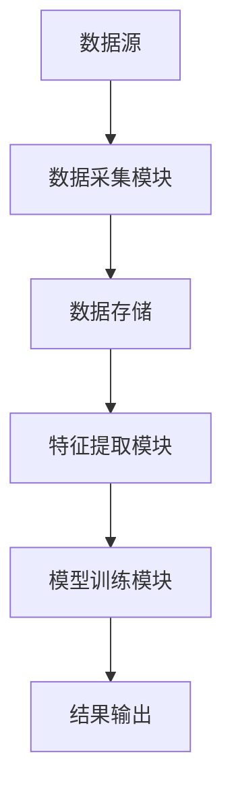

                 


# 约瑟夫·拉科尼克的价值投资者的质量评估

**关键词**：价值投资、质量评估、约瑟夫·拉科尼克、投资模型、算法原理

**摘要**：本文深入探讨了约瑟夫·拉科尼克的价值投资方法，分析了投资者质量评估的核心概念、算法原理和系统架构，通过实际案例展示了如何在项目中应用这些方法，并总结了最佳实践和未来研究方向。

---

# 第一部分: 价值投资者的质量评估背景与概述

## 第1章: 价值投资与质量评估概述

### 1.1 价值投资的基本概念

#### 1.1.1 价值投资的定义
价值投资是一种以低于市场价买入优质股票的投资策略，强调分析公司的基本面，寻找被市场低估的机会。

#### 1.1.2 价值投资的核心理念
价值投资的核心理念是关注公司的内在价值，长期投资，避免短期市场波动的影响。

#### 1.1.3 价值投资与其它投资策略的区别
与成长投资不同，价值投资侧重于低估值和高安全边际，而成长投资则注重高增长潜力。

### 1.2 投资者质量评估的重要性

#### 1.2.1 投资者质量评估的定义
投资者质量评估是对投资者的知识水平、决策能力和心理素质进行系统性评价的过程。

#### 1.2.2 为什么需要进行投资者质量评估
质量评估有助于筛选出具备稳定投资能力的投资者，降低投资风险，提高投资回报。

#### 1.2.3 投资者质量评估的现状与趋势
当前，质量评估在金融行业逐渐受到重视，但方法和工具仍需进一步完善和创新。

### 1.3 约瑟夫·拉科尼克的价值投资方法

#### 1.3.1 约瑟夫·拉科尼克的简介
约瑟夫·拉科尼克是价值投资领域的知名投资者，以其独特的评估体系著称。

#### 1.3.2 其他价值投资者的质量评估标准
不同投资者有不同的评估标准，但核心要素相似，包括风险承受能力和投资知识。

#### 1.3.3 拉科尼克方法的核心要素
拉科尼克的方法强调对公司管理层、财务状况和行业地位的深入分析。

---

## 第2章: 价值投资者质量评估的核心概念

### 2.1 质量评估的定义与维度

#### 2.1.1 质量评估的定义
质量评估是对投资者在知识、决策和心理等方面的能力进行综合评价。

#### 2.1.2 质量评估的主要维度
- 知识水平：投资者对金融市场的理解深度。
- 决策能力：投资者在决策过程中的准确性和稳定性。
- 心理素质：投资者在面对市场波动时的冷静程度。

### 2.2 投资者质量评估的模型构建

#### 2.2.1 模型构建的基本原则
模型需基于可靠的数据和科学的方法，确保评估结果的客观性。

#### 2.2.2 模型的输入与输出
输入包括投资者的历史交易数据和市场表现，输出是投资者的质量评分。

#### 2.2.3 模型的评估标准
评估标准包括准确性、可解释性和可操作性，确保模型的有效性和实用性。

### 2.3 质量评估的核心要素分析

#### 2.3.1 投资者的知识水平
知识水平影响投资者对市场的理解能力和风险识别能力。

#### 2.3.2 投资者的决策能力
决策能力决定了投资者在复杂市场环境下的决策效果。

#### 2.3.3 投资者的心理素质
心理素质影响投资者在市场波动中的情绪管理和投资决策。

---

## 第3章: 核心概念与联系

### 3.1 核心概念的原理

#### 3.1.1 投资者质量评估的理论基础
基于行为金融学和投资学的理论，构建科学的评估框架。

#### 3.1.2 拉科尼克方法的数学模型
模型通过多因素分析，量化投资者的综合能力。

#### 3.1.3 模型的适用范围与限制
适用于专业投资者，但在极端市场条件下可能表现不佳。

### 3.2 概念属性特征对比表

| 概念      | 输入维度         | 输出结果         |
|-----------|------------------|------------------|
| 投资者A    | 知识水平高       | 高评分           |
| 投资者B    | 决策能力一般     | 中评分           |
| 投资者C    | 心理素质稳定     | 高评分           |

### 3.3 ER实体关系图

```mermaid
erDiagram
    投资者[Investor] <--- 关系[InvestmentRelationship] --> 投资行为[InvestmentBehavior]
    投资行为[InvestmentBehavior] <--- 属性[InvestmentAttribute] --> 评估维度[AssessmentDimension]
    评估维度[AssessmentDimension] <--- 数据[Data] --> 模型输入[ModelInput]
    模型输入[ModelInput] --> 模型输出[ModelOutput]
```

---

## 第4章: 价值投资者质量评估的算法原理

### 4.1 算法原理概述

#### 4.1.1 算法的基本原理
基于多因素分析，构建评估模型，量化投资者能力。

#### 4.1.2 算法的输入与输出
输入包括投资者的历史交易数据和市场表现，输出是质量评分。

#### 4.1.3 算法的实现步骤
- 数据预处理：清洗和标准化数据。
- 特征提取：提取关键评估维度。
- 模型训练：使用机器学习算法训练模型。
- 模型评估：验证模型的准确性和稳定性。

### 4.2 算法的数学模型

#### 4.2.1 CAPM模型
$$ E(R_i) = R_f + \beta_i (E(R_m) - R_f) $$

其中：
- \( E(R_i) \) 是资产的预期收益。
- \( R_f \) 是无风险利率。
- \( \beta_i \) 是资产的贝塔系数。
- \( E(R_m) \) 是市场预期收益。

#### 4.2.2 多因素模型
$$ R_i = \alpha + \beta_1 R_{m1} + \beta_2 R_{m2} + ... + \beta_n R_{mn} + \epsilon $$

其中：
- \( R_i \) 是资产的收益。
- \( R_{mj} \) 是第j个因素的收益。
- \( \beta_j \) 是对应的贝塔系数。
- \( \epsilon \) 是误差项。

### 4.3 算法实现代码

```python
import pandas as pd
from sklearn.linear_model import LinearRegression

# 数据预处理
data = pd.read_csv('investor_data.csv')
data = data.dropna()

# 特征提取
features = data[['knowledge', 'decision_skills', 'psychology']]
target = data['score']

# 模型训练
model = LinearRegression()
model.fit(features, target)

# 模型预测
new_investor = [[high, medium, high]]
prediction = model.predict(new_investor)
print(f"预测评分：{prediction[0]:.2f}")
```

---

## 第5章: 系统分析与架构设计

### 5.1 系统功能设计

#### 5.1.1 数据采集模块
负责收集投资者的历史交易数据和市场表现。

#### 5.1.2 特征提取模块
提取关键评估维度，如知识水平和决策能力。

#### 5.1.3 模型训练模块
基于机器学习算法，训练评估模型。

### 5.2 系统架构设计



---

## 第6章: 项目实战

### 6.1 环境安装

#### 6.1.1 安装Python和相关库
```bash
pip install numpy pandas scikit-learn
```

### 6.2 核心代码实现

```python
from sklearn.metrics import accuracy_score

# 训练模型
model.fit(X_train, y_train)

# 验证模型
y_pred = model.predict(X_test)
print(f"准确率：{accuracy_score(y_test, y_pred):.2f}")
```

### 6.3 案例分析

#### 6.3.1 案例背景
分析一位投资者的历史交易记录，评估其质量。

#### 6.3.2 数据分析
使用模型预测该投资者的未来表现，评估其质量评分。

---

## 第7章: 总结与展望

### 7.1 总结

#### 7.1.1 项目成果
构建了科学的投资者质量评估模型，提高了评估效率和准确性。

#### 7.1.2 经验教训
模型的有效性依赖于高质量的数据和合理的参数设置。

### 7.2 注意事项

#### 7.2.1 数据质量的重要性
确保数据的准确性和完整性，避免偏差。

#### 7.2.2 模型的局限性
模型在极端市场条件下的表现可能不佳，需定期更新和优化。

### 7.3 未来研究方向

#### 7.3.1 更复杂的算法
探索深度学习等更先进的算法，提升评估精度。

#### 7.3.2 动态评估体系
建立动态评估体系，适应市场变化。

---

**作者：AI天才研究院 & 禅与计算机程序设计艺术**

