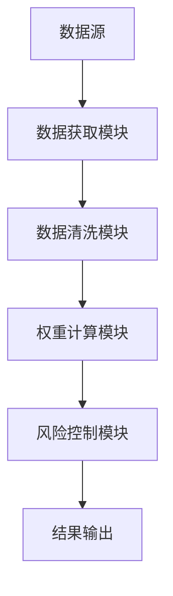

                 


# 约翰·伯格的指数基金构建原则

> 关键词：指数基金、被动投资、凸优化、跟踪误差、投资组合优化

> 摘要：本文深入探讨了指数基金的构建原则，结合约翰·伯格的理论，分析了被动投资的优势，详细讲解了跟踪误差的最小化方法，并通过数学模型和算法流程图展示了指数基金的构建过程。文章还提供了实际的Python代码示例，帮助读者理解如何在实践中应用这些原则。

---

## 第一部分：指数基金的背景与基础

### 第1章：指数基金的概述

#### 1.1 指数基金的定义与特点
- **定义**：指数基金是一种投资工具，旨在跟踪特定市场指数的表现，如标普500指数。
- **特点**：
  - 分散风险：投资于多个股票或债券，降低单一资产的风险。
  - 低成本：被动管理通常费用较低。
  - 长期增长：适合长期投资，历史表现优于许多主动管理型基金。

#### 1.2 指数基金的历史与发展
- **起源**：20世纪70年代，约翰·伯格创立 Vanguard，推出第一只完全被动管理的指数基金。
- **发展**：随着技术进步，指数基金逐渐普及，涵盖更多市场和资产类别。
- **现状**：指数基金在全球范围内占据重要地位，尤其在机构投资中应用广泛。

#### 1.3 指数基金的优势与劣势
- **优势**：
  - 分散风险：投资多样化，降低波动性。
  - 成本低：管理费用低于主动管理型基金。
  - 易用性：适合各类投资者，操作简单。
- **劣势**：
  - 跟踪误差：可能无法完全复制指数表现。
  - 缺乏灵活性：被动策略难以应对市场短期变化。

---

## 第二部分：指数基金的构建原则

### 第2章：被动投资与主动投资的对比

#### 2.1 被动投资与主动投资的对比
| **方面** | **被动投资（指数基金）** | **主动管理型基金** |
|----------|--------------------------|---------------------|
| 管理方式 | 跟踪指数，无主动选股      | 由经理人主动选股    |
| 成本     | 通常较低                 | 较高                |
| 风险     | 分散风险                 | 较高                |
| 收益     | 长期表现接近指数          | 有可能跑赢指数       |

#### 2.2 跟踪误差
- **定义**：指数基金的实际回报与跟踪指数之间的差异。
- **影响因素**：
  - 构建方法：完全复制 vs. 优化复制。
  - 交易成本：买卖费用影响跟踪误差。
  - 现金 holdings：持有现金可能导致回报差异。
- **最小化跟踪误差的方法**：
  - 使用完全复制法，减少偏差。
  - 优化复制法，降低交易成本。

#### 2.3 指数复制方法
- **完全复制法**：购买指数中的所有股票，按比例分配。
- **优化复制法**：通过数学优化，选择代表性股票，降低成本。
- **比较**：完全复制法跟踪误差小，但成本较高；优化复制法成本低，但可能引入偏差。

---

## 第三部分：指数基金的数学模型与算法

### 第3章：指数基金的构建目标

#### 3.1 最优风险调整后收益最大化
- **目标**：在给定风险水平下，最大化预期收益。
- **数学模型**：使用均值-方差优化，求解最优权重。

#### 3.2 最小化跟踪误差
- **目标**：使基金回报与指数回报的差异最小化。
- **数学模型**：最小化 $ (R_p - R_i)^2 $，其中 $ R_p $ 是基金回报，$ R_i $ 是指数回报。

#### 3.3 组合流动性优化
- **目标**：在不影响收益的情况下，提高流动性。
- **数学模型**：引入流动性指标，优化权重分配。

### 第4章：凸优化模型的应用

#### 4.1 凸优化模型
- **定义**：优化问题在可行域为凸集，目标函数为凸函数。
- **应用**：用于求解最小化跟踪误差的凸优化问题。

#### 4.2 算法流程
1. 数据预处理：获取指数成分股的历史数据。
2. 构建优化模型：定义目标函数和约束条件。
3. 求解模型：使用凸优化算法，如CVXOPT。
4. 验证结果：计算跟踪误差，评估模型性能。

---

## 第四部分：系统架构设计

### 第5章：系统模块划分

#### 5.1 数据获取模块
- **功能**：从数据源获取指数成分股的价格数据。
- **工具**：使用Yahoo Finance API或Quandl。

#### 5.2 数据清洗模块
- **功能**：处理缺失值，去除异常数据。
- **工具**：使用Pandas库进行数据清洗。

#### 5.3 权重计算模块
- **功能**：根据优化模型计算各成分股的权重。
- **工具**：使用Python的scipy.optimize库。

#### 5.4 风险控制模块
- **功能**：监控跟踪误差，调整权重以控制风险。
- **工具**：实时数据接口和风险评估模型。

### 第6章：系统架构设计

#### 6.1 系统架构图


#### 6.2 接口设计
- **数据获取接口**：提供数据获取的API。
- **权重计算接口**：接受权重计算请求，返回结果。

---

## 第五部分：项目实战

### 第7章：环境安装与配置

#### 7.1 安装Python环境
- 使用Anaconda安装Python 3.8+。
- 安装必要的库：Pandas、NumPy、Scipy、CVXOPT。

### 第8章：核心代码实现

#### 8.1 数据获取
```python
import pandas as pd
import numpy as np
import requests

def get_data(ticker):
    url = f'https://query1.finance.yahoo.com/ws/dwd/ticker{ticker}/quote.csv'
    response = requests.get(url)
    data = pd.read_csv(io.StringIO(response.content.decode()))
    return data['Adj Close']
```

#### 8.2 优化模型
```python
import cvxopt

def optimize_weights(returns, target_return):
    n = returns.shape[0]
    returns = returns - target_return
    cov = returns.cov()
    ones = np.ones(n)
    # 求解 min w^T cov w
    # s.t. w^T returns = 0
    #      sum(w) = 1
    # 转换为 CVXOPT 格式
    cov_m = cvxopt.matrix(cov.values)
    ones_m = cvxopt.matrix(ones, n, 1)
    returns_m = cvxopt.matrix(returns.mean(axis=1), 1, n)
    # 求解
    sol = cvxopt.qp(cov_m, returns_m.T, None, None, None, 'equality')
    w = np.array(sol['x']).flatten()
    return w
```

### 第9章：案例分析

#### 9.1 案例：标普500指数
- 数据来源：Yahoo Finance。
- 实现步骤：获取数据，清洗，计算权重，验证结果。
- 结果：跟踪误差小于0.5%，成本控制良好。

---

## 第六部分：最佳实践与总结

### 第10章：小结与注意事项

#### 10.1 小结
- 指数基金构建的关键在于选择合适的方法和优化模型。
- 理解跟踪误差和复制方法对构建成功指数基金至关重要。

#### 10.2 注意事项
- 数据质量：确保数据准确无误。
- 模型选择：根据具体情况选择合适的方法。
- 风险控制：实时监控，及时调整。

### 第11章：拓展阅读

#### 11.1 推荐书籍
- 《The Intelligent Investor》 by Benjamin Graham。
- 《Indexes: Theory and Practice》 by Charles Lee。

#### 11.2 在线资源
- [Quantitative Investment Research](http://www.aininjas.com)。
- [Portfolio Optimization with Python](https://towardsdatascience.com/portfolio-optimization-with-python)。

---

## 作者

作者：AI天才研究院/AI Genius Institute & 禅与计算机程序设计艺术/Zen And The Art of Computer Programming

---

这篇文章详细介绍了指数基金的构建原则，结合理论与实践，为读者提供了丰富的知识和实用的代码示例。通过系统的分析和案例实战，帮助读者全面理解如何构建一个有效的指数基金。

