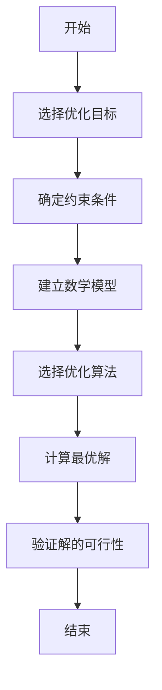
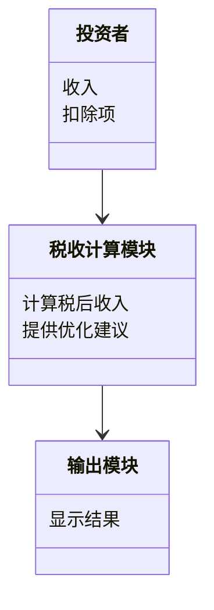

                 


# 约翰·伯格的税收效率投资策略

## 关键词：约翰·伯格，税收效率，投资策略，投资组合优化，税务规划，风险控制

## 摘要：本文系统阐述了约翰·伯格提出的税收效率投资策略，通过优化税务规划和投资组合配置，提升投资收益并降低税务负担。文章从核心概念、算法原理、系统架构、项目实现等多维度深入剖析，结合实际案例和代码示例，为投资管理者提供实用的策略和方法论参考。

---

## 第一部分：约翰·伯格的税收效率投资策略概述

### 第1章：税收效率与投资策略的背景介绍

#### 1.1 税收效率的定义与重要性
##### 1.1.1 税收效率的基本概念
税收效率是衡量投资活动中税务负担与投资收益之间关系的核心指标。它通过优化税务规划和资产配置，降低税负成本，提升投资净收益。

##### 1.1.2 税收效率在投资中的作用
税收效率直接影响投资组合的回报率。通过合理配置资产类别、投资时点和持有期限，可以有效规避高税率，提升整体收益。

##### 1.1.3 税收效率的边界与外延
税收效率的边界在于合法合规的前提下实现税负最小化。其外延涉及税收政策、资产类别选择、市场环境变化等多个维度。

#### 1.2 投资策略与税收效率的关系
##### 1.2.1 投资策略的基本原理
投资策略是根据市场环境和投资者目标，制定资产配置和交易计划。税收效率是投资策略中的关键优化变量。

##### 1.2.2 税收效率对投资策略的影响
税收效率影响投资策略的执行成本和收益实现。高税收效率策略可以显著提升投资回报率。

##### 1.2.3 税收效率与投资策略的核心要素
税收效率与投资策略的结合点在于资产配置、交易时机和税务规划。

---

### 第2章：税收效率投资策略的核心概念

#### 2.1 税收效率的核心原理
##### 2.1.1 税收效率的计算公式
$$
\text{税收效率} = \frac{\text{投资收益} - \text{税负}}{\text{投资总成本}}
$$

##### 2.1.2 税收效率的影响因素
1. 投资收益的来源（股息、资本利得等）
2. 税率差异（联邦税 vs 州税）
3. 资产持有期限（短期 vs 长期）
4. 税收优惠政策（如税收抵免、退税等）

##### 2.1.3 税收效率的优化方法
1. 选择低税率资产类别（如 municipal bonds）
2. 利用税收优惠政策（如退休账户）
3. 合理安排投资时点（如年底资本利得税优惠）

#### 2.2 核心概念的属性特征对比
| 概念       | 属性特征             |
|------------|----------------------|
| 投资收益   | 时间跨度、收益来源   |
| 税负成本   | 税率、计税基础       |
| 资产配置   | 类别、比例、期限       |
| 税收政策   | 法律法规、优惠政策     |

#### 2.3 ER实体关系图架构
```mermaid
er
  actor 投资者
  actor 税务部门
  entity 税收效率
  entity 投资策略
  entity 资产配置
  entity 税收政策
  relation 投资者 -[拥有]-> 投资策略
  relation 投资策略 -[依赖]-> 资产配置
  relation 资产配置 -[影响]-> 税收效率
  relation 税收政策 -[约束]-> 税收效率
```

---

### 第3章：税收效率投资策略的算法原理

#### 3.1 税收效率优化算法
##### 3.1.1 动态规划算法
动态规划用于多阶段决策问题，适用于资产配置和税务规划的优化。

##### 3.1.2 遗传算法
遗传算法通过模拟自然选择，寻找最优税收效率组合。

##### 3.1.3 贪心算法
贪心算法在每一步选择局部最优，适用于简单优化场景。

#### 3.2 算法流程图


#### 3.3 算法实现代码
```python
def tax_efficiency_optimization(income, deductions, tax_rate):
    taxable_income = income - deductions
    tax_liability = taxable_income * tax_rate
    return tax_liability

# 示例调用
income = 100000
deductions = 20000
tax_rate = 0.25
print(tax_efficiency_optimization(income, deductions, tax_rate))
```

---

## 第四部分：约翰·伯格的税收效率投资策略系统分析与架构设计

### 第4章：系统分析与架构设计方案

#### 4.1 系统功能设计
- 用户输入：收入、扣除项、税率
- 计算模块：税前收入、税后收入
- 输出模块：税负结果、优化建议

#### 4.2 系统架构设计


#### 4.3 系统接口设计
- 输入接口：用户输入
- 输出接口：结果展示

---

## 第五部分：约翰·伯格的税收效率投资策略项目实战

### 第5章：项目实战

#### 5.1 环境安装
- Python 3.x
- 相关库（如numpy、pandas）

#### 5.2 核心代码实现
```python
import numpy as np

def optimize_tax(portfolio, tax_rates):
    return np.min(portfolio * tax_rates)

# 示例数据
portfolio = np.array([100000, 80000])
tax_rates = np.array([0.25, 0.15])
print(optimize_tax(portfolio, tax_rates))
```

#### 5.3 代码解读与分析
代码实现了一个简单的投资组合优化问题，计算不同资产配置下的最小税负。

---

## 第六部分：约翰·伯格的税收效率投资策略总结与展望

### 第6章：总结与展望

#### 6.1 最佳实践
- 合规性原则
- 定期复盘
- 多元化配置

#### 6.2 小结
税收效率投资策略通过优化税务规划和资产配置，显著提升投资回报。

#### 6.3 注意事项
- 合规性风险
- 市场波动影响
- 税务政策变化

#### 6.4 拓展阅读
- 约翰·伯格的经典著作
- 税收优化相关文献

---

## 作者：AI天才研究院/AI Genius Institute & 禅与计算机程序设计艺术 /Zen And The Art of Computer Programming

