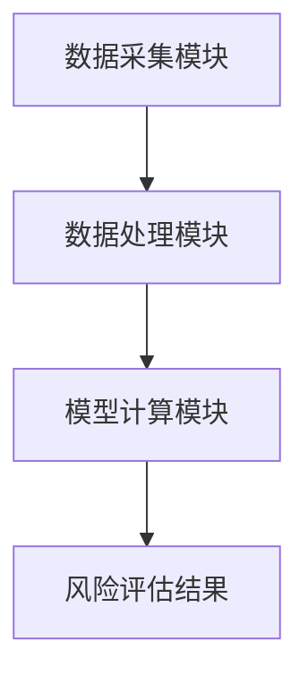

                 

# 约翰·内夫的价值陷阱识别技巧

> 关键词：价值陷阱识别、约翰·内夫、投资技巧、风险管理、价值评估

> 摘要：本文深入探讨了约翰·内夫的价值陷阱识别技巧，从基本概念到数学模型，从系统设计到实战案例，全面解析如何识别和规避价值陷阱。文章内容涵盖价值陷阱的核心概念、识别方法、数学模型、系统架构以及实际案例分析，帮助读者掌握价值陷阱识别的关键技巧。

---

## 第1章: 价值陷阱识别技巧的引言

### 1.1 价值陷阱的基本概念
价值陷阱是投资学中的一个重要概念，指那些表面上看似具有投资价值，但实际上存在隐藏风险或缺陷的投资机会。识别价值陷阱是投资者在做出投资决策时必须掌握的核心技能之一。

#### 1.1.1 价值陷阱的定义
价值陷阱是指那些看似具有较高价值或收益潜力，但实际上存在根本性缺陷或风险的投资标的。投资者如果未能识别这些陷阱，可能会遭受重大损失。

#### 1.1.2 价值陷阱的核心特征
- **表面吸引力**：标的物在财务数据或市场表现上看似优异。
- **隐藏风险**：存在未被充分揭示或评估的缺陷或风险。
- **短期诱惑**：短期内可能表现出较高的收益或估值。

#### 1.1.3 价值陷阱识别的重要性
识别价值陷阱可以帮助投资者避免误判投资标的的真实价值，从而降低投资风险，提高投资决策的准确性。

### 1.2 价值陷阱识别的核心概念
价值陷阱识别的核心在于分析投资标的的内在价值、财务健康状况、市场环境和潜在风险。

#### 1.2.1 问题背景与问题描述
在投资过程中，投资者需要对大量的投资机会进行筛选和评估。然而，许多看似优质的标的实际上可能存在隐藏的问题，这些问题可能在短期内不明显，但长期来看会导致投资失败。

#### 1.2.2 问题解决的思路与方法
通过系统化的分析方法和模型，结合财务数据、市场信息和行业知识，识别潜在的价值陷阱。

#### 1.2.3 价值陷阱的边界与外延
价值陷阱的识别不仅限于单一指标，而是需要综合考虑多个维度的信息，包括财务、市场、行业和公司治理等因素。

### 1.3 价值陷阱识别的核心要素
价值陷阱识别的核心要素包括财务数据、市场行为和行业特征。

#### 1.3.1 核心要素的组成与结构
- **财务数据**：包括收入、利润、资产负债情况等。
- **市场行为**：包括股价波动、交易量变化等。
- **行业特征**：包括行业周期、竞争格局等。

#### 1.3.2 核心要素之间的关系
财务数据反映了标的的盈利能力，市场行为反映了市场的预期，行业特征反映了标的所处的外部环境。三者共同作用，决定了标的的内在价值。

#### 1.3.3 核心概念的属性特征对比表
| 属性 | 财务数据 | 市场行为 | 行业特征 |
|------|----------|----------|----------|
| 数据类型 | 数值型 | 数值型 | 数值型与文本型 |
| 数据来源 | 财务报表 | 市场数据 | 行业报告 |
| 数据频率 | 季度/年度 | 实时 | 定期 |

---

## 第2章: 价值陷阱识别的关键指标与方法

### 2.1 价值陷阱识别的关键指标
价值陷阱识别的关键指标包括财务指标、市场指标和公司治理指标。

#### 2.1.1 财务指标分析
- **收入与利润**：分析标的的收入和利润是否持续增长，是否存在虚假收入或利润。
- **资产负债情况**：分析标的的资产负债结构，是否存在高额负债或资产贬值。
- **现金流**：分析标的的现金流是否健康，是否存在现金流断裂的风险。

#### 2.1.2 市场指标分析
- **股价与估值**：分析标的的股价是否合理，市盈率、市净率等估值指标是否偏离行业平均水平。
- **交易量**：分析标的的交易量是否异常，是否存在成交量 manipulation。

#### 2.1.3 公司治理指标分析
- **管理层稳定性**：分析公司管理层是否稳定，是否存在频繁更换或内部矛盾。
- **公司治理结构**：分析公司治理结构是否合理，是否存在大股东操控或内部控制问题。

### 2.2 价值陷阱识别的主要方法
价值陷阱识别的主要方法包括基本面分析、市场行为分析和行业分析。

#### 2.2.1 基于财务数据的方法
- **财务比率分析**：通过分析标的的财务比率（如ROE、ROA、负债率等）来评估其财务健康状况。
- **趋势分析**：通过分析标的的财务数据趋势，发现潜在的问题。

#### 2.2.2 基于市场行为的方法
- **股价走势分析**：通过分析标的的股价走势，发现是否存在异常波动。
- **市场情绪分析**：通过分析市场的整体情绪，判断标的是否存在被市场过度炒作的风险。

#### 2.2.3 基于行业分析的方法
- **行业周期分析**：分析标的所处行业的周期，判断其是否处于衰退期或成熟期。
- **行业竞争分析**：分析标的在行业中的竞争地位，是否存在竞争优势不足的问题。

### 2.3 价值陷阱识别的误区与注意事项
价值陷阱识别过程中，投资者容易陷入以下误区：

#### 2.3.1 常见误区分析
- **只看表面数据**：忽视了数据背后的真实情况。
- **过度依赖单一指标**：过于依赖某一个指标，忽视了综合分析的重要性。
- **忽视行业风险**：没有充分考虑行业风险，导致误判。

#### 2.3.2 如何避免误区
- **综合分析**：结合多个指标和维度进行分析，避免单一指标的误导。
- **深入调查**：对标的进行深入调查，了解其真实情况。
- **持续关注**：持续关注标的的动态，及时发现潜在风险。

#### 2.3.3 关键指标的权重分配
- **财务指标**：权重较高，尤其是收入和利润。
- **市场指标**：权重中等，尤其是在市场波动较大的情况下。
- **公司治理指标**：权重较低，但在长期投资中非常重要。

---

## 第3章: 价值陷阱识别的数学模型与算法原理

### 3.1 价值陷阱识别的数学模型
价值陷阱识别的数学模型主要用于量化标的的风险和潜在问题。

#### 3.1.1 模型的构建过程
- **数据收集**：收集标的的财务数据、市场数据和行业数据。
- **数据预处理**：对数据进行清洗和标准化处理。
- **模型训练**：通过机器学习或统计方法训练模型。

#### 3.1.2 模型的输入变量与输出变量
- **输入变量**：财务指标（收入、利润、资产负债率等）、市场指标（股价、交易量等）、公司治理指标（管理层稳定性等）。
- **输出变量**：标的的风险等级（低风险、中风险、高风险）。

#### 3.1.3 模型的假设条件与限制
- **假设条件**：数据的完整性和准确性。
- **限制**：模型无法预测黑天鹅事件。

### 3.2 价值陷阱识别的算法原理
价值陷阱识别的算法主要用于对标的进行分类和预测。

#### 3.2.1 算法的输入数据类型
- **数值型数据**：财务数据、市场数据。
- **文本型数据**：公司治理相关的文本信息。

#### 3.2.2 算法的处理流程
1. 数据预处理：清洗、标准化、特征提取。
2. 模型训练：使用机器学习算法（如逻辑回归、随机森林）训练模型。
3. 模型预测：对新数据进行预测，输出风险等级。

#### 3.2.3 算法的输出结果解释
- **风险等级**：低风险（0）、中风险（1）、高风险（2）。

### 3.3 价值陷阱识别的数学公式
价值陷阱识别的数学公式主要用于计算风险评分。

#### 3.3.1 核心公式推导
$$
\text{风险评分} = \alpha \times \text{财务指标} + \beta \times \text{市场指标} + \gamma \times \text{公司治理指标}
$$
其中，$\alpha$、$\beta$、$\gamma$为权重系数。

#### 3.3.2 公式的应用场景
应用于对标的的综合风险评估，帮助投资者做出投资决策。

#### 3.3.3 公式的优缺点分析
- **优点**：能够综合考虑多个因素，提高评估的准确性。
- **缺点**：权重系数的设定可能影响评估结果，需要根据实际情况调整。

---

## 第4章: 价值陷阱识别的系统架构与设计

### 4.1 价值陷阱识别系统的总体架构
价值陷阱识别系统是一个复杂的系统，需要整合多个模块的功能。

#### 4.1.1 系统的功能模块划分
- **数据采集模块**：负责采集标的的财务数据、市场数据和行业数据。
- **数据处理模块**：负责对数据进行清洗、标准化和特征提取。
- **模型计算模块**：负责对数据进行建模和预测。

#### 4.1.2 模块之间的交互关系
1. 数据采集模块将数据传输到数据处理模块。
2. 数据处理模块将处理后的数据传输到模型计算模块。
3. 模型计算模块输出风险评估结果。

#### 4.1.3 系统的输入输出设计
- **输入**：标的的财务数据、市场数据和行业数据。
- **输出**：标的的风险等级（低风险、中风险、高风险）。

### 4.2 价值陷阱识别系统的功能设计
#### 4.2.1 数据采集模块
- **功能**：采集标的的财务数据、市场数据和行业数据。
- **实现**：通过API接口获取数据。

#### 4.2.2 数据处理模块
- **功能**：对数据进行清洗、标准化和特征提取。
- **实现**：使用Python的Pandas库进行数据处理。

#### 4.2.3 模型计算模块
- **功能**：对数据进行建模和预测。
- **实现**：使用机器学习算法（如随机森林）进行模型训练。

### 4.3 价值陷阱识别系统的架构图
以下是一个简单的系统架构图：

---

## 第5章: 价值陷阱识别的实战案例分析

### 5.1 实战案例的选择标准
选择具有代表性的案例，帮助读者更好地理解价值陷阱识别的技巧。

#### 5.1.1 案例的典型性
选择那些在行业内具有代表性的公司，尤其是那些曾经被认为是“价值洼地”的公司。

#### 5.1.2 案例的可分析性
选择那些数据完整、易于分析的公司。

#### 5.1.3 案例的教育意义
选择那些能够帮助读者理解价值陷阱识别技巧的公司。

### 5.2 案例分析的具体步骤
以某公司为例，分析其是否为价值陷阱。

#### 5.2.1 数据的收集
- **财务数据**：收入、利润、资产负债率等。
- **市场数据**：股价、交易量等。
- **行业数据**：行业周期、竞争格局等。

#### 5.2.2 数据的预处理
- **清洗数据**：去除异常值。
- **标准化处理**：将数据标准化，方便模型训练。

#### 5.2.3 模型的训练
- **选择算法**：选择随机森林算法。
- **训练模型**：使用训练数据训练模型。
- **验证模型**：使用测试数据验证模型的准确性。

#### 5.2.4 结果的解读
- **风险评分**：根据模型输出的风险评分，判断标的是否为价值陷阱。

---

## 结语

通过本文的详细讲解，我们可以看到，价值陷阱识别是一项复杂但非常重要的技能。从基本概念到数学模型，从系统设计到实战案例，我们全面解析了如何识别和规避价值陷阱。希望本文能够为投资者提供有价值的参考和启示。

---

**作者：AI天才研究院/AI Genius Institute & 禅与计算机程序设计艺术 /Zen And The Art of Computer Programming**

