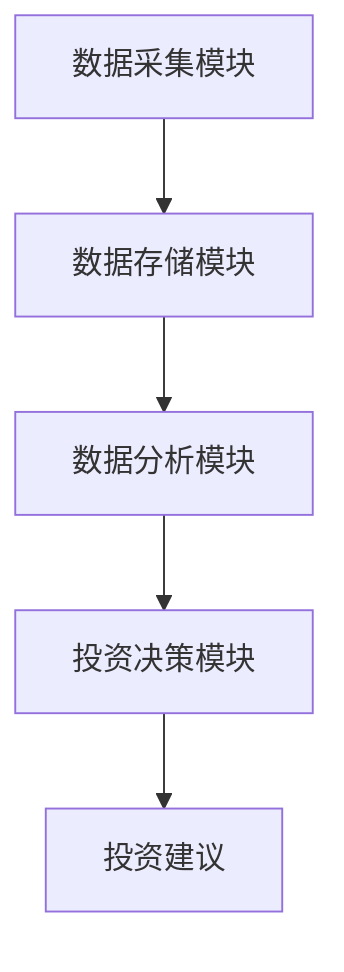

                 

# 约翰·内夫的高股息价值投资策略

> 关键词：高股息投资、价值投资、约翰·内夫、内部收益率、风险管理、投资组合优化

> 摘要：本文深入探讨了约翰·内夫的高股息价值投资策略，分析了其核心理念、选股标准、风险管理方法以及投资系统的构建。文章从高股息投资的基本概念出发，逐步展开对其数学模型、算法原理和系统架构的详细讲解，并结合实际案例进行了分析和总结。通过本文，读者将能够全面理解高股息价值投资的策略、方法和实际应用。

---

## 第一部分: 高股息价值投资策略概述

### 第1章: 高股息价值投资的背景与核心理念

#### 1.1 高股息投资的基本概念

##### 1.1.1 高股息投资的定义
高股息投资是一种以获取稳定的股息收入为核心目标的投资策略。通过选择股息率高、股息支付稳定且具备长期增长潜力的股票，投资者可以在获取稳定现金流的同时，追求资产的长期增值。

##### 1.1.2 高股息投资的核心特征
- **股息收益率高**：通常选择股息率在3%以上的股票。
- **股息支付稳定**：公司具有稳定的盈利能力和良好的股息支付能力。
- **低估值**：通常选择市盈率（P/E）和市净率（P/B）较低的股票。
- **长期持有**：高股息投资强调长期持有优质资产，避免频繁交易。

##### 1.1.3 高股息投资的市场背景
高股息投资在经济下行周期或低利率环境下更具吸引力。在低利率环境中，债券收益率下降，投资者转向股票市场寻求更高的收益，而高股息股票因其稳定的股息收入受到青睐。

#### 1.2 约翰·内夫的投资理念

##### 1.2.1 约翰·内夫的生平简介
约翰·内夫（John Neff）是美国著名的投资经理，曾担任韦格尔资本管理公司（Vanguard）的投资总监。他以高股息价值投资策略闻名，其投资理念强调长期持有、低估值和稳定的股息收入。

##### 1.2.2 内夫投资策略的核心思想
内夫的投资策略可以总结为以下几点：
1. **低市盈率**：选择市盈率低于市场平均水平的股票。
2. **高股息率**：优先选择股息率高的股票。
3. **安全边际**：通过低市盈率和低市净率寻找具有安全边际的股票。
4. **长期持有**：避免频繁交易，长期持有优质资产。

##### 1.2.3 内夫策略与传统价值投资的异同
- **相同点**：都强调寻找被市场低估的股票，注重安全边际。
- **不同点**：内夫策略更加强调股息收益率和低市盈率，而传统价值投资更关注企业的基本面和长期竞争优势。

#### 1.3 高股息投资的适用场景与局限性

##### 1.3.1 高股息投资的适用场景
- **追求稳定收入**：适合需要稳定现金流的投资者，如退休人士。
- **经济下行周期**：在经济低迷时期，高股息股票往往表现相对稳定。
- **低利率环境**：低利率环境下，债券收益率下降，高股息股票的吸引力上升。

##### 1.3.2 高股息投资的局限性
- **收益波动**：高股息股票的价格波动可能较大，尤其是在市场低迷时期。
- **流动性风险**：部分高股息股票流动性较差，可能导致买卖价差较大。
- **再投资风险**：如果股息再投资于同样的股票，可能会导致过度集中风险。

##### 1.3.3 不同市场周期下的策略调整
- **牛市**：适当降低高股息股票的仓位，增加对成长股的配置。
- **熊市**：增加高股息股票的配置，利用市场的恐慌性下跌的机会建仓。

### 第2章: 高股息价值投资的核心策略

#### 2.1 高股息股票的筛选标准

##### 2.1.1 股息率的计算与评估
股息率的计算公式为：
$$
\text{股息率} = \frac{\text{每股股息}}{\text{股价}}
$$

##### 2.1.2 股息支付率的分析
股息支付率的计算公式为：
$$
\text{股息支付率} = \frac{\text{每股股息}}{\text{每股收益}}
$$

##### 2.1.3 股票市盈率与市净率的综合考量
- **市盈率（P/E）**：计算公式为：
  $$
  \text{P/E} = \frac{\text{股价}}{\text{每股收益}}
  $$
- **市净率（P/B）**：计算公式为：
  $$
  \text{P/B} = \frac{\text{股价}}{\text{每股净资产}}
  $$

#### 2.2 内部收益率（IRR）的计算与应用

##### 2.2.1 IRR的定义与计算公式
内部收益率（IRR）是指投资项目的净现值为零的折现率。计算公式为：
$$
NPV = \sum_{t=1}^{n} \frac{C_t}{(1+IRR)^t} = 0
$$

##### 2.2.2 IRR在高股息投资中的应用
通过计算高股息股票的IRR，可以评估其未来现金流的现值，从而判断其投资价值。

##### 2.2.3 IRR与股息率的关系分析
IRR与股息率的关系可以通过以下公式体现：
$$
IRR = \text{股息率} \times \text{再投资收益率}
$$

#### 2.3 股票内在价值的评估方法

##### 2.3.1 股票价值的多维度评估
- **现金流折现法（DCF）**：通过预测未来现金流并折现计算股票价值。
- **相对估值法**：通过比较市盈率、市净率等指标进行估值。

##### 2.3.2 股票估值模型的建立与应用
常用股票估值模型包括：
1. **股息折扣模型（DDM）**：通过股息的现值计算股票价值。
2. **市盈率模型**：通过比较市盈率与行业平均水平判断股票价值。

##### 2.3.3 内部收益率与股票价值的关系
通过IRR模型可以判断股票的内在价值，从而指导投资决策。

### 第3章: 高股息价值投资的数学模型与算法

#### 3.1 股票内在价值的数学模型

##### 3.1.1 股票价值的多因子模型
多因子模型可以通过以下公式表示：
$$
\text{股票价值} = \alpha + \beta_1 \times \text{因子1} + \beta_2 \times \text{因子2} + \cdots + \beta_n \times \text{因子n}
$$

##### 3.1.2 股票估值的公式推导
通过股息折现模型（DDM）计算股票价值：
$$
\text{股票价值} = \frac{\text{股息}}{\text{股息增长率}} \times \frac{1}{\text{折现率} - \text{股息增长率}}
$$

##### 3.1.3 案例分析：某高股息股票的价值评估
假设某股票股息为2元，股息增长率5%，折现率为8%，则股票价值为：
$$
\text{股票价值} = \frac{2}{0.05} \times \left( \frac{1}{0.08 - 0.05} \right) = 40 \times 33.33 = 1333.2
$$

#### 3.2 内部收益率（IRR）的计算算法

##### 3.2.1 IRR的数学公式
IRR的计算公式为：
$$
NPV = \sum_{t=1}^{n} \frac{C_t}{(1+IRR)^t} = 0
$$

##### 3.2.2 IRR的计算步骤
1. **确定现金流**：列出项目的现金流。
2. **设定初始猜测值**：选择一个初始的折现率。
3. **计算NPV**：根据初始猜测值计算NPV。
4. **调整折现率**：根据NPV的符号调整折现率，直到NPV接近零。

##### 3.2.3 IRR在高股息投资中的应用案例
假设某高股息股票的现金流如下：
- 年初投资：-100元
- 第一年股息：5元
- 第二年股息：5.25元
- 第三年股息：5.5元
- 折现率：8%

计算IRR：
$$
0 = \frac{5}{(1+IRR)^1} + \frac{5.25}{(1+IRR)^2} + \frac{5.5}{(1+IRR)^3} - 100
$$
通过试算，IRR ≈ 7.5%

### 第4章: 高股息价值投资的系统架构与实现

#### 4.1 投资系统的需求分析

##### 4.1.1 系统功能需求
- 数据采集：获取股票的股息率、市盈率等数据。
- 数据分析：计算股票的内在价值、IRR等指标。
- 投资决策：根据分析结果生成投资建议。

##### 4.1.2 系统性能需求
- 数据处理速度：能够快速处理大量股票数据。
- 系统稳定性：保证系统的稳定运行，避免数据丢失。

#### 4.2 系统架构设计

##### 4.2.1 系统功能模块设计
- 数据采集模块：负责采集股票数据。
- 数据分析模块：负责计算股票的内在价值、IRR等指标。
- 投资决策模块：根据分析结果生成投资建议。

##### 4.2.2 系统架构图

#### 4.3 系统接口设计

##### 4.3.1 数据接口
- 输入接口：接收股票数据。
- 输出接口：输出股票的内在价值、IRR等指标。

##### 4.3.2 用户接口
- 输入：用户输入筛选条件。
- 输出：显示符合条件的股票列表和投资建议。

### 第5章: 高股息价值投资的风险管理与优化

#### 5.1 风险管理策略

##### 5.1.1 风险识别
- 市场风险：股票价格波动。
- 利率风险：利率上升导致股票价格下跌。
- 信用风险：公司财务状况恶化导致股息减少或停止。

##### 5.1.2 风险评估
通过计算股票的波动率、贝塔系数等指标评估风险。

##### 5.1.3 风险控制
- 分散投资：通过投资不同行业的股票降低风险。
- 仓位控制：根据市场情况调整投资仓位。

#### 5.2 策略优化

##### 5.2.1 动态调整
根据市场变化动态调整投资策略。

##### 5.2.2 绩效评估
定期评估投资组合的绩效，根据结果优化策略。

---

## 作者：AI天才研究院/AI Genius Institute & 禅与计算机程序设计艺术 /Zen And The Art of Computer Programming

