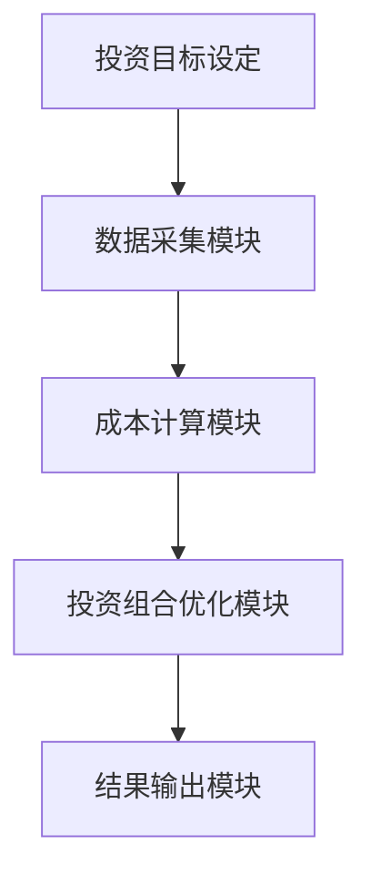

                 


# 约翰·博格尔的成本敏感型投资策略

## 关键词：
- 成本敏感型投资
- 投资策略
- 投资成本
- 投资回报
- 投资组合优化

## 摘要：
本文深入探讨约翰·博格尔的成本敏感型投资策略，分析其核心概念、数学模型及系统架构设计。通过具体案例，展示如何在投资中通过优化成本实现更高回报。文章涵盖投资基础、成本分析、系统设计及实战应用，为投资者提供实用指导。

## 第1章: 投资基础与成本敏感型投资的背景

### 1.1 投资的基本概念
#### 1.1.1 投资的定义与分类
投资是将资源（如资金）分配到不同资产中，以期在未来获得收益的行为。主要分为股票、债券、房地产等多种类型。

#### 1.1.2 投资的基本原则与目标
投资需遵循分散化原则，降低风险。目标通常是实现资产增值，满足财务需求。

#### 1.1.3 投资市场的基本结构
市场分为一级市场和二级市场，投资者通过购买证券参与市场。

### 1.2 成本敏感型投资的背景与现状
#### 1.2.1 传统投资策略的局限性
传统策略忽视交易成本和管理费，导致实际回报降低。

#### 1.2.2 成本在投资中的重要性
投资成本直接影响回报，高成本策略长期表现不佳。

#### 1.2.3 成本敏感型投资的兴起与发展趋势
随着投资者对成本的关注增加，成本敏感型投资逐渐成为主流策略。

## 第2章: 成本敏感型投资的核心原理

### 2.1 投资成本的构成与影响
#### 2.1.1 投资成本的分类
包括交易成本、管理费用、托管费等。

#### 2.1.2 投资成本对投资回报的影响
使用公式计算成本对回报的影响：$$\text{净回报} = \text{总回报} - \text{投资成本}$$

#### 2.1.3 成本敏感型投资的成本优化策略
通过分散投资和选择低成本工具降低整体成本。

### 2.2 投资组合优化的数学模型
#### 2.2.1 投资组合优化的基本原理
优化目标为最大化收益或最小化风险。

#### 2.2.2 数学模型与公式
$$
\text{目标函数：} \quad \min_{w} \left( w^T C w \right)
$$
$$
\text{约束条件：} \quad \sum_{i=1}^{n} w_i = 1, \quad w_i \geq 0
$$

#### 2.2.3 模型的优化过程与结果分析
通过算法找到最优权重，减少成本，提升回报。

## 第3章: 成本敏感型投资的系统架构与设计

### 3.1 投资系统的需求分析
#### 3.1.1 系统目标与功能需求
系统需实现数据采集、成本计算和优化建议。

#### 3.1.2 系统的输入输出分析
输入包括市场数据和用户目标，输出优化方案和报告。

#### 3.1.3 系统的性能需求
要求高效处理数据，快速生成结果。

### 3.2 投资系统架构设计
#### 3.2.1 系统架构的模块划分
包括数据采集模块、成本计算模块和优化模块。

#### 3.2.2 系统架构的流程图


#### 3.2.3 系统架构的优缺点分析
模块化设计便于维护，但初期开发成本较高。

## 第4章: 成本敏感型投资的项目实战

### 4.1 环境安装与数据准备
#### 4.1.1 系统环境的搭建
安装Python和相关库，如numpy和pandas。

#### 4.1.2 数据源的选择与获取
从金融数据供应商获取历史数据。

#### 4.1.3 数据预处理与清洗
处理缺失值和异常数据，确保数据质量。

### 4.2 投资组合优化的代码实现
#### 4.2.1 投资组合优化算法的实现
```python
import numpy as np
def optimize_portfolio(cost_matrix):
    n = cost_matrix.shape[0]
    # 初始化权重向量
    w = np.ones(n) / n
    # 迭代优化
    while True:
        # 计算成本
        cost = w.T.dot(cost_matrix.dot(w))
        # 检查收敛条件
        if np.allclose(cost, w.T.dot(cost_matrix.dot(w))):
            break
        # 更新权重
        w = w * (1 - cost)
    return w
```

#### 4.2.2 代码应用解读与分析
通过迭代优化权重，找到成本最小化或回报最大化的组合。

#### 4.2.3 案例分析
以股票和债券组合为例，展示优化前后的成本和回报变化。

## 第5章: 最佳实践与小结

### 5.1 注意事项与实践技巧
定期监控投资组合，及时调整权重，避免过高成本。

### 5.2 小结
成本敏感型投资通过优化成本提升回报，值得投资者长期关注。

### 5.3 展望
未来，随着技术进步，成本敏感型投资将更加智能化和个性化。

## 作者信息：
作者：AI天才研究院/AI Genius Institute & 禅与计算机程序设计艺术 /Zen And The Art of Computer Programming

