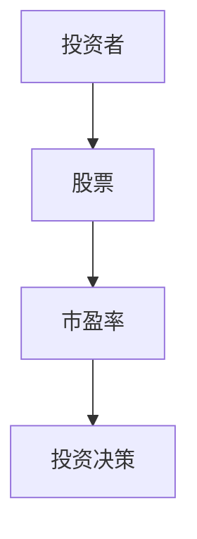
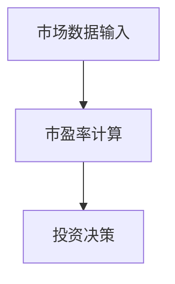
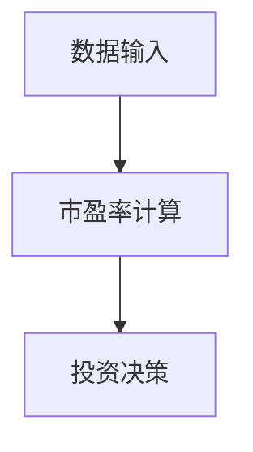

                 


# 约翰·奈夫的低市盈率投资法：简单而有效的价值策略

## 关键词：低市盈率，投资策略，约翰·奈夫，安全边际，价值投资

## 摘要：本文深入探讨了约翰·奈夫的低市盈率投资法，从其背景、核心概念、数学模型到实际应用案例进行了全面分析。通过系统架构设计和项目实战，展示了如何在实际投资中应用这一策略。文章还对比了低市盈率策略与其他投资策略的优缺点，并总结了最佳实践和注意事项。

---

## 第一部分: 约翰·奈夫的低市盈率投资法概述

### 第1章: 低市盈率投资法的背景与核心概念

#### 1.1 低市盈率投资法的背景

低市盈率投资法是一种基于价值投资的策略，旨在通过识别市场中被低估的股票进行投资。约翰·奈夫是该策略的代表人物，他强调以合理的价格投资于具有稳定增长潜力的企业。

##### 1.1.1 投资市场的基本概念

投资市场是一个复杂的系统，涉及股票、债券等多种金融资产。投资者通过分析市场数据和企业基本面，做出投资决策。低市盈率策略关注于股票的市盈率（P/E比率），即股价与每股收益的比率。

##### 1.1.2 低市盈率策略的起源与发展

低市盈率策略起源于20世纪，约翰·奈夫是其主要倡导者。他认为，低市盈率股票通常具有较高的安全边际，即市场价格低于内在价值，从而为投资者提供了较高的安全空间。

##### 1.1.3 约翰·奈夫的投资理念与方法

奈夫的投资理念强调长期价值和安全边际。他主张选择那些市盈率低于市场平均水平且具有稳定收益的企业，避免短期市场波动的干扰。

#### 1.2 低市盈率投资法的核心概念

##### 1.2.1 市盈率的定义与计算公式

市盈率（P/E）是衡量股票价值的重要指标，公式为：

$$ P/E = \frac{\text{股价}}{\text{每股收益}} $$

低市盈率通常意味着股票价格相对较低，可能被市场低估。

##### 1.2.2 低市盈率策略的属性特征对比

| 特性       | 低市盈率策略特点 |
|------------|----------------|
| 适用场景   | 价值被低估的股票 |
| 风险水平   | 中低风险         |
| 投资期限   | 中长期         |

##### 1.2.3 实体关系图



#### 1.3 低市盈率投资法的边界与外延

##### 1.3.1 界定了哪些股票类型

低市盈率策略主要关注那些市盈率低于市场平均水平且具有稳定收益的企业。

##### 1.3.2 与其他投资策略的对比

与其他策略（如成长型投资）相比，低市盈率策略更注重安全性和稳定性，适合风险偏好较低的投资者。

##### 1.3.3 低市盈率策略的局限性

低市盈率策略可能在高增长行业表现不佳，且需要较长的时间来实现收益。

#### 1.4 本章小结

本章介绍了低市盈率投资法的背景、核心概念及其与其他策略的对比，为后续分析奠定了基础。

---

### 第2章: 低市盈率投资法的核心原理

#### 2.1 约翰·奈夫的投资策略

##### 2.1.1 安全边际的概念与计算

安全边际是低市盈率策略的核心，确保市场价格低于内在价值。计算公式为：

$$ \text{安全边际} = \frac{\text{内在价值} - \text{市场价格}}{\text{市场价格}} $$

##### 2.1.2 内在价值的评估方法

内在价值是基于未来现金流的现值计算得出：

$$ \text{内在价值} = \sum_{t=1}^{n} \frac{\text{CF}_t}{(1 + r)^t} $$

其中，CF_t为第t年的现金流，r为折现率。

##### 2.1.3 内在价值与市场价格的关系

通过比较内在价值和市场价格，投资者可以确定是否存在安全边际。

#### 2.2 低市盈率策略的数学模型

##### 2.2.1 市盈率与股票价格的关系

市盈率与股票价格成正比，与每股收益成反比。

##### 2.2.2 市盈率与企业盈利的关系

低市盈率通常意味着企业盈利较高或市场预期较低。

##### 2.2.3 市盈率与投资风险的关系

低市盈率股票通常风险较低，但需考虑行业和企业的具体情况。

#### 2.3 算法原理

##### 2.3.1 算法流程



##### 2.3.2 代码实现

```python
def calculate_pe(stock_price, earnings_per_share):
    return stock_price / earnings_per_share

# 示例
stock_price = 50
earnings_per_share = 10
pe_ratio = calculate_pe(stock_price, earnings_per_share)
print(f"市盈率: {pe_ratio}")
```

---

### 第3章: 低市盈率投资法的系统分析与架构设计

#### 3.1 系统分析

##### 3.1.1 投资决策场景介绍

投资者需要根据市场数据和企业基本面信息做出投资决策。

##### 3.1.2 系统功能需求分析

系统需要具备数据采集、市盈率计算、投资决策等功能。

##### 3.1.3 系统边界与接口设计

系统与外部数据源、投资者交互，输出投资建议。

#### 3.2 系统架构设计

##### 3.2.1 系统模块划分

- 数据采集模块
- 市盈率计算模块
- 投资决策模块

##### 3.2.2 系统架构图



##### 3.2.3 系统交互设计

投资者输入市场数据，系统计算市盈率并生成投资建议。

#### 3.3 本章小结

本章分析了低市盈率投资法的系统架构，为实际应用提供了框架。

---

### 第4章: 低市盈率投资法的项目实战

#### 4.1 环境安装与数据准备

##### 4.1.1 环境安装

安装必要的工具和库，如Python、Pandas等。

##### 4.1.2 数据准备

收集相关股票的市场数据和财务数据。

#### 4.2 系统核心实现

##### 4.2.1 数据采集

使用API获取股票数据。

##### 4.2.2 市盈率计算

根据公式计算市盈率。

##### 4.2.3 投资决策

基于市盈率和安全边际做出投资决策。

#### 4.3 实际案例分析

##### 4.3.1 案例介绍

分析某低市盈率股票的内在价值和投资潜力。

##### 4.3.2 案例分析

通过具体数据展示低市盈率策略的应用。

#### 4.4 本章小结

本章通过实际案例展示了低市盈率投资法的应用过程。

---

## 第五部分: 总结与展望

### 5.1 总结

约翰·奈夫的低市盈率投资法通过识别低估股票，实现稳定收益。本文详细分析了其核心原理和实际应用。

### 5.2 最佳实践 tips

- 确保数据准确性和及时性。
- 结合行业和企业基本面分析。
- 长期持有，避免频繁交易。

### 5.3 小结

低市盈率投资法是一种简单而有效的策略，适合长期投资者。

### 5.4 注意事项

- 风险控制是关键。
- 避免过度依赖单一指标。

### 5.5 拓展阅读

推荐相关书籍和资源，进一步深入学习。

---

## 作者：AI天才研究院 & 禅与计算机程序设计艺术

