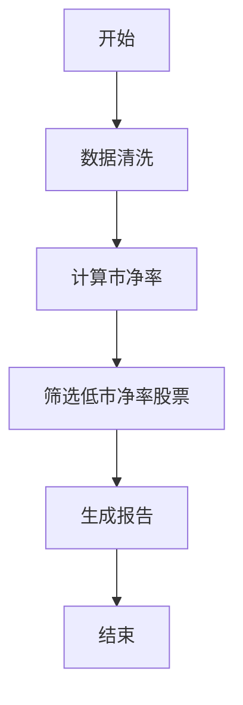
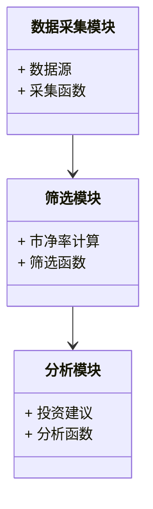

                 


# 约翰·聂夫的低市净率投资：简单有效的价值筛选

---

## 关键词：低市净率投资，约翰·聂夫，价值投资，市净率，投资策略，投资筛选

---

## 摘要

本文深入探讨了约翰·聂夫的低市净率投资策略，分析其理论基础、筛选标准及实际应用。通过详细讲解市净率的定义、计算、优缺点，结合算法原理、系统设计和项目实战，为读者提供从理论到实践的全面指导。文章还总结了最佳实践，帮助读者在投资中有效应用低市净率策略。

---

## 第一部分：低市净率投资的背景与核心概念

### 第1章：低市净率投资的起源与发展

#### 1.1 低市净率投资的起源

低市净率投资是一种基于价值投资的理念，旨在寻找市场低估的股票。起源于20世纪，约翰·聂夫是该策略的代表人物，他在1970年代至2000年代管理的富达逆向策略基金取得了卓越的业绩。

#### 1.2 低市净率投资与其他价值投资策略的对比

| 指标 | 定义 | 适用场景 | 优点 | 缺点 |
|------|------|----------|------|------|
| 市盈率 | P/E = 价格/每股收益 | 高增长行业 | 反映盈利能力 | 收益波动大 |
| 市净率 | P/B = 价格/每股净资产 | 资产密集型行业 | 评估资产价值 | 忽略收益质量 |
| 市销率 | P/S = 价格/每股营收 | 服务行业 | 反映收入能力 | 受营销影响 |

#### 1.3 约翰·聂夫的投资理念

- **投资策略**：长期持有，注重安全边际。
- **核心思想**：寻找低市净率且基本面良好的公司。
- **投资组合管理**：分散投资，定期调整。

### 第2章：市净率的定义与计算

#### 2.1 市净率的定义

市净率（P/B）= 股票价格 / 每股净资产。

#### 2.2 市净率与其他指标的对比

**优缺点对比**：

- **优点**：评估资产价值，避免高估。
- **缺点**：忽视收益质量，可能错过高增长公司。

**ER图**：

```mermaid
erDiagram
    投资者 o-< 系统 : 使用
    系统 o-< 数据 : 处理
    数据 o-< 市净率 : 计算
```

---

## 第二部分：低市净率投资的算法原理

### 第3章：低市净率筛选算法

#### 3.1 算法定义

目标：筛选市净率低于行业平均值的股票。

#### 3.2 算法流程



#### 3.3 算法优化

- 增加流动性考虑。
- 结合其他指标（如ROE）。
- 设置动态筛选阈值。

---

## 第三部分：低市净率投资的系统分析

### 第4章：低市净率投资系统的架构设计

#### 4.1 系统设计背景

目标：辅助投资者筛选低市净率股票。

#### 4.2 系统功能设计

- 数据采集模块：收集股票数据。
- 筛选模块：计算市净率并筛选。
- 分析模块：生成投资建议。
- 报告模块：输出报告。

**类图**：



---

## 第四部分：低市净率投资的项目实战

### 第5章：低市净率投资系统的实现

#### 5.1 环境安装

安装Python和相关库（Pandas、NumPy）。

#### 5.2 核心代码实现

```python
import pandas as pd

def calculate_p_b_ratio(data):
    data['P/B'] = data['Price'] / data['Book Value per Share']
    return data

def filter_low_p_b(data, threshold=1.5):
    return data[data['P/B'] < threshold]

# 示例数据
data = {
    'Stock': ['A', 'B', 'C'],
    'Price': [50, 30, 40],
    'Book Value per Share': [20, 15, 25]
}
df = pd.DataFrame(data)
df = calculate_p_b_ratio(df)
filtered = filter_low_p_b(df)

print(filtered)
```

#### 5.3 代码解读

- `calculate_p_b_ratio`：计算市净率。
- `filter_low_p_b`：筛选低市净率股票。

---

## 第五部分：低市净率投资的最佳实践

### 第6章：总结与建议

#### 6.1 总结

低市净率投资是一种有效的价值筛选方法，约翰·聂夫的成功证明了其长期有效性。

#### 6.2 注意事项

- 市场变化：周期性波动影响策略效果。
- 数据质量：确保数据准确。
- 模型优化：结合其他指标提升效果。

#### 6.3 拓展阅读

推荐书籍：《约翰·聂夫谈投资》、《投资中最简单的事》。

---

## 作者：AI天才研究院 & 禅与计算机程序设计艺术

---

本文通过详细分析约翰·聂夫的低市净率投资策略，从理论到实践，为读者提供了全面的指导。通过系统设计和项目实战，帮助读者掌握这一简单而有效的投资方法。

