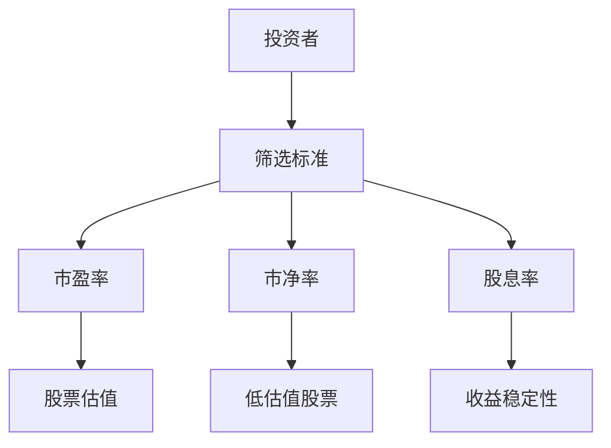
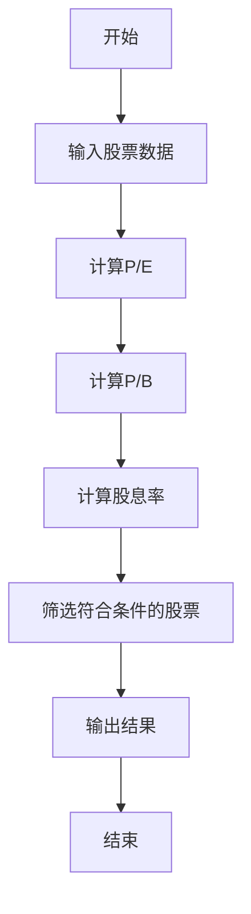
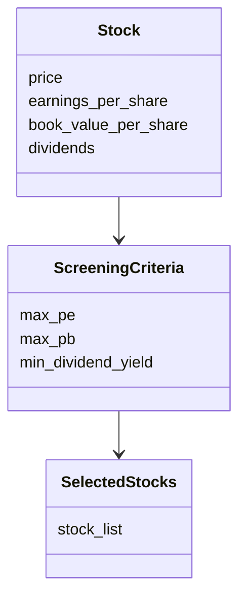

                 


# 约翰·聂夫的小盘价值股筛选标准

## 关键词：约翰·聂夫，小盘价值股，投资标准，股票筛选，价值投资

## 摘要：  
约翰·聂夫是历史上最成功的投资者之一，他的小盘价值股投资策略以其严格的标准和卓越的长期表现而闻名。本文将深入分析约翰·聂夫的小盘价值股筛选标准，从背景介绍、核心概念、算法原理到实际应用，为读者提供全面的理解和实用的指导。通过详细讲解每一步筛选标准及其背后的逻辑，本文旨在帮助投资者掌握这一经典的投资策略。

---

## 第一部分：背景介绍

### 第1章：约翰·聂夫与小盘价值股投资概述

#### 1.1 约翰·聂夫的投资理念
- **1.1.1 价值投资的起源与核心思想**
  - 价值投资的起源可以追溯到本杰明·格雷厄姆，他强调以低于内在价值的价格购买优质资产。约翰·聂夫继承并发展了这一理念，专注于寻找被市场低估的小盘股。
  - 核心思想：市场先生是不可预测的，投资者的任务是找到内在价值，并在价格远低于价值时买入。

- **1.1.2 约翰·聂夫的投资风格与成就**
  - 约翰·聂夫以其耐心、纪律性和对小盘股的专注而闻名。他在任职期间管理的基金取得了卓越的长期回报，年化收益率超过20%。
  - 成就：成功筛选出许多优质的小盘股，帮助投资者实现超额收益。

- **1.1.3 小盘股的定义与价值**
  - 小盘股通常指市值在10亿到20亿美元之间的公司。
  - 小盘股市场的波动性较高，但潜在回报也更大。许多伟大的公司早期都是小盘股，因此小盘股投资具有发现未来潜力股的机会。

---

### 第2章：价值投资与小盘股的结合

- **2.1 小盘股市场的特点**
  - 小盘股市场的流动性较低，但波动性较高。
  - 小盘股公司通常更具成长性，但也面临更高的风险。

- **2.2 价值投资的核心原则**
  - 买入被市场低估的股票。
  - 长期持有，耐心等待市场重新认识其价值。

- **2.3 约翰·聂夫的创新**
  - 约翰·聂夫在传统的价值投资中加入了对成长性的考量，既关注低估值，又关注公司的成长潜力。

---

## 第二部分：核心概念与联系

### 第3章：小盘价值股筛选标准的核心要素

#### 3.1 核心概念原理
- **市盈率（P/E）**
  - 计算公式：$$P/E = \frac{股票价格}{每股净利润}$$
  - 低市盈率通常意味着股票被低估，但需结合行业特性分析。
  
- **市净率（P/B）**
  - 计算公式：$$P/B = \frac{股票价格}{每股净资产}$$
  - 低市净率表明资产可能被低估，尤其适用于资产密集型行业。

- **股息率与股息支付率**
  - 股息率：$$\text{股息率} = \frac{\text{每股股息}}{\text{股票价格}}$$
  - 股息支付率：$$\text{股息支付率} = \frac{\text{每股股息}}{\text{每股净利润}}$$
  - 高股息率和合理的股息支付率表明公司财务健康，且愿意回报股东。

#### 3.2 核心概念属性特征对比表
| 标准       | 计算公式                | 重要性 | 适用场景                           |
|------------|-------------------------|--------|------------------------------------|
| 市盈率     | P/E = 价格/每股收益    | 高     | 评估股票估值                       |
| 市净率     | P/B = 价格/每股净资产  | 中     | 评估低估值股票                     |
| 股息率     | D/R = 每股股息/股价    | 高     | 评估收益稳定性                     |
| 股息支付率 | D/P = 每股股息/净利润  | 中     | 评估财务健康性                     |

#### 3.3 实体关系图（Mermaid流程图）



---

### 第4章：算法与数学模型

#### 4.1 约翰·聂夫筛选标准的算法流程图（Mermaid）



#### 4.2 筛选标准的数学模型

- **市盈率筛选**：选择P/E < 市场平均值。
- **市净率筛选**：选择P/B < 1.5。
- **股息率筛选**：选择股息率 > 2%且股息支付率 < 50%。

#### 4.3 Python实现代码

```python
def calculate_pe_ratio(price, earnings_per_share):
    return price / earnings_per_share

def calculate_pb_ratio(price, book_value_per_share):
    return price / book_value_per_share

def calculate_dividend_yield(dividends, price):
    return dividends / price

def screen_stocks(stocks, max_pe=15, max_pb=2, min_dividend_yield=2):
    selected_stocks = []
    for stock in stocks:
        pe = calculate_pe_ratio(stock['price'], stock['earnings_per_share'])
        pb = calculate_pb_ratio(stock['price'], stock['book_value_per_share'])
        dividend_yield = calculate_dividend_yield(stock['dividends'], stock['price'])
        
        if pe < max_pe and pb < max_pb and dividend_yield > min_dividend_yield:
            selected_stocks.append(stock)
    return selected_stocks
```

---

## 第三部分：系统分析与架构设计

### 第5章：系统架构设计

#### 5.1 领域模型（Mermaid类图）



#### 5.2 系统架构设计（Mermaid架构图）


---

## 第四部分：项目实战

### 第6章：项目实战

#### 6.1 环境安装
- 需要Python 3.8及以上版本。
- 安装必要的库：pandas, numpy, matplotlib。

#### 6.2 核心代码实现

```python
import pandas as pd

def load_stock_data(file_path):
    return pd.read_csv(file_path)

def apply_screening_criteria(stocks_df, max_pe=15, max_pb=2, min_dividend_yield=2):
    stocks_df['PE'] = stocks_df['price'] / stocks_df['earnings_per_share']
    stocks_df['PB'] = stocks_df['price'] / stocks_df['book_value_per_share']
    stocks_df['Dividend_Yield'] = stocks_df['dividends'] / stocks_df['price']
    
    selected_stocks = stocks_df[
        (stocks_df['PE'] < max_pe) &
        (stocks_df['PB'] < max_pb) &
        (stocks_df['Dividend_Yield'] > min_dividend_yield)
    ]
    return selected_stocks

# 示例数据加载与筛选
stocks_data = load_stock_data('stock_data.csv')
selected = apply_screening_criteria(stocks_data)
print(selected)
```

#### 6.3 实际案例分析
- 假设有一只股票，价格为$50，每股收益为$2，每股净资产为$25，股息为$1。
- 计算：PE=25，PB=2，Dividend_Yield=2%。
- 如果max_pe=15，max_pb=2，min_dividend_yield=2%，则该股票符合筛选标准。

---

## 第五部分：最佳实践

### 第7章：最佳实践

#### 7.1 小结
- 约翰·聂夫的小盘价值股筛选标准是一个简单但有效的投资策略，通过关注低估值、高成长性和稳定收益的股票，实现长期的超额回报。

#### 7.2 注意事项
- 小盘股市场波动较大，需注意市场风险。
- 筛选标准需根据市场变化和公司具体情况灵活调整。
- 长期持有是关键，避免频繁交易。

#### 7.3 拓展阅读
- 《价值投资实战指南》
- 《小盘股投资策略》
- 约翰·聂夫的经典投资论文

---

## 作者：AI天才研究院/AI Genius Institute & 禅与计算机程序设计艺术 /Zen And The Art of Computer Programming

