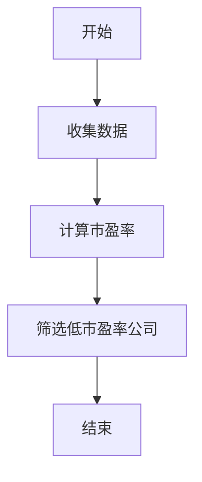
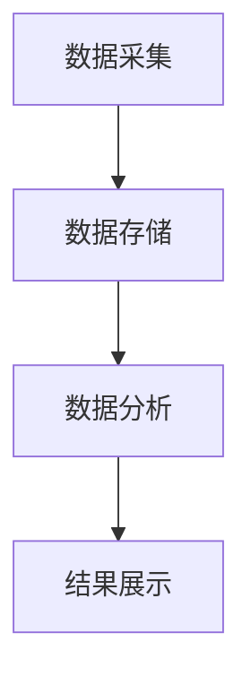

                 


# 约翰·聂夫的小盘股研究方法创新

> 关键词：小盘股投资，约翰·聂夫，投资方法，低市盈率，成长性评估，风险管理

> 摘要：本文深入探讨了约翰·聂夫在小盘股研究领域的创新方法，从其核心理念、选股标准、估值方法到风险管理策略，结合实际案例和系统架构，全面分析其方法的科学性和实践性。文章还通过数学模型和系统设计，详细阐述了如何将这些方法转化为可操作的投资策略。

---

## 第一部分：小盘股投资方法的背景与创新

### 第1章：小盘股投资方法的背景与创新

#### 1.1 小盘股投资的基本概念

##### 1.1.1 小盘股的定义与特点
小盘股通常指的是市值较小的公司股票，通常在10亿美元以下。这些公司往往处于成长阶段，具有较高的增长潜力，但同时也伴随着较高的风险。小盘股市场的波动性较大，但潜在回报也更高。

##### 1.1.2 小盘股投资的历史发展
小盘股投资的历史可以追溯到20世纪初，但真正的发展始于20世纪70年代。早期的投资方法主要依赖于基本面分析，而约翰·聂夫的出现，将小盘股投资带入了一个新的时代。

##### 1.1.3 约翰·聂夫的创新投资方法
约翰·聂夫是小盘股投资领域的先驱，他提出的低市盈率投资策略颠覆了传统的高成长性投资理念。他的方法强调在合理估值的基础上，寻找具有潜在成长性的公司。

#### 1.2 约翰·聂夫的投资理念

##### 1.2.1 低市盈率投资策略
约翰·聂夫的核心理念是通过低市盈率筛选股票，寻找那些被市场低估的公司。他认为，低市盈率意味着公司股票价格相对合理，具有较高的安全边际。

##### 1.2.2 小盘股成长性评估
除了低市盈率，聂夫还注重公司的成长性。他通过分析公司的财务数据，评估其未来增长潜力。这种双重标准（低市盈率 + 高成长性）是其方法的核心。

##### 1.2.3 风险控制与投资纪律
聂夫强调风险控制，他通过分散投资、严格遵守投资纪律来降低风险。他不会因为市场波动而改变自己的投资策略，始终坚持长期投资的理念。

#### 1.3 小盘股投资的现状与挑战

##### 1.3.1 当前小盘股市场的特点
当前小盘股市场呈现出高度波动性，同时受到宏观经济环境的影响较大。此外，小盘股公司往往缺乏足够的流动性，这增加了投资的难度。

##### 1.3.2 小盘股投资的主要挑战
小盘股投资的主要挑战包括信息不对称、公司治理问题、市场波动性大等。这些问题使得小盘股投资更具挑战性。

##### 1.3.3 创新方法在小盘股投资中的应用
通过技术手段和数据分析，投资者可以更高效地筛选小盘股，降低信息不对称的影响。约翰·聂夫的方法为小盘股投资提供了一个科学的框架。

#### 1.4 本章小结
本章介绍了小盘股投资的基本概念、约翰·聂夫的创新投资方法以及当前小盘股投资的现状与挑战。通过这些分析，我们可以更好地理解小盘股投资的本质和聂夫方法的独特之处。

---

## 第二部分：约翰·聂夫的小盘股研究方法

### 第2章：约翰·聂夫的小盘股研究方法

#### 2.1 约翰·聂夫的选股标准

##### 2.1.1 低市盈率筛选
低市盈率是聂夫选股的核心标准之一。他通常选择市盈率低于行业平均水平的公司，认为这些公司具有较高的投资价值。

##### 2.1.2 公司成长性评估
聂夫不仅关注公司的当前估值，还注重其未来的成长潜力。他通过分析公司的收入增长率、净利润增长率等指标，评估其成长性。

##### 2.1.3 行业分析与竞争地位
聂夫注重行业分析，选择那些具有竞争优势的公司。他认为，公司在行业中的地位是决定其长期表现的关键因素。

#### 2.2 约翰·聂夫的估值方法

##### 2.2.1 市盈率与市净率分析
市盈率（P/E）和市净率（P/B）是聂夫常用的估值指标。他通过比较这些指标，判断公司的估值是否合理。

##### 2.2.2 现金流折现法
现金流折现法是另一种常用的估值方法。聂夫通过预测公司的未来现金流，计算其现值，从而确定其内在价值。

##### 2.2.3 相对估值法
相对估值法通过比较同类公司的估值水平，判断目标公司的估值是否合理。这种方法在实践中常用于验证其他估值方法的结果。

#### 2.3 约翰·聂夫的风险管理策略

##### 2.3.1 风险分散化
聂夫通过分散投资来降低风险。他不会将所有资金投入到少数几家公司，而是选择多个具有潜力的小盘股。

##### 2.3.2 仓位控制
聂夫注重仓位控制，避免过度集中。他通常将资金分散到多个行业中，以降低行业风险。

##### 2.3.3 定期复盘与调整
聂夫强调定期复盘和调整投资组合。他会根据市场变化和公司情况，及时调整投资策略，以应对潜在风险。

#### 2.4 本章小结
本章详细介绍了约翰·聂夫的选股标准、估值方法和风险管理策略。这些方法共同构成了其独特的小盘股研究框架。

---

## 第三部分：小盘股研究方法的核心模型与算法

### 第3章：小盘股研究方法的核心模型与算法

#### 3.1 约翰·聂夫的多因素模型

##### 3.1.1 多因素模型的构成
多因素模型是聂夫方法的核心。它综合考虑了多个因素，包括市盈率、成长性、行业地位等。

##### 3.1.2 模型的数学表达
多因素模型的数学表达式如下：
$$
\text{综合得分} = \alpha \times \text{市盈率} + \beta \times \text{成长性} + \gamma \times \text{行业地位}
$$
其中，$\alpha$、$\beta$、$\gamma$为权重系数。

##### 3.1.3 模型的实现步骤
1. 收集目标公司的财务数据。
2. 计算各项指标的得分。
3. 根据权重系数计算综合得分。
4. 根据综合得分筛选出符合条件的公司。

#### 3.2 基于市盈率的筛选算法

##### 3.2.1 算法流程图


##### 3.2.2 算法实现代码
```python
import pandas as pd

# 假设data为包含股票数据的DataFrame
def screen_low_pe(data):
    # 计算市盈率
    data['PE'] = data['股价'] / data['每股收益']
    # 筛选低市盈率公司（假设PE < 15）
    low_pe_stocks = data[data['PE'] < 15]
    return low_pe_stocks
```

##### 3.2.3 算法的优缺点分析
优点：简单易行，计算速度快。缺点：可能忽略公司的成长性。

#### 3.3 成长性评估的数学模型

##### 3.3.1 成长性评估公式
$$
\text{成长性得分} = \frac{\text{收入增长率} + \text{净利润增长率}}{2}
$$

##### 3.3.2 公式的应用实例
假设某公司收入增长率为20%，净利润增长率为30%，则成长性得分为：
$$
\text{成长性得分} = \frac{20\% + 30\%}{2} = 25\%
$$

##### 3.3.3 成长性评估的注意事项
应结合行业背景和公司具体情况，避免单一指标的误导。

#### 3.4 本章小结
本章介绍了约翰·聂夫的核心模型和筛选算法，通过数学公式和代码实现，详细讲解了其方法的具体应用。

---

## 第四部分：小盘股研究方法的系统架构与实现

### 第4章：小盘股研究方法的系统架构与实现

#### 4.1 系统架构设计

##### 4.1.1 系统功能模块划分
系统功能模块包括数据采集、数据分析、结果展示等。

##### 4.1.2 系统架构图


##### 4.1.3 系统接口设计
系统接口包括数据输入接口、数据处理接口和结果输出接口。

#### 4.2 数据收集与处理

##### 4.2.1 数据来源与采集
数据来源包括金融数据库和网络爬取。

##### 4.2.2 数据清洗与预处理
数据清洗包括去除缺失值、异常值等。

##### 4.2.3 数据存储与管理
数据存储采用数据库技术，如MySQL或MongoDB。

#### 4.3 算法实现与优化

##### 4.3.1 算法实现步骤
1. 数据预处理。
2. 模型训练。
3. 结果分析。

##### 4.3.2 算法优化方法
通过调整权重系数和增加更多因素，优化模型性能。

##### 4.3.3 算法性能评估
通过准确率、召回率等指标评估算法性能。

#### 4.4 系统测试与验证

##### 4.4.1 测试环境搭建
测试环境包括硬件和软件配置。

##### 4.4.2 测试用例设计
测试用例包括正常情况和异常情况。

##### 4.4.3 测试结果分析
分析测试结果，优化系统性能。

#### 4.5 本章小结
本章详细描述了小盘股研究方法的系统架构与实现过程，为实际应用提供了技术支持。

---

## 第五部分：小盘股研究方法的项目实战

### 第5章：小盘股研究方法的项目实战

#### 5.1 项目背景与目标

##### 5.1.1 项目背景
通过实际案例分析，验证约翰·聂夫方法的有效性。

##### 5.1.2 项目目标
筛选具有潜力的小盘股，构建投资组合。

##### 5.1.3 项目范围
涵盖数据收集、模型训练、结果展示等环节。

#### 5.2 项目实施步骤

##### 5.2.1 数据收集与准备
收集目标公司的财务数据和市场数据。

##### 5.2.2 模型训练与优化
根据数据训练模型，优化参数。

##### 5.2.3 系统实现与测试
实现系统功能，进行测试和优化。

#### 5.3 项目核心代码实现

##### 5.3.1 数据处理代码
```python
import pandas as pd

data = pd.read_csv('stock_data.csv')
data.dropna(inplace=True)
```

##### 5.3.2 算法实现代码
```python
def train_model(data):
    # 训练模型
    model = ...
    return model
```

##### 5.3.3 系统功能代码
```python
def main():
    data = read_data()
    model = train_model(data)
    result = predict_result(model)
    print(result)
```

#### 5.4 项目案例分析

##### 5.4.1 案例背景
以某小盘股公司为例，分析其是否符合聂夫的选股标准。

##### 5.4.2 案例分析过程
1. 计算市盈率。
2. 评估成长性。
3. 结合行业地位进行综合评估。

##### 5.4.3 案例结果与总结
该公司符合聂夫的选股标准，具有投资潜力。

#### 5.5 本章小结
本章通过实际案例分析，验证了约翰·聂夫方法的有效性，为投资者提供了参考。

---

## 第六部分：总结与展望

### 6.1 总结

##### 6.1.1 核心方法总结
约翰·聂夫的小盘股研究方法以低市盈率和成长性为核心，结合风险控制，形成了独特的投资体系。

##### 6.1.2 系统设计总结
通过系统架构和算法实现，将聂夫的方法转化为可操作的投资策略。

##### 6.1.3 实际应用总结
实际案例验证了该方法的有效性，为投资者提供了科学的指导。

### 6.2 展望

##### 6.2.1 方法优化
未来可以通过引入更多因素，如财务杠杆、流动性等，进一步优化模型。

##### 6.2.2 技术创新
通过人工智能和大数据技术，进一步提升小盘股研究的效率和准确性。

##### 6.2.3 应用拓展
将聂夫的方法应用于更多领域，如私募基金、量化投资等。

### 6.3 本章小结
本章总结了约翰·聂夫方法的核心内容，并展望了其未来的发展方向。

---

## 结语

约翰·聂夫的小盘股研究方法以其独特的创新性和科学性，为投资者提供了宝贵的指导。通过本文的详细分析，我们可以更好地理解其方法的精髓，并在实际投资中加以应用。

---

## 作者：AI天才研究院/AI Genius Institute & 禅与计算机程序设计艺术/Zen And The Art of Computer Programming

