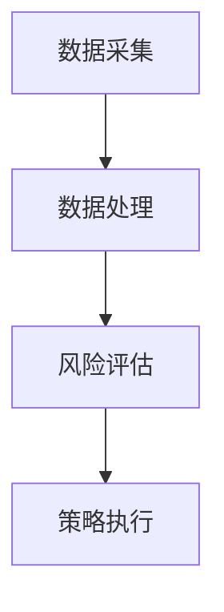

                 


# 约翰伯格对主动投资的批评

## 关键词：主动投资，约翰·伯格，被动投资，投资组合，量化分析

## 摘要：本文深入探讨约翰·伯格对主动投资的批评，从理论基础到实际应用，分析主动投资的优缺点，并结合量化分析方法，探讨伯格的观点对投资决策的启示。

---

## 第一部分: 约翰·伯格对主动投资的背景与核心概念

### 第1章: 主动投资的基本概念与背景

#### 1.1 主动投资的定义与历史发展

主动投资是一种以超越市场指数为目标的投资策略，强调通过研究和主动管理来获取超额收益。其历史可以追溯到20世纪中期，随着金融理论的发展，主动投资在20世纪末至21世纪初达到顶峰，但近年来其市场份额逐渐被被动投资侵蚀。

#### 1.2 主动投资的核心要素

主动投资的核心要素包括：

1. **投资组合管理**：通过精选个股或行业，构建具有超额收益潜力的组合。
2. **市场时机选择**：在合适的时间买入或卖出资产以捕捉市场波动。
3. **交易成本与税收**：主动投资通常涉及较高的交易成本和税务负担。

#### 1.3 约翰·伯格对主动投资的批评

伯格是指数投资的倡导者，他批评主动投资的主要观点包括：

1. **高成本问题**：主动管理通常涉及高昂的管理费和交易成本，这些成本显著侵蚀了潜在收益。
2. **低效性问题**：大多数主动管理的投资组合无法持续跑赢市场指数，尤其是在扣除费用后。
3. **不可预测性问题**：市场预测的难度使得主动投资的成功率难以保证。

---

### 第2章: 主动投资与被动投资的对比

#### 2.1 主动投资与被动投资的定义对比

1. **被动投资**：通过复制指数表现，追求市场平均收益，通常成本较低，管理简单。
2. **主动投资**：通过精选个股或行业，试图跑赢市场指数，通常成本较高，管理复杂。

#### 2.2 主动投资与被动投资的优缺点分析

| 优点                | 缺点                  |
|---------------------|----------------------|
| 有机会获得超额收益   | 成本较高             |
| 可以根据市场变化调整  | 需要高超的管理能力    |
| 适合特定市场环境     | 成功率难以保证        |

#### 2.3 伯格对两者的评价

伯格认为，被动投资在长期表现上更优，尤其是考虑到主动投资的高成本和低效性，大多数投资者很难通过主动投资获得超额收益。

---

### 第3章: 约翰·伯格的主动投资批评框架

#### 3.1 伯格的主动投资批评的核心观点

1. **主动投资的高成本问题**：管理费和交易成本显著侵蚀了潜在收益。
2. **主动投资的低效性问题**：大多数主动管理的投资组合无法持续跑赢市场。
3. **主动投资的不可预测性问题**：市场预测的难度使得主动投资的成功率难以保证。

#### 3.2 伯格的实证研究方法

伯格通过大量实证研究发现，大多数主动管理的基金在扣除费用后，表现低于市场指数。

#### 3.3 伯格批评的理论意义与实践价值

1. **理论意义**：伯格的批评推动了投资理论从主动投资向被动投资的转变。
2. **实践价值**：伯格的批评为投资者提供了更低成本、更高效的投资策略选择。

---

## 第二部分: 主动投资的算法原理与数学模型

### 第4章: 主动投资的量化分析方法

#### 4.1 现代投资组合理论（MPT）

现代投资组合理论由哈里·马科维茨提出，强调通过分散投资来降低风险。公式表示为：

$$
\sigma_p = \sqrt{w^T \Sigma w}
$$

其中，$\sigma_p$ 是组合风险，$w$ 是权重向量，$\Sigma$ 是资产间的协方差矩阵。

#### 4.2 风险调整后的收益评估

夏普比率用于衡量投资组合的风险调整后收益：

$$
\text{夏普比率} = \frac{E[r_p] - r_f}{\sigma_p}
$$

其中，$E[r_p]$ 是组合的预期收益，$r_f$ 是无风险利率，$\sigma_p$ 是组合风险。

---

## 第三部分: 系统分析与架构设计方案

### 第5章: 系统分析与架构设计方案

#### 5.1 问题场景介绍

主动投资的系统需要能够实时监控市场数据，评估投资组合的风险，并根据市场变化调整投资策略。

#### 5.2 系统功能设计

- 数据采集模块：收集市场数据。
- 风险评估模块：计算投资组合风险。
- 策略执行模块：根据策略调整投资组合。

#### 5.3 系统架构设计



---

## 第四部分: 项目实战

### 第6章: 项目实战

#### 6.1 环境安装

安装Python和必要的库：

```bash
pip install numpy pandas matplotlib
```

#### 6.2 核心实现源代码

```python
import numpy as np
import pandas as pd

# 示例数据
data = pd.DataFrame(np.random.randn(100, 5), columns=['资产1', '资产2', '资产3', '资产4', '资产5'])

# 计算投资组合风险
cov_matrix = data.cov()
weights = np.array([0.2, 0.2, 0.2, 0.2, 0.2])
portfolio_variance = weights.T.dot(cov_matrix).dot(weights)
print("投资组合风险：", portfolio_variance)
```

#### 6.3 代码应用解读

上述代码计算了投资组合的风险，展示了如何通过量化方法评估主动投资的风险。

---

## 第五部分: 最佳实践

### 第7章: 最佳实践

#### 7.1 投资者的注意事项

- **成本控制**：主动投资的高成本可能侵蚀收益。
- **风险管理**：即使采用主动投资，也需要严格控制风险。

#### 7.2 未来趋势

随着人工智能和大数据技术的发展，主动投资的效率和成本问题可能会得到部分缓解，但被动投资的优势依然存在。

---

## 结论

约翰·伯格的批评揭示了主动投资的局限性，但也为投资者提供了更低成本、更高效的投资策略选择。无论是主动还是被动投资，关键在于根据自身的风险承受能力和投资目标做出合理选择。

---

## 作者

作者：AI天才研究院/AI Genius Institute & 禅与计算机程序设计艺术 /Zen And The Art of Computer Programming

