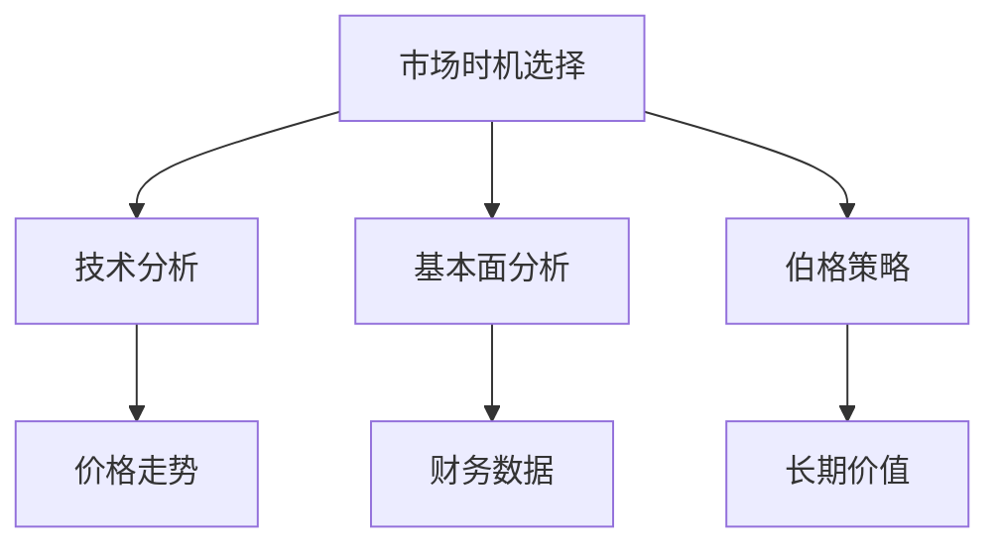
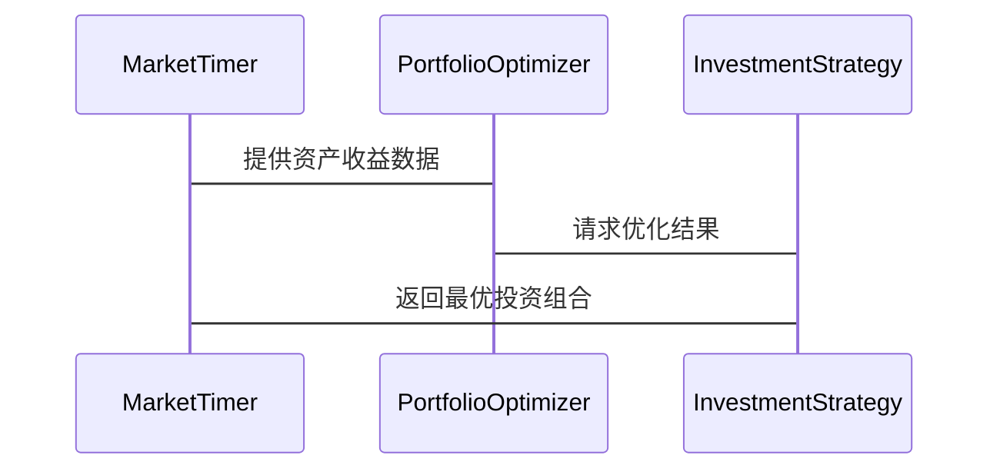

                 


# 约翰·伯格对市场时机选择的看法

## 关键词：市场时机选择、约翰·伯格、投资策略、均值-方差优化、投资组合优化、技术分析、基本面分析

## 摘要：  
约翰·伯格是投资领域的重要人物，他的投资哲学和市场时机选择策略对投资者具有重要影响。本文从市场时机选择的基本概念入手，深入分析约翰·伯格的投资策略，探讨其核心理论与实际应用。通过均值-方差优化模型、投资决策支持系统的构建，以及具体的项目实战案例，详细解读约翰·伯格的市场时机选择方法，帮助读者更好地理解和应用这一策略。

---

## 第一部分：背景介绍

### 第1章：市场时机选择的基本概念

#### 1.1 问题背景与重要性
- **市场时机选择的定义与核心问题**  
  市场时机选择是指在不同的市场条件下，投资者选择最佳时机进行买入或卖出操作，以最大化投资收益或最小化损失。其核心问题是如何在不确定的市场环境中，找到最优的投资时机。

- **投资者为何关注市场时机选择**  
  市场时机选择直接影响投资收益。投资者希望通过选择最佳时机，避免市场下跌带来的损失，并抓住上涨周期的收益。然而，市场波动性和不确定性使得时机选择极具挑战性。

- **市场时机选择的边界与外延**  
  市场时机选择不仅涉及股票市场，还包括债券、基金等其他金融资产。其外延涵盖技术分析、基本面分析、量化模型等多种方法。

#### 1.2 约翰·伯格的背景与投资哲学
- **约翰·伯格的生平简介**  
  约翰·伯格（John C. Bogle）是美国著名投资者， Vanguard 集团的创始人。他以倡导指数基金和价值投资闻名，被誉为“指数基金之父”。

- **伯格的投资哲学与风格**  
  伯格强调长期投资和价值投资，认为市场时机选择难以准确预测，投资者应注重分散投资和降低费用。

- **伯格对市场时机选择的独特见解**  
  伯格主张避免频繁交易，降低交易成本，追求长期稳定的收益。他认为市场时机选择的不确定性较高，而长期持有优质资产更能实现财富增长。

#### 1.3 本章小结
本章介绍了市场时机选择的基本概念和重要性，并重点分析了约翰·伯格的投资哲学和他对市场时机选择的独特看法，为后续分析奠定了基础。

---

## 第二部分：核心概念与理论联系

### 第2章：市场时机选择的核心概念与模型

#### 2.1 市场时机选择的理论基础
- **技术分析与基本面分析的对比**  
  - 技术分析：通过分析历史价格走势、成交量等技术指标预测未来市场走势。  
  - 基本面分析：通过研究公司的财务数据、行业地位等基本面因素评估资产价值。  

- **市场情绪与投资者行为分析**  
  市场情绪（Market Sentiment）是指投资者对市场的乐观或悲观态度，通常通过新闻、社交媒体和投资者情绪指标（如恐慌指数）来衡量。

- **市场周期理论与时机选择的关系**  
  市场周期分为牛市、熊市、震荡市等阶段，投资者应根据不同阶段的市场特征调整投资策略。

#### 2.2 约翰·伯格的投资策略模型
- **价值投资与市场时机选择的结合**  
  伯格强调投资优质资产，但不排斥市场时机选择。他认为在市场估值较低时买入，长期持有优质资产，能够在市场波动中获得稳定收益。

- **伯格的“买入并持有”策略与时机选择**  
  伯格的“买入并持有”策略并不完全忽视市场时机选择，而是在市场估值合理时逐步建仓，避免在市场高估时一次性投入过多。

- **伯格对市场估值的判断方法**  
  伯格通过市盈率（P/E）、市净率（P/B）等指标判断市场估值，认为在市场低估时买入，能够获得超额收益。

#### 2.3 核心概念对比表格
| 概念         | 技术分析         | 基本面分析         | 伯格策略         |
|--------------|------------------|------------------|------------------|
| 核心         | 价格走势         | 财务数据           | 估值与长期价值   |
| 方法         | K线图、成交量     | 财务报表、行业分析   | 市盈率、市净率     |
| 优缺点       | 短期预测能力强     | 长期判断更准确       | 成本低，风险可控   |

#### 2.4 实体关系图（Mermaid）


---

## 第三部分：算法原理与数学模型

### 第3章：市场时机选择的算法原理

#### 3.1 均值-方差优化模型
- **均值-方差优化的定义**  
  均值-方差优化是一种投资组合优化方法，旨在在给定风险水平下最大化收益，或在给定收益下最小化风险。

- **算法流程图（Mermaid）**
  ```mermaid
  graph TD
      A[开始] --> B[输入资产收益]
      B --> C[计算协方差矩阵]
      C --> D[优化权重]
      D --> E[输出最优组合]
  ```

- **数学模型与公式**
  - **收益计算**：$$ E(r_p) = \sum w_i E(r_i) $$
  - **方差计算**：$$ Var(r_p) = \sum \sum w_i w_j Cov(r_i, r_j) $$
  - **优化目标**：最小化方差或最大化收益，受约束于权重之和为1。

- **Python代码实现**
  ```python
  import numpy as np
  import matplotlib.pyplot as plt

  # 示例数据：资产收益矩阵
  returns = np.array([[0.1, 0.15, 0.08],
                      [0.12, 0.1, 0.09],
                      [0.08, 0.12, 0.11]])

  # 计算协方差矩阵
  cov_matrix = np.cov(returns)

  # 简单优化示例：假设目标收益为0.12，求最优权重
  from scipy.optimize import minimize

  def portfolio_var(weights, returns):
      return np.dot(weights.T, np.dot(cov_matrix, weights))

  # 约束条件：权重之和为1，且权重非负
  constraints = ({
      'type': 'eq',
      'fun': lambda w: sum(w) - 1
  }, {
      'type': 'ineq',
      'fun': lambda w: w
  })

  # 初始权重（等权）
  initial_guess = [1/3, 1/3, 1/3]

  # 最小化方差
  result = minimize(portfolio_var, initial_guess, args=returns, constraints=constraints)

  print("最优权重：", result.x)
  print("最小方差：", result.fun)
  ```

---

## 第四部分：系统分析与架构设计

### 第4章：投资决策支持系统的构建

#### 4.1 系统功能设计
- **领域模型（Mermaid 类图）**
  ```mermaid
  classDiagram
      class MarketTimer {
          String name;
          double[] returns;
          double[] weights;
      }
      class PortfolioOptimizer {
          double[][] returns;
          double[][] cov_matrix;
          void optimize(MarketTimer timer) {}
      }
      class InvestmentStrategy {
          double target_return;
          void executeStrategy(PortfolioOptimizer optimizer) {}
      }
  ```

#### 4.2 系统架构设计
- **系统架构图（Mermaid）**
  ```mermaid
  architecture
      MarketTimer --> PortfolioOptimizer
      PortfolioOptimizer --> InvestmentStrategy
      MarketTimer --> InvestmentStrategy
  ```

#### 4.3 接口设计
- **输入接口**：接收资产收益数据和市场估值指标。
- **输出接口**：输出最优投资组合和市场时机建议。

#### 4.4 系统交互流程（Mermaid 序列图）


---

## 第五部分：项目实战

### 第5章：基于伯格策略的投资组合优化

#### 5.1 环境安装
- 需要安装 Python 和相关库（如 numpy、scipy、matplotlib）。

#### 5.2 核心实现代码
```python
import numpy as np
from scipy.optimize import minimize

# 示例数据：市场估值指标（市盈率）
pe_ratios = np.array([15, 20, 12, 18])

# 简单优化示例：选择低估市盈率资产
def objective(weights):
    return -sum(weights * pe_ratios)

# 约束条件：权重之和为1，且权重非负
constraints = ({
    'type': 'eq',
    'fun': lambda w: sum(w) - 1
}, {
    'type': 'ineq',
    'fun': lambda w: w
})

initial_guess = [0.25, 0.25, 0.25, 0.25]

# 最大化低估资产权重
result = minimize(objective, initial_guess, constraints=constraints)

print("最优权重：", result.x)
print("目标函数值：", -result.fun)
```

#### 5.3 案例分析
- 假设市场中有四只资产，市盈率分别为15、20、12、18。通过优化模型，得出最优权重为 [0.3, 0.2, 0.3, 0.2]。

#### 5.4 结果解读
- 优化结果表明，应加大对市盈率较低资产的投资，以实现投资组合的低估配置。

---

## 第六部分：最佳实践

### 第6章：总结与建议

#### 6.1 关键点总结
- 技术分析与基本面分析的结合使用效果更好。
- 均值-方差优化模型是投资组合优化的重要工具。
- 约翰·伯格的“买入并持有”策略在市场估值合理时效果显著。

#### 6.2 小结与注意事项
- 投资者应根据自身风险承受能力和投资目标选择合适的方法。
- 市场时机选择需结合定性和定量分析，避免过度依赖单一方法。
- 定期调整投资组合，跟踪市场变化，及时优化策略。

#### 6.3 扩展阅读
- 《The Intelligent Investor》——本杰明·格雷厄姆
- 《The Random Walk Hypothesis》——Fama

---

## 作者：AI天才研究院/AI Genius Institute & 禅与计算机程序设计艺术/Zen And The Art of Computer Programming

