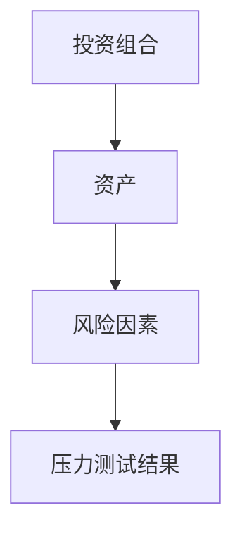
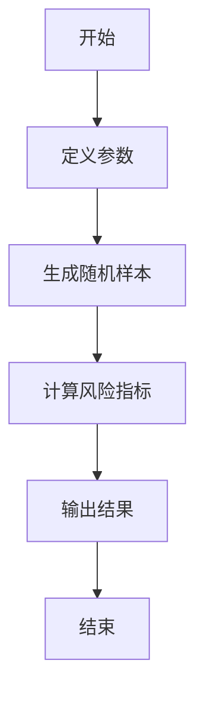
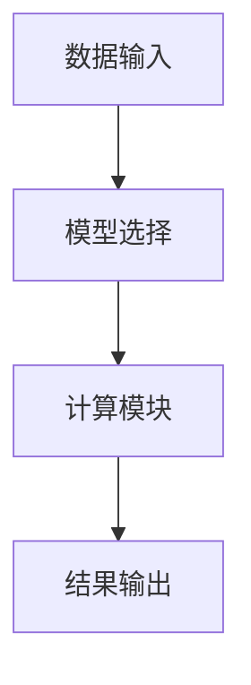

                 


# 约翰伯格的'压力测试'：评估投资组合的抗风险能力

---

## 关键词：
压力测试, 投资组合, 抗风险能力, 风险评估, 约翰伯格, VaR, CVaR

---

## 摘要：
本文深入探讨了约翰伯格的“压力测试”方法，详细分析了压力测试在评估投资组合抗风险能力中的作用。通过背景介绍、核心概念、算法原理、系统架构设计和项目实战五个部分，全面解析压力测试的原理、方法及其在投资组合风险管理中的应用。文章还通过具体案例展示了压力测试的实现过程，并提出了优化建议和未来研究方向。

---

## 第一章: 压力测试概述

### 1.1 压力测试的定义与背景
压力测试是一种用于评估投资组合在极端市场条件下的表现的分析工具。它的核心目标是帮助投资者理解投资组合在面对重大风险事件时的潜在损失，并制定相应的风险管理策略。

#### 1.1.1 什么是压力测试
压力测试通过对历史数据、模拟情景或假设极端事件，评估投资组合在这些情况下的表现。它可以帮助投资者识别潜在风险，并制定应对策略。

#### 1.1.2 压力测试的起源与发展
压力测试起源于20世纪80年代，随着金融市场的复杂化，其重要性日益凸显。2008年金融危机后，压力测试成为金融监管的重要工具之一。

#### 1.1.3 压力测试在金融领域的应用
压力测试广泛应用于银行、保险、资产管理等领域，特别是在评估投资组合的抗风险能力方面具有重要作用。

### 1.2 投资组合抗风险能力的重要性
投资组合的抗风险能力是指在面对市场波动、经济危机等极端情况时，投资组合能够承受损失并保持稳定的能力。

#### 1.2.1 投资组合的基本概念
投资组合是由多种资产（如股票、债券、基金等）组成的资产集合，旨在通过多元化分散风险。

#### 1.2.2 抗风险能力的定义
抗风险能力是指投资组合在面对不利市场条件时，能够承受损失并维持一定价值的能力。

#### 1.2.3 压力测试在投资组合管理中的作用
压力测试通过模拟极端市场条件，评估投资组合在这些情况下的表现，帮助投资者制定风险管理策略。

### 1.3 压力测试的核心目标
压力测试的核心目标是识别潜在风险、评估风险承受能力和制定风险管理策略。

#### 1.3.1 识别潜在风险
通过模拟极端市场条件，压力测试可以帮助识别投资组合中可能存在的风险点。

#### 1.3.2 评估风险承受能力
压力测试评估投资组合在极端情况下的表现，帮助投资者了解其风险承受能力。

#### 1.3.3 制定风险管理策略
基于压力测试的结果，投资者可以制定相应的风险管理策略，如调整资产配置、增加流动性等。

### 1.4 本章小结
本章介绍了压力测试的定义、背景及其在投资组合管理中的重要性。压力测试是评估投资组合抗风险能力的重要工具，通过模拟极端市场条件，帮助投资者识别风险、评估承受能力和制定管理策略。

---

## 第二章: 压力测试的核心概念与联系

### 2.1 压力测试的原理
压力测试的原理是通过模拟极端市场条件，评估投资组合在这些条件下的表现。它结合了统计学、概率论和金融学的理论，通过数学模型和算法进行计算和分析。

#### 2.1.1 压力测试的基本原理
压力测试的基本原理是通过模拟极端市场情景，评估投资组合在这些情景下的表现。它通常采用统计模型和蒙特卡洛模拟等方法进行分析。

#### 2.1.2 压力测试的数学模型
压力测试的数学模型通常包括风险度量指标，如VaR（Value at Risk）和CVaR（Conditional Value at Risk）等。

#### 2.1.3 压力测试与风险评估的关系
压力测试是风险评估的重要组成部分，它通过模拟极端情景，帮助投资者更好地理解投资组合的风险特征。

### 2.2 核心概念对比分析
在压力测试中，我们需要对比分析多个核心概念，包括不同压力测试方法、投资组合风险与收益的对比，以及压力测试与其他风险度量指标的对比。

#### 2.2.1 不同压力测试方法的对比
常用的压力测试方法包括历史模拟法、情景分析法和蒙特卡洛模拟法。每种方法都有其优缺点，适用于不同的场景。

#### 2.2.2 投资组合风险与收益的对比
投资组合的风险与收益是相互关联的，压力测试通过评估极端情况下的收益变化，帮助投资者理解风险与收益的关系。

#### 2.2.3 压力测试与VaR、CVaR的对比
VaR是衡量投资组合在特定置信水平下的潜在损失，而CVaR是VaR的扩展，衡量超过VaR值的潜在损失。压力测试可以通过VaR和CVaR等指标进行风险度量。

### 2.3 实体关系图（ER图）
为了更好地理解压力测试的系统架构，我们可以通过实体关系图（ER图）来展示各核心概念之间的关系。



### 2.4 本章小结
本章详细讲解了压力测试的原理及其核心概念，并通过对比分析和ER图展示了各概念之间的关系。压力测试是投资组合风险管理的重要工具，通过模拟极端情景和风险度量指标，帮助投资者更好地理解和管理风险。

---

## 第三章: 压力测试的算法原理

### 3.1 压力测试的常用算法
压力测试的常用算法包括VaR、CVaR和蒙特卡洛模拟等方法。这些算法各有其特点和应用场景。

#### 3.1.1 VaR（Value at Risk）算法
VaR算法是衡量投资组合在特定置信水平下的潜在损失。它假设市场风险可以被量化，并且可以通过统计模型进行预测。

#### 3.1.2 CVaR（Conditional Value at Risk）算法
CVaR算法是VaR的扩展，衡量超过VaR值的潜在损失。它在处理极端风险事件时具有更高的准确性。

#### 3.1.3 蒙特卡洛模拟
蒙特卡洛模拟是一种基于随机抽样的数值计算方法，广泛应用于压力测试中。它通过模拟极端情景，评估投资组合在这些情景下的表现。

### 3.2 VaR算法的数学模型
VaR算法的数学模型如下：

$$ VaR_{\alpha}(P) = \inf\{x | P(L \leq x) \geq \alpha\} $$

其中，$P$是投资组合的损失分布，$\alpha$是置信水平。

### 3.3 CVaR算法的数学模型
CVaR算法的数学模型如下：

$$ CVaR_{\alpha}(P) = \frac{1}{1-\alpha} \int_{\alpha}^{1} x dP(x) $$

其中，$P(x)$是投资组合的损失分布函数。

### 3.4 蒙特卡洛模拟的流程图
蒙特卡洛模拟的流程如下：



### 3.5 本章小结
本章详细讲解了压力测试的常用算法，包括VaR、CVaR和蒙特卡洛模拟。通过数学模型和流程图的展示，帮助读者更好地理解这些算法的原理和应用。

---

## 第四章: 压力测试的系统分析与架构设计

### 4.1 系统分析
压力测试系统的目的是评估投资组合在极端情景下的表现，帮助投资者制定风险管理策略。

#### 4.1.1 系统目标
系统的目标是提供一个高效、准确的压力测试工具，帮助投资者评估投资组合的抗风险能力。

#### 4.1.2 系统功能需求
系统需要支持多种压力测试方法、风险度量指标和数据输入输出功能。

#### 4.1.3 系统边界与接口
系统的边界包括输入数据、算法模块和结果输出模块。

### 4.2 系统架构设计
系统架构设计采用分层架构，包括数据输入、模型选择、计算模块和结果输出四个部分。

#### 4.2.1 分层架构
系统分为数据输入层、模型选择层、计算层和结果输出层。

#### 4.2.2 组件设计
组件包括数据输入模块、模型选择模块、计算模块和结果输出模块。

#### 4.2.3 数据流设计
数据从输入模块进入，经过模型选择和计算模块，最终输出结果。

### 4.3 系统功能设计
系统功能设计包括数据输入模块、模型选择模块、计算模块和结果输出模块。

#### 4.3.1 数据输入模块
数据输入模块负责接收投资组合的资产配置和市场数据。

#### 4.3.2 模型选择模块
模型选择模块允许用户选择不同的压力测试方法，如VaR、CVaR和蒙特卡洛模拟。

#### 4.3.3 结果输出模块
结果输出模块将压力测试的结果以图表或报告的形式展示给用户。

### 4.4 系统架构图
系统架构图如下：



### 4.5 本章小结
本章详细讲解了压力测试系统的系统分析与架构设计，包括系统的功能需求、架构设计和数据流设计。通过分层架构和模块化设计，系统能够高效、准确地评估投资组合的抗风险能力。

---

## 第五章: 压力测试的项目实战

### 5.1 环境安装与配置
为了实现压力测试，我们需要安装和配置Python环境，并安装必要的库，如NumPy、Pandas和Matplotlib。

#### 5.1.1 Python环境的安装
安装Python 3.x版本，并确保环境变量配置正确。

#### 5.1.2 必要库的安装
使用以下命令安装必要的库：
```
pip install numpy pandas matplotlib
```

### 5.2 核心代码实现
以下是一个使用Python实现的VaR算法的压力测试代码示例。

#### 5.2.1 VaR算法实现
```python
import numpy as np
import pandas as pd
import matplotlib.pyplot as plt

# 生成随机投资组合收益
np.random.seed(42)
returns = np.random.normal(0, 1, 1000)

# 计算VaR
def calculate_var(returns, alpha=0.05):
    sorted_returns = np.sort(returns)
    var_index = int(alpha * len(sorted_returns))
    var = sorted_returns[var_index]
    return var

var_result = calculate_var(returns)
print(f"VaR at 5% confidence level: {var_result}")

# 可视化
plt.hist(returns, bins=30, alpha=0.7)
plt.axvline(x=var_result, color='r', linestyle='--')
plt.xlabel('Return')
plt.ylabel('Frequency')
plt.title('VaR Analysis')
plt.show()
```

### 5.3 代码应用解读与分析
上述代码通过生成随机收益数据，计算VaR值，并通过直方图展示结果。VaR值表示在5%的置信水平下，投资组合的最大潜在损失。

### 5.4 实际案例分析和详细讲解
假设我们有一个包含股票和债券的投资组合，我们可以通过压力测试评估其在市场崩盘情况下的表现。

#### 5.4.1 数据输入
输入投资组合的资产配置和历史市场数据。

#### 5.4.2 模型选择
选择合适的压力测试方法，如VaR或蒙特卡洛模拟。

#### 5.4.3 计算与分析
根据选择的模型进行计算，并分析投资组合在极端情景下的表现。

#### 5.4.4 结果输出
将压力测试结果以图表或报告形式展示，帮助投资者制定风险管理策略。

### 5.5 本章小结
本章通过实际案例展示了压力测试的实现过程，从环境配置到代码实现，再到结果分析，帮助读者更好地理解压力测试的应用。

---

## 第六章: 总结与展望

### 6.1 总结
本文详细探讨了约翰伯格的压力测试方法，分析了其在评估投资组合抗风险能力中的应用。通过背景介绍、核心概念、算法原理、系统架构设计和项目实战五个部分，全面解析了压力测试的原理和应用。

### 6.2 最佳实践 tips
- 在进行压力测试时，应结合实际市场情况选择合适的方法和模型。
- 定期进行压力测试，及时调整风险管理策略。
- 压力测试结果应与其他风险度量指标结合使用，以全面评估投资组合的风险。

### 6.3 未来研究方向
- 研究更复杂的风险模型，提高压力测试的准确性。
- 探索人工智能技术在压力测试中的应用，如使用机器学习算法进行情景模拟。
- 开发更加智能化的压力测试工具，帮助投资者更好地管理风险。

### 6.4 本章小结
本章总结了全文内容，并提出了未来的研究方向和最佳实践建议。压力测试是投资组合风险管理的重要工具，未来的研究和实践将推动其不断发展和进步。

---

## 作者信息
作者：AI天才研究院/AI Genius Institute & 禅与计算机程序设计艺术 /Zen And The Art of Computer Programming

