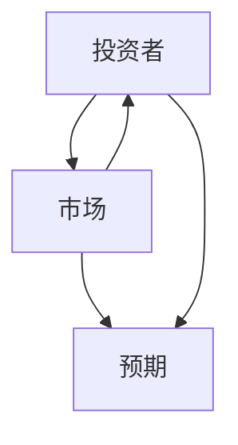

                 


# 约翰伯格的'理性预期'投资：设定合理的收益预期

## 关键词：理性预期投资，收益预期，约翰·伯格，投资策略，风险控制，资产配置

## 摘要：本文深入探讨了约翰·伯格的理性预期投资理念，分析了如何在投资过程中设定合理的收益预期。通过结合数学模型、算法原理和实际案例，本文为投资者提供了一套系统化的投资策略，帮助他们在复杂多变的市场中做出更明智的决策。

---

# 第一部分：理性预期投资的背景与核心概念

## 第1章：理性预期的起源与发展

### 1.1 理性预期的定义与核心思想
#### 1.1.1 理性预期的定义
理性预期是指投资者在决策时，基于所有可获得的信息，理性地预测未来的情况，而不仅仅是依靠直觉或情绪。

#### 1.1.2 理性预期的核心思想
理性预期的核心思想是，投资者在做出决策时，会充分考虑所有相关信息，并通过逻辑推理来预测未来的结果。这种预期是基于理性分析，而非情绪化或非理性判断。

#### 1.1.3 理性预期与传统预期的对比
与传统预期相比，理性预期更加注重数据和逻辑分析，而非市场情绪或历史经验。它假设市场参与者都是理性的，能够根据信息做出最优决策。

### 1.2 理性预期在投资中的应用
#### 1.2.1 投资中的理性预期概念
在投资领域，理性预期指的是投资者根据市场信息和基本面分析，预测未来资产的价格走势和收益情况。

#### 1.2.2 理性预期与市场效率的关系
理性预期与市场效率密切相关。如果市场参与者都是理性的，市场将趋于有效，价格反映所有可获得的信息。

#### 1.2.3 理性预期在资产定价中的作用
理性预期在资产定价中起着关键作用。投资者根据理性预期，确定资产的合理价格，并据此做出买卖决策。

---

## 第2章：理性预期的核心概念与联系

### 2.1 理性预期的原理
#### 2.1.1 理性预期的假设条件
理性预期的假设条件包括：市场参与者都是理性的，能够最大化自身利益；市场信息是完全的，所有相关信息都是可获得的。

#### 2.1.2 理性预期的数学模型
理性预期的数学模型通常基于概率论和统计学。例如，预期收益可以表示为：
$$ E[R] = \sum_{i=1}^{n} p_i r_i $$
其中，$p_i$ 是第 $i$ 种情况发生的概率，$r_i$ 是第 $i$ 种情况下的收益。

#### 2.1.3 理性预期与市场参与者的互动
理性预期与市场参与者的互动形成了市场的动态。每个投资者的理性预期影响市场价格，而市场价格又反过来影响投资者的预期。

### 2.2 理性预期与投资决策的关系
#### 2.2.1 投资者行为的理性分析
投资者在做出投资决策时，会根据理性预期，分析市场的供需关系、宏观经济指标和公司基本面等因素。

#### 2.2.2 理性预期在资产配置中的应用
在资产配置中，理性预期帮助投资者确定不同类型资产的预期收益和风险，从而优化投资组合。

#### 2.2.3 理性预期与风险管理的结合
理性预期与风险管理密切相关。通过预测市场的波动性和潜在风险，投资者可以制定有效的风险管理策略。

### 2.3 理性预期的ER实体关系图


---

# 第二部分：理性预期投资的算法与数学模型

## 第3章：理性预期的算法原理

### 3.1 理性预期算法的步骤
#### 3.1.1 数据采集与处理
数据采集与处理是理性预期算法的第一步，包括收集历史价格、财务数据、宏观经济指标等。

#### 3.1.2 预期计算与优化
通过统计分析和优化算法，计算出各资产的预期收益，并根据风险偏好进行优化。

#### 3.1.3 算法实现与验证
使用编程语言（如Python）实现算法，并通过回测和实证分析验证算法的有效性。

### 3.2 理性预期算法的数学模型
#### 3.2.1 预期的数学表达式
预期收益可以表示为：
$$ E[R] = \sum_{i=1}^{n} p_i r_i $$

#### 3.2.2 理性预期的优化模型
优化模型通常采用均值-方差优化，即：
$$ \min \sum_{i=1}^{n} \sum_{j=1}^{n} w_i w_j \sigma_{ij} $$
$$ \text{约束条件：} \sum_{i=1}^{n} w_i = 1 $$

---

## 第4章：理性预期的系统分析与架构设计

### 4.1 理性预期投资系统的应用场景
理性预期投资系统适用于各种投资场景，包括股票、债券、基金等多种资产的投资。

### 4.2 理性预期投资系统的功能设计
#### 4.2.1 数据采集模块
数据采集模块负责收集市场数据，包括历史价格、财务指标等。

#### 4.2.2 预期计算模块
预期计算模块基于理性预期模型，计算各资产的预期收益和风险。

#### 4.2.3 投资策略生成模块
策略生成模块根据预期结果，制定最优的投资组合和交易策略。

### 4.3 理性预期投资系统的架构设计


---

## 第5章：理性预期的项目实战

### 5.1 环境安装
需要安装的环境包括Python、Pandas、NumPy等。

### 5.2 核心代码实现
以下是理性预期算法的核心代码示例：
```python
import numpy as np
import pandas as pd

# 示例数据
data = pd.DataFrame({'price': [100, 105, 110, 115, 120]})

# 计算预期收益
returns = data.pct_change().dropna()
expected_return = returns.mean()

print("预期收益:", expected_return)
```

### 5.3 案例分析与解读
通过具体案例分析，验证理性预期算法的有效性，并根据结果进行策略调整。

---

## 第6章：理性预期投资的最佳实践

### 6.1 小结
理性预期投资是一种基于逻辑和数据的投资方法，能够帮助投资者做出更明智的决策。

### 6.2 注意事项
投资者在实际操作中，需要注意数据的准确性和模型的适用性，避免过度依赖单一模型。

### 6.3 拓展阅读
推荐阅读相关书籍和文献，深入理解理性预期投资的理论与实践。

---

# 结语

理性预期投资是一种科学的投资方法，它通过逻辑分析和数据支持，帮助投资者设定合理的收益预期，并做出最优的投资决策。希望本文能够为投资者提供有价值的指导，帮助他们在复杂多变的市场中取得成功。

---

# 作者：AI天才研究院/AI Genius Institute & 禅与计算机程序设计艺术 /Zen And The Art of Computer Programming

