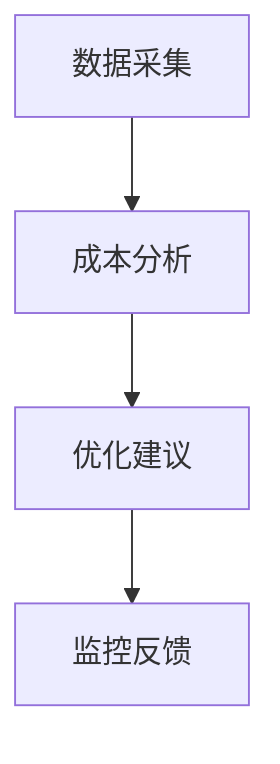

                 


# 约翰伯格的成本控制理念：为什么低成本是制胜关键

## 关键词：成本控制，低成本，企业制胜，约翰伯格，管理策略

## 摘要：  
本文深入探讨了约翰伯格的成本控制理念，分析了低成本在企业竞争中的关键作用，并结合实际案例和系统设计，详细阐述了如何通过科学的成本控制策略提升企业竞争力。文章从成本构成、成本管理维度、成本-效益分析、边际成本理论、成本领先战略等方面展开，最后通过项目实战和系统架构设计，为企业提供切实可行的成本优化方案。

---

# 第1章 成本控制的背景与重要性

## 1.1 成本控制的基本概念

### 1.1.1 什么是成本控制  
成本控制是企业管理中的核心环节，指通过计划、监测和调整企业运营中的各项成本，以实现最小化成本支出、提高资源利用效率的目标。成本控制不仅关乎企业的盈利能力，还直接影响企业的市场竞争力。

### 1.1.2 成本控制的历史演变  
成本控制的理论和实践经历了多个阶段：从传统的成本会计到现代的成本管理，从局部成本控制到全面成本管理，成本控制的内涵不断扩展，方法日益多样化。

### 1.1.3 成本控制在现代企业中的地位  
在现代企业中，成本控制是实现可持续发展的关键因素。通过有效的成本控制，企业可以在价格竞争中占据优势，同时优化资源配置，提升整体运营效率。

## 1.2 约翰伯格的成本控制理念

### 1.2.1 成本控制的核心思想  
约翰伯格认为，成本控制不仅是对资源的优化配置，更是对企业管理能力的全面提升。他强调，低成本不是单纯追求低价，而是通过科学的方法实现资源的最大化利用。

### 1.2.2 成本控制与企业竞争力的关系  
成本控制是企业竞争力的核心要素之一。通过降低成本，企业可以降低产品价格，提高市场占有率；同时，优化的成本结构还能增强企业的抗风险能力。

### 1.2.3 成本控制的哲学基础  
约翰伯格的成本控制理念植根于精益思想，强调通过消除浪费、提高效率和持续改进，实现成本的最优控制。

---

# 第2章 成本构成与成本管理维度

## 2.1 成本构成要素分析

### 2.1.1 直接成本与间接成本  
- **直接成本**：直接与产品或服务相关的成本，如原材料、直接人工。
- **间接成本**：无法直接追溯到产品或服务的成本，如厂房租金、管理费用。

| 成本类型 | 定义 | 示例 |
|----------|------|------|
| 直接成本 | 与产品直接相关 | 原材料、直接人工 |
| 间接成本 | 与产品间接相关 | 厂房租金、管理费用 |

### 2.1.2 固定成本与变动成本  
- **固定成本**：在一定范围内不随产量变化的成本，如设备折旧。
- **变动成本**：随产量变化的成本，如原材料采购。

### 2.1.3 机会成本与沉没成本  
- **机会成本**：放弃某项选择所失去的潜在收益。
- **沉没成本**：已经发生的，无法收回的成本。

## 2.2 成本管理的维度

### 2.2.1 时间维度  
成本管理需要考虑时间因素，如生产周期、库存周转时间等。

### 2.2.2 空间维度  
成本管理涉及企业内外部的资源配置，如供应链管理、生产布局优化。

### 2.2.3 质量维度  
高质量的产品通常需要较高的初始成本，但能带来更高的客户满意度和品牌价值。

---

# 第3章 成本-效益分析与边际成本理论

## 3.1 成本-效益分析

### 3.1.1 成本-效益分析的基本原理  
成本-效益分析是通过比较项目或方案的总成本和总效益，判断其可行性和优选性。

### 3.1.2 成本-效益分析的步骤与方法  
1. 确定目标和范围。
2. 收集数据，估算成本和效益。
3. 比较分析，选择最优方案。

### 3.1.3 成本-效益分析的数学模型  
成本-效益分析的数学模型如下：

$$ \text{净效益} = \text{总效益} - \text{总成本} $$

## 3.2 边际成本理论

### 3.2.1 边际成本的定义与计算  
边际成本是指每增加一单位产量所增加的总成本。

$$ \text{边际成本} = \frac{\Delta \text{总成本}}{\Delta \text{产量}} $$

### 3.2.2 边际成本曲线的绘制  
边际成本曲线通常呈现先下降后上升的趋势，反映了规模效应和边际效益递减的规律。

---

# 第4章 成本领先战略与全面成本管理

## 4.1 成本领先战略

### 4.1.1 成本领先战略的定义与特点  
成本领先战略是通过降低产品或服务的成本，成为市场上的低成本供应商。

### 4.1.2 成本领先战略的实施步骤  
1. 确定成本基准。
2. 识别成本节约点。
3. 实施成本优化措施。
4. 监测和评估效果。

## 4.2 全面成本管理

### 4.2.1 全面成本管理的概念  
全面成本管理强调企业内部各个部门和环节的协同合作，实现成本的全员、全过程控制。

### 4.2.2 全面成本管理的方法  
1. 建立成本控制目标。
2. 制定成本控制计划。
3. 实施成本监控和反馈。

---

# 第5章 成本控制的系统分析与架构设计

## 5.1 系统分析

### 5.1.1 问题场景介绍  
以某制造企业为例，希望通过系统化的方法优化生产成本。

### 5.1.2 系统功能设计  
- 数据采集模块：收集生产数据。
- 成本分析模块：计算成本构成。
- 优化建议模块：提出降成本方案。

## 5.2 系统架构设计

### 5.2.1 系统架构图  


---

# 第6章 项目实战：制造企业的成本优化

## 6.1 项目背景

### 6.1.1 项目背景  
某制造企业希望通过成本控制降低生产成本，提高利润率。

## 6.2 核心代码实现

### 6.2.1 成本计算函数  
```python
def calculate_cost(units, fixed_cost, variable_cost):
    total_cost = fixed_cost + units * variable_cost
    return total_cost
```

---

# 第7章 最佳实践与小结

## 7.1 最佳实践

### 7.1.1 关键点  
- 领导重视。
- 全员参与。
- 持续改进。

## 7.2 小结

通过本文的探讨，我们可以看到，低成本不仅是企业生存的关键，更是企业发展的核心竞争力。约翰伯格的成本控制理念为企业提供了一套科学的管理方法，值得深入学习和实践。

---

# 作者：AI天才研究院 & 禅与计算机程序设计艺术

---

这篇技术博客详细分析了约翰伯格的成本控制理念，从理论到实践，为企业提供了一套系统的成本优化方案。

