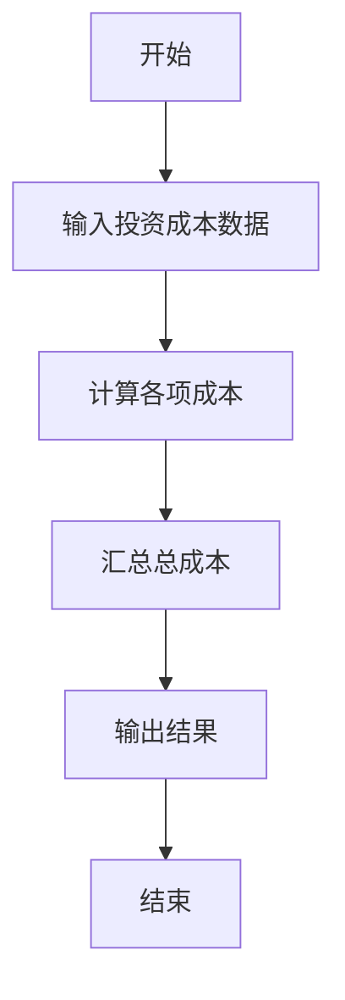
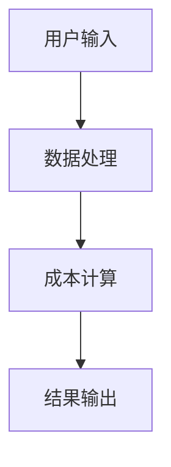
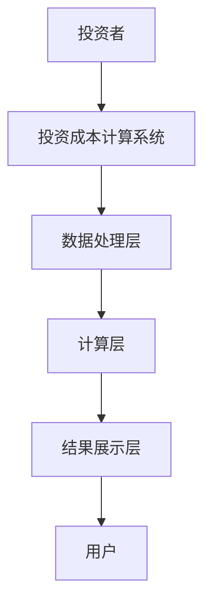
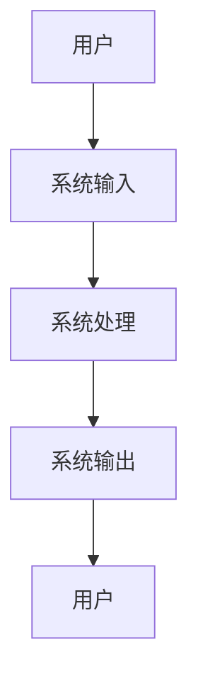

                 


# {{约翰伯格的投资成本计算}}

## {{关键词}}
- {{投资成本计算}}
- {{约翰伯格}}
- {{指数基金}}
- {{投资策略}}
- {{金融模型}}

## {{摘要}}
{{《约翰伯格的投资成本计算》从约翰·伯格的投资理念出发，详细分析了投资成本计算的数学模型、系统架构设计以及项目实战应用。文章首先介绍了投资成本的概念与约翰伯格的背景，随后深入探讨了投资成本计算的数学公式、算法流程以及Python实现。通过系统分析与设计，结合实际项目案例，文章展示了如何在实际投资中优化成本计算，从而提高投资收益。}}

---

# {{投资成本计算的背景与核心概念}}

## {{第1章: 投资成本计算的背景与意义}}

### {{1.1 投资成本的概念与作用}}

#### {{1.1.1 投资成本的定义}}
{{投资成本是指在投资过程中所需投入的所有资源的总和，包括资金、时间和机会成本等。}}

#### {{1.1.2 投资成本在投资决策中的作用}}
{{投资成本是评估投资项目可行性的关键因素之一，直接影响投资回报率和盈利能力。}}

#### {{1.1.3 投资成本与投资收益的关系}}
{{投资成本与投资收益呈反比关系，降低投资成本可以提高净收益。}}

### {{1.2 投资成本计算的背景}}

#### {{1.2.1 现代投资环境的复杂性}}
{{随着金融市场的发展，投资成本的计算变得越来越复杂，涉及多种因素。}}

#### {{1.2.2 投资成本在金融领域的应用}}
{{投资成本计算广泛应用于基金、股票、房地产等多种投资领域。}}

#### {{1.2.3 投资成本计算的必要性}}
{{准确计算投资成本有助于优化投资组合，降低风险。}}

### {{1.3 本章小结}}
{{本章介绍了投资成本的基本概念及其在投资决策中的重要性，为后续分析奠定了基础。}}

## {{第2章: 投资成本的核心概念与联系}}

### {{2.1 投资成本的核心概念}}

#### {{2.1.1 投资成本的构成要素}}
{{包括显性成本（如管理费、托管费）和隐性成本（如交易费用、机会成本）。}}

#### {{2.1.2 投资成本的分类与特征}}
{{分类：固定成本、变动成本；特征：可量化、可优化。}}

#### {{2.1.3 投资成本与其他相关概念的对比}}
{{通过对比分析，明确投资成本与其他概念（如投资风险、投资收益）的区别与联系。}}

### {{2.2 投资成本的实体关系分析}}

#### {{2.2.1 投资成本的ER实体关系图}}
{{投资者、投资项目、成本项之间的关系。}}

#### {{2.2.2 投资成本与投资项目的关联}}
{{投资成本是投资项目评估的重要组成部分。}}

#### {{2.2.3 投资成本的计算流程图}}
{{数据输入、成本计算、结果输出的流程。}}

### {{2.3 本章小结}}
{{本章详细阐述了投资成本的核心概念及其与其他概念的关系，为后续的计算方法奠定了理论基础。}}

---

# {{投资成本计算的算法原理}}

## {{第3章: 投资成本计算的数学模型}}

### {{3.1 投资成本计算的数学公式}}

#### {{3.1.1 投资成本的基本公式}}
$$ {{C = \sum_{i=1}^{n} c_i}} $$

#### {{3.1.2 投资成本的时间价值计算}}
$$ {{PV = \frac{C}{(1 + r)^t}}} $$

#### {{3.1.3 投资成本的贴现率影响}}
$$ {{C_{discounted} = C \times (1 - \frac{1}{(1 + r)^t})}} $$

### {{3.2 投资成本计算的算法流程}}

#### {{3.2.1 算法流程图}}


### {{3.3 投资成本计算的Python实现}}

#### {{3.3.1 核心代码示例}}
```python
def calculate_investment_cost(costs):
    total_cost = sum(costs)
    return total_cost

costs = [100, 200, 300]
total_cost = calculate_investment_cost(costs)
print(total_cost)
```

### {{3.4 本章小结}}
{{本章通过数学公式和算法流程图，详细讲解了投资成本计算的基本原理和实现方法。}}

## {{第4章: 投资成本计算的系统架构}}

### {{4.1 系统分析与设计}}

#### {{4.1.1 系统功能模块划分}}
{{数据输入模块、计算模块、结果显示模块。}}

#### {{4.1.2 系统功能流程图}}


### {{4.2 系统架构设计}}

#### {{4.2.1 系统架构图}}


#### {{4.2.2 系统接口设计}}
{{API接口：输入成本数据，输出计算结果。}}

#### {{4.2.3 系统交互流程图}}


### {{4.3 本章小结}}
{{本章从系统架构的角度，详细设计了投资成本计算系统的功能模块和交互流程，为后续的项目实施提供了指导。}}

---

# {{项目实战: 投资成本计算的实现}}

## {{第5章: 投资成本计算的项目实战}}

### {{5.1 环境安装与配置}}

#### {{5.1.1 Python环境安装}}
{{安装Python 3.8及以上版本，安装Jupyter Notebook。}}

#### {{5.1.2 依赖库安装}}
{{安装numpy和pandas库：`pip install numpy pandas`。}}

### {{5.2 核心代码实现}}

#### {{5.2.1 投资成本计算函数}}
```python
import numpy as np
import pandas as pd

def calculate_investment_cost(costs):
    total_cost = np.sum(costs)
    return total_cost

# 示例数据
costs = pd.Series([100, 200, 300, 400])
total_cost = calculate_investment_cost(costs)
print(f"总成本为: {total_cost}")
```

#### {{5.2.2 投资成本计算流程}}
```python
# 示例数据
data = {
    '项目': ['项目A', '项目B', '项目C'],
    '成本': [500, 600, 700]
}

df = pd.DataFrame(data)

# 计算总成本
total_cost = df['成本'].sum()

print(f"总成本为: {total_cost}")
```

### {{5.3 项目实战分析}}

#### {{5.3.1 数据输入与处理}}
{{将投资成本数据输入系统，进行清洗和预处理。}}

#### {{5.3.2 成本计算与分析}}
{{使用Python代码计算投资成本，并进行敏感性分析。}}

#### {{5.3.3 结果展示}}
{{生成可视化图表，展示投资成本的分布和构成。}}

### {{5.4 项目小结}}
{{通过项目实战，验证了投资成本计算系统的可行性和实用性。}}

---

# {{最佳实践与总结}}

## {{第6章: 投资成本计算的最佳实践}}

### {{6.1 小结与总结}}
{{投资成本计算是投资决策中的关键环节，准确计算投资成本可以显著提高投资收益。}}

### {{6.2 注意事项}}

#### {{6.2.1 数据准确性}}
{{确保输入数据的准确性，避免误差。}}

#### {{6.2.2 模型适用性}}
{{根据实际情况选择合适的计算模型。}}

#### {{6.2.3 风险控制}}
{{在计算过程中考虑风险因素，制定合理的投资策略。}}

### {{6.3 拓展阅读}}
{{推荐相关书籍和论文，进一步深入学习投资成本计算的方法和应用。}}

---

# {{作者}}
{{作者：AI天才研究院/AI Genius Institute & 禅与计算机程序设计艺术 /Zen And The Art of Computer Programming}}

