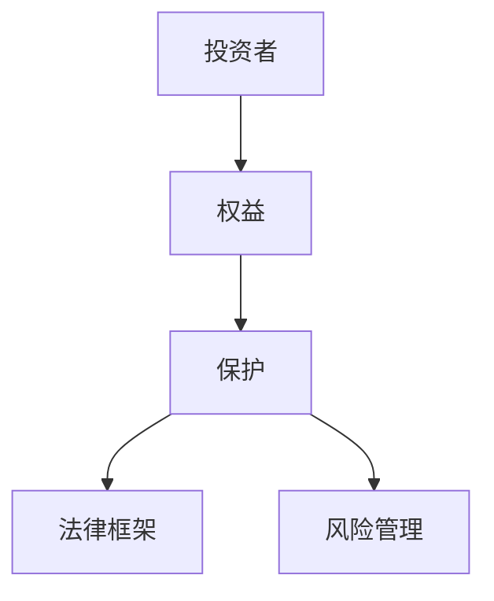
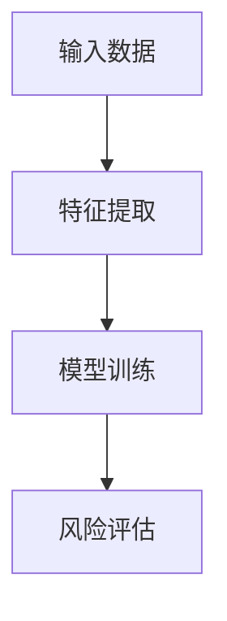
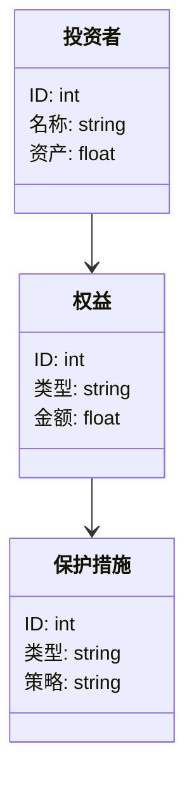
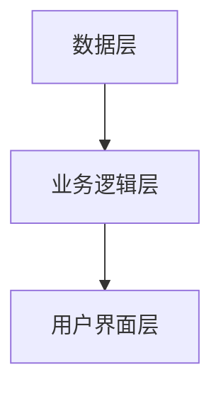

                 


# 约翰伯格的投资者权益保护

## 关键词：投资者权益保护，风险管理，投资组合优化，风险评估模型，法律框架

## 摘要：本文深入探讨了投资者权益保护的核心概念、算法原理及系统实现。通过分析约翰伯格的理论，结合实际案例，讲解了如何在投资过程中保护投资者权益，涵盖风险管理、法律框架及数学模型等方面，旨在为投资者提供科学的保护策略。

## 第一部分：投资者权益保护的背景与重要性

### 第1章：投资者权益保护的概述

#### 1.1 投资者权益保护的定义与范围
- **投资者权益保护的基本概念**：投资者权益保护是指通过法律、监管和管理手段，确保投资者在投资活动中获得公平、公正的待遇，避免遭受不合理的损失。
- **投资者权益保护的法律框架**：包括相关法律法规，如《证券法》、《公司法》等，明确了投资者的权利和保护措施。
- **投资者权益保护的重要性**：保障投资者利益，维护市场秩序，增强投资者信心，促进市场的健康发展。

#### 1.2 投资者权益保护的背景与问题背景
- **当前投资环境的复杂性**：市场波动加剧，金融创新增多，投资者面临更多风险。
- **投资者面临的常见问题**：信息不对称、虚假陈述、欺诈行为、市场操纵等。
- **投资者权益保护的必要性**：通过有效的保护措施，减少投资者损失，维护市场公平。

### 第2章：投资者权益保护的核心概念与联系

#### 2.1 投资者权益保护的核心概念
- **法律框架**：相关法律法规为投资者权益保护提供了基础。
- **经济模型**：通过数学模型评估风险和收益，优化投资组合。
- **伦理考量**：强调道德规范，避免不正当行为。

#### 2.2 核心概念与联系
- **属性特征对比**：投资者权益保护具有法律性、经济性、技术性、伦理性的特征，与传统投资策略相比，更注重风险控制和合规性。
- **ER实体关系图架构**


## 第二部分：投资者权益保护的算法原理

### 第3章：投资者权益保护的算法原理

#### 3.1 风险评估模型
- **风险评估模型的定义**：通过分析市场、资产、投资者行为等因素，评估投资风险。
- **风险评估模型的流程图**


#### 3.2 投资组合优化的数学模型
- **数学模型的定义**：优化投资组合，最大化收益，最小化风险。
- **数学模型的公式**
  - **目标函数**：$\min \sum_{i=1}^{n} w_i r_i$
  - **约束条件**：$\sum_{i=1}^{n} w_i = 1$

## 第三部分：系统分析与架构设计

### 第4章：系统分析与架构设计

#### 4.1 系统功能设计
- **领域模型**：投资者、权益、保护措施等核心实体及其关系。


#### 4.2 系统架构设计
- **架构设计**：采用分层架构，包括数据层、业务逻辑层和用户界面层。
- **架构图**


## 第四部分：项目实战

### 第5章：项目实战

#### 5.1 环境安装
- **安装Python**：下载并安装Python 3.8以上版本。
- **安装依赖库**：使用pip安装numpy、pandas、scipy等库。

#### 5.2 核心实现源代码
- **投资组合优化代码示例**
```python
import numpy as np
import pandas as pd
from scipy.optimize import minimize

# 示例数据
returns = np.array([0.1, 0.2, 0.15, 0.05, 0.3])

# 定义优化目标函数
def objective(weights):
    return np.dot(weights, returns)

# 约束条件
def constraint(weights):
    return np.sum(weights) - 1

# 初始化权重
initial_guess = np.array([1/5, 1/5, 1/5, 1/5, 1/5])

# 使用SLSQP求解器优化
result = minimize(objective, initial_guess, method='SLSQP', constraints={'type': 'eq', 'fun': constraint})

# 输出结果
print("最优权重:", result.x)
print("最优收益:", objective(result.x))
```

#### 5.3 案例分析与解读
- **案例分析**：假设某投资者有5种资产，目标是优化投资组合，最小化风险，最大化收益。
- **代码实现**：使用上述代码优化权重，计算最优投资组合。
- **结果解读**：解释优化后的权重分布，分析各资产对总收益的贡献。

## 第五部分：总结与展望

### 第6章：总结与展望

#### 6.1 最佳实践 tips
- **持续学习与实践**：关注市场变化，不断更新知识和技能。
- **工具与方法**：利用数据分析工具和优化算法，提高保护效率。

#### 6.2 小结
- **主要内容回顾**：投资者权益保护的背景、核心概念、算法原理、系统设计和项目实战。
- **未来展望**：随着金融科技的发展，投资者权益保护将更加依赖于智能算法和大数据分析，保护措施将更加精准和高效。

## 作者

作者：AI天才研究院/AI Genius Institute & 禅与计算机程序设计艺术 /Zen And The Art of Computer Programming

