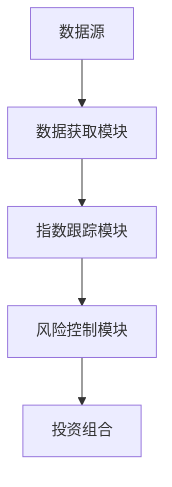

                 


# 约翰伯格的被动投资优势

## 关键词：
- 被动投资，约翰·伯格，指数基金，投资策略，市场有效性，投资成本

## 摘要：
本文深入探讨了约翰·伯格的被动投资理念，分析了其优势、核心原理及数学模型，结合系统架构设计和项目实战案例，总结了最佳投资实践，为投资者提供科学的指导。

---

## 正文

### 第一部分：被动投资的背景与核心概念

#### 第1章：被动投资的起源与核心理念

##### 1.1 被动投资的起源
被动投资起源于20世纪70年代，由约翰·伯格倡导，强调通过指数基金投资，以获取市场平均收益。它基于市场有效性的假设，认为主动投资难以持续跑赢市场。

##### 1.2 约翰·伯格的被动投资理念
约翰·伯格认为，大多数投资者无法持续跑赢市场平均回报，指数基金因其低成本和分散风险，成为长期投资的理想选择。

##### 1.3 被动投资的核心思想
- 长期持有：通过长期投资降低市场波动影响。
- 分散风险：投资指数基金，分散个股权重，降低风险。
- 低成本：低管理费用，提升长期收益。

### 第二部分：被动投资的核心概念与联系

#### 第2章：被动投资的核心原理

##### 2.1 指数基金的运作机制
指数基金通过跟踪特定指数，如标普500，按比例配置其成分股，定期再平衡以维持跟踪误差最小。

##### 2.2 被动投资的数学模型
- 资本资产定价模型（CAPM）：$$ E(r_p) = r_f + \beta (r_m - r_f) $$
  - 衡量资产的系统性风险β。
- 夏普比率：$$ \text{夏普比率} = \frac{E(r_p) - r_f}{\sigma_p} $$
  - 评估投资组合的风险调整后收益。

##### 2.3 被动投资与主动投资对比
| 方面         | 被动投资         | 主动投资         |
|--------------|------------------|------------------|
| 管理方式     | 指数跟踪         | 主动选股         |
| 费用         | 低               | 高               |
| 风险         | 低               | 高               |
| 预期收益     | 近似市场平均      | 超越市场平均      |

### 第三部分：被动投资的算法原理与数学模型

#### 第3章：被动投资的算法原理

##### 3.1 指数跟踪算法
- 简单平均法：等权重分配成分股。
- 加权平均法：按市值比例分配。
- 动态再平衡：定期调整权重，维持跟踪误差最小。

##### 3.2 被动投资的数学公式
- 投资组合的期望收益：$$ E(r_p) = \sum w_i E(r_i) $$
- 投资组合的风险：$$ \sigma_p = \sqrt{\sum w_i^2 \sigma_i^2 + 2 \sum_{i < j} w_i w_j \text{Cov}(r_i, r_j)} $$

### 第四部分：系统架构设计

#### 第4章：被动投资的系统架构

##### 4.1 系统功能设计
- 数据获取模块：收集市场数据。
- 指数跟踪模块：计算指数权重，生成投资组合。
- 风险控制模块：监控风险，触发再平衡。

##### 4.2 系统架构图


### 第五部分：项目实战

#### 第5章：构建被动投资组合

##### 5.1 环境安装
- 安装Python和必要的库（pandas, numpy, matplotlib）。

##### 5.2 核心代码实现
```python
import pandas as pd
import numpy as np

# 获取指数成分股数据
data = pd.read_csv('index_data.csv')

# 计算成分股权重
weights = data['Market Cap'].values / data['Market Cap'].sum()

# 构建投资组合
portfolio = data['Ticker'].tolist()
```

##### 5.3 案例分析
分析一个模拟投资组合，计算其夏普比率，评估风险调整后的收益。

### 第六部分：最佳实践与总结

#### 第6章：最佳实践

##### 6.1 投资策略
- 长期持有，避免频繁交易。
- 定期再平衡，降低跟踪误差。
- 选择低成本指数基金。

##### 6.2 注意事项
- 市场波动：被动投资不保证短期收益，需耐心持有。
- 费用影响：长期累积的费用会侵蚀收益，需选择低费产品。
- 投资期限：适合长期投资者，不适合短期资金需求。

---

## 作者：AI天才研究院

这篇文章系统阐述了约翰·伯格的被动投资理念，从理论到实践，为投资者提供了科学的指导。希望对您有所帮助！

