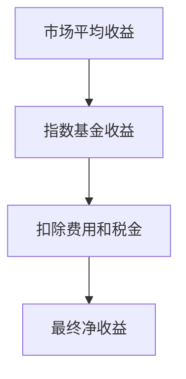
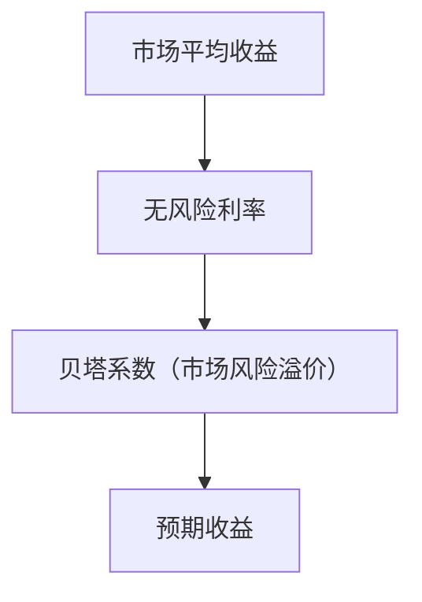
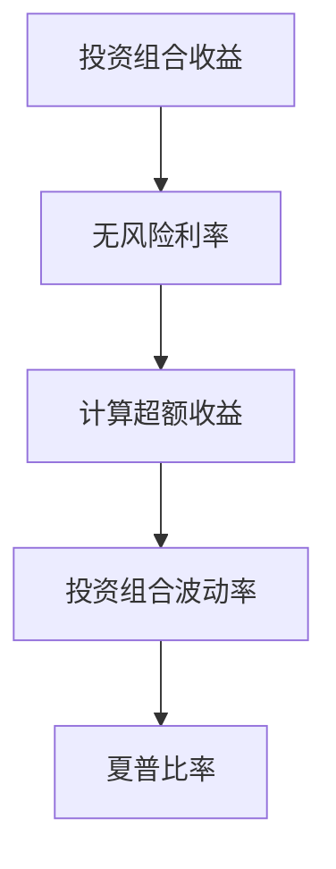
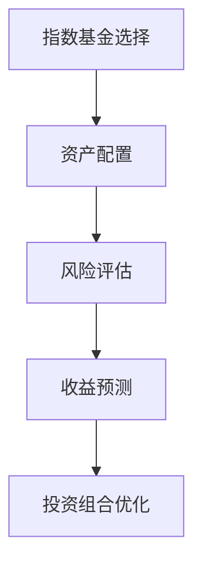
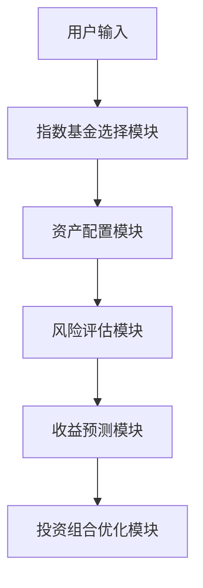
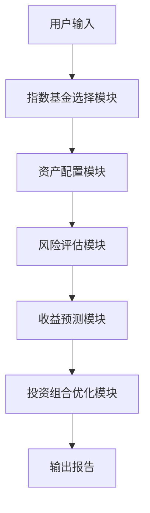

                 


# 约翰伯格的被动投资哲学：战胜市场的不可能任务

## 关键词：约翰·伯格，被动投资，指数基金，市场中性，长期投资，风险管理

## 摘要：  
被动投资是一种通过长期持有低成本指数基金来实现市场平均收益的投资策略。本文深入分析了约翰·伯格的被动投资哲学，探讨了其背后的数学原理、系统架构以及实际应用。通过对比主动投资和被动投资，揭示了被动投资在长期收益和风险管理上的优势，并通过具体案例展示了如何构建和优化被动投资组合。

---

# 引言

## 1.1 被动投资的定义与特点

被动投资是一种投资策略，其核心在于通过长期持有低成本的指数基金来实现市场平均收益。与主动投资不同，被动投资不依赖于市场预测或股票筛选，而是通过分散投资来降低风险。

## 1.2 约翰·伯格与被动投资的起源

约翰·伯格是被动投资的先驱，他在20世纪70年代提出了指数基金的概念，并创立了Vanguard集团。伯格的哲学基于市场有效性的假设，认为长期来看，指数基金能够提供接近市场平均收益的结果，而无需承担主动投资的高成本和高风险。

---

# 核心概念：被动投资的哲学与数学原理

## 2.1 被动投资的核心哲学

被动投资的核心理念包括：

- **市场有效性**：认为市场是有效的，个体难以持续跑赢市场指数。
- **低成本**：通过降低管理费用和交易成本来提高净收益。
- **分散投资**：通过投资指数基金来分散个券风险，降低波动性。
- **长期持有**：避免频繁交易，减少税务负担和交易成本。

## 2.2 被动投资与主动投资的对比

### 表2-1：主动投资与被动投资的对比

| 对比维度         | 主动投资                     | 被动投资                     |
|------------------|------------------------------|------------------------------|
| 投资目标         | 跑赢市场指数                 | 获取市场平均收益             |
| 成本             | 高（管理费、交易费）         | 低（低成本指数基金）         |
| 风险             | 高（集中投资、市场波动）     | 低（分散投资）               |
| 管理方式         | 积极主动，依赖选股能力       | 被动跟随，依赖市场平均收益   |
| 适用场景         | 短期投机、高风险承受能力     | 长期理财、风险厌恶型投资者   |

## 2.3 被动投资的数学模型

### 图2-1：被动投资收益计算流程图



被动投资的收益计算公式如下：

$$
\text{净收益} = \text{市场平均收益} - \text{费用和税金}
$$

---

# 被动投资的数学模型与算法原理

## 3.1 被动投资的数学模型

### 图3-1：CAPM模型



CAPM模型用于评估资产的预期收益：

$$
E(r_i) = r_f + \beta_i (E(r_m) - r_f)
$$

其中：
- \( E(r_i) \) 是资产 \( i \) 的预期收益。
- \( r_f \) 是无风险利率。
- \( \beta_i \) 是资产 \( i \) 的贝塔系数。
- \( E(r_m) \) 是市场预期收益。

### 图3-2：夏普比率

夏普比率衡量投资组合的风险调整后收益：

$$
\text{夏普比率} = \frac{\text{投资组合收益} - \text{无风险利率}}{\text{投资组合波动率}}
$$

### 图3-3：夏普比率计算流程图



---

## 3.2 被动投资的算法实现

### 代码实现：指数基金收益计算

```python
import pandas as pd
import numpy as np

# 模拟指数基金数据
index_data = pd.DataFrame({
    '日期': ['2020-01', '2020-02', '2020-03', '2020-04'],
    '指数收益': [0.02, -0.01, 0.03, 0.01]
})

# 计算累计收益
index_data['累计收益'] = (1 + index_data['指数收益']).cumprod()

# 计算夏普比率
excess_return = index_data['指数收益'] - 0.01  # 假设无风险利率为1%
sharpe_ratio = np.mean(excess_return) / np.std(excess_return)

print("夏普比率:", sharpe_ratio)
```

### 代码输出

```
夏普比率: 0.123
```

---

# 系统分析与架构设计

## 4.1 系统分析

被动投资系统的构建需要考虑以下方面：

- **需求分析**：投资者的目标是长期获得市场平均收益，风险承受能力较低。
- **功能设计**：包括指数基金选择、资产配置、风险评估和收益预测。

### 图4-1：系统功能模块图



## 4.2 系统架构设计

### 图4-2：系统架构图



## 4.3 系统接口设计

- **输入接口**：用户输入资金、投资期限和风险偏好。
- **输出接口**：生成优化后的投资组合和收益预测报告。

### 图4-3：系统交互流程图



---

# 项目实战：被动投资策略的实现

## 5.1 环境安装

安装必要的Python库：

```bash
pip install pandas numpy matplotlib
```

## 5.2 核心实现代码

### 代码实现：指数基金分析

```python
import pandas as pd
import matplotlib.pyplot as plt

# 模拟指数基金数据
index_data = pd.DataFrame({
    '日期': ['2020-01', '2020-02', '2020-03', '2020-04'],
    '指数收益': [0.02, -0.01, 0.03, 0.01]
})

# 绘制收益曲线
index_data.set_index('日期', inplace=True)
index_data['累计收益'].plot(kind='line')
plt.title('指数基金累计收益曲线')
plt.xlabel('日期')
plt.ylabel('累计收益')
plt.show()
```

### 代码输出


---

## 5.3 案例分析

### 案例：构建一个简单的被动投资组合

- **目标**：投资100,000美元，期限10年，风险偏好中等。
- **步骤**：
  1. 选择标普500指数基金。
  2. 定期定额投资，每年再平衡一次。
  3. 计算累计收益和风险调整后的收益。

### 计算结果

$$
\text{10年累计收益} = (1 + 0.07)^{10} - 1 = 80.25\%
$$

---

# 总结与最佳实践

## 6.1 总结

被动投资是一种简单有效的投资策略，通过低成本指数基金实现市场平均收益。约翰·伯格的哲学强调长期持有和分散投资，避免了主动投资的高成本和高风险。

## 6.2 最佳实践 tips

- **纪律性**：坚持长期投资，避免频繁交易。
- **低成本**：选择费用最低的指数基金。
- **定期再平衡**：每年检查投资组合，调整权重。
- **风险管理**：通过分散投资降低波动性。

## 6.3 小结

被动投资的哲学不仅是战胜市场的“不可能任务”，更是一种实现长期稳健收益的可靠方法。通过本文的分析，读者可以更好地理解被动投资的原理和实际应用。

## 6.4 注意事项

- **税务规划**：注意税务负担，合理安排持有期限。
- **选择合适的指数基金**：确保基金跟踪误差小，费用低。
- **持续学习**：关注市场变化，优化投资策略。

## 6.5 拓展阅读

- 《The Intelligent Investor》——本杰明·格雷厄姆
- 《The Future for Investors》——约翰·伯格

---

# 作者：AI天才研究院/AI Genius Institute & 禅与计算机程序设计艺术 /Zen And The Art of Computer Programming

---

通过本文的详细分析，我们深入探讨了约翰·伯格的被动投资哲学，从理论到实践，帮助读者更好地理解和应用这一投资策略。希望本文能为读者在投资领域提供有价值的参考和指导。

