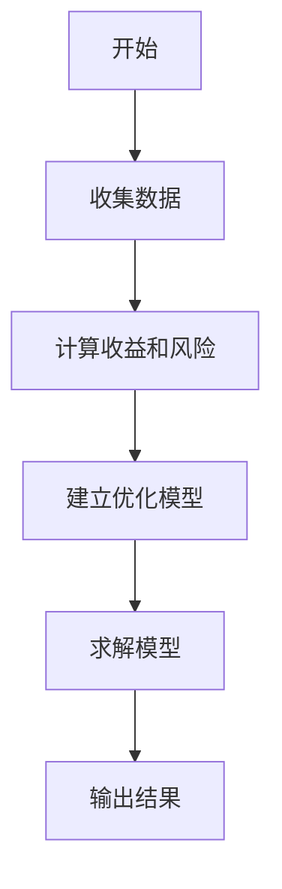
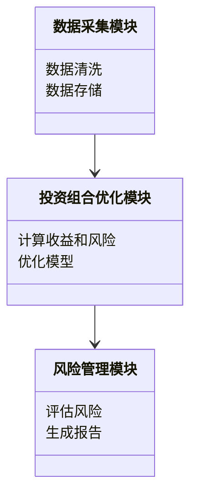

                 


# 约翰伯格的退休投资规划

## 关键词：
退休投资规划, 投资组合理论, 资本资产定价模型, 现金流分析, 风险管理

## 摘要：
本文深入探讨了退休投资规划的核心概念、数学模型和算法实现，结合实际案例分析，提供了系统化的解决方案。通过介绍投资组合理论、现金流分析、风险管理等关键要素，结合系统设计和实战项目，帮助读者构建有效的退休投资策略。

---

# 引言

## 1. 退休投资规划的重要性

### 1.1 背景介绍

退休投资规划是保障个人在退休后生活质量的重要手段。随着人口老龄化加剧，传统的养老金体系面临压力，个人退休投资变得尤为重要。

### 1.2 本书目标

本书旨在帮助读者掌握退休投资规划的核心方法，从理论到实践，构建稳健的投资策略。

### 1.3 结构安排

本文分为七章，涵盖背景、核心概念、算法、系统设计、实战、最佳实践等部分，结构清晰，内容详实。

---

# 第一部分: 退休投资规划的背景与基础

## 第1章: 退休投资规划概述

### 1.1 退休投资规划的基本概念

#### 1.1.1 投资目标与生命周期阶段

- 不同生命周期阶段的投资目标不同，需根据年龄和风险承受能力调整投资策略。

#### 1.1.2 退休规划的核心要素

- 资产配置：确定各类资产的投资比例。
- 风险承受能力：根据个人风险偏好设定。
- 时间跨度：从开始投资到退休的时间长度。

#### 1.1.3 资产与负债管理

- 资产：包括金融资产和房地产等。
- 负债：如房贷和其他贷款。

### 1.2 退休投资规划的现状与挑战

#### 1.2.1 传统退休保障体系的局限性

- 养老金体系的可持续性问题。
- 通货膨胀对购买力的影响。

#### 1.2.2 现代退休投资的特点

- 个性化与专业化。
- 风险管理与资产配置。

---

## 第2章: 退休投资规划的核心概念与联系

### 2.1 投资组合理论

#### 2.1.1 现代投资组合理论（MPT）

- 由哈里·马科维茨提出，旨在通过分散投资降低风险。

#### 2.1.2 资本资产定价模型（CAPM）

- 描述资产的预期收益与系统性风险之间的关系。

#### 2.1.3 夏普比率与投资风险

- 夏普比率衡量投资组合的风险调整后收益。

### 2.2 核心概念的联系

#### 2.2.1 投资目标与风险承受能力的关系

- 风险承受能力影响资产配置，高风险承受能力可投资更多股票。

#### 2.2.2 资产分配与投资绩效的关联

- 资产分配决定了组合的风险收益特征。

#### 2.2.3 投资组合调整与市场变化的互动

- 定期再平衡投资组合以适应市场变化。

---

## 第3章: 投资组合优化的数学模型

### 3.1 投资组合优化的数学模型

#### 3.1.1 最优化问题的建立

- 目标函数：最大化收益或最小化风险。
- 约束条件：如资产比例限制、风险承受等。

#### 3.1.2 常用目标函数与约束条件

- 收益最大化：maximize return.
- 风险最小化：minimize variance.

#### 3.1.3 数学模型的求解方法

- 常用优化算法：如拉格朗日乘数法。

### 3.2 投资组合优化的算法实现

#### 3.2.1 算法流程图（使用 Mermaid）



#### 3.2.2 Python代码示例

```python
import numpy as np
from scipy.optimize import minimize

# 示例数据
returns = np.array([0.1, 0.15, 0.05])

def portfolio_variance(weights):
    return np.dot(weights.T, np.dot(np.diag(returns), weights))

# 初始权重
initial_guess = np.array([1/3, 1/3, 1/3])

# 约束条件
cons = ({'type': 'eq', 'fun': lambda w: sum(w) - 1})

# 求解
result = minimize(portfolio_variance, initial_guess, constraints=cons)

print("最优权重:", result.x)
```

### 3.3 数学模型的解释

#### 3.3.1 优化问题的数学表达

$$
\text{minimize } w^T \Sigma w \\
\text{subject to } 1^T w = 1
$$

其中，$w$ 是权重向量，$\Sigma$ 是协方差矩阵。

---

## 第4章: 现金流分析与风险管理

### 4.1 现金流分析

#### 4.1.1 现金流的时间价值

- 考虑资金的时间价值，使用现值和终值计算。

#### 4.1.2 现金流的风险评估

- 使用标准差衡量波动性。

### 4.2 风险管理

#### 4.2.1 风险管理策略

- 多样化投资降低非系统性风险。

#### 4.2.2 风险调整后的投资策略

- 使用VaR（在险价值）评估潜在损失。

---

## 第5章: 系统分析与架构设计

### 5.1 系统功能设计

#### 5.1.1 功能模块

- 数据采集与处理模块。
- 投资组合优化模块。
- 风险管理模块。

#### 5.1.2 系统类图（Mermaid）



### 5.2 系统架构设计

#### 5.2.1 架构图（Mermaid）

```mermaid
container 系统架构 {
    数据采集模块
    数据处理模块
    投资组合优化模块
    风险管理模块
}
```

---

## 第6章: 项目实战

### 6.1 环境安装与数据收集

#### 6.1.1 环境配置

- 安装Python、Pandas、NumPy等库。

#### 6.1.2 数据来源

- 使用历史股票数据和债券收益率。

### 6.2 投资组合优化的实现

#### 6.2.1 Python代码实现

```python
import numpy as np
from scipy.optimize import minimize

# 示例数据
returns = np.array([0.05, 0.08, 0.02])

def portfolio_variance(weights):
    return np.dot(weights.T, np.dot(np.diag(returns), weights))

# 初始权重
initial_guess = np.array([1/3, 1/3, 1/3])

# 约束条件
cons = ({'type': 'eq', 'fun': lambda w: sum(w) - 1})

# 求解
result = minimize(portfolio_variance, initial_guess, constraints=cons)

print("最优权重:", result.x)
```

#### 6.2.2 结果分析

- 最优权重反映了各资产的最佳配置比例。

### 6.3 现金流分析与风险管理

#### 6.3.1 VaR计算

- 使用历史模拟法计算VaR，评估潜在损失。

---

## 第7章: 最佳实践与总结

### 7.1 最佳实践 tips

- 定期审查投资组合，根据市场变化调整。
- 分散投资以降低风险。

### 7.2 小结

通过系统化的分析和实战案例，读者掌握了退休投资规划的核心方法和技术。

### 7.3 注意事项

- 风险管理是投资成功的关键。
- 需要根据个人情况调整投资策略。

### 7.4 拓展阅读

推荐阅读《投资学》和《Python金融计算》等书籍。

---

# 作者

作者：AI天才研究院/AI Genius Institute  
禅与计算机程序设计艺术 /Zen And The Art of Computer Programming

---

以上是《约翰伯格的退休投资规划》的文章内容，涵盖了从理论到实践的各个方面，详细解释了退休投资规划的核心概念、算法实现和系统设计，结合具体案例，帮助读者构建有效的退休投资策略。

