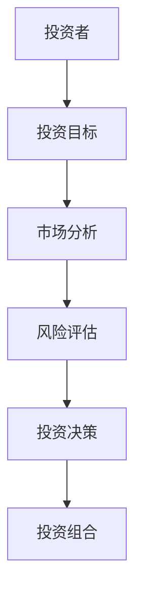
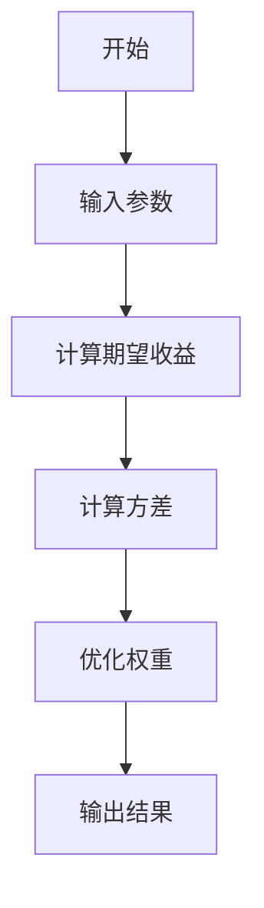
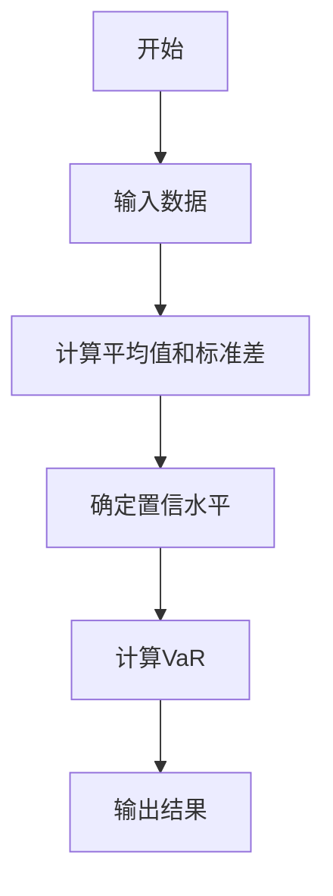

                 


```markdown
# {{此处是文章标题}}

> 关键词：{{此处列出文章的5-7个核心关键词}}

> 摘要：{{此处给出文章的核心内容和主题思想}}

# 第一部分: 引言

# 第1章: 约翰·邓普顿的全球化投资视角概述

## 1.1 约翰·邓普顿的生平与投资理念
### 1.1.1 约翰·邓普顿的生平简介
### 1.1.2 约翰·邓普顿的投资哲学
### 1.1.3 约翰·邓普顿的全球化投资理念

## 1.2 全球化投资的背景与重要性
### 1.2.1 全球化投资的历史发展
### 1.2.2 全球化投资的经济理论基础
### 1.2.3 全球化投资的现状与趋势

## 1.3 本书的核心内容与结构
### 1.3.1 本书的核心主题
### 1.3.2 本书的章节安排
### 1.3.3 本书的阅读方法

# 第二部分: 全球化投资的核心概念与分析框架

# 第2章: 全球化投资的核心概念

## 2.1 全球化投资的定义与特征
### 2.1.1 全球化投资的定义
### 2.1.2 全球化投资的核心特征
### 2.1.3 全球化投资与本地化投资的对比

## 2.2 约翰·邓普顿投资理念的实体关系图


## 2.3 全球化投资的核心要素对比表
| 要素 | 定义 | 特点 |
|------|------|------|
| 投资目标 | 投资的具体对象 | 全球化、多样化 |
| 投资策略 | 实现投资目标的方法 | 风险分散、收益最大化 |
| 风险管理 | 控制投资风险的措施 | 多元化、动态调整 |

# 第3章: 全球化投资的数学模型与算法原理

## 3.1 投资组合优化的数学模型
### 3.1.1 投资组合优化的定义
### 3.1.2 投资组合优化的数学公式
$$ \text{目标函数：} \quad \text{max} \sum_{i=1}^n w_i r_i - \lambda \sum_{i=1}^n w_i^2 \sigma_i^2 $$
### 3.1.3 投资组合优化的算法流程


## 3.2 风险管理的数学模型
### 3.2.1 风险管理的定义
### 3.2.2 风险值(VaR)的计算公式
$$ \text{VaR} = \mu + z \cdot \sigma $$
### 3.2.3 风险管理的算法流程


## 3.3 投资组合优化的代码实现
### 3.3.1 Python代码实现
```python
import numpy as np
import pandas as pd

def optimize_portfolio(returns, weights):
    # 计算投资组合的期望收益和风险
    expected_return = np.dot(weights, returns)
    risk = np.sqrt(np.dot(weights.T, np.dot(returns.cov(), weights)))
    return expected_return, risk

# 示例数据
returns = pd.DataFrame({
    '资产1': [0.05, 0.03, 0.07],
    '资产2': [0.02, 0.06, 0.05]
})

weights = [0.5, 0.5]

expected_return, risk = optimize_portfolio(returns, weights)
print(f"期望收益: {expected_return}")
print(f"风险: {risk}")
```

## 3.4 投资组合优化的系统架构


# 第四部分: 全球化投资的系统架构与实现

# 第4章: 全球化投资的系统架构设计

## 4.1 系统功能设计
### 4.1.1 系统功能模块划分
- 数据采集模块
- 数据处理模块
- 投资组合优化模块
- 风险管理模块

### 4.1.2 系统功能流程图


## 4.2 系统架构设计
### 4.2.1 系统架构图


## 4.3 系统接口设计
### 4.3.1 输入接口
- 数据输入接口
- 参数设置接口

### 4.3.2 输出接口
- 结果输出接口
- 日志输出接口

## 4.4 系统交互设计
### 4.4.1 用户与系统的交互流程


# 第五部分: 全球化投资的实战应用

# 第5章: 全球化投资的案例分析

## 5.1 案例背景介绍
### 5.1.1 案例目标
### 5.1.2 案例数据
### 5.1.3 案例分析步骤

## 5.2 案例分析与解读
### 5.2.1 数据采集与处理
### 5.2.2 模型选择与实现
### 5.2.3 结果分析与优化

## 5.3 案例总结
### 5.3.1 案例的关键点
### 5.3.2 案例的启示

# 第6章: 全球化投资的实战技巧

## 6.1 投资组合优化的实战技巧
### 6.1.1 数据清洗与预处理
### 6.1.2 模型调参与优化
### 6.1.3 结果验证与评估

## 6.2 风险管理的实战技巧
### 6.2.1 风险评估与监控
### 6.2.2 风险控制与调整
### 6.2.3 风险沟通与汇报

## 6.3 投资组合管理的实战技巧
### 6.3.1 投资组合再平衡
### 6.3.2 投资组合调整与优化
### 6.3.3 投资组合评估与反馈

# 第七部分: 总结与展望

# 第7章: 全球化投资的总结与展望

## 7.1 本书的核心内容回顾
### 7.1.1 全球化投资的定义与特征
### 7.1.2 约翰·邓普顿的投资理念
### 7.1.3 投资组合优化的数学模型
### 7.1.4 系统架构与实现

## 7.2 约翰·邓普顿视角的全球化投资展望
### 7.2.1 未来全球化投资的趋势
### 7.2.2 投资者如何应对全球化挑战
### 7.2.3 约翰·邓普顿投资理念的现代应用

## 7.3 本书的阅读收获与启示
### 7.3.1 投资者如何运用本书知识
### 7.3.2 投资者如何进一步学习
### 7.3.3 本书对投资领域的贡献

# 附录

## 附录A: 全球化投资相关术语表
## 附录B: 投资组合优化的数学公式汇总
## 附录C: 系统架构设计的详细说明

# 参考文献

## 1. 约翰·邓普顿的著作
## 2. 全球化投资的经典文献
## 3. 相关学术论文

# 作者信息

## 作者：AI天才研究院/AI Genius Institute & 禅与计算机程序设计艺术 /Zen And The Art of Computer Programming

# 结语

## 感谢您的阅读，希望本书对您在全球化投资领域有所帮助！
```

