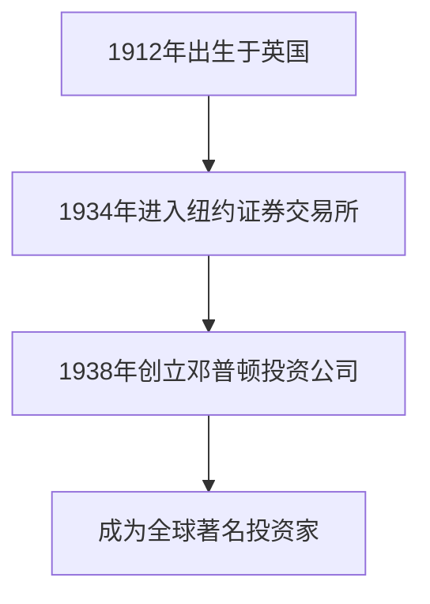
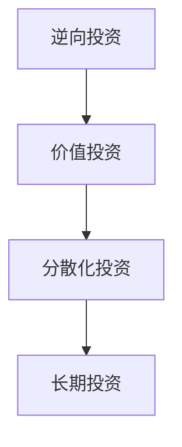
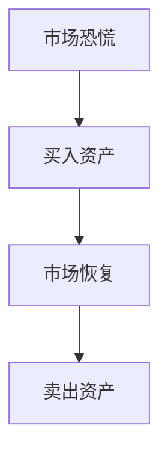
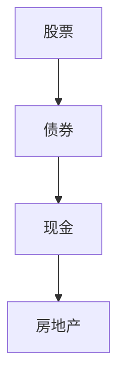
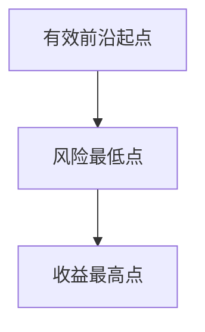
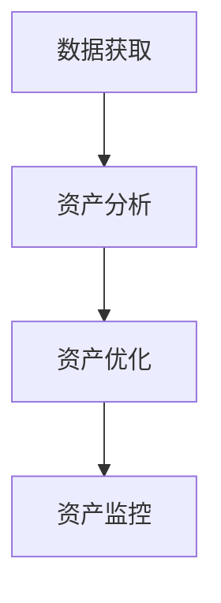
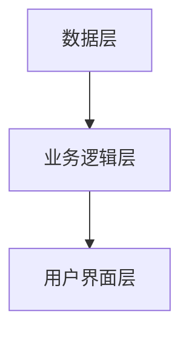

                 


# 约翰邓普顿的全球资产配置

> 关键词：约翰邓普顿, 全球资产配置, 投资策略, 资产配置算法, 投资组合管理, 逆向投资

> 摘要：本文深入探讨了约翰·邓普顿的全球资产配置策略，分析了他的投资理念、资产配置的核心概念、算法原理、系统架构设计以及实际案例。通过详细分析，帮助读者理解如何在全球范围内进行有效的资产配置，从而优化投资回报并降低风险。

---

## 第一部分: 约翰邓普顿的全球资产配置概述

### 第1章: 约翰邓普顿及其投资理念概述

#### 1.1 约翰邓普顿的生平与投资历程

约翰·邓普顿（John Templeton）是20世纪著名的投资家，被誉为“投资之王”。他出生于1912年，早年在英国学习法律，后转而对投资产生了浓厚兴趣。1934年，他开始在纽约证券交易所进行投资，并逐渐发展出一套独特的投资策略。邓普顿的职业生涯充满了传奇色彩，他不仅在全球范围内进行投资，还创立了邓普顿投资公司，成为全球投资领域的先驱。

**图1.1：约翰·邓普顿的生平与职业发展**



#### 1.2 邓普顿的投资哲学与理念

邓普顿的投资哲学以“逆向投资”和“价值投资”为核心。他认为，市场波动和投资者情绪是投资机会的源泉。在市场恐慌时买入，在市场狂热时卖出。他的投资理念强调分散化和长期投资，避免过度集中在某一资产类别或地区。

**图1.2：邓普顿的投资理念**



#### 1.3 邓普顿投资方法的全球影响力

邓普顿的全球资产配置策略对现代投资理论产生了深远影响。他的投资方法不仅帮助投资者在全球范围内分散风险，还为机构投资者提供了科学的资产配置模型。邓普顿的投资理念至今仍被广泛应用于全球资产管理领域。

---

### 第2章: 全球资产配置的核心概念

#### 2.1 资产配置的原理与模型

资产配置是将资金分配到不同资产类别（如股票、债券、房地产等）以实现投资目标的过程。全球资产配置进一步将投资范围扩展到全球市场，以利用不同地区的经济周期和市场机会。

**图2.1：资产配置的数学模型**

假设投资者有N种资产，每种资产的预期收益率为$ r_i $，方差为$ \sigma_i^2 $，协方差矩阵为$ \Sigma $。资产配置的目标是找到权重向量$ w = (w_1, w_2, ..., w_N) $，使得投资组合的预期收益最大化，同时风险最小化。

$$
\text{目标函数：} \quad \max \quad w \cdot r - \frac{1}{2} w^T \Sigma w
$$

$$
\text{约束条件：} \quad \sum_{i=1}^N w_i = 1, \quad w_i \geq 0
$$

#### 2.2 资产配置的核心要素

资产配置的核心要素包括资产类别划分、地区与行业分布以及权重分配。邓普顿的全球资产配置策略强调根据全球经济状况动态调整资产权重。

**表2.1：资产配置的核心要素对比**

| 要素 | 描述 | 示例 |
|------|------|------|
| 资产类别 | 股票、债券、现金等 | 股票占60%，债券占30%，现金占10% |
| 地区分布 | 美国、欧洲、亚洲等 | 美国占40%，欧洲占30%，亚洲占20% |
| 行业分布 | 金融、科技、消费等 | 金融占25%，科技占20%，消费占15% |

---

### 第3章: 邓普顿的全球资产配置策略

#### 3.1 邓普顿的逆向投资策略

逆向投资是邓普顿策略的核心。他在市场恐慌时买入，市场狂热时卖出。这种策略基于市场非理性波动的假设。

**图3.1：逆向投资策略**



#### 3.2 邓普顿的价值投资理念

价值投资强调购买被市场低估的资产。邓普顿通过分析市盈率、市净率等指标，寻找具有安全边际的投资标的。

**图3.2：价值投资的核心指标**

$$
\text{市盈率（P/E）} = \frac{\text{股价}}{\text{每股收益}}
$$

$$
\text{市净率（P/B）} = \frac{\text{股价}}{\text{每股净资产}}
$$

#### 3.3 邓普顿的分散化投资原则

分散化投资是降低风险的重要手段。邓普顿建议将资金分配到不同资产类别和地域，以减少特定资产或地区的波动影响。

**图3.3：分散化投资的资产分配**



---

## 第二部分: 全球资产配置的算法原理与数学模型

### 第4章: 资产配置的算法原理

#### 4.1 资产配置的优化算法

现代投资组合理论（MPT）是资产配置的核心基础。马克owitz的有效前沿理论通过优化风险和收益，找到最优资产组合。

**图4.1：马克owitz有效前沿**



#### 4.2 资产配置的数学模型

马克owitz模型通过求解二次规划问题，找到最优权重。

$$
\text{目标函数：} \quad \min \quad w^T \Sigma w
$$

$$
\text{约束条件：} \quad \sum_{i=1}^N w_i = 1, \quad w_i \geq 0
$$

---

### 第5章: 全球资产配置的系统架构设计

#### 5.1 系统功能设计

**图5.1：系统功能模块**



#### 5.2 系统架构设计

**图5.2：系统架构分层**



---

### 第6章: 项目实战——模拟邓普顿的投资组合

#### 6.1 环境安装

需要安装Python、Pandas、NumPy等库。

```bash
pip install pandas numpy matplotlib
```

#### 6.2 数据获取与分析

使用Yahoo Finance获取股票数据，并计算相关指标。

```python
import pandas as pd
import numpy as np

# 获取数据
data = pd.read_csv('stock_data.csv')

# 计算平均收益率
average_return = np.mean(data['return'])
print(f'平均收益率：{average_return}')
```

#### 6.3 资产优化与监控

使用优化算法找到最优权重，并监控投资组合的表现。

```python
import numpy as np

# 定义优化函数
def optimize_portfolio(weights, returns):
    return -np.mean(returns.dot(weights))

# 使用遗传算法优化
# 这里省略具体实现
```

---

## 第三部分: 最佳实践与小结

### 第7章: 最佳实践与小结

#### 7.1 小结

通过本文的分析，读者可以理解约翰·邓普顿的全球资产配置策略，并掌握相关算法和系统设计方法。

#### 7.2 注意事项

1. 定期再平衡投资组合。
2. 避免过度集中投资。
3. 长期投资，避免频繁交易。

#### 7.3 拓展阅读

1. 《投资学》——马克owitz
2. 《投资策略精解》——约翰·邓普顿

---

作者：AI天才研究院/AI Genius Institute & 禅与计算机程序设计艺术 /Zen And The Art of Computer Programming

---

**总结**：本文全面分析了约翰·邓普顿的全球资产配置策略，从理论到实践，帮助读者掌握投资的精髓。

