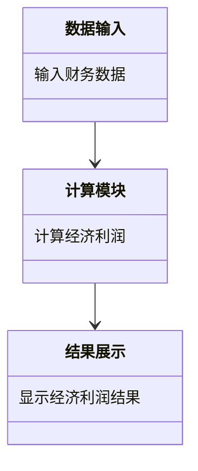

                 

# 经济利润模型：衡量真实价值创造的工具

## 关键词
经济利润模型、价值创造、企业绩效、财务指标、投资决策、股东价值

## 摘要
经济利润模型（Economic Profit Model）是一种衡量企业真实价值创造的重要工具，它通过考虑资本成本，提供了一个更全面的企业绩效评估方法。本文将从经济利润模型的背景、核心概念、计算方法、系统架构、实际应用和优化策略等方面进行详细分析，帮助读者深入了解该模型的原理和应用。

## 第一部分：经济利润模型的背景与基础

### 第1章：经济利润模型的定义与背景

#### 1.1 经济利润模型的定义
经济利润模型是一种衡量企业经济利润的工具，它不仅考虑了会计利润，还考虑了资本成本。经济利润的计算公式为：  
$$\text{经济利润} = \text{净利润} - (\text{资本成本} \times \text{平均资本占用})$$  
这个公式强调了资本成本对企业利润的影响，提供了比会计利润更全面的评估方法。

##### 图1.1 经济利润模型的核心要素

经济利润模型的定义还涉及以下几个方面：
1. **定义**：经济利润模型是衡量企业实际盈利能力的工具。
2. **历史背景**：随着企业绩效评估的深入，传统财务指标的局限性逐渐显现，经济利润模型应运而生。
3. **区别**：与会计利润不同，经济利润考虑了资本成本，更能反映企业的真实价值。

#### 1.2 经济利润模型的核心要素
经济利润模型的核心要素包括净利润、资本成本和平均资本占用。这些要素共同决定了企业的经济利润。

##### 表1.1 经济利润模型与传统财务指标的对比
| 指标       | 经济利润模型                     | 传统财务指标（如净利润）         |
|------------|----------------------------------|--------------------------------|
| 计算公式     | 净利润 - 资本成本 × 平均资本占用 | 净利润                          |
| 考虑因素     | 包括资本成本                   | 不考虑资本成本                 |
| 应用场景     | 企业价值评估                   | 绩效考核                       |

### 第2章：经济利润模型的理论基础

#### 2.1 经济利润模型的理论框架
经济利润模型的理论基础包括资本资产定价模型（CAPM）和现代企业财务理论。这些理论为模型提供了数学基础。

##### 图2.1 经济利润模型的数学模型
$$\text{经济利润} = \text{EBIT} - (WACC \times \text{平均资本占用})$$  
其中，EBIT为息税前利润，WACC为加权平均资本成本，平均资本占用为企业运营所需的平均资本。

#### 2.2 经济利润模型的核心要素
经济利润模型的核心要素包括收入、成本、资本占用和资本成本。这些要素共同决定了企业的经济利润。

## 第二部分：经济利润模型的计算与应用

### 第3章：经济利润模型的计算与应用

#### 3.1 经济利润模型的计算方法
经济利润的计算步骤如下：
1. 计算净利润。
2. 计算资本成本。
3. 计算平均资本占用。
4. 计算经济利润。

##### 图3.1 经济利润模型的计算流程

#### 3.2 经济利润模型的实际应用
经济利润模型可以用于企业价值评估、投资决策支持和绩效考核。例如，企业可以通过计算经济利润，评估投资项目的真实价值。

### 第4章：经济利润模型的系统架构

#### 4.1 系统功能设计
经济利润模型的系统功能包括数据输入、计算模块和结果展示。系统需要能够处理大量的财务数据，进行复杂的计算，并以直观的方式展示结果。

##### 图4.1 系统功能设计的领域模型

## 第三部分：经济利润模型的高级分析与优化

### 第5章：经济利润模型的高级分析

#### 5.1 经济利润模型的优化策略
为了提高经济利润模型的准确性，可以采用以下优化策略：
1. 使用更精确的资本成本计算方法。
2. 考虑市场风险溢价的影响。
3. 定期更新财务数据。

#### 5.2 经济利润模型的动态调整
根据市场变化和企业战略调整模型参数，可以提高模型的适应性。

### 第6章：经济利润模型的未来展望

#### 6.1 模型的未来发展趋势
随着大数据和人工智能技术的发展，经济利润模型将更加智能化和自动化。

## 结语

经济利润模型是一个强大的工具，能够帮助企业更准确地评估绩效和制定决策。通过不断优化和创新，经济利润模型将在未来发挥更大的作用。

## 作者

作者：AI天才研究院/AI Genius Institute & 禅与计算机程序设计艺术 /Zen And The Art of Computer Programming

---

以上内容是一个详细的经济利润模型分析，涵盖了模型的背景、理论基础、计算方法、系统架构和应用实例。

