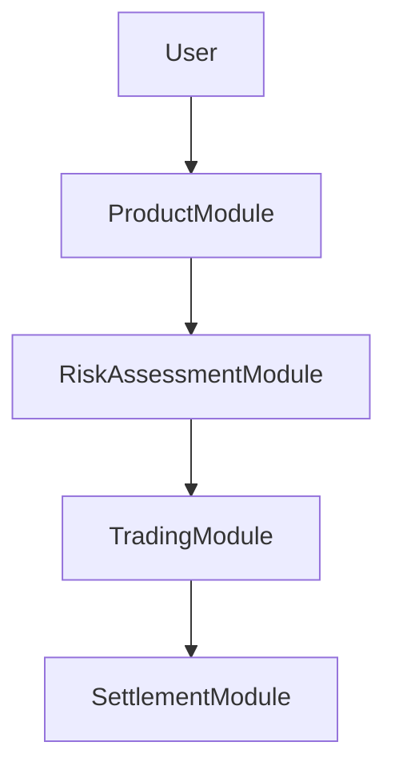

                 


# 结构性产品：定制化投资解决方案的优缺点

> 关键词：结构性产品，定制化投资，金融工具，风险管理，收益分析

> 摘要：结构性产品是一种结合金融衍生工具和固定收益证券的复杂投资工具，本文将从其定义、核心原理、优缺点分析、系统架构设计、实战案例、法律合规风险及未来发展趋势等方面进行深入探讨，帮助读者全面了解结构性产品的本质及其在投资中的应用价值。

---

## 第1章：结构性产品的基本概念

### 1.1 什么是结构性产品
结构性产品（Structured Products）是一种复杂的金融工具，通常结合了衍生品和固定收益证券的特点。它们通过嵌入期权、期货等衍生工具，为投资者提供多样化的收益结构和风险敞口。

#### 1.1.1 结构性产品的背景
随着金融市场的发展，投资者对定制化投资工具的需求日益增长。结构性产品应运而生，成为满足多样化投资需求的重要工具。

#### 1.1.2 核心概念
结构性产品通常由发行人发行，投资者购买后，其收益取决于挂钩资产的表现，如股票、指数、商品等。投资者可以选择固定收益或浮动收益，同时承担相应的风险。

### 1.2 结构性产品的分类
结构性产品可以根据不同的标准进行分类，主要包括以下几种：

#### 1.2.1 按收益结构分类
1. **固定收益结构性产品**：收益部分固定，风险较低。
2. **浮动收益结构性产品**：收益部分与挂钩资产表现相关，风险较高。

#### 1.2.2 按挂钩资产分类
1. **股票挂钩结构性产品**：收益与特定股票或股票指数相关。
2. **债券挂钩结构性产品**：收益与债券或债券指数相关。
3. **商品挂钩结构性产品**：收益与黄金、原油等商品价格相关。

### 1.3 与传统投资工具的区别
结构性产品与传统股票、债券等投资工具的区别在于其嵌入了衍生工具，能够提供多样化的收益结构和风险敞口。

---

## 第2章：结构性产品的核心原理

### 2.1 定价模型
结构性产品的定价需要考虑多个因素，包括挂钩资产的价格波动、期权的执行价格、时间价值等。

#### 2.1.1 Black-Scholes模型
Black-Scholes模型是衍生品定价的基础模型，适用于欧式期权定价。其公式为：
$$ C = S_0 \Phi(d_1) - K e^{-rT} \Phi(d_2) $$
其中：
- \( C \) 是期权的价格
- \( S_0 \) 是标的资产的价格
- \( \Phi(d) \) 是标准正态分布的累积分布函数
- \( K \) 是执行价格
- \( r \) 是无风险利率
- \( T \) 是到期时间

#### 2.1.2 二叉树模型
二叉树模型通过构建标的资产价格的树状结构，计算期权在不同节点的理论价格。其核心思想是将时间分解为多个区间，计算每个区间内的价格变化。

### 2.2 风险评估
结构性产品的风险主要来自挂钩资产的价格波动和市场环境的变化。

#### 2.2.1 风险类型
1. **市场风险**：挂钩资产价格波动导致的收益不确定性。
2. **流动性风险**：结构性产品通常流动性较差，难以快速变现。
3. **信用风险**：发行人的信用状况影响产品的兑付能力。

#### 2.2.2 风险评估指标
- **VaR（Value at Risk）**：衡量在一定置信水平下的最大损失。
- **CVaR（Conditional Value at Risk）**：衡量在VaR水平下的平均损失。

### 2.3 收益结构分析
结构性产品的收益结构通常由固定收益部分和浮动收益部分组成。

#### 2.3.1 收益计算
收益计算需要考虑挂钩资产的表现、期权的执行条件以及产品的期限。

#### 2.3.2 收益与风险的权衡
高风险的结构性产品通常提供更高的收益潜力，而低风险的产品收益相对稳定。

---

## 第3章：结构性产品的优缺点分析

### 3.1 优点分析
1. **灵活性高**：投资者可以根据风险偏好选择不同的收益结构。
2. **风险可控**：通过嵌入衍生工具，投资者可以降低特定风险敞口。
3. **收益潜力大**：高风险的结构性产品可能带来超额收益。

### 3.2 缺点分析
1. **复杂性高**：结构性产品的嵌入衍生工具使其难以理解和估值。
2. **流动性差**：大多数结构性产品缺乏二级市场流动性，难以快速变现。
3. **透明度低**：产品的嵌入结构可能导致投资者对实际风险和收益不完全了解。

---

## 第4章：结构性产品的系统分析与架构设计

### 4.1 系统架构概述
结构性产品系统的架构通常包括以下几个模块：
1. **用户模块**：投资者进行产品购买和赎回。
2. **产品模块**：管理结构性产品的发行、定价和风险评估。
3. **风险评估模块**：实时监控市场风险、信用风险等。
4. **交易模块**：处理结构性产品的交易和结算。

#### 4.1.1 系统架构图


### 4.2 核心算法实现
结构性产品的定价和风险评估需要依赖复杂的算法。

#### 4.2.1 定价算法
```python
def calculate_price(S0, K, r, T, sigma):
    d1 = (math.log(S0/K) + (r + 0.5*sigma**2)*T) / (sigma*math.sqrt(T))
    d2 = d1 - sigma*math.sqrt(T)
    C = S0 * norm.cdf(d1) - K * math.exp(-r*T) * norm.cdf(d2)
    return C
```

---

## 第5章：项目实战

### 5.1 环境安装
需要安装Python、numpy、pandas、scipy等库。

### 5.2 核心代码实现
以下是一个简单的结构性产品定价示例：
```python
import math
from scipy.stats import norm

def calculate_option_price(S0, K, r, T, sigma):
    d1 = (math.log(S0/K) + (r + 0.5*sigma**2)*T) / (sigma*math.sqrt(T))
    d2 = d1 - sigma*math.sqrt(T)
    C = S0 * norm.cdf(d1) - K * math.exp(-r*T) * norm.cdf(d2)
    return C

# 示例参数
S0 = 100
K = 100
r = 0.05
T = 1
sigma = 0.2

price = calculate_option_price(S0, K, r, T, sigma)
print(f"期权价格为：{price}")
```

### 5.3 案例分析
假设某结构性产品挂钩沪深300指数，期限为1年，执行价格为100点。根据Black-Scholes模型计算其理论价格。

---

## 第6章：法律与合规风险

### 6.1 法律框架
结构性产品的发行和交易需要遵守相关法律法规，包括《证券法》《公司法》等。

### 6.2 合规要求
1. 产品信息披露要求
2. 投资者适当性管理
3. 风险提示义务

### 6.3 法律纠纷案例
近年来，因结构性产品设计不当或发行人违约引发的法律纠纷案例逐渐增多。

---

## 第7章：未来趋势与创新

### 7.1 数字化转型
随着金融科技的发展，结构性产品的发行和交易将更加数字化。

### 7.2 ESG投资
结构性产品将更多地嵌入ESG（环境、社会、治理）因子，满足投资者的可持续投资需求。

### 7.3 智能投顾
人工智能技术将被广泛应用于结构性产品的定制化设计和风险评估。

---

## 第8章：总结与展望

结构性产品作为一种复杂的金融工具，在定制化投资解决方案中具有重要作用。然而，其复杂性和风险也要求投资者和发行人具备较高的专业素养和合规意识。未来，随着技术的进步和市场的发展，结构性产品将更加多样化和智能化。

---

作者：AI天才研究院/AI Genius Institute  
禅与计算机程序设计艺术/Zen And The Art of Computer Programming

