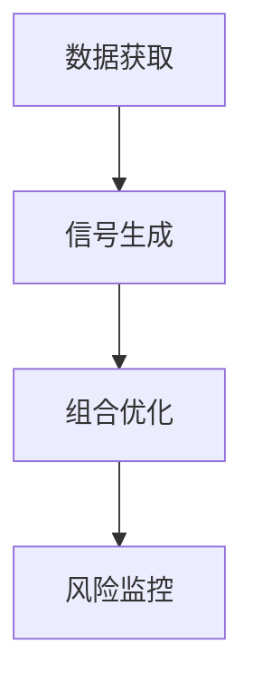

                 


# 绝对收益策略：追求不依赖市场的稳定回报

---

## 关键词：
绝对收益策略，稳定回报，风险管理，量化投资，多因子模型，夏普比率，风险调整收益

---

## 摘要：
绝对收益策略是一种追求独立于市场波动的稳定回报的投资方法。本文从绝对收益策略的核心概念出发，详细探讨其数学模型、算法原理、系统架构及实战应用。通过多因子模型的分解、风险调整后的收益计算、均值-方差优化等方法，结合具体案例分析，帮助读者理解如何在实际投资中实现稳定回报。文章最后总结了最佳实践和注意事项，为投资者提供实用的指导。

---

# 第一部分：绝对收益策略概述

## 第1章：绝对收益策略的定义与特点

### 1.1 绝对收益的定义
绝对收益是指投资组合在一定时间内的回报，以货币单位或百分比表示，不依赖于市场基准。例如，一个投资组合在一年内增长10%，则其绝对收益为10%，无论市场整体表现如何。

### 1.2 绝对收益与相对收益的区别
- **相对收益**：以市场基准为参照点，衡量投资组合的表现，例如“跑赢市场”或“跑输市场”。
- **绝对收益**：独立于市场基准，关注投资组合自身的回报。

### 1.3 绝对收益策略的核心特点
1. **独立性**：不依赖市场波动，追求稳定回报。
2. **风险管理**：通过量化方法控制风险，避免重大损失。
3. **多因子模型**：结合多个因子（如价值、动量、流动性等）进行收益预测。

---

## 第2章：绝对收益策略的背景与意义

### 2.1 传统投资策略的局限性
- **市场依赖性**：传统相对收益策略容易受到市场波动的影响。
- **收益不稳定**：在市场低迷时，相对收益可能为负。

### 2.2 绝对收益策略的兴起
- 随着量化投资的发展，绝对收益策略逐渐受到重视。
- 对冲基金和机构投资者广泛采用绝对收益策略。

### 2.3 绝对收益在投资组合中的作用
- 作为投资组合的一部分，提供稳定的回报来源。
- 降低整体投资组合的波动性。

---

## 第3章：绝对收益策略的应用场景

### 3.1 机构投资者的应用
- 用于对冲基金、私募基金等追求绝对回报的机构。
- 作为投资组合的一部分，降低整体风险。

### 3.2 个人投资者的应用
- 适合风险厌恶型投资者，追求稳定的收益。
- 用于个人财富保值和增值。

### 3.3 不同市场环境下的策略选择
- **牛市**：结合绝对收益策略和相对收益策略，放大收益。
- **熊市**：依靠绝对收益策略，降低损失。

---

# 第二部分：绝对收益策略的核心原理

## 第4章：绝对收益的多因子模型

### 4.1 多因子模型的基本原理
- 将收益分解为多个因子的线性组合。
- 常见因子：市值（Size）、价值（Value）、动量（Momentum）、流动性（Liquidity）。

### 4.2 收益来源的多因子分解
- **市值因子**：小盘股通常具有更高的收益潜力。
- **价值因子**：低市盈率或低市净率的股票可能被低估。
- **动量因子**：过去表现好的股票未来可能继续表现良好。

### 4.3 风险控制的多因子模型
- 使用因子模型量化风险。
- 通过调整因子权重实现风险控制。

---

## 第5章：绝对收益的数学模型与算法

### 5.1 夏普比率与绝对收益
- 夏普比率衡量投资回报相对于其风险的表现：
$$ \text{夏普比率} = \frac{E[r_p - r_f]}{\sigma_p} $$
- 其中，$E[r_p - r_f]$ 是投资组合超额收益的期望值，$\sigma_p$ 是投资组合的波动率。

### 5.2 风险调整后的收益模型
- 风险调整后收益公式：
$$ \text{风险调整后收益} = E[r] - \lambda \sigma^2 $$
- 其中，$\lambda$ 是风险厌恶系数。

### 5.3 均值-方差优化的绝对收益模型
- 通过优化算法找到收益和风险的最佳平衡点。

---

## 第6章：绝对收益策略的系统架构

### 6.1 系统功能设计
- 数据获取模块：获取历史价格、财务数据等。
- 信号生成模块：基于多因子模型生成投资信号。
- 组合优化模块：优化投资组合，实现风险调整后的收益。
- 风险监控模块：实时监控投资组合的风险。

### 6.2 系统架构设计


### 6.3 系统接口设计
- 数据接口：与数据源对接，获取所需数据。
- 信号接口：将信号传递给交易系统。
- 风险接口：实时监控并调整投资组合。

---

## 第7章：绝对收益策略的项目实战

### 7.1 环境安装
- 安装Python和相关库（如Pandas、NumPy、Scikit-learn）。

### 7.2 核心代码实现
```python
import pandas as pd
import numpy as np
from sklearn.linear_model import LinearRegression

# 示例：基于动量因子的绝对收益策略
def momentum_strategy(prices, window=20):
    # 计算动量因子
    momentum = prices.rolling(window).mean().shift(1)
    # 生成信号
    signal = momentum > np.percentile(momentum, 75)
    return signal
```

### 7.3 实际案例分析
- 数据来源：某股票的历史价格数据。
- 模型训练：使用动量因子进行预测。
- 组合优化：优化投资组合，实现最大夏普比率。

---

## 第8章：绝对收益策略的最佳实践

### 8.1 小结
- 绝对收益策略通过多因子模型和风险控制，实现稳定回报。
- 在不同市场环境下，灵活调整策略。

### 8.2 注意事项
- 风险控制是关键，避免重大损失。
- 定期调整投资组合，适应市场变化。

### 8.3 拓展阅读
- 《投资学》：夏普、约翰逊等著。
- 《Python金融计算》：克里斯托弗·格林著。

---

## 作者：AI天才研究院（AI Genius Institute） & 禅与计算机程序设计艺术（Zen And The Art of Computer Programming）

