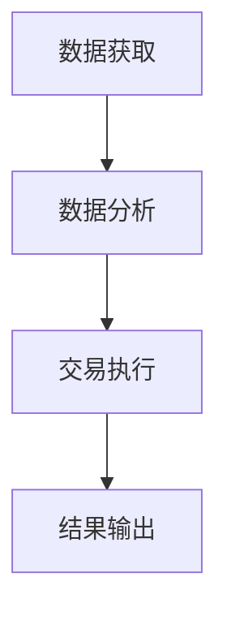
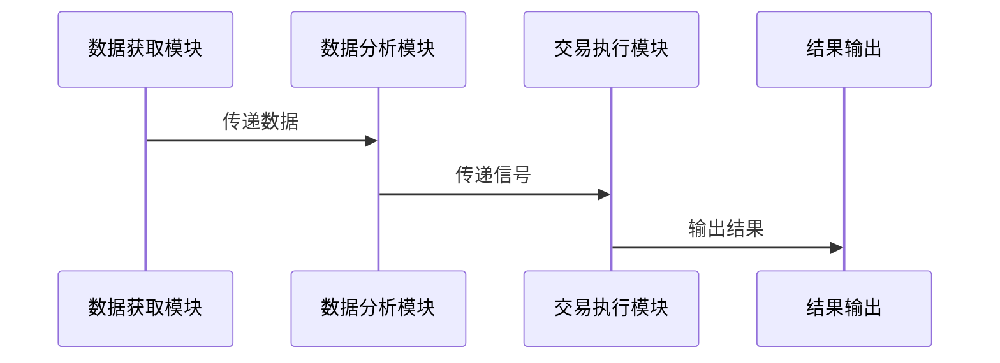

                 


# 统计套利：利用价格偏离进行中性市场投资

---

## 关键词
统计套利，市场中性，均值回归，配对交易，风险管理，量化投资，套利机会

---

## 摘要
统计套利是一种利用市场中价格偏离进行投资的策略，其核心思想是通过构建市场中性组合，捕捉短期价格波动带来的套利机会。本文将从统计套利的基本概念、数学模型、实际应用等方面展开分析，深入探讨其原理、策略设计以及风险管理。通过实例分析和代码实现，帮助读者理解如何在实际投资中应用统计套利策略。

---

# 第一部分: 统计套利基础

## 第1章: 统计套利概述

### 1.1 统计套利的背景与定义

#### 1.1.1 统计套利的背景
统计套利是一种基于统计学和数学模型的投资策略，其核心思想是通过寻找市场中价格偏离均衡状态的机会，进行套利交易以获利。随着金融市场的发展，价格波动的复杂性和高频交易的兴起，统计套利逐渐成为量化投资中的重要方法之一。

#### 1.1.2 统计套利的定义
统计套利是指通过分析金融资产的价格波动，利用统计模型预测价格的短期偏离，并在价格回归均衡时进行交易以获利。与传统套利不同，统计套利依赖于概率和统计分析，而非确定性的套利机会。

#### 1.1.3 统计套利的核心概念与特点
- **市场中性**：统计套利的核心是构建市场中性组合，即组合的收益与市场整体波动无关。
- **均值回归**：价格会回归其历史均值，这是统计套利的重要假设。
- **风险中性**：通过分散化投资降低特定风险，专注于捕捉系统性机会。

### 1.2 市场中性策略

#### 1.2.1 市场中性策略的定义
市场中性策略是指通过构造一个与市场指数无关的组合，使组合的收益不受市场整体波动影响。这种策略通常用于对冲基金和量化投资中。

#### 1.2.2 市场中性策略的核心思想
- 构造一个与市场指数无关的组合，使组合的贝塔值接近零。
- 通过多空配对交易，捕捉市场中价格的短期偏离。

#### 1.2.3 市场中性策略的应用场景
- 股票市场：利用个股与指数的偏离进行套利。
- 期货市场：利用基差的短期波动进行套利。
- 债券市场：利用收益率曲线的波动进行套利。

### 1.3 统计套利与其他投资策略的区别

#### 1.3.1 统计套利与价值投资的区别
- **价值投资**：基于对公司内在价值的分析，寻找被低估的资产进行投资。
- **统计套利**：基于价格波动和统计模型，寻找短期套利机会。

#### 1.3.2 统计套利与趋势投资的区别
- **趋势投资**：基于价格的长期趋势，寻找持续的上涨或下跌趋势。
- **统计套利**：基于价格的短期偏离，寻找均值回归的机会。

#### 1.3.3 统计套利与套利策略的对比
- **传统套利**：基于确定性的套利机会，如跨市场套利。
- **统计套利**：基于概率的套利机会，利用统计模型寻找可能的套利机会。

---

## 第2章: 套利机会的来源与分类

### 2.1 套利机会的来源

#### 2.1.1 市场定价偏差
- 市场中某些资产的价格偏离其真实价值，为套利提供了机会。
- 例如，股票价格的短期波动可能偏离其合理估值。

#### 2.1.2 市场流动性不足
- 在流动性不足的市场中，某些资产的价格可能被高估或低估。
- 例如，小盘股在流动性不足时可能被低估。

#### 2.1.3 市场结构差异
- 不同市场的价格差异可能为套利提供机会。
- 例如，A股和H股的价格差异可能为跨市场套利提供机会。

### 2.2 套利机会的分类

#### 2.2.1 跨市场套利
- 利用不同市场中同一资产的价格差异进行套利。
- 例如，利用A股和H股的价格差异进行套利。

#### 2.2.2 跨期套利
- 利用同一资产在不同时间点的价格差异进行套利。
- 例如，利用期货和现货的价格差异进行套利。

#### 2.2.3 股票市场内部套利
- 利用股票价格的短期波动进行套利。
- 例如，利用股票的短期超涨或超跌进行配对交易。

---

## 第3章: 统计套利的核心原理

### 3.1 统计套利的基本原理

#### 3.1.1 均值回归理论
- 均值回归理论认为，价格会回归其历史均值。
- 在统计套利中，均值回归是核心假设之一。

#### 3.1.2 配对交易策略
- 配对交易策略是指将两个相关资产配对，利用它们的价格差异进行交易。
- 例如，将两只相关股票配对，当一只股票价格过高时，买入价格低的股票，卖出价格高的股票。

#### 3.1.3 市场中性组合构建
- 构建一个与市场指数无关的组合，使组合的收益不受市场整体波动影响。
- 例如，利用因子模型构建一个市场中性组合。

### 3.2 统计套利的数学模型

#### 3.2.1 均值回归模型
- 假设价格会回归其历史均值。
- 数学公式：$r_t = \alpha + \beta r_{t-1} + \epsilon_t$
- 其中，$\alpha$ 是截距，$\beta$ 是回归系数，$\epsilon_t$ 是误差项。

#### 3.2.2 配对交易模型
- 配对交易模型的核心是利用两个资产的价格差异进行交易。
- 数学公式：$z_t = \frac{p_t}{q_t}$
- 其中，$p_t$ 是资产的价格，$q_t$ 是另一个资产的价格，$z_t$ 是标准化的价格差异。

#### 3.2.3 市场中性组合的构建公式
- 市场中性组合的构建公式通常基于因子模型。
- 数学公式：$w_i = \frac{1}{N} \sum_{i=1}^N \frac{x_i}{\sqrt{\sigma_i^2}}$
- 其中，$x_i$ 是因子值，$\sigma_i^2$ 是因子的方差。

---

## 第4章: 统计套利的风险与挑战

### 4.1 统计套利的主要风险

#### 4.1.1 市场风险
- 市场波动可能影响套利组合的收益。
- 例如，市场下跌可能导致套利组合的损失。

#### 4.1.2 流动性风险
- 套利组合可能面临流动性不足的风险。
- 例如，某些资产的流动性不足可能导致无法及时买卖。

#### 4.1.3 模型风险
- 统计套利依赖于数学模型，模型失效可能导致套利失败。
- 例如，均值回归模型可能在极端市场条件下失效。

### 4.2 统计套利的挑战

#### 4.2.1 数据质量与获取难度
- 套利需要高质量的数据，但数据获取可能面临困难。
- 例如，某些市场的数据可能不完整或不可靠。

#### 4.2.2 市场变化与模型失效
- 市场环境的变化可能导致统计套利模型失效。
- 例如，金融危机可能导致均值回归假设失效。

#### 4.2.3 竞争加剧与套利机会减少
- 随着套利策略的普及，套利机会可能减少。
- 例如，高频交易的普及可能导致套利机会减少。

---

# 第二部分: 统计套利的数学模型与算法

## 第5章: 统计套利的数学模型

### 5.1 均值回归模型

#### 5.1.1 均值回归的定义与假设
- 均值回归假设价格会回归其历史均值。
- 数学公式：$r_t = \alpha + \beta r_{t-1} + \epsilon_t$

#### 5.1.2 均值回归的数学公式
$$ r_t = \alpha + \beta r_{t-1} + \epsilon_t $$

#### 5.1.3 均值回归的实例分析
- 例如，假设某股票的价格在过去一个月中偏离其历史均值，统计套利者可以利用均值回归模型预测其价格回归均值的机会。

---

## 第6章: 配对交易模型

### 6.1 配对交易策略的数学模型

#### 6.1.1 配对交易模型的定义
- 配对交易模型是利用两个资产的价格差异进行交易。
- 数学公式：$z_t = \frac{p_t}{q_t}$

#### 6.1.2 配对交易模型的数学公式
$$ z_t = \frac{p_t}{q_t} $$

#### 6.1.3 配对交易模型的实例分析
- 例如，假设股票A和股票B的价格差异偏离历史均值，统计套利者可以买入价格低的股票，卖出价格高的股票。

---

## 第7章: 市场中性组合的构建

### 7.1 市场中性组合的构建公式

#### 7.1.1 市场中性组合的定义
- 市场中性组合是与市场指数无关的组合。
- 数学公式：$w_i = \frac{1}{N} \sum_{i=1}^N \frac{x_i}{\sqrt{\sigma_i^2}}$

#### 7.1.2 市场中性组合的数学公式
$$ w_i = \frac{1}{N} \sum_{i=1}^N \frac{x_i}{\sqrt{\sigma_i^2}} $$

#### 7.1.3 市场中性组合的实例分析
- 例如，假设某指数包含多只股票，统计套利者可以利用因子模型构建一个市场中性组合。

---

# 第三部分: 统计套利的系统架构与实现

## 第8章: 统计套利的系统架构

### 8.1 系统功能设计

#### 8.1.1 数据获取模块
- 数据获取模块负责获取金融市场的数据。
- 包括股票价格、指数价格、期货价格等。

#### 8.1.2 数据分析模块
- 数据分析模块负责对数据进行分析，构建统计套利模型。
- 包括均值回归模型、配对交易模型等。

#### 8.1.3 交易执行模块
- 交易执行模块负责根据模型的预测结果执行交易。
- 包括多空配对交易、市场中性组合构建等。

### 8.2 系统架构设计

#### 8.2.1 系统架构图


#### 8.2.2 系统交互图


---

## 第9章: 统计套利的项目实战

### 9.1 环境安装

#### 9.1.1 安装Python环境
- 使用Anaconda安装Python环境。
- 安装必要的库，如pandas、numpy、scipy等。

#### 9.1.2 数据获取工具
- 使用Yahoo Finance获取股票数据。
- 使用pandas数据框进行数据处理。

### 9.2 核心实现源代码

#### 9.2.1 均值回归模型的实现
```python
import pandas as pd
import numpy as np
from statsmodels.tsa.arima_model import ARIMA

# 数据获取
data = pd.read_csv('stock_data.csv')

# 均值回归模型
model = ARIMA(data['price'], order=(1, 1, 0))
model_fit = model.fit()

# 预测价格
forecast = model_fit.forecast(steps=5)
```

#### 9.2.2 配对交易模型的实现
```python
import pandas as pd
import numpy as np

# 数据获取
data = pd.read_csv('stock_data.csv')

# 配对交易模型
def calculate_zscore(data, window=20):
    mean = data['price'].rolling(window).mean()
    std = data['price'].rolling(window).std()
    zscore = (data['price'] - mean) / std
    return zscore

zscore = calculate_zscore(data)
```

---

## 第10章: 统计套利的风险管理

### 10.1 风险管理策略

#### 10.1.1 风险价值（VaR）
- 风险价值是指在一定置信水平下，投资组合可能遭受的最大损失。
- 数学公式：VaR = Value at Risk

#### 10.1.2 波动率控制
- 通过控制投资组合的波动率来降低风险。
- 数学公式：Volatility = Standard Deviation of Returns

#### 10.1.3 仓位管理
- 通过调整仓位大小来控制风险。
- 数学公式：Position Size = Risk Capital / Risk Per Unit

---

## 第11章: 统计套利的优化与拓展

### 11.1 统计套利的优化策略

#### 11.1.1 动态调整模型
- 根据市场变化动态调整统计套利模型的参数。
- 例如，动态调整均值回归模型的窗口大小。

#### 11.1.2 多因子模型
- 使用多个因子构建市场中性组合。
- 例如，使用市值、价值、动量等多个因子进行组合投资。

### 11.2 统计套利的拓展应用

#### 11.2.1 高频交易
- 利用高频数据进行统计套利。
- 例如，利用高频数据捕捉市场的短期波动。

#### 11.2.2 跨资产套利
- 利用不同资产的价格差异进行套利。
- 例如，利用股票、期货、期权等多种资产进行套利。

---

## 第12章: 统计套利的案例分析

### 12.1 案例分析

#### 12.1.1 配对交易案例
- 假设股票A和股票B的价格差异偏离历史均值，统计套利者可以买入价格低的股票A，卖出价格高的股票B。

#### 12.1.2 市场中性组合案例
- 假设某指数包含多只股票，统计套利者可以利用因子模型构建一个市场中性组合，使组合的收益不受市场整体波动影响。

---

## 第13章: 统计套利的总结与展望

### 13.1 总结

#### 13.1.1 统计套利的核心思想
- 利用价格偏离进行套利，构建市场中性组合。

#### 13.1.2 统计套利的关键点
- 均值回归理论、配对交易策略、市场中性组合构建。

#### 13.1.3 统计套利的优缺点
- 优点：风险可控、收益稳定。
- 缺点：依赖于统计模型，模型失效可能导致损失。

### 13.2 未来展望

#### 13.2.1 统计套利的未来发展
- 随着人工智能和大数据技术的发展，统计套利将更加智能化和自动化。

#### 13.2.2 统计套利的创新方向
- 利用机器学习算法优化统计套利模型。
- 利用区块链技术提升套利交易的效率和安全性。

---

## 作者：AI天才研究院/AI Genius Institute & 禅与计算机程序设计艺术 /Zen And The Art of Computer Programming

---

以上是《统计套利：利用价格偏离进行中性市场投资》的技术博客文章的完整目录大纲。文章内容涵盖统计套利的基本概念、数学模型、系统架构、项目实战以及风险管理等方面，通过详细讲解和实例分析，帮助读者全面理解统计套利的核心思想和实际应用。

