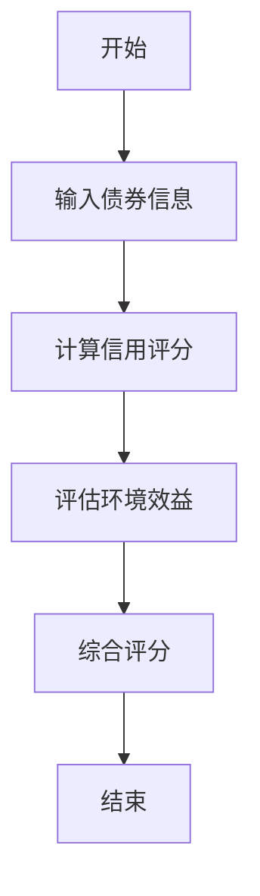

                 


# 绿色债券投资：支持可持续发展的固定收益工具

## 关键词：绿色债券，可持续发展，固定收益工具，ESG投资，环境效益，金融市场，风险管理

## 摘要：绿色债券作为一种新兴的固定收益工具，正在成为支持可持续发展的重要金融手段。本文将深入探讨绿色债券的定义、分类、市场现状及其环境效益，分析绿色债券的投资策略和风险管理方法。通过实际案例分析，本文将展示绿色债券在支持环保项目中的实际应用，为投资者提供科学的决策参考。文章还结合了绿色债券的评级算法和系统架构设计，为读者提供了全面而深入的技术视角。

---

# 正文

## 第一部分：绿色债券投资的背景与核心概念

### 第1章：绿色债券的基本概念与背景

#### 1.1 什么是绿色债券？

绿色债券是一种债务融资工具，其募集资金主要用于支持环保、气候变化应对和可持续发展项目。与传统债券相比，绿色债券具有鲜明的环境效益导向。

#### 1.2 绿色债券的起源与发展

绿色债券的概念最早可以追溯到20世纪70年代，但真正的发展始于21世纪初。随着全球气候变化问题的加剧，绿色债券作为一种支持可持续发展的工具，得到了快速发展。

#### 1.3 绿色债券与可持续发展的关系

绿色债券通过支持环保项目，促进能源转型、减少碳排放，为实现联合国可持续发展目标（SDGs）提供了重要的资金支持。

---

### 第2章：绿色债券的核心概念与框架

#### 2.1 绿色债券的分类

绿色债券可以根据不同的标准进行分类，包括发行主体、资金用途、债券期限等。常见的分类包括：

- **国际绿色债券**：遵循气候债券倡议组织（CBI）等国际标准。
- **国内绿色债券**：符合中国绿色债券标准等地方性标准。
- **贴标绿色债券**：债券发行时明确标注为绿色债券。

#### 2.2 绿色债券的发行与投资框架

绿色债券的发行流程包括项目筛选、评级、发行、投资和监管等环节。投资者在选择绿色债券时，需要关注债券的信用风险、市场风险和环境效益。

---

## 第二部分：绿色债券的评估与定价

### 第3章：绿色债券的评级与定价

#### 3.1 绿色债券评级模型的算法原理

绿色债券评级模型通过分析债券的信用风险、环境效益和社会影响，对债券进行综合评分。以下是模型的流程图：



#### 3.2 绿色债券评级模型的Python实现

以下是绿色债券评级模型的Python代码示例：

```python
def green_bond_rating(bond_info):
    # 计算信用评分
    credit_score = bond_info['credit_rating']
    environmental_impact = bond_info['environmental效益']
    social_impact = bond_info['social效益']
    
    # 综合评分公式
    total_score = 0.5 * credit_score + 0.3 * environmental_impact + 0.2 * social_impact
    return total_score
```

#### 3.3 绿色债券定价的数学模型

绿色债券的定价可以基于以下公式：

$$ \text{债券价格} = \text{面值} \times \left(1 + \frac{\text{票面利率} \times \text{期限}}{1 + \text{市场利率}} \right) $$

---

## 第三部分：绿色债券投资的系统架构与实战

### 第4章：绿色债券评估系统的架构设计

#### 4.1 系统功能设计

绿色债券评估系统的功能模块包括：

- 数据采集：收集债券信息、市场数据和环境效益数据。
- 评级计算：应用绿色债券评级模型对债券进行评分。
- 投资建议：基于评级结果为投资者提供投资建议。

#### 4.2 系统架构设计

以下是绿色债券评估系统的架构图：

```mermaid
graph TD
    User --> Controller: 用户请求
    Controller --> Service: 服务调用
    Service --> Model: 模型计算
    Model --> Database: 数据查询
    Controller --> View: 页面渲染
```

---

### 第5章：绿色债券投资实战

#### 5.1 项目背景与目标

本案例将分析投资某绿色能源项目的情况，评估其环境效益和社会影响。

#### 5.2 投资策略与风险管理

在投资绿色债券时，需要考虑市场风险、信用风险和环境效益的可持续性。

---

## 第四部分：绿色债券投资的最佳实践

### 第6章：绿色债券投资的注意事项

#### 6.1 风险管理

绿色债券投资需要关注债券的信用风险、市场风险和环境效益的可持续性。

#### 6.2 市场趋势与政策影响

关注全球绿色债券市场的增长趋势和政策变化，选择具有长期投资价值的债券。

#### 6.3 长期投资价值

绿色债券作为ESG投资的一部分，具有长期的投资价值，符合可持续发展的趋势。

---

## 作者：AI天才研究院/AI Genius Institute & 禅与计算机程序设计艺术 /Zen And The Art of Computer Programming

---

通过以上分析，绿色债券作为一种支持可持续发展的固定收益工具，正在在全球范围内得到广泛应用。投资者在选择绿色债券时，需要结合环境效益、信用风险和社会影响，做出科学的投资决策。

