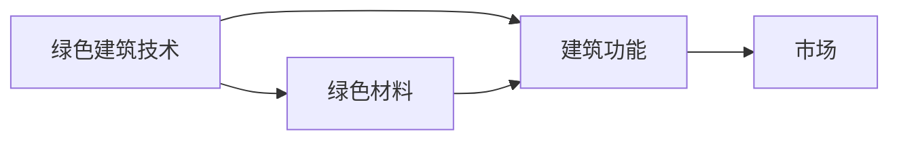
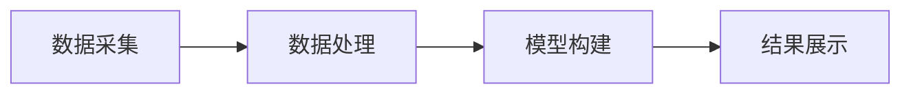
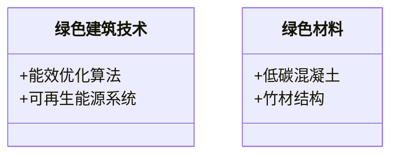
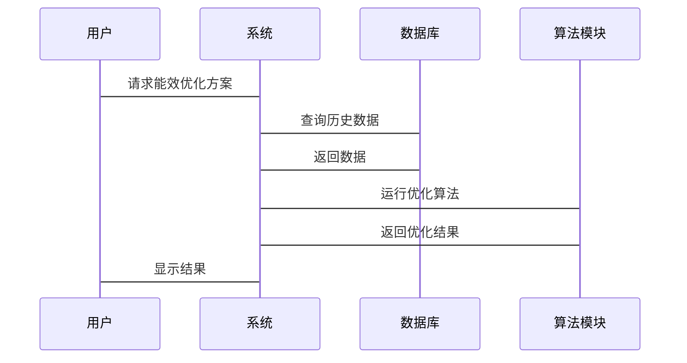

                 

# 绿色建筑技术与材料的市场增长潜力

> 关键词：绿色建筑、可持续发展、建筑技术、建筑材料、市场增长、环保技术

> 摘要：绿色建筑技术与材料作为推动可持续发展的重要组成部分，近年来在全球范围内得到了广泛关注。本文从绿色建筑的核心概念、技术与材料的内在联系、算法优化模型、系统架构设计、实际项目案例分析等方面，深入探讨绿色建筑技术与材料的市场增长潜力，为读者提供全面的分析和见解。

---

## 第一部分: 绿色建筑技术与材料的背景介绍

### 第1章: 绿色建筑技术与材料的背景介绍

#### 1.1 绿色建筑的核心概念
##### 1.1.1 绿色建筑的定义与内涵
绿色建筑是指在全生命周期内，最大限度地减少资源消耗和环境影响，同时提供健康舒适居住环境的建筑。其核心在于通过技术创新和材料优化，实现能源节约、碳排放降低和生态友好。

##### 1.1.2 绿色建筑技术的发展历程
绿色建筑的概念起源于20世纪70年代的能源危机，经历了从简单节能到全面可持续发展的演变。近年来，随着全球气候变化加剧，绿色建筑技术迅速发展，成为建筑行业转型的重要方向。

##### 1.1.3 绿色建筑与可持续发展的关系
绿色建筑是实现联合国可持续发展目标（SDGs）的重要途径，通过减少建筑全生命周期的环境负担，推动社会、经济和环境的协调发展。

#### 1.2 绿色建筑技术与材料的市场背景
##### 1.2.1 全球建筑行业的发展现状
全球建筑行业是碳排放的主要来源之一，传统建筑方式浪费资源、污染环境，亟需转型。绿色建筑技术的出现为行业提供了可持续发展的解决方案。

##### 1.2.2 绿色建筑市场的兴起与驱动因素
政策支持、环保意识增强、技术进步等因素共同推动了绿色建筑市场的快速发展。例如，许多国家实施绿色建筑认证体系（如LEED、BREEAM），进一步促进了市场增长。

##### 1.2.3 绿色建筑技术与材料的市场需求分析
随着环保法规的严格和消费者环保意识的提升，绿色建筑技术与材料的需求持续增长。市场研究机构预测，未来几年绿色建筑市场年增长率将超过8%。

#### 1.3 绿色建筑技术与材料的边界与外延
##### 1.3.1 绿色建筑技术的边界
绿色建筑技术不仅包括建筑本身的设计优化，还涉及施工过程中的节能减排技术。其外延扩展至智慧建筑、可再生能源等领域。

##### 1.3.2 绿色材料的分类与应用范围
绿色材料包括竹材、再生钢材、低碳混凝土等，广泛应用于建筑结构、保温隔热、装饰等多个方面。

##### 1.3.3 绿色建筑技术与材料的外延
绿色建筑技术与材料的应用已延伸至城市规划、交通系统等领域，推动了整体城市可持续发展。

#### 1.4 绿色建筑技术与材料的概念结构与核心要素
##### 1.4.1 绿色建筑技术的核心要素
绿色建筑技术的核心要素包括能效优化、可再生能源利用、雨水收集系统等。

##### 1.4.2 绿色材料的核心要素
绿色材料的核心要素包括低环境影响、可循环利用、高性能等。

##### 1.4.3 绿色建筑技术与材料的相互关系
绿色建筑技术与材料相辅相成，技术创新推动材料改进，材料升级促进技术优化，共同实现建筑的可持续目标。

---

## 第二部分: 绿色建筑技术与材料的核心概念与联系

### 第2章: 绿色建筑技术与材料的核心概念与联系

#### 2.1 绿色建筑技术的原理与特点
##### 2.1.1 绿色建筑技术的原理
绿色建筑技术通过优化建筑设计、采用可再生能源和高效设备，降低建筑能耗和环境影响。

##### 2.1.2 绿色建筑技术的特点
- 节能减排：通过被动设计（如自然采光、通风）和主动技术（如地源热泵）减少能源消耗。
- 循环利用：材料和资源的循环使用，减少浪费。
- 生态友好：保护和恢复建筑周边的自然环境。

#### 2.2 绿色材料的属性特征对比
##### 2.2.1 绿色材料的分类与属性特征
绿色材料可分为低碳材料（如再生混凝土）和环保材料（如竹材）。其属性特征包括低碳排放、可再生、无害化等。

##### 2.2.2 绿色材料与传统材料的对比分析
| 特性 | 绿色材料 | 传统材料 |
|------|-----------|-----------|
| 碳排放 | 低        | 高        |
| 循环性 | 高        | 低        |
| 环保性 | 优        | 一般      |

#### 2.3 绿色建筑技术与材料的ER实体关系图

---

## 第三部分: 绿色建筑技术与材料的算法原理讲解

### 第3章: 绿色建筑技术与材料的算法原理讲解

#### 3.1 绿色建筑技术与材料的优化算法
##### 3.1.1 线性规划模型
线性规划模型常用于优化建筑材料的使用和成本控制。

##### 3.1.2 线性回归模型
线性回归模型可用于预测绿色建筑市场的增长趋势。

##### 3.1.3 机器学习算法
机器学习算法可以帮助预测建筑能效和材料性能。

#### 3.2 算法原理的数学模型与公式
##### 3.2.1 线性规划模型
$$ \text{最大化} \quad c^T x $$
$$ \text{约束} \quad A x \leq b $$
$$ x \geq 0 $$

##### 3.2.2 线性回归模型
$$ y = \beta_0 + \beta_1 x + \epsilon $$

#### 3.3 算法原理的举例说明
##### 3.3.1 线性规划的应用案例
通过线性规划优化绿色建材的采购成本和库存管理。

##### 3.3.2 机器学习在绿色建筑预测中的应用
利用机器学习算法预测绿色建筑技术的市场渗透率。

---

## 第四部分: 绿色建筑技术与材料的系统分析与架构设计方案

### 第4章: 绿色建筑技术与材料的系统分析与架构设计方案

#### 4.1 系统分析
##### 4.1.1 绿色建筑技术与材料的系统分析框架
包括目标设定、数据收集、模型构建和结果分析。

##### 4.1.2 系统分析的关键指标
能效比、碳排放强度、材料循环利用率等。

#### 4.2 系统架构设计
##### 4.2.1 系统架构的模块划分
数据采集、数据处理、模型构建、结果展示。

##### 4.2.2 系统架构的Mermaid图

---

## 第五部分: 绿色建筑技术与材料的项目实战

### 第5章: 绿色建筑技术与材料的项目实战

#### 5.1 项目介绍
##### 5.1.1 项目背景
某绿色建筑项目采用新型低碳材料和智能控制系统，实现能源消耗降低30%。

##### 5.1.2 项目目标
通过技术创新实现建筑能效优化和环境友好。

#### 5.2 系统功能设计
##### 5.2.1 领域模型Mermaid类图

#### 5.3 系统接口设计
##### 5.3.1 系统接口设计
API接口用于数据传输和系统控制。

##### 5.3.2 系统交互Mermaid序列图

#### 5.4 项目小结
通过技术创新和材料优化，绿色建筑项目实现了显著的节能减排效果，市场反响良好。

---

## 第六部分: 总结与展望

### 第6章: 总结与展望

#### 6.1 最佳实践 tips
- 优先选择认证的绿色建材。
- 采用智能化建筑管理系统。

#### 6.2 小结
绿色建筑技术与材料的市场增长潜力巨大，技术创新和政策支持是推动其发展的关键因素。

#### 6.3 注意事项
在实际应用中，需综合考虑成本、性能和环保效果。

#### 6.4 拓展阅读
建议读者进一步阅读绿色建筑相关的国际标准和最新研究成果。

---

## 作者：AI天才研究院/AI Genius Institute & 禅与计算机程序设计艺术 /Zen And The Art of Computer Programming

---

以上是《绿色建筑技术与材料的市场增长潜力》的技术博客文章大纲和内容。

