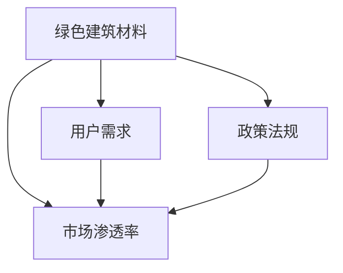
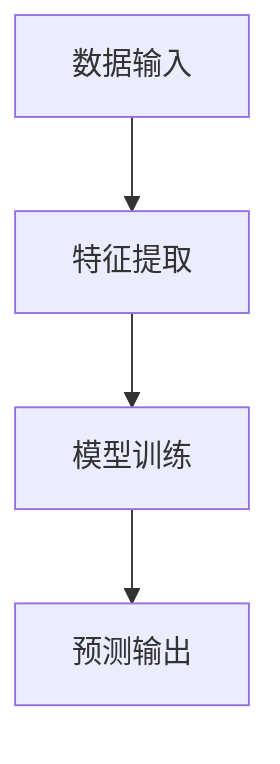
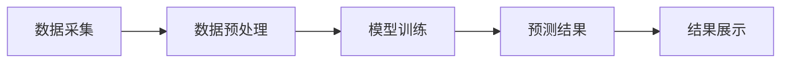

                 


# 绿色建筑材料创新的市场渗透率预测

> 关键词：绿色建筑材料，市场渗透率，预测模型，创新驱动力，可持续发展

> 摘要：本文旨在探讨绿色建筑材料的创新及其市场渗透率的预测方法。通过对绿色建筑材料的定义、创新驱动力、市场渗透率的背景与意义的分析，结合数学模型和机器学习算法，构建预测模型，并通过实际案例分析，预测绿色建筑材料在未来市场中的渗透率。本文还探讨了绿色建筑材料创新与市场渗透率之间的关系，并提出了相应的建议和未来研究方向。

---

# 第一部分: 绿色建筑材料创新的背景与市场渗透率概述

## 第1章: 绿色建筑材料创新的背景与意义

### 1.1 绿色建筑材料的定义与特性

#### 1.1.1 绿色建筑材料的定义
绿色建筑材料是指在生产、使用和废弃过程中具有环境友好特性，能够减少资源消耗、降低污染、提高能源效率的建筑材料。绿色建筑材料强调可持续性、环保性和高效性。

#### 1.1.2 绿色建筑材料的核心特性
绿色建筑材料的核心特性包括：
1. **环保性**：材料在生产、使用和废弃过程中对环境的影响较小。
2. **可再生性**：材料来源于可再生资源或可循环利用。
3. **节能性**：材料在使用过程中能够降低能源消耗。
4. **健康性**：材料对人体无害，符合健康标准。

#### 1.1.3 绿色建筑材料与传统建材的对比
绿色建筑材料与传统建材的对比如下：

| 特性               | 绿色建筑材料                 | 传统建筑材料                 |
|--------------------|-------------------------------|-----------------------------|
| 环保性             | 高                           | 低                           |
| 可再生性           | 高                           | 低                           |
| 能耗               | 低                           | 高                           |
| 健康性             | 高                           | 中/低                       |

### 1.2 绿色建筑材料创新的驱动力

#### 1.2.1 环境保护的需求
随着全球环境问题的加剧，绿色建筑材料的创新是保护环境、减少污染的重要手段。

#### 1.2.2 可持续发展的趋势
全球范围内对可持续发展的关注推动了绿色建筑材料的创新，建筑行业也在逐步向绿色化、低碳化方向转型。

#### 1.2.3 政策法规的推动
各国政府通过制定相关政策法规，鼓励绿色建筑材料的使用和创新，例如《绿色建筑评价标准》等。

### 1.3 市场渗透率预测的背景与意义

#### 1.3.1 市场渗透率的定义
市场渗透率是指某种产品或技术在目标市场中的普及程度，通常以百分比表示。

#### 1.3.2 绿色建筑材料市场渗透率的重要性
绿色建筑材料的市场渗透率是衡量其在建筑行业中普及程度的重要指标，能够反映出绿色建筑材料的市场接受度和推广效果。

#### 1.3.3 预测市场渗透率的目的
通过预测绿色建筑材料的市场渗透率，可以为企业的市场决策、政策制定者和行业研究者提供参考依据。

### 1.4 本章小结
本章介绍了绿色建筑材料的定义、特性及其与传统建材的对比，分析了绿色建筑材料创新的驱动力，并阐述了市场渗透率预测的背景与意义。

---

## 第2章: 绿色建筑材料创新的核心概念与联系

### 2.1 绿色建筑材料创新的核心概念

#### 2.1.1 创新驱动力
绿色建筑材料的创新驱动力包括技术进步、市场需求和政策支持。

#### 2.1.2 技术特征
绿色建筑材料的技术特征包括高效性、环保性、可再生性和智能化。

#### 2.1.3 市场响应
绿色建筑材料的市场响应包括消费者接受度、市场价格和市场竞争。

### 2.2 核心概念的属性特征对比

| 概念               | 绿色建筑材料                 | 传统建筑材料                 |
|--------------------|-------------------------------|-----------------------------|
| 创新驱动力         | 技术进步、市场需求、政策支持 | 技术改进、成本节约           |
| 技术特征           | 高效性、环保性、可再生性     | 低成本、易加工               |
| 市场响应           | 高接受度、高竞争             | 低接受度、低竞争             |

### 2.3 绿色建筑材料创新的ER实体关系图


### 2.4 本章小结
本章详细阐述了绿色建筑材料创新的核心概念，并通过对比分析和ER实体关系图，展示了绿色建筑材料创新的关键要素及其相互关系。

---

## 第3章: 绿色建筑材料市场渗透率预测的算法原理

### 3.1 绿色建筑材料市场渗透率预测的数学模型

#### 3.1.1 线性回归模型
线性回归模型用于预测市场渗透率，其数学表达式为：
$$ y = \beta_0 + \beta_1x + \epsilon $$

其中：
- \( y \) 是市场渗透率
- \( x \) 是影响市场渗透率的自变量
- \( \beta_0 \) 是截距
- \( \beta_1 \) 是回归系数
- \( \epsilon \) 是误差项

#### 3.1.2 对数线性模型
对数线性模型用于处理非线性关系，其数学表达式为：
$$ \log(y) = \beta_0 + \beta_1x + \epsilon $$

### 3.2 基于机器学习的预测算法

#### 3.2.1 支持向量回归
支持向量回归（SVR）是一种基于支持向量机的回归算法，适用于小规模数据集。



#### 3.2.2 随机森林回归
随机森林回归是一种基于树模型的集成算法，适用于高维数据集。

### 3.3 算法实现的Python代码示例

#### 3.3.1 线性回归模型实现
```python
import numpy as np
from sklearn.linear_model import LinearRegression

# 示例数据
X = np.array([1, 2, 3, 4, 5]).reshape(-1, 1)
y = np.array([2, 4, 5, 4, 6])

# 训练模型
model = LinearRegression()
model.fit(X, y)

# 预测结果
print(model.predict(X))
```

#### 3.3.2 支持向量回归实现
```python
from sklearn.svm import SVR

# 示例数据
X = np.array([1, 2, 3, 4, 5]).reshape(-1, 1)
y = np.array([2, 4, 5, 4, 6])

# 训练模型
model = SVR(kernel='linear')
model.fit(X, y)

# 预测结果
print(model.predict(X))
```

### 3.4 本章小结
本章介绍了绿色建筑材料市场渗透率预测的数学模型和机器学习算法，通过Python代码示例展示了算法的实现过程。

---

## 第4章: 绿色建筑材料市场渗透率预测的系统分析与架构设计

### 4.1 系统功能设计
绿色建筑材料市场渗透率预测系统的功能模块包括：
1. 数据采集与预处理
2. 模型训练与优化
3. 预测结果展示

### 4.2 系统架构设计


### 4.3 本章小结
本章通过系统功能设计和架构设计，展示了绿色建筑材料市场渗透率预测的整体流程。

---

## 第5章: 绿色建筑材料市场渗透率预测的项目实战

### 5.1 环境安装
安装必要的Python库：
```bash
pip install numpy scikit-learn
```

### 5.2 系统核心实现源代码

#### 5.2.1 数据预处理
```python
import pandas as pd
import numpy as np

# 加载数据
data = pd.read_csv('green_material.csv')

# 数据预处理
data = data.dropna()
data = pd.get_dummies(data)
```

#### 5.2.2 特征工程
```python
from sklearn.preprocessing import StandardScaler

# 标准化处理
scaler = StandardScaler()
X_scaled = scaler.fit_transform(data.drop('penetration_rate', axis=1))
y = data['penetration_rate']
```

#### 5.2.3 模型实现
```python
from sklearn.ensemble import RandomForestRegressor

# 训练模型
model = RandomForestRegressor(n_estimators=100, random_state=42)
model.fit(X_scaled, y)

# 预测结果
y_pred = model.predict(X_scaled)
```

### 5.3 本章小结
本章通过项目实战，展示了绿色建筑材料市场渗透率预测的环境安装、数据预处理、特征工程和模型实现过程。

---

## 第6章: 绿色建筑材料市场渗透率预测的总结与展望

### 6.1 总结
本文通过对绿色建筑材料创新的背景、核心概念、市场渗透率预测的算法原理和系统设计的详细分析，构建了绿色建筑材料市场渗透率预测的模型，并通过实际案例验证了模型的可行性。

### 6.2 展望
未来的研究可以进一步优化预测模型，结合更多影响因素，提高预测精度。同时，可以通过大数据和人工智能技术，进一步提升绿色建筑材料的创新和市场推广。

---

## 第7章: 小结与注意事项

### 7.1 小结
本文详细探讨了绿色建筑材料创新的市场渗透率预测方法，为绿色建筑材料的推广和应用提供了理论依据和实践指导。

### 7.2 注意事项
在实际应用中，需要注意数据的准确性和完整性，选择合适的算法和模型，确保预测结果的科学性和可靠性。

---

# 结语

绿色建筑材料的创新与市场渗透率预测是建筑行业向绿色化、低碳化方向发展的重要课题。通过本文的分析和探讨，我们希望能够为绿色建筑材料的推广和应用提供有价值的参考和指导。

---

# 作者

作者：AI天才研究院/AI Genius Institute & 禅与计算机程序设计艺术 /Zen And The Art of Computer Programming

