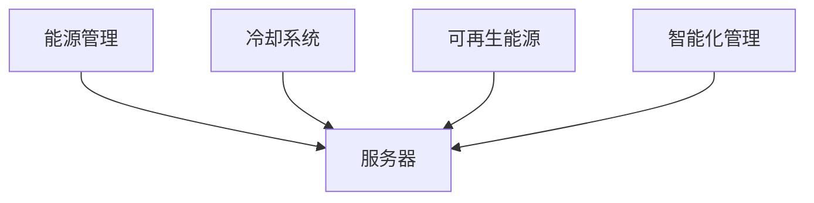
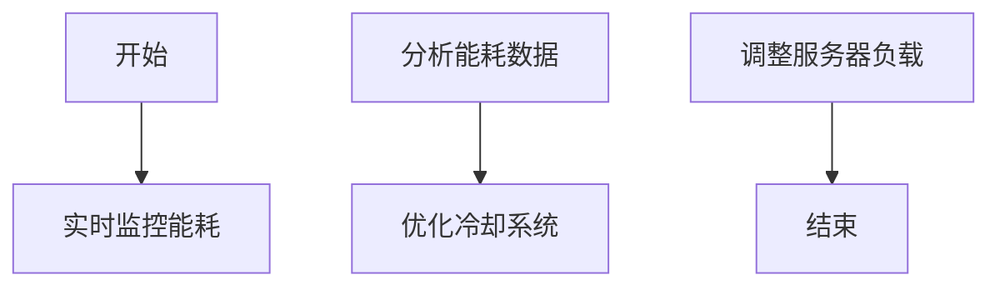
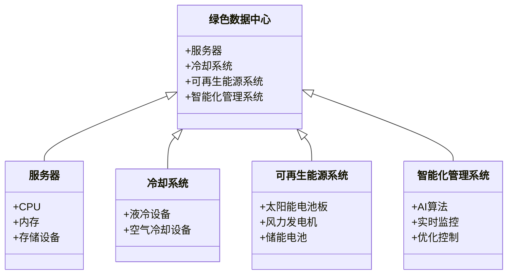
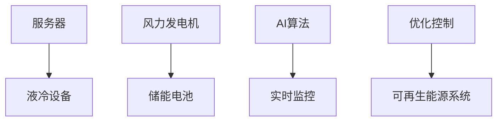
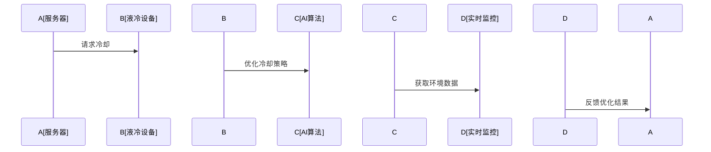

                 


# 绿色数据中心技术的市场增长与投资前景

## 关键词：绿色数据中心、能源效率、可再生能源、云计算、投资前景、可持续发展

## 摘要：  
绿色数据中心是现代信息技术发展与环境保护相结合的产物，其通过优化能源使用效率、采用可再生能源和智能化管理，实现了高效能与低排放的目标。本文从绿色数据中心的定义、核心技术创新、市场现状与增长预测、投资策略、系统架构设计以及未来发展趋势等多个维度进行深入分析，探讨绿色数据中心在技术与商业领域的双重价值，为投资者和相关从业者提供有价值的参考。

---

# 第1章 绿色数据中心技术的定义与背景

## 1.1 绿色数据中心的定义与特点

### 1.1.1 绿色数据中心的定义  
绿色数据中心是一种通过优化能源使用效率、减少碳排放和采用可再生能源，以实现可持续发展目标的数据中心。与传统数据中心相比，绿色数据中心更加注重节能减排和环境友好。

### 1.1.2 绿色数据中心的核心特点  
1. **高效能**：通过先进的冷却技术和能源管理算法，降低能源消耗。
2. **可再生能源**：广泛使用太阳能、风能等清洁能源，减少对化石燃料的依赖。
3. **智能化**：利用人工智能和大数据技术进行实时监控和优化管理。
4. **模块化设计**：支持灵活扩展，减少资源浪费。

### 1.1.3 绿色数据中心与传统数据中心的对比  
| 特性                | 绿色数据中心                 | 传统数据中心               |
|---------------------|-------------------------------|---------------------------|
| 能耗                | 低                          | 高                        |
| 可再生能源使用      | 高                          | 低                        |
| 智能化管理          | 高                          | 低                        |
| 环境影响            | 小                          | 大                        |

---

## 1.2 绿色数据中心的背景与发展趋势

### 1.2.1 全球能源危机与数据中心能耗问题  
随着全球数据量的指数级增长，数据中心的能耗问题日益突出。据统计，全球数据中心的能耗已占总电力消耗的5%以上，且仍在快速增长。

### 1.2.2 环境保护与可持续发展的需求  
全球气候变化和环境污染问题推动了绿色数据中心的发展。通过减少碳排放，绿色数据中心为实现联合国可持续发展目标（SDGs）做出了重要贡献。

### 1.2.3 绿色数据中心的技术进步与政策支持  
技术方面，液冷技术、AI优化算法等创新推动了绿色数据中心的进步。政策方面，各国政府通过补贴、税收优惠等措施鼓励绿色数据中心的建设。

---

## 1.3 绿色数据中心的市场现状与问题背景

### 1.3.1 全球绿色数据中心市场现状  
根据市场研究机构的数据，2022年全球绿色数据中心市场规模约为200亿美元，预计到2030年将增长至800亿美元，年复合增长率（CAGR）为15%。

### 1.3.2 绿色数据中心建设中的主要问题  
1. **高初期投资**：绿色数据中心的建设和设备采购成本较高。
2. **技术瓶颈**：部分技术如液冷技术仍处于试验阶段，尚未大规模应用。
3. **运维复杂性**：智能化管理需要高水平的技术支持和运维团队。

### 1.3.3 绿色数据中心的边界与外延  
绿色数据中心的边界包括硬件设施（如服务器、冷却系统）和软件系统（如能源管理平台）。其外延则涉及云计算、边缘计算等技术领域。

### 1.3.4 绿色数据中心的核心概念结构  
以下是绿色数据中心的核心要素组成分析：



---

# 第2章 绿色数据中心技术的核心原理

## 2.1 能源效率优化技术

### 2.1.1 数据中心能耗分析  
数据中心的主要能耗来自服务器、冷却系统和电源设备。通过优化这些部分的能效，可以显著降低整体能耗。

### 2.1.2 能源效率优化算法  
一种常见的优化算法如下：



### 2.1.3 热设计优化与液冷技术  
液冷技术通过液体循环冷却服务器，相比传统空气冷却技术能效提升30%以上。

---

## 2.2 可再生能源的应用

### 2.2.1 太阳能、风能等可再生能源的利用  
通过安装太阳能电池板和风力发电机，数据中心可以实现部分能源的自给自足。

### 2.2.2 可再生能源与电网的互动  
利用智能电网技术，数据中心可以将多余的可再生能源反馈给电网，实现能源的双向流动。

### 2.2.3 可再生能源的存储与管理  
通过电池储能系统（BESS），数据中心可以存储多余的可再生能源，确保能源供应的稳定性。

---

## 2.3 虚拟化与云计算技术

### 2.3.1 虚拟化技术在数据中心的应用  
虚拟化技术通过分割物理服务器资源，提高硬件利用率，减少服务器数量和能耗。

### 2.3.2 云计算对绿色数据中心的影响  
云计算通过资源共享和按需分配，显著降低了数据中心的能耗和碳排放。

### 2.3.3 虚拟化与云计算的协同优化  
通过结合虚拟化和云计算技术，数据中心可以实现资源的动态调整和优化分配。

---

## 2.4 绿色数据中心的智能化管理

### 2.4.1 AI 在能源管理中的应用  
人工智能算法可以通过分析历史数据和实时监控，预测能耗并优化能源使用策略。

### 2.4.2 智能冷却系统与设备  
智能冷却系统可以根据实时温度和负载情况，自动调整冷却设备的运行状态，减少能源浪费。

### 2.4.3 数据中心的实时监控与优化  
通过物联网（IoT）技术和大数据分析，数据中心可以实现设备的实时监控和智能化管理。

---

# 第3章 绿色数据中心技术的市场分析与投资策略

## 3.1 绿色数据中心市场的现状与增长预测

### 3.1.1 全球绿色数据中心市场规模  
根据市场研究机构的数据，2022年全球绿色数据中心市场规模约为200亿美元，预计到2030年将增长至800亿美元，年复合增长率（CAGR）为15%。

### 3.1.2 市场增长的驱动因素  
1. **政策支持**：各国政府通过补贴、税收优惠等措施鼓励绿色数据中心的建设。
2. **技术进步**：液冷技术、AI优化算法等创新推动了绿色数据中心的发展。
3. **企业需求**：越来越多的企业开始关注碳中和目标，推动绿色数据中心的市场需求。

### 3.1.3 区域市场分布与发展趋势  
目前，北美和欧洲是绿色数据中心的主要市场，亚太地区（特别是中国和印度）的市场需求增长最快。

---

## 3.2 绿色数据中心技术的核心竞争力分析

### 3.2.1 技术创新与成本优化  
绿色数据中心通过技术创新降低了能耗和运营成本，增强了市场竞争力。

### 3.2.2 可扩展性与灵活性  
绿色数据中心的设计支持灵活扩展，能够满足不同规模企业的需求。

### 3.2.3 品牌影响力与市场认可度  
随着绿色数据中心技术的成熟，越来越多的企业开始选择绿色数据中心，品牌影响力逐步提升。

---

## 3.3 绿色数据中心技术的投资策略与回报分析

### 3.3.1 投资回报周期  
绿色数据中心的初期投资较高，但通过节能减排和能源成本的降低，投资回报周期通常在5-7年。

### 3.3.2 投资风险与应对策略  
1. **技术风险**：技术创新是绿色数据中心发展的关键，需要持续投入研发。
2. **政策风险**：政策变化可能影响绿色数据中心的市场环境。
3. **市场风险**：市场需求波动可能影响投资回报。

### 3.3.3 投资机会分析  
1. **技术创新**：液冷技术、AI优化算法等领域存在较大的投资机会。
2. **区域市场**：亚太地区等新兴市场的需求增长快，值得重点关注。
3. **合作伙伴关系**：与政府、企业和技术供应商建立合作关系，降低投资风险。

---

# 第4章 绿色数据中心技术的系统架构设计

## 4.1 问题场景介绍

### 4.1.1 数据中心能耗过高  
传统数据中心的能耗问题日益突出，亟需通过技术创新实现节能减排。

### 4.1.2 可再生能源利用不足  
目前，数据中心主要依赖化石能源，可再生能源的利用比例较低。

### 4.1.3 系统智能化水平有限  
传统的数据中心管理系统智能化水平较低，难以实现高效的能源管理。

---

## 4.2 系统功能设计

### 4.2.1 领域模型设计  
以下是绿色数据中心的领域模型设计：



### 4.2.2 系统架构设计  
以下是绿色数据中心的系统架构设计：



### 4.2.3 接口设计与交互  
以下是绿色数据中心的接口设计：



---

## 4.3 系统实现与优化

### 4.3.1 环境安装与配置  
绿色数据中心的建设需要选择合适的地理位置，配备必要的硬件设施和软件系统。

### 4.3.2 核心实现源代码  
以下是绿色数据中心管理系统的部分源代码示例：

```python
# 绿色数据中心管理系统
class DataCenter:
    def __init__(self):
        self.servers = []
        self.cooling_system = CoolingSystem()
        self.renewable_energy = RenewableEnergy()
        self.ai_manager = AIManager()

    def manage_energy(self):
        # 使用AI算法优化能源管理
        self.ai_manager.optimize(self.servers, self.cooling_system, self.renewable_energy)

    def monitor_system(self):
        # 实时监控系统状态
        self.ai_manager.monitor(self.servers, self.cooling_system, self.renewable_energy)

# 定义冷却系统类
class CoolingSystem:
    def __init__(self):
        self.status = "idle"

    def cool_down(self):
        self.status = "cooling"

# 定义可再生能源类
class RenewableEnergy:
    def __init__(self):
        self.capacity = 0

    def generate_energy(self):
        self.capacity += 100

# 定义AI算法类
class AIManager:
    def __init__(self):
        pass

    def optimize(self, servers, cooling_system, renewable_energy):
        # 示例优化算法
        if servers.load > 80:
            cooling_system.cool_down()
            renewable_energy.generate_energy()
```

### 4.3.3 代码应用解读与分析  
上述代码展示了绿色数据中心管理系统的部分功能，包括服务器管理、冷却系统优化和可再生能源管理。AI算法通过优化冷却系统和可再生能源的使用，实现了能源的高效管理。

---

## 4.4 项目实战与案例分析

### 4.4.1 项目介绍  
某互联网公司建设了一个绿色数据中心，采用液冷技术、可再生能源和智能化管理系统，实现了能耗的大幅降低。

### 4.4.2 实施过程  
1. **需求分析**：确定绿色数据中心的设计目标和功能需求。
2. **系统设计**：完成系统架构设计和接口设计。
3. **设备采购**：采购服务器、液冷设备、太阳能电池板等硬件设备。
4. **系统集成**：完成硬件设备的安装和软件系统的集成。
5. **测试优化**：通过测试和优化，提升系统的性能和稳定性。

### 4.4.3 实施结果与分析  
通过绿色数据中心的建设，该公司的能源消耗降低了40%，碳排放减少了30%，投资回报周期为5年。

---

## 4.5 项目小结

### 4.5.1 成功经验总结  
绿色数据中心的成功建设离不开技术创新、政策支持和企业的积极参与。

### 4.5.2 经验教训与改进建议  
在项目实施过程中，需要注意技术选型、成本控制和团队协作，确保项目的顺利推进。

---

# 第5章 绿色数据中心技术的未来展望与最佳实践

## 5.1 绿色数据中心技术的未来发展趋势

### 5.1.1 技术创新  
未来，绿色数据中心将更加依赖人工智能、区块链等新兴技术，实现更高效的能源管理和更高的智能化水平。

### 5.1.2 市场扩展  
随着全球能源危机的加剧，绿色数据中心的市场需求将进一步扩大，特别是在新兴市场如亚太地区。

### 5.1.3 政策支持  
各国政府将继续出台政策支持绿色数据中心的发展，推动行业的快速成长。

---

## 5.2 最佳实践与小结

### 5.2.1 最佳实践 tips  
1. **技术创新**：持续投入技术研发，保持技术领先。
2. **成本控制**：优化初期投资和运营成本，提升经济效益。
3. **合作共赢**：与政府、企业和技术供应商建立合作关系，共同推动绿色数据中心的发展。

### 5.2.2 小结  
绿色数据中心是实现可持续发展目标的重要手段，其技术创新和市场扩展将为行业带来巨大的发展机遇。

---

## 5.3 注意事项与拓展阅读

### 5.3.1 注意事项  
1. 投资者应关注技术风险和政策变化，避免盲目投资。
2. 企业应结合自身需求，选择合适的绿色数据中心解决方案。

### 5.3.2 拓展阅读  
1. 《绿色数据中心技术与实践》
2. 《可再生能源与能源互联网》
3. 《人工智能在能源管理中的应用》

---

# 结语

绿色数据中心是信息技术与环境保护相结合的产物，其发展不仅关乎技术的进步，更关乎人类的可持续发展。通过技术创新、市场扩展和政策支持，绿色数据中心将在未来发挥更大的作用，为社会创造更多的价值。

---

# 作者：AI天才研究院/AI Genius Institute & 禅与计算机程序设计艺术 /Zen And The Art of Computer Programming

