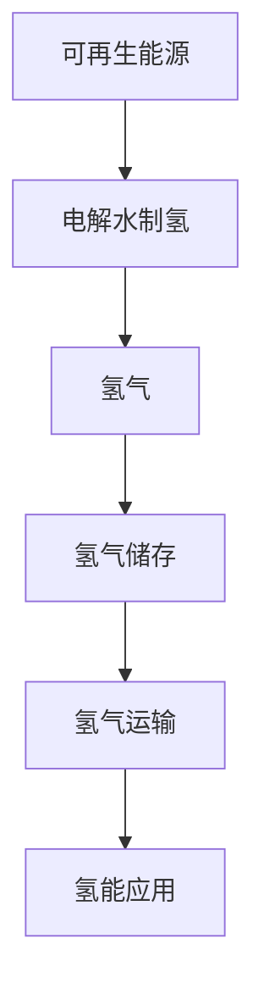
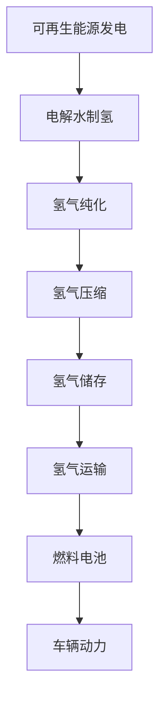
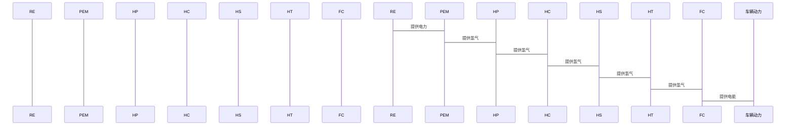

                 

# 绿色氢能产业链的投资机会分析

## 关键词：绿色氢能、氢能产业链、投资机会、可再生能源、双碳目标、储氢技术

## 摘要：  
绿色氢能作为清洁能源的重要组成部分，是实现碳中和目标的关键技术之一。本文从绿色氢能的定义、技术原理、产业链结构、投资驱动因素、核心环节的投资机会以及面临的挑战等方面进行系统分析。通过对比不同制氢、储氢和运氢技术的优劣，结合实际案例，为投资者提供深度分析和实践指导，帮助其识别绿色氢能产业链中的投资机会，并评估相关风险。

---

# 第一部分: 绿色氢能产业链的背景与核心概念

## 第1章: 绿色氢能的定义与技术原理

### 1.1 绿色氢能的定义与特点

#### 1.1.1 绿色氢能的定义  
绿色氢能（Green Hydrogen）是指通过可再生能源（如风能、太阳能）电解水产生的氢气，其生产和使用过程中几乎不产生碳排放。与传统的灰氢（由化石燃料制得，会产生大量二氧化碳）相比，绿色氢能是实现能源低碳化的重要途径。

#### 1.1.2 绿色氢能的技术原理  
绿色氢能的核心技术是电解水制氢。电解水制氢的基本原理是利用可再生能源产生的电能，将水分解为氢气和氧气。化学反应式为：  
$$2H_2O \rightarrow 2H_2 + O_2$$  

电解水制氢的主要优点是技术成熟、氢气纯度高，缺点是制氢成本较高，主要原因是可再生能源的波动性和电解设备的初期投资较大。

#### 1.1.3 绿色氢能与传统氢能的区别  
| 特性      | 绿色氢能                | 传统氢能（灰氢）           |
|-----------|-------------------------|-----------------------------|
| 来源      | 可再生能源电解水        | 石油、天然气重整           |
| 碳排放    | 几乎为零                 | 高                          |
| 应用领域  | 工业、交通、储能        | 工业、能源                   |
| 成本      | 较高（技术进步中）       | 较低                        |

### 1.2 绿色氢能产业链的构成

#### 1.2.1 制氢环节  
制氢是绿色氢能产业链的核心环节，主要技术包括：  
1. **电解水制氢**：使用质子交换膜电解（PEM）、固体氧化物电解（SOE）或碱性电解（AEL）技术。  
2. **光解水制氢**：通过太阳能直接分解水制氢，目前仍处于研发阶段。  

#### 1.2.2 储氢环节  
储氢技术是绿色氢能大规模应用的关键。主要技术包括：  
1. **高压气态储氢**：适用于短途运输和小规模储存。  
2. **液态储氢**：适用于长距离运输，但能耗较高。  
3. **固体储氢**：利用金属氢化物或碳基材料储存氢气，适合分布式储存。  

#### 1.2.3 运氢环节  
氢气的运输方式主要有：  
1. **管道运输**：适用于大规模、长距离运输。  
2. **罐式运输**：适用于小规模、短途运输。  

#### 1.2.4 氢能应用环节  
绿色氢能的应用领域广泛，主要包括：  
1. **工业领域**：用于合成氨、炼钢、化工生产等。  
2. **交通领域**：用于燃料电池汽车、公交车等。  
3. **能源领域**：用于电网调峰、热电联产等。  

### 1.3 绿色氢能的全球发展现状

#### 1.3.1 全球绿色氢能发展概况  
全球绿色氢能市场尚处于起步阶段，但增长迅速。根据国际能源署（IEA）的报告，到2030年，全球绿色氢能需求将超过500万吨/年，其中中国、欧洲和北美是主要市场。

#### 1.3.2 中国绿色氢能发展现状  
中国是全球最大的氢能消费国，但目前仍以灰氢为主。随着政策支持和技术进步，绿色氢能的占比将快速提升。预计到2030年，中国绿色氢能产量将超过100万吨/年。

#### 1.3.3 绿色氢能的市场潜力  
绿色氢能的市场需求主要来自工业、交通和能源领域。随着技术进步和成本下降，绿色氢能的经济性将逐步显现，市场潜力巨大。

### 1.4 绿色氢能的政策支持与投资驱动

#### 1.4.1 全球主要国家的政策支持  
1. **欧盟**：通过“绿色新政”计划，大力发展绿色氢能。  
2. **美国**：通过《通胀削减法案》，加大对绿色氢能的技术研发和产业支持。  
3. **日本**：提出“氢能源利用 roadmap”，计划到2030年实现绿色氢能的商业化应用。  

#### 1.4.2 中国绿色氢能的政策框架  
1. **国家层面**：《氢能产业发展规划（2021-2035年）》提出，到2030年，建成完整的氢能产业链。  
2. **地方层面**：多个省份出台支持绿色氢能发展的政策，例如广东省提出建设“氢谷”。  

#### 1.4.3 投资驱动因素分析  
1. **技术进步**：电解水、储氢等技术的突破将降低绿色氢能的成本。  
2. **政策支持**：政府补贴、税收优惠等将推动绿色氢能的产业化。  
3. **市场需求**：双碳目标驱动下，绿色氢能的需求将持续增长。  

### 1.5 本章小结  
绿色氢能是实现碳中和的重要技术，其产业链包括制氢、储氢、运氢和应用四个环节。全球范围内，绿色氢能的市场潜力巨大，政策支持和技术进步将推动其快速发展。

---

## 第2章: 绿色氢能产业链的核心概念与联系

### 2.1 绿色氢能产业链的核心要素

#### 2.1.1 可再生能源制氢  
可再生能源（如风能、太阳能）通过电解水制氢，是绿色氢能的核心来源。  

#### 2.1.2 储能技术  
绿色氢能不仅是能源的载体，还可以作为储能媒介，帮助可再生能源的消纳和电网调峰。  

#### 2.1.3 氢能运输与配送  
氢气的运输和配送是绿色氢能大规模应用的关键环节，需要高效、安全的运输方式。  

#### 2.1.4 氢能应用领域  
绿色氢能的应用场景广泛，包括工业、交通和能源领域，具有较高的经济价值。  

### 2.2 绿色氢能产业链的实体关系图  

### 2.3 绿色氢能产业链的关键流程

#### 2.3.1 制氢流程  
1. 可再生能源发电（如风电、光伏）。  
2. 电解水制氢，生成氢气和氧气。  
3. 氢气纯化，达到99.99%以上的纯度。  

#### 2.3.2 储氢流程  
1. 氢气压缩或液化。  
2. 储存于高压容器或低温液化罐中。  

#### 2.3.3 运氢流程  
1. 罐式运输或管道运输。  
2. 到达终端后解压或气化。  

#### 2.3.4 应用流程  
1. 工业应用：合成氨、炼钢等。  
2. 交通应用：燃料电池汽车。  
3. 能源应用：电网调峰、热电联产。  

### 2.4 核心概念对比分析

#### 2.4.1 不同制氢技术的对比  

| 技术类型    | 优缺点                         | 适用场景           |
|-------------|--------------------------------|--------------------|
| PEM电解水   | 成本高、效率高、适合小规模     | 适用于分布式制氢   |
| AEL电解水   | 成本低、效率稍低、适合大规模   | 适用于集中式制氢   |
| SOE电解水   | 成本适中、效率高、适合大规模   | 适用于可再生能源基地 |

#### 2.4.2 不同储氢技术的对比  

| 技术类型    | 优缺点                         | 适用场景           |
|-------------|--------------------------------|--------------------|
| 高压气态    | 成本低、储存时间短               | 适用于短途运输     |
| 液态储氢    | 能耗高、储存时间长               | 适用于长距离运输   |
| 固体储氢    | 安全性高、储存时间长             | 适用于分布式储存   |

#### 2.4.3 不同运氢方式的对比  

| 运输方式    | 优缺点                         | 适用场景           |
|-------------|--------------------------------|--------------------|
| 罐式运输    | 成本低、灵活性高                  | 适用于小批量运输   |
| 管道运输    | 成本高、安全性高                  | 适用于大规模运输   |

### 2.5 本章小结  
绿色氢能产业链的核心要素包括可再生能源制氢、储氢、运氢和应用。不同技术的优缺点需要根据具体场景进行选择，以实现经济性和技术性的最优结合。

---

## 第3章: 绿色氢能产业链的投资机会分析

### 3.1 绿色氢能产业链的投资驱动因素

#### 3.1.1 双碳目标的推动  
中国提出“双碳”目标，要求在2030年前实现碳达峰，2060年前实现碳中和。绿色氢能是实现这一目标的重要技术路径。

#### 3.1.2 可再生能源成本下降  
随着可再生能源（如风电、光伏）成本的下降，电解水制氢的成本也在逐步降低，为绿色氢能的商业化奠定了基础。

#### 3.1.3 氢能技术进步  
电解水、储氢等技术的突破将提高绿色氢能的效率，降低成本，推动其产业化。

#### 3.1.4 政策支持  
政府通过补贴、税收优惠等政策，鼓励绿色氢能的研发和产业化。

### 3.2 绿色氢能产业链的关键环节投资机会

#### 3.2.1 制氢环节投资机会  
1. **电解水制氢技术**：PEM和SOE技术是未来发展方向，适合投资技术研发和设备制造。  
2. **可再生能源制氢项目**：在风光资源丰富的地区投资建设绿色氢能生产基地。  

#### 3.2.2 储氢环节投资机会  
1. **高压气态储氢**：适用于分布式储存，市场需求大。  
2. **固体储氢技术**：适合小规模储存，技术壁垒高，投资回报潜力大。  

#### 3.2.3 运氢环节投资机会  
1. **氢气运输设备**：投资氢气罐、管道等基础设施。  
2. **氢气物流服务**：提供氢气运输和配送服务。  

#### 3.2.4 应用环节投资机会  
1. **燃料电池汽车**：投资氢燃料电池的研发和生产。  
2. **工业应用**：投资绿色氢能的工业应用场景，如合成氨、炼钢等。  

### 3.3 绿色氢能产业链的投资风险与挑战

#### 3.3.1 技术风险  
绿色氢能技术尚处于研发阶段，存在技术不成熟和成本高的风险。  

#### 3.3.2 市场风险  
市场需求的不确定性和竞争的加剧可能影响投资回报。  

#### 3.3.3 政策风险  
政策的不确定性和变化可能对绿色氢能的商业化产生影响。  

### 3.4 本章小结  
绿色氢能产业链的投资机会主要集中在制氢、储氢、运氢和应用环节。投资者需要关注技术进步、市场需求和政策变化，同时评估技术风险和市场风险。

---

# 第四部分: 绿色氢能产业链的系统分析与架构设计

## 第4章: 绿色氢能产业链的系统架构

### 4.1 系统功能设计

#### 4.1.1 制氢系统  
制氢系统包括可再生能源发电、电解水制氢和氢气纯化三个子系统。  

#### 4.1.2 储氢系统  
储氢系统包括氢气压缩、液化和储存三个子系统。  

#### 4.1.3 运氢系统  
运氢系统包括氢气罐、管道和运输管理三个子系统。  

#### 4.1.4 应用系统  
应用系统包括燃料电池、工业应用和能源应用三个子系统。  

### 4.2 系统架构设计

### 4.3 系统接口设计  
1. **制氢系统与可再生能源发电系统的接口**：电力输入和氢气输出。  
2. **储氢系统与制氢系统的接口**：氢气输入和压力输出。  
3. **运氢系统与储氢系统的接口**：氢气罐或管道连接。  

### 4.4 系统交互设计  

### 4.5 本章小结  
绿色氢能产业链的系统架构包括制氢、储氢、运氢和应用四个部分，各部分之间通过接口和交互实现协同工作。

---

# 第五部分: 绿色氢能产业链的项目实战

## 第5章: 绿色氢能产业链的项目实战分析

### 5.1 项目背景与目标

#### 5.1.1 项目背景  
某风光互补发电项目计划利用弃风和弃光资源，建设绿色氢能生产基地，实现能源的高效利用和碳减排。  

#### 5.1.2 项目目标  
1. 建成一个绿色氢能生产基地，年产能达到10万吨/年。  
2. 实现绿色氢能的储运和应用，探索商业化模式。  

### 5.2 项目规划与实施

#### 5.2.1 项目规划  
1. **制氢系统**：采用PEM电解水技术，配备20台电解槽。  
2. **储氢系统**：建设高压气态储氢罐，容量为500立方米。  
3. **运氢系统**：购置氢气罐车，用于氢气运输和配送。  

#### 5.2.2 项目实施  
1. **设备采购**：购买电解槽、储氢罐、氢气压缩机等设备。  
2. **系统集成**：完成制氢、储氢和运氢系统的集成和调试。  
3. **试运行**：进行小规模试生产，验证系统稳定性。  

### 5.3 项目成本与收益分析

#### 5.3.1 项目成本  
1. **设备投资**：电解槽、储氢罐等设备投资约为5000万元。  
2. **安装与调试**：系统安装和调试费用约为1000万元。  
3. **运营成本**：氢气生产成本约为10元/公斤，储运成本约为5元/公斤。  

#### 5.3.2 项目收益  
1. **氢气销售**：预计年产量10万吨，销售价格为20元/公斤，年收入为20亿元。  
2. **政策补贴**：获得政府补贴5000万元。  

#### 5.3.3 投资回报分析  
1. **投资回收期**：预计投资回收期为5-7年。  
2. **净现值（NPV）**：预计NPV为正，项目具有较好的经济效益。  

### 5.4 项目风险管理

#### 5.4.1 技术风险  
电解水制氢技术尚未完全成熟，可能存在设备故障风险。应对措施：加强技术攻关和设备维护。  

#### 5.4.2 市场风险  
氢气市场需求可能低于预期，导致项目收益不达预期。应对措施：拓展多元化应用场景，提升市场竞争力。  

### 5.5 本章小结  
绿色氢能项目的实施需要综合考虑技术、成本和市场因素，通过科学的规划和风险管理，可以实现较好的投资回报。

---

# 第六部分: 绿色氢能产业链的最佳实践与总结

## 第6章: 绿色氢能产业链的最佳实践

### 6.1 投资策略建议  
1. **技术驱动**：优先投资电解水制氢技术的研发和产业化。  
2. **政策导向**：关注政府政策支持，选择有潜力的区域投资。  
3. **产业链协同**：加强与可再生能源发电企业、储氢企业和应用企业的合作。  

### 6.2 风险管理建议  
1. **技术风险**：加大研发投入，提高技术成熟度。  
2. **市场风险**：拓展多元化市场，降低对单一市场的依赖。  
3. **政策风险**：密切关注政策变化，制定灵活的投资策略。  

### 6.3 未来发展趋势  
1. **技术进步**：电解水、储氢技术的进一步突破将降低成本。  
2. **市场扩展**：绿色氢能的应用场景将不断扩展，市场需求将持续增长。  
3. **国际合作**：全球范围内的技术交流和产业合作将加速绿色氢能的商业化进程。  

### 6.4 本章小结  
绿色氢能产业链的投资需要结合技术、政策和市场因素，通过科学的策略和风险管理，实现可持续发展。

---

# 作者：AI天才研究院/AI Genius Institute & 禅与计算机程序设计艺术 /Zen And The Art of Computer Programming

