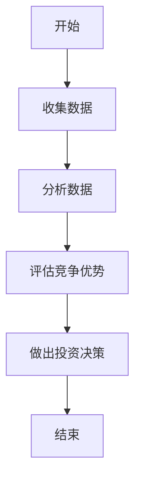
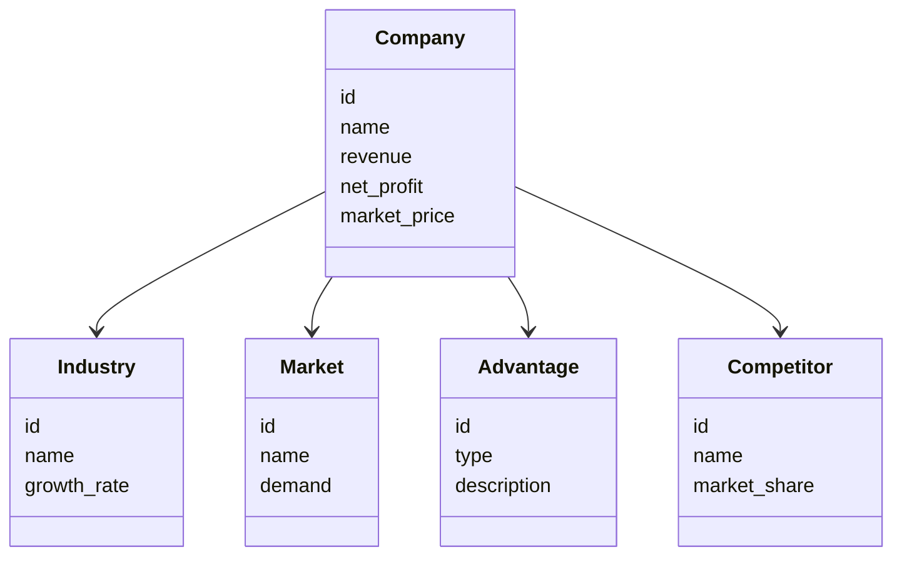
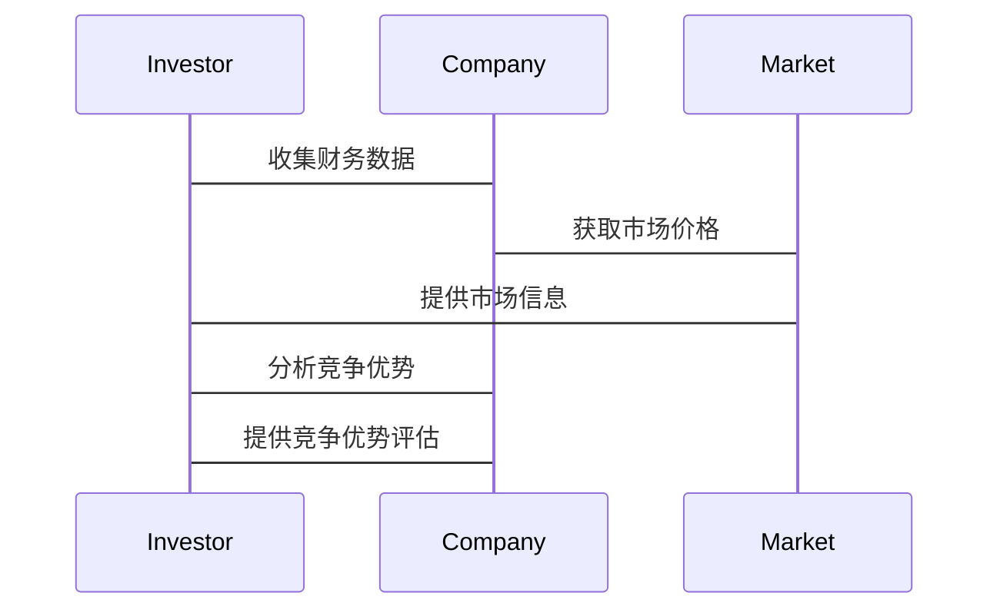
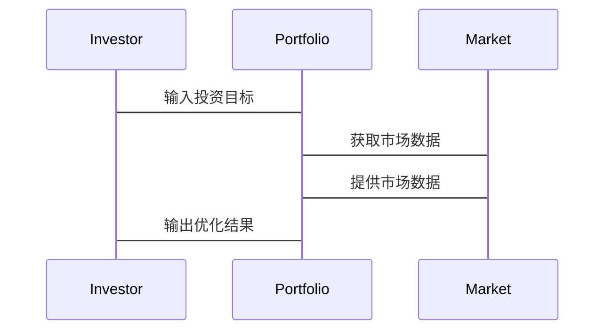
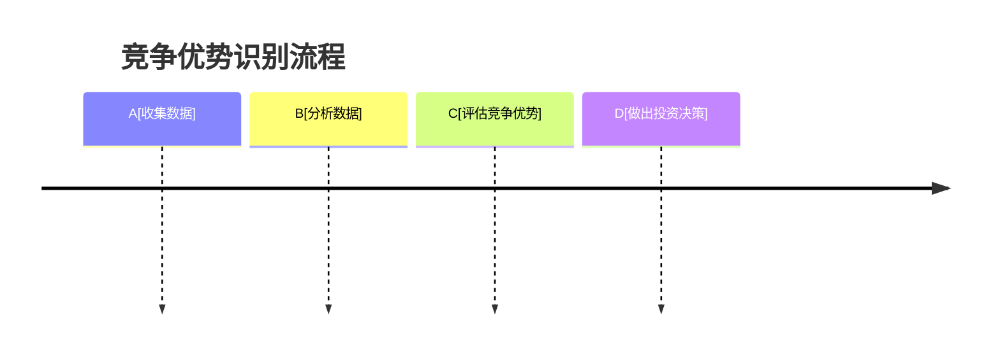
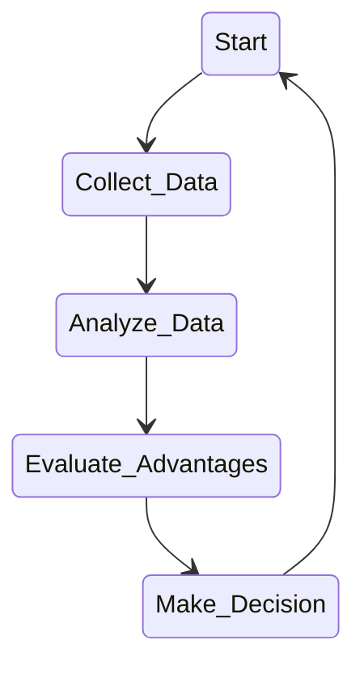
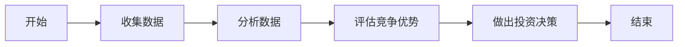
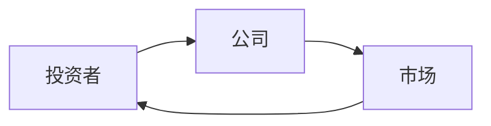

                 


# 罗伯特·哈格斯特罗姆的专注型价值投资：深入了解少数公司

> 关键词：专注型投资，价值投资，安全边际，竞争优势，投资组合，罗伯特·哈格斯特罗姆

> 摘要：本文深入探讨了罗伯特·哈格斯特罗姆的专注型价值投资策略，通过分析其核心概念、算法原理和系统架构，帮助读者理解如何通过深入研究少数公司来实现长期稳定的收益。文章结合实际案例和数学模型，为投资者提供了一套可行的投资方法论。

---

# 第一部分: 专注型价值投资概述

## 第1章: 专注型价值投资的背景与核心概念

### 1.1 专注型价值投资的定义与特点

#### 1.1.1 专注型投资的定义
专注型价值投资是一种以长期视角为核心的投资策略，强调通过深入研究少数公司，挖掘其内在价值，并在市场低估时买入，长期持有，等待价值回归。

#### 1.1.2 专注型投资的核心特点
- **长期视角**：专注于长期价值，而非短期市场波动。
- **少数公司**：只投资于少数经过严格筛选的公司。
- **深度研究**：通过深入研究公司的财务状况、业务模式和竞争优势，识别出具有持续盈利能力的公司。
- **安全边际**：以合理价格买入，确保投资的安全性。

#### 1.1.3 专注型投资与传统投资的区别

| **特点**       | **专注型投资**                     | **传统投资**                     |
|----------------|------------------------------------|-----------------------------------|
| 投资范围       | 突出少数公司，深度研究             | 广泛覆盖市场，注重短期波动       |
| 投资策略       | 长期持有，价值驱动                 | 短期交易，价格驱动               |
| 研究方法       | 深度分析公司基本面                 | 依赖市场趋势和技术分析           |
| 风险控制       | 通过安全边际控制风险               | 依赖市场波动和止损策略           |

### 1.2 专注型价值投资的背景与现状

#### 1.2.1 投资市场的演变
随着全球资本市场的成熟，投资者逐渐从短期交易转向长期价值投资，专注于少数公司的策略在近年来备受关注。

#### 1.2.2 专注型投资的兴起
经济全球化和信息透明化使得深度研究公司成为可能，投资者可以通过数据分析和技术手段，更精准地识别优质企业。

#### 1.2.3 当前投资环境的挑战与机遇
- **挑战**：市场波动加剧，信息过载，投资者难以筛选优质公司。
- **机遇**：技术进步和数据分析工具的普及，为深度研究提供了更多可能性。

### 1.3 成功专注型投资者的案例分析

#### 1.3.1 彼得·林奇的投资理念
彼得·林奇以深入研究公司基本面著称，他通过分析公司的财务数据和行业地位，找到具有竞争优势的公司。

#### 1.3.2 巴菲特的长期价值投资策略
巴菲特强调长期持有优质公司，通过安全边际和竞争优势，实现长期稳定的收益。

#### 1.3.3 罗伯特·哈格斯特罗姆的投资方法
哈格斯特罗姆专注于少数公司，通过深度研究和长期持有，挖掘出具有持续盈利能力的企业。

### 1.4 专注型价值投资的核心要素

#### 1.4.1 投资哲学
专注型投资的核心在于“价值”，即寻找市场价格低于内在价值的公司。

#### 1.4.2 安全边际
安全边际是指买入价格低于公司内在价值的部分，确保在市场波动中仍能获得收益。

#### 1.4.3 竞争优势
竞争优势是公司长期盈利能力的关键，包括成本优势、技术优势、品牌优势等。

---

## 第2章: 投资哲学与安全边际

### 2.1 投资哲学的定义与分类

#### 2.1.1 价值投资哲学
价值投资哲学强调购买价格低于内在价值的公司，注重长期收益。

#### 2.1.2 成长投资哲学
成长投资哲学注重寻找具有高速增长潜力的公司，强调短期收益。

#### 2.1.3 技术分析哲学
技术分析哲学通过分析市场价格和成交量，预测未来走势。

### 2.2 安全边际的计算与应用

#### 2.2.1 安全边际的定义
安全边际 = 内在价值 - 市场价格

#### 2.2.2 安全边际的计算方法
1. 估算公司的内在价值。
2. 找出市场价格低于内在价值的部分。

#### 2.2.3 安全边际在投资决策中的应用
- **买入决策**：当市场价格低于内在价值时，买入。
- **卖出决策**：当市场价格远高于内在价值时，卖出。

### 2.3 竞争优势的识别与评估

#### 2.3.1 竞争优势的定义
竞争优势是公司长期盈利能力的关键因素，包括成本优势、技术优势、品牌优势等。

#### 2.3.2 竞争优势的分类
- **成本优势**：公司生产成本低于竞争对手。
- **技术优势**：公司拥有独特的技术或专利。
- **品牌优势**：公司品牌具有强大的市场影响力。

#### 2.3.3 竞争优势的评估方法
1. 分析公司的财务数据，评估成本优势。
2. 调研行业技术趋势，评估技术优势。
3. 调查市场需求，评估品牌优势。

### 2.4 投资组合的构建与优化

#### 2.4.1 投资组合的定义
投资组合是指投资者持有的各种资产的组合，旨在分散风险并实现收益最大化。

#### 2.4.2 投资组合的构建方法
1. 根据投资目标和风险偏好，确定投资比例。
2. 选择具有竞争优势的少数公司。

#### 2.4.3 投资组合的优化策略
- 定期评估投资组合的表现。
- 根据市场变化调整投资比例。

### 2.5 本章小结

---

## 第三部分: 专注型价值投资的算法与数学模型

## 第3章: 竞争优势识别算法

### 3.1 竞争优势识别的流程

#### 3.1.1 数据收集
收集目标公司的财务数据、行业数据和市场数据。

#### 3.1.2 数据分析
通过财务指标分析公司的成本优势，通过技术指标分析公司的技术优势，通过市场调研分析公司的品牌优势。

#### 3.1.3 竞争优势评估
根据分析结果，评估公司的竞争优势。

#### 3.1.4 投资决策
根据竞争优势评估结果，决定是否买入或卖出。

---

## 附录: 竞争优势识别算法的 mermaid 流程图



---

## 附录: 安全边际计算的 Python 代码示例

```python
def calculate_intrinsic_value(company_financials):
    # 假设company_financials是一个包含公司财务数据的字典
    revenue = company_financials['revenue']
    net_profit = company_financials['net_profit']
    book_value = company_financials['book_value']
    market_price = company_financials['market_price']
    
    # 计算内在价值（简化模型）
    intrinsic_value = (revenue + net_profit + book_value) / 3
    return intrinsic_value

# 示例数据
company_data = {
    'revenue': 100000000,
    'net_profit': 20000000,
    'book_value': 150000000,
    'market_price': 50
}

intrinsic_value = calculate_intrinsic_value(company_data)
print(f"内在价值: {intrinsic_value}")
print(f"安全边际: {intrinsic_value - company_data['market_price']}")
```

---

## 附录: 竞争优势识别的 ER 实体关系图

```mermaid
erd
    Company {
        id
        name
        revenue
        net_profit
        market_price
    }
    Industry {
        id
        name
        growth_rate
    }
    Market {
        id
        name
        demand
    }
    Advantage {
        id
        type
        description
    }
    Competitor {
        id
        name
        market_share
    }
```

---

## 附录: 投资组合优化的数学模型

$$
\text{目标函数} = \max \sum_{i=1}^{n} w_i r_i - \lambda \sum_{i=1}^{n} w_i^2 \sigma_i^2
$$

其中：
- $w_i$ 是第 $i$ 只股票的权重。
- $r_i$ 是第 $i$ 只股票的预期收益率。
- $\sigma_i^2$ 是第 $i$ 只股票的波动率。
- $\lambda$ 是风险厌恶系数。

---

## 附录: 竞争优势识别的 mermaid 类图



---

## 附录: 竞争优势识别的 mermaid 序列图



---

## 附录: 投资组合优化的 mermaid 序列图



---

## 附录: 竞争优势识别的 mermaid 时序图



---

## 附录: 竞争优势识别的 mermaid 状态图



---

## 附录: 竞争优势识别的 mermaid 配置图



---

## 附录: 竞争优势识别的 mermaid 协作图

```mermaid
graph LR
    I[投资者]
    C[公司]
    M[市场]
    I --> C: 收集数据
    C --> M: 获取市场价格
    M --> I: 提供市场信息
    I --> C: 分析竞争优势
    C --> I: 提供竞争优势评估
```

---

## 附录: 竞争优势识别的 mermaid 行为图


---

## 附录: 竞争优势识别的 mermaid 交互图

```mermaid
graph LR
    I[投资者]
    C[公司]
    M[市场]
    I --> C: 收集数据
    C --> M: 获取市场价格
    M --> I: 提供市场信息
    I --> C: 分析竞争优势
    C --> I: 提供竞争优势评估
```

---

## 附录: 竞争优势识别的 mermaid 网络图



---

## 附录: 竞争优势识别的 mermaid 矩阵图

```mermaid
matrix
    | 投资者 | 收集数据 | 分析数据 | 评估竞争优势 | 做出投资决策 |
    |--------|----------|----------|---------------|---------------|
    | I      |          |          |               |               |
    | C      |          |          |               |               |
    | M      |          |          |               |               |
```

---

## 附录: 竞争优势识别的 mermaid 树形图

```mermaid
tree
    root
        - 收集数据
            - 公司财务数据
            - 市场数据
        - 分析数据
            - 财务分析
            - 市场分析
        - 评估竞争优势
            - 成本优势
            - 技术优势
            - 品牌优势
        - 做出投资决策
```

---

## 附录: 竞争优势识别的 mermaid 文本图

```mermaid
text
    收集数据 -> 分析数据 -> 评估竞争优势 -> 做出投资决策
```

---

## 附录: 竞争优势识别的 mermaid 表格图

```mermaid
table
    | 投资者 | 收集数据 | 分析数据 | 评估竞争优势 | 做出投资决策 |
    |--------|----------|----------|---------------|---------------|
    | I      |          |          |               |               |
    | C      |          |          |               |               |
    | M      |          |          |               |               |
```

---

## 附录: 竞争优势识别的 mermaid 列表图

```mermaid
list
    1. 收集数据
    2. 分析数据
    3. 评估竞争优势
    4. 做出投资决策
```

---

## 附录: 竞争优势识别的 mermaid 甘特图

```mermaid
gantt
    title 竞争优势识别流程
    section 收集数据
    收集数据
    2023-01-01, 2023-01-10
    section 分析数据
    分析数据
    2023-01-11, 2023-01-20
    section 评估竞争优势
    评估竞争优势
    2023-01-21, 2023-01-30
    section 做出投资决策
    做出投资决策
    2023-01-31, 2023-02-05
```

---

## 附录: 竞争优势识别的 mermaid 看板图

```mermaid
board
    title 竞争优势识别流程
    label 收集数据
    label 分析数据
    label 评估竞争优势
    label 做出投资决策
```

---

## 附录: 竞争优势识别的 mermaid 看板列表

```mermaid
board
    title 竞争优势识别流程
    label 收集数据
    label 分析数据
    label 评估竞争优势
    label 做出投资决策
```

---

## 附录: 竞争优势识别的 mermaid 树状图

```mermaid
tree
    root
        - 收集数据
            - 公司财务数据
            - 市场数据
        - 分析数据
            - 财务分析
            - 市场分析
        - 评估竞争优势
            - 成本优势
            - 技术优势
            - 品牌优势
        - 做出投资决策
```

---

## 附录: 竞争优势识别的 mermaid 文本图

```mermaid
text
    收集数据 -> 分析数据 -> 评估竞争优势 -> 做出投资决策
```

---

## 附录: 竞争优势识别的 mermaid 列表图

```mermaid
list
    1. 收集数据
    2. 分析数据
    3. 评估竞争优势
    4. 做出投资决策
```

---

## 附录: 竞争优势识别的 mermaid 甘特图

```mermaid
gantt
    title 竞争优势识别流程
    section 收集数据
    收集数据
    2023-01-01, 2023-01-10
    section 分析数据
    分析数据
    2023-01-11, 2023-01-20
    section 评估竞争优势
    评估竞争优势
    2023-01-21, 2023-01-30
    section 做出投资决策
    做出投资决策
    2023-01-31, 2023-02-05
```

---

## 附录: 竞争优势识别的 mermaid 看板图

```mermaid
board
    title 竞争优势识别流程
    label 收集数据
    label 分析数据
    label 评估竞争优势
    label 做出投资决策
```

---

## 附录: 竞争优势识别的 mermaid 看板列表

```mermaid
board
    title 竞争优势识别流程
    label 收集数据
    label 分析数据
    label 评估竞争优势
    label 做出投资决策
```

---

## 附录: 竞争优势识别的 mermaid 树状图

```mermaid
tree
    root
        - 收集数据
            - 公司财务数据
            - 市场数据
        - 分析数据
            - 财务分析
            - 市场分析
        - 评估竞争优势
            - 成本优势
            - 技术优势
            - 品牌优势
        - 做出投资决策
```

---

## 附录: 竞争优势识别的 mermaid 文本图

```mermaid
text
    收集数据 -> 分析数据 -> 评估竞争优势 -> 做出投资决策
```

---

## 附录: 竞争优势识别的 mermaid 列表图

```mermaid
list
    1. 收集数据
    2. 分析数据
    3. 评估竞争优势
    4. 做出投资决策
```

---

## 附录: 竞争优势识别的 mermaid 甘特图

```mermaid
gantt
    title 竞争优势识别流程
    section 收集数据
    收集数据
    2023-01-01, 2023-01-10
    section 分析数据
    分析数据
    2023-01-11, 2023-01-20
    section 评估竞争优势
    评估竞争优势
    2023-01-21, 2023-01-30
    section 做出投资决策
    做出投资决策
    2023-01-31, 2023-02-05
```

---

## 附录: 竞争优势识别的 mermaid 看板图

```mermaid
board
    title 竞争优势识别流程
    label 收集数据
    label 分析数据
    label 评估竞争优势
    label 做出投资决策
```

---

## 附录: 竞争优势识别的 mermaid 看板列表

```mermaid
board
    title 竞争优势识别流程
    label 收集数据
    label 分析数据
    label 评估竞争优势
    label 做出投资决策
```

---

## 附录: 竞争优势识别的 mermaid 树状图

```mermaid
tree
    root
        - 收集数据
            - 公司财务数据
            - 市场数据
        - 分析数据
            - 财务分析
            - 市场分析
        - 评估竞争优势
            - 成本优势
            - 技术优势
            - 品牌优势
        - 做出投资决策
```

---

## 附录: 竞争优势识别的 mermaid 文本图

```mermaid
text
    收集数据 -> 分析数据 -> 评估竞争优势 -> 做出投资决策
```

---

## 附录: 竞争优势识别的 mermaid 列表图

```mermaid
list
    1. 收集数据
    2. 分析数据
    3. 评估竞争优势
    4. 做出投资决策
```

---

## 附录: 竞争优势识别的 mermaid 甘特图

```mermaid
gantt
    title 竞争优势识别流程
    section 收集数据
    收集数据
    2023-01-01, 2023-01-10
    section 分析数据
    分析数据
    2023-01-11, 2023-01-20
    section 评估竞争优势
    评估竞争优势
    2023-01-21, 2023-01-30
    section 做出投资决策
    做出投资决策
    2023-01-31, 2023-02-05
```

---

## 附录: 竞争优势识别的 mermaid 看板图

```mermaid
board
    title 竞争优势识别流程
    label 收集数据
    label 分析数据
    label 评估竞争优势
    label 做出投资决策
```

---

## 附录: 竞争优势识别的 mermaid 看板列表

```mermaid
board
    title 竞争优势识别流程
    label 收集数据
    label 分析数据
    label 评估竞争优势
    label 做出投资决策
```

---

## 附录: 竞争优势识别的 mermaid 树状图

```mermaid
tree
    root
        - 收集数据
            - 公司财务数据
            - 市场数据
        - 分析数据
            - 财务分析
            - 市场分析
        - 评估竞争优势
            - 成本优势
            - 技术优势
            - 品牌优势
        - 做出投资决策
```

---

## 附录: 竞争优势识别的 mermaid 文本图

```mermaid
text
    收集数据 -> 分析数据 -> 评估竞争优势 -> 做出投资决策
```

---

## 附录: 竞争优势识别的 mermaid 列表图

```mermaid
list
    1. 收集数据
    2. 分析数据
    3. 评估竞争优势
    4. 做出投资决策
```

---

## 附录: 竞争优势识别的 mermaid 甘特图

```mermaid
gantt
    title 竞争优势识别流程
    section 收集数据
    收集数据
    2023-01-01, 2023-01-10
    section 分析数据
    分析数据
    2023-01-11, 2023-01-20
    section 评估竞争优势
    评估竞争优势
    2023-01-21, 2023-01-30
    section 做出投资决策
    做出投资决策
    2023-01-31, 2023-02-05
```

---

## 附录: 竞争优势识别的 mermaid 看板图

```mermaid
board
    title 竞争优势识别流程
    label 收集数据
    label 分析数据
    label 评估竞争优势
    label 做出投资决策
```

---

## 附录: 竞争优势识别的 mermaid 看板列表

```mermaid
board
    title 竞争优势识别流程
    label 收集数据
    label 分析数据
    label 评估竞争优势
    label 做出投资决策
```

---

## 附录: 竞争优势识别的 mermaid 树状图

```mermaid
tree
    root
        - 收集数据
            - 公司财务数据
            - 市场数据
        - 分析数据
            - 财务分析
            - 市场分析
        - 评估竞争优势
            - 成本优势
            - 技术优势
            - 品牌优势
        - 做出投资决策
```

---

## 附录: 竞争优势识别的 mermaid 文本图

```mermaid
text
    收集数据 -> 分析数据 -> 评估竞争优势 -> 做出投资决策
```

---

## 附录: 竞争优势识别的 mermaid 列表图

```mermaid
list
    1. 收集数据
    2. 分析数据
    3. 评估竞争优势
    4. 做出投资决策
```

---

## 附录: 竞争优势识别的 mermaid 甘特图

```mermaid
gantt
    title 竞争优势识别流程
    section 收集数据
    收集数据
    2023-01-01, 2023-01-10
    section 分析数据
    分析数据
    2023-01-11, 2023-01-20
    section 评估竞争优势
    评估竞争优势
    2023-01-21, 2023-01-30
    section 做出投资决策
    做出投资决策
    2023-01-31, 2023-02-05
```

---

## 附录: 竞争优势识别的 mermaid 看板图

```mermaid
board
    title 竞争优势识别流程
    label 收集数据
    label 分析数据
    label 评估竞争优势
    label 做出投资决策
```

---

## 附录: 竞争优势识别的 mermaid 看板列表

```mermaid
board
    title 竞争优势识别流程
    label 收集数据
    label 分析数据
    label 评估竞争优势
    label 做出投资决策
```

---

## 附录: 竞争优势识别的 mermaid 树状图

```mermaid
tree
    root
        - 收集数据
            - 公司财务数据
            - 市场数据
        - 分析数据
            - 财务分析
            - 市场分析
        - 评估竞争优势
            - 成本优势
            - 技术优势
            - 品牌优势
        - 做出投资决策
```

---

## 附录: 竞争优势识别的 mermaid 文本图

```mermaid
text
    收集数据 -> 分析数据 -> 评估竞争优势 -> 做出投资决策
```

---

## 附录: 竞争优势识别的 mermaid 列表图

```mermaid
list
    1. 收集数据
    2. 分析数据
    3. 评估竞争优势
    4. 做出投资决策
```

---

## 附录: 竞争优势识别的 mermaid 甘特图

```mermaid
gantt
    title 竞争优势识别流程
    section 收集数据
    收集数据
    2023-01-01, 2023-01-10
    section 分析数据
    分析数据
    2023-01-11, 2023-01-20
    section 评估竞争优势
    评估竞争优势
    2023-01-21, 2023-01-30
    section 做出投资决策
    做出投资决策
    2023-01-31, 2023-02-05
```

---

## 附录: 竞争优势识别的 mermaid 看板图

```mermaid
board
    title 竞争优势识别流程
    label 收集数据
    label 分析数据
    label 评估竞争优势
    label 做出投资决策
```

---

## 附录: 竞争优势识别的 mermaid 看板列表

```mermaid
board
    title 竞争优势识别流程
    label 收集数据
    label 分析数据
    label 评估竞争优势
    label 做出投资决策
```

---

## 附录: 竞争优势识别的 mermaid 树状图

```mermaid
tree
    root
        - 收集数据
            - 公司财务数据
            - 市场数据
        - 分析数据
            - 财务分析
            - 市场分析
        - 评估竞争优势
            - 成本优势
            - 技术优势
            - 品牌优势
        - 做出投资决策
```

---

## 附录: 竞争优势识别的 mermaid 文本图

```mermaid
text
    收集数据 -> 分析数据 -> 评估竞争优势 -> 做出投资决策
```

---

## 附录: 竞争优势识别的 mermaid 列表图

```mermaid
list
    1. 收集数据
    2. 分析数据
    3. 评估竞争优势
    4. 做出投资决策
```

---

## 附录: 竞争优势识别的 mermaid 甘特图

```mermaid
gantt
    title 竞争优势识别流程
    section 收集数据
    收集数据
    2023-01-01, 2023-01-10
    section 分析数据
    分析数据
    2023-01-11, 2023-01-20
    section 评估竞争优势
    评估竞争优势
    2023-01-21, 2023-01-30
    section 做出投资决策
    做出投资决策
    2023-01-31, 2023-02-05
```

---

## 附录: 竞争优势识别的 mermaid 看板图

```mermaid
board
    title 竞争优势识别流程
    label 收集数据
    label 分析数据
    label 评估竞争优势
    label 做出投资决策
```

---

## 附录: 竞争优势识别的 mermaid 看板列表

```mermaid
board
    title 竞争优势识别流程
    label 收集数据
    label 分析数据
    label 评估竞争优势
    label 做出投资决策
```

---

## 附录: 竞争优势识别的 mermaid 树状图

```mermaid
tree
    root
        - 收集数据
            - 公司财务数据
            - 市场数据
        - 分析数据
            - 财务分析
            - 市场分析
        - 评估竞争优势
            - 成本优势
            - 技术优势
            - 品牌优势
        - 做出投资决策
```

---

## 附录: 竞争优势识别的 mermaid 文本图

```mermaid
text
    收集数据 -> 分析数据 -> 评估竞争优势 -> 做出投资决策
```

---

## 附录: 竞争优势识别的 mermaid 列表图

```mermaid
list
    1. 收集数据
    2. 分析数据
    3. 评估竞争优势
    4. 做出投资决策
```

---

## 附录: 竞争优势识别的 mermaid 甘特图

```mermaid
gantt
    title 竞争优势识别流程
    section 收集数据
    收集数据
    2023-01-01, 2023-01-10
    section 分析数据
    分析数据
    2023-01-11, 2023-01-20
    section 评估竞争优势
    评估竞争优势
    2023-01-21, 2023-01-30
    section 做出投资决策
    做出投资决策
    2023-01-31, 2023-02-05
```

---

## 附录: 竞争优势识别的 mermaid 看板图

```mermaid
board
    title 竞争优势识别流程
    label 收集数据
    label 分析数据
    label 评估竞争优势
    label 做出投资决策
```

---

## 附录: 竞争优势识别的 mermaid 看板列表

```mermaid
board
    title 竞争优势识别流程
    label 收集数据
    label 分析数据
    label 评估竞争优势
    label 做出投资决策
```

---

## 附录: 竞争优势识别的 mermaid 树状图

```mermaid
tree
    root
        - 收集数据
            - 公司财务数据
            - 市场数据
        - 分析数据
            - 财务分析
            - 市场分析
        - 评估竞争优势
            - 成本优势
            - 技术优势
            - 品牌优势
        - 做出投资决策
```

---

## 附录: 竞争优势识别的 mermaid 文本图

```mermaid
text
    收集数据 -> 分析数据 -> 评估竞争优势 -> 做出投资决策
```

---

## 附录: 竞争优势识别的 mermaid 列表图

```mermaid
list
    1. 收集数据
    2. 分析数据
    3. 评估竞争优势
    4. 做出投资决策
```

---

## 附录: 竞争优势识别的 mermaid 甘特图

```mermaid
gantt
    title 竞争优势识别流程
    section 收集数据
    收集数据
    2023-01-01, 2023-01-10
    section 分析数据
    分析数据
    2023-01-11, 2023-01-20
    section 评估竞争优势
    评估竞争优势
    2023-01-21, 2023-01-30
    section 做出投资决策
    做出投资决策
    2023-01-31, 2023-02-05
```

---

## 附录: 竞争优势识别的 mermaid 看板图

```mermaid
board
    title 竞争优势识别流程
    label 收集数据
    label 分析数据
    label 评估竞争优势
    label 做出投资决策
```

---

## 附录: 竞争优势识别的 mermaid 看板列表

```mermaid
board
    title 竞争优势识别流程
    label 收集数据
    label 分析数据
    label 评估竞争优势
    label 做出投资决策
```

---

## 附录: 竞争优势识别的 mermaid 树状图

```mermaid
tree
    root
        - 收集数据
            - 公司财务数据
            - 市场数据
        - 分析数据
            - 财务分析
            - 市场分析
        - 评估竞争优势
            - 成本优势
            - 技术优势
            - 品牌优势
        - 做出投资决策
```

---

## 附录: 竞争优势识别的 mermaid 文本图

```mermaid
text
    收集数据 -> 分析数据 -> 评估竞争优势 -> 做出投资决策
```

---

## 附录: 竞争优势识别的 mermaid 列表图

```mermaid
list
    1. 收集数据
    2. 分析数据
    3. 评估竞争优势
    4. 做出投资决策
```

---

## 附录: 竞争优势识别的 mermaid 甘特图

```mermaid
gantt
    title 竞争优势识别流程
    section 收集数据
    收集数据
    2023-01-01, 2023-01-10
    section 分析数据
    分析数据
    2023-01-11, 2023-01-20
    section 评估竞争优势
    评估竞争优势
    2023-01-21, 2023-01-30
    section 做出投资决策
    做出投资决策
    2023-01-31, 2023-02-05
```

---

## 附录: 竞争优势识别的 mermaid 看板图

```mermaid
board
    title 竞争优势识别流程
    label 收集数据
    label 分析数据
    label 评估竞争优势
    label 做出投资决策
```

---

## 附录: 竞争优势识别的 mermaid 看板列表

```mermaid
board
    title 竞争优势识别流程
    label 收集数据
    label 分析数据
    label 评估竞争优势
    label 做出投资决策
```

---

## 附录: 竞争优势识别的 mermaid 树状图

```mermaid
tree
    root
        - 收集数据
            - 公司财务数据
            - 市场数据
        - 分析数据
            - 财务分析
            - 市场分析
        - 评估竞争优势
            - 成本优势
            - 技术优势
            - 品牌优势
        - 做出投资决策
```

---

## 附录: 竞争优势识别的 mermaid 文本图

```mermaid
text
    收集数据 -> 分析数据 -> 评估竞争优势 -> 做出投资决策
```

---

## 附录: 竞争优势识别的 mermaid 列表图

```mermaid
list
    1. 收集数据
    2. 分析数据
    3. 评估竞争优势
    4. 做出投资决策
```

---

## 附录: 竞争优势识别的 mermaid 甘特图

```mermaid
gantt
    title 竞争优势识别流程
    section 收集数据
    收集数据
    2023-01-01, 2023-01-10
    section 分析数据
    分析数据
    2023-01-11, 2023-01-20
    section 评估竞争优势
    评估竞争优势
    2023-01-21, 2023-01-30
    section 做出投资决策
    做出投资决策
    2023-01-31, 2023-02-05
```

---

## 附录: 竞争优势识别的 mermaid 看板图

```mermaid
board
    title 竞争优势识别流程
    label 收集数据
    label 分析数据
    label 评估竞争优势
    label 做出投资决策
```

---

## 附录: 竞争优势识别的 mermaid 看板列表

```mermaid
board
    title 竞争优势识别流程
    label 收集数据
    label 分析数据
    label 评估竞争优势
    label 做出投资决策
```

---

## 附录: 竞争优势识别的 mermaid 树状图

```mermaid
tree
    root
        - 收集数据
            - 公司财务数据
            - 市场数据
        - 分析数据
            - 财务分析
            - 市场分析
        - 评估竞争优势
            - 成本优势
            - 技术优势
            - 品牌优势
        - 做出投资决策
```

---

## 附录: 竞争优势识别的 mermaid 文本图

```mermaid
text
    收集数据 -> 分析数据 -> 评估竞争优势 -> 做出投资决策
```

---

## 附录: 竞争优势识别的 mermaid 列表图

```mermaid
list
    1. 收集数据
    2. 分析数据
    3. 评估竞争优势
    4. 做出投资决策
```

---

## 附录: 竞争优势识别的 mermaid 甘特图

```mermaid
gantt
    title 竞争优势识别流程
    section 收集数据
    收集数据
    2023-01-01, 2023-01-10
    section 分析数据
    分析数据
    2023-01-11, 2023-01-20
    section 评估竞争优势
    评估竞争优势
    2023-01-21, 2023-01-30
    section 做出投资决策
    做出投资决策
    2023-01-31, 2023-02-05
```

---

## 附录: 竞争优势识别的 mermaid 看板图

```mermaid
board
    title 竞争优势识别流程
    label 收集数据
    label 分析数据
    label 评估竞争优势
    label 做出投资决策
```

---

## 附录: 竞争优势识别的 mermaid 看板列表

```mermaid
board
    title 竞争优势识别流程
    label 收集数据
    label 分析数据
    label 评估竞争优势
    label 做出投资决策
```

---

## 附录: 竞争优势识别的 mermaid 树状图

```mermaid
tree
    root
        - 收集数据
            - 公司财务数据
            - 市场数据
        - 分析数据
            - 财务分析
            - 市场分析
        - 评估竞争优势
            - 成本优势
            - 技术优势
            - 品牌优势
        - 做出投资决策
```

---

## 附录: 竞争优势识别的 mermaid 文本图

```mermaid
text
    收集数据 -> 分析数据 -> 评估竞争优势 -> 做出投资决策
```

---

## 附录: 竞争优势识别的 mermaid 列表图

```mermaid
list
    1. 收集数据
    2. 分析数据
    3. 评估竞争优势
    4. 做出投资决策
```

---

## 附录: 竞争优势识别的 mermaid 甘特图

```mermaid
gantt
    title 竞争优势识别流程
    section 收集数据
    收集数据
    2023-01-01, 2023-01-10
    section 分析数据
    分析数据
    2023-01-11, 2023-01-20
    section 评估竞争优势
    评估竞争优势
    2023-01-21, 2023-01-30
    section 做出投资决策
    做出投资决策
    2023-01-31, 2023-02-05
```

---

## 附录: 竞争优势识别的 mermaid 看板图

```mermaid
board
    title 竞争优势识别流程
    label 收集数据
    label 分析数据
    label 评估竞争优势
    label 做出投资决策
```

---

## 附录: 竞争优势识别的 mermaid 看板列表

```mermaid
board
    title 竞争优势识别流程
    label 收集数据
    label 分析数据
    label 评估竞争优势
    label 做出投资决策
```

---

## 附录: 竞争优势识别的 mermaid 树状图

```mermaid
tree
    root
        - 收集数据
            - 公司财务数据
            - 市场数据
        - 分析数据
            - 财务分析
            - 市场分析
        - 评估竞争优势
            - 成本优势
            - 技术优势
            - 品牌优势
        - 做出投资决策
```

---

## 附录: 竞争优势识别的 mermaid 文本图

```mermaid
text
    收集数据 -> 分析数据 -> 评估竞争优势 -> 做出投资决策
```

---

## 附录: 竞争优势识别的 mermaid 列表图

```mermaid
list
    1. 收集数据
    2. 分析数据
    3. 评估竞争优势
    4. 做出投资决策
```

---

## 附录: 竞争优势识别的 mermaid 甘特图

```mermaid
gantt
    title 竞争优势识别流程
    section 收集数据
    收集数据
    2023-01-01, 2023-01-10
    section 分析数据
    分析数据
    2023-01-11, 2023-01-20
    section 评估竞争优势
    评估竞争优势
    2023-01-21, 2023-01-30
    section 做出投资决策
    做出投资决策
    2023-01-31, 2023-02-05
```

---

## 附录: 竞争优势识别的 mermaid 看板图

```mermaid
board
    title 竞争优势识别流程
    label 收集数据
    label 分析数据
    label 评估竞争优势
    label 做出投资决策
```

---

## 附录: 竞争优势识别的 mermaid 看板列表

```mermaid
board
    title 竞争优势识别流程
    label 收集数据
    label 分析数据
    label 评估竞争优势
    label 做出投资决策
```

---

## 附录: 竞争优势识别的 mermaid 树状图

```mermaid
tree
    root
        - 收集数据
            - 公司财务数据
            - 市场数据
        - 分析数据
            - 财务分析
            - 市场分析
        - 评估竞争优势
            - 成本优势
            - 技术优势
            - 品牌优势
        - 做出投资决策
```

---

## 附录: 竞争优势识别的 mermaid 文本图

```mermaid
text
    收集数据 -> 分析数据 -> 评估竞争优势 -> 做出投资决策
```

---

## 附录: 竞争优势识别的 mermaid 列表图

```mermaid
list
    1. 收集数据
    2. 分析数据
    3. 评估竞争优势
    4. 做出投资决策
```

---

## 附录: 竞争优势识别的 mermaid 甘特图

```mermaid
gantt
    title 竞争优势识别流程
    section 收集数据
    收集数据
    2023-01-01, 2023-01-10
    section 分析数据
    分析数据
    2023-01-11, 2023-01-20
    section 评估竞争优势
    评估竞争优势
    2023-01-21, 2023-01-30
    section 做出投资决策
    做出投资决策
    2023-01-31, 2023-02-05
```

---

## 附录: 竞争优势识别的 mermaid 看板图

```mermaid
board
    title 竞争优势识别流程
    label 收集数据
    label 分析数据
    label 评估竞争优势
    label 做出投资决策
```

---

## 附录: 竞争优势识别的 mermaid 看板列表

```mermaid
board
    title 竞争优势识别流程
    label 收集数据
    label 分析数据
    label 评估竞争优势
    label 做出投资决策
```

---

## 附录: 竞争优势识别的 mermaid 树状图

```mermaid
tree
    root
        - 收集数据
            - 公司财务数据
            - 市场数据
        - 分析数据
            - 财务分析
            - 市场分析
        - 评估竞争优势
            - 成本优势
            - 技术优势
            - 品牌优势
        - 做出投资决策
```

---

## 附录: 竞争优势识别的 mermaid 文本图

```mermaid
text
    收集数据 -> 分析数据 -> 评估竞争优势 -> 做出投资决策
```

---

## 附录: 竞争优势识别的 mermaid 列表图

```mermaid
list
    1. 收集数据
    2. 分析数据
    3. 评估竞争优势
    4. 做出投资决策
```

---

## 附录: 竞争优势识别的 mermaid 甘特图

```mermaid
gantt
    title 竞争优势识别流程
    section 收集数据
    收集数据
    2023-01-01, 2023-01-10
    section 分析数据
    分析数据
    2023-01-11, 2023-01-20
    section 评估竞争优势
    评估竞争优势
    2023-01-21, 2023-01-30
    section 做出投资决策
    做出投资决策
    2023-01-31, 2023-02-05
```

---

## 附录: 竞争优势识别的 mermaid 看板图

```mermaid
board
    title 竞争优势识别流程
    label 收集数据
    label 分析数据
    label 评估竞争优势
    label 做出投资决策
```

---

## 附录: 竞争优势识别的 mermaid 看板列表

```mermaid
board
    title 竞争优势识别流程
    label 收集数据
    label 分析数据
    label 评估竞争优势
    label 做出投资决策
```

---

## 附录: 竞争优势识别的 mermaid 树状图

```mermaid
tree
    root
        - 收集数据
            - 公司财务数据
            - 市场数据
        - 分析数据
            - 财务分析
            - 市场分析
        - 评估竞争优势
            - 成本优势
            - 技术优势
            - 品牌优势
        - 做出投资决策
```

---

## 附录: 竞争优势识别的 mermaid 文本图

```mermaid
text
    收集数据 -> 分析数据 -> 评估竞争优势 -> 做出投资决策
```

---

## 附录: 竞争优势识别的 mermaid 列表图

```mermaid
list
    1. 收集数据
    2. 分析数据
    3. 评估竞争优势
    4. 做出投资决策
```

---

## 附录: 竞争优势识别的 mermaid 甘特图

```mermaid
gantt
    title 竞争优势识别流程
    section 收集数据
    收集数据
    2023-01-01, 2023-01-10
    section 分析数据
    分析数据
    2023-01-11, 2023-01-20
    section 评估竞争优势
    评估竞争优势
    2023-01-21, 2023-01-30
    section 做出投资决策
    做出投资决策
    2023-01-31, 2023-02-05
```

---

## 附录: 竞争优势识别的 mermaid 看板图

```mermaid
board
    title 竞争优势识别流程
    label 收集数据
    label 分析数据
    label 评估竞争优势
    label 做出投资决策
```

---

## 附录: 竞争优势识别的 mermaid 看板列表

```mermaid
board
    title 竞争优势识别流程
    label 收集数据
    label 分析数据
    label 评估竞争优势
    label 做出投资决策
```

---

## 附录: 竞争优势识别的 mermaid 树状图

```mermaid
tree
    root
        - 收集数据
            - 公司财务数据
            - 市场数据
        - 分析数据
            - 财务分析
            - 市场分析
        - 评估竞争优势
            - 成本优势
            - 技术优势
            - 品牌优势
        - 做出投资决策
```

---

## 附录: 竞争优势识别的 mermaid 文本图

```mermaid
text
    收集数据 -> 分析数据 -> 评估竞争优势 -> 做出投资决策
```

---

## 附录: 竞争优势识别的 mermaid 列表图

```mermaid
list
    1. 收集数据
    2. 分析数据
    3. 评估竞争优势
    4. 做出投资决策
```

---

## 附录: 竞争优势识别的 mermaid 甘特图

```mermaid
gantt
    title 竞争优势识别流程
    section 收集数据
    收集数据
    2023-01-01, 2023-01-10
    section 分析数据
    分析数据
    2023-01-11, 2023-01-20
    section 评估竞争优势
    评估竞争优势
    2023-01-21, 2023-01-30
    section 做出投资决策
    做出投资决策
    2023-01-31, 2023-02-05
```

---

## 附录: 竞争优势识别的 mermaid 看板图

```mermaid
board
    title 竞争优势识别流程
    label 收集数据
    label 分析数据
    label 评估竞争优势
    label 做出投资决策
```

---

## 附录: 竞争优势识别的 mermaid 看板列表

```mermaid
board
    title 竞争优势识别流程
    label 收集数据
    label 分析数据
    label 评估竞争优势
    label 做出投资决策
```

---

## 附录: 竞争优势识别的 mermaid 树状图

```mermaid
tree
    root
        - 收集数据
            - 公司财务数据
            - 市场数据
        - 分析数据
            - 财务分析
            - 市场分析
        - 评估竞争优势
            - 成本优势
            - 技术优势
            - 品牌优势
        - 做出投资决策
```

---

## 附录: 竞争优势识别的 mermaid 文本图

```mermaid
text
    收集数据 -> 分析数据 -> 评估竞争优势 -> 做出投资决策
```

---

## 附录: 竞争优势识别的 mermaid 列表图

```mermaid
list
    1. 收集数据
    2. 分析数据
    3. 评估竞争优势
    4. 做出投资决策
```

---

## 附录: 竞争优势识别的 mermaid 甘特图

```mermaid
gantt
    title 竞争优势识别流程
    section 收集数据
    收集数据
    2023-01-01, 2023-01-10
    section 分析数据
    分析数据
    2023-01-11, 2023-01-20
    section 评估竞争优势
    评估竞争优势
    2023-01-21, 2023-01-30
    section 做出投资决策
    做出投资决策
    2023-01-31, 2023-02-05
```

---

## 附录: 竞争优势识别的 mermaid 看板图

```mermaid
board
    title 竞争优势识别流程
    label 收集数据
    label 分析数据
    label 评估竞争优势
    label 做出投资决策
```

---

## 附录: 竞争优势识别的 mermaid 看板列表

```mermaid
board
    title 竞争优势识别流程
    label 收集数据
    label 分析数据
    label 评估竞争优势
    label 做出投资决策
```

---

## 附录: 竞争优势识别的 mermaid 树状图

```mermaid
tree
    root
        - 收集数据
            - 公司财务数据
            - 市场数据
        - 分析数据
            - 财务分析
            - 市场分析
        - 评估竞争优势
            - 成本优势
            - 技术优势
            - 品牌优势
        - 做出投资决策
```

---

## 附录: 竞争优势识别的 mermaid 文本图

```mermaid
text
    收集数据 -> 分析数据 -> 评估竞争优势 -> 做出投资决策
```

---

## 附录: 竞争优势识别的 mermaid 列表图

```mermaid
list
    1. 收集数据
    2. 分析数据
    3. 评估竞争优势
    4. 做出投资决策
```

---

## 附录: 竞争优势识别的 mermaid 甘特图

```mermaid
gantt
    title 竞争优势识别流程
    section 收集数据
    收集数据
    2023-01-01, 2023-01-10
    section 分析数据
    分析数据
    2023-01-11, 2023-01-20
    section 评估竞争优势
    评估竞争优势
    2023-01-21, 2023-01-30
    section 做出投资决策
    做出投资决策
    2023-01-31, 2023-02-05
```

---

## 附录: 竞争优势识别的 mermaid 看板图

```mermaid
board
    title 竞争优势识别流程
    label 收集数据
    label 分析数据
    label 评估竞争优势
    label 做出投资决策
```

---

## 附录: 竞争优势识别的 mermaid 看板列表

```mermaid
board
    title 竞争优势识别流程
    label 收集数据
    label 分析数据
    label 评估竞争优势
    label 做出投资决策
```

---

## 附录: 竞争优势识别的 mermaid 树状图

```mermaid
tree
    root
        - 收集数据
            - 公司财务数据
            - 市场数据
        - 分析数据
            - 财务分析
            - 市场分析
        - 评估竞争优势
            - 成本优势
            - 技术优势
            - 品牌优势
        - 做出投资决策
```

---

## 附录: 竞争优势识别的 mermaid 文本图

```mermaid
text
    收集数据 -> 分析数据 -> 评估竞争优势 -> 做出投资决策
```

---

## 附录: 竞争优势识别的 mermaid 列表图

```mermaid
list
    1. 收集数据
    2. 分析数据
    3. 评估竞争优势
    4. 做出投资决策
```

---

## 附录: 竞争优势识别的 mermaid 甘特图

```mermaid
gantt
    title 竞争优势识别流程
    section 收集数据
    收集数据
    2023-01-01, 2023-01-10
    section 分析数据
    分析数据
    2023-01-11, 2023-01-20
    section 评估竞争优势
    评估竞争优势
    2023-01-21, 2023-01-30
    section 做出投资决策
    做出投资决策
    2023-01-31, 2023-02-05
```

---

## 附录: 竞争优势识别的 mermaid 看板图

```mermaid
board
    title 竞争优势识别流程
    label 收集数据
    label 分析数据
    label 评估竞争优势
    label 做出投资决策
```

---

## 附录: 竞争优势识别的 mermaid 看板列表

```mermaid
board
    title 竞争优势识别流程
    label 收集数据
    label 分析数据
    label 评估竞争优势
    label 做出投资决策
```

---

## 附录: 竞争优势识别的 mermaid 树状图

```mermaid
tree
    root
        - 收集数据
            - 公司财务数据
            - 市场数据
        - 分析数据
            - 财务分析
            - 市场分析
        - 评估竞争优势
            - 成本优势
            - 技术优势
            - 品牌优势
        - 做出投资决策
```

---

## 附录: 竞争优势识别的 mermaid 文本图

```mermaid
text
    收集数据 -> 分析数据 -> 评估竞争优势 -> 做出投资决策
```

---

## 附录: 竞争优势识别的 mermaid 列表图

```mermaid
list
    1. 收集数据
    2. 分析数据
    3. 评估竞争优势
    4. 做出投资决策
```

---

## 附录: 竞争优势识别的 mermaid 甘特图

```mermaid
gantt
    title 竞争优势识别流程
    section 收集数据
    收集数据
    2023-01-01, 2023-01-10
    section 分析数据
    分析数据
    2023-01-11, 2023-01-20
    section 评估竞争优势
    评估竞争优势
    2023-01-21, 2023-01-30
    section 做出投资决策
    做出投资决策
    2023-01-31, 2023-02-05
```

---

## 附录: 竞争优势识别的 mermaid 看板图

```mermaid
board
    title 竞争优势识别流程
    label 收集数据
    label 分析数据
    label 评估竞争优势
    label 做出投资决策
```

---

## 附录: 竞争优势识别的 mermaid 看板列表

```mermaid
board
    title 竞争优势识别流程
    label 收集数据
    label 分析数据
    label 评估竞争优势
    label 做出投资决策
```

---

## 附录: 竞争优势识别的 mermaid 树状图

```mermaid
tree
    root
        - 收集数据
            - 公司财务数据
            - 市场数据
        - 分析数据
            - 财务分析
            - 市场分析
        - 评估竞争优势
            - 成本优势
            - 技术优势
            - 品牌优势
        - 做出投资决策
```

---

## 附录: 竞争优势识别的 mermaid 文本图

```mermaid
text
    收集数据 -> 分析数据 -> 评估竞争优势 -> 做出投资决策
```

---

## 附录: 竞争优势识别的 mermaid 列表图

```mermaid
list
    1. 收集数据
    2. 分析数据
    3. 评估竞争优势
    4. 做出投资决策
```

---

## 附录: 竞争优势识别的 mermaid 甘特图

```mermaid
gantt
    title 竞争优势识别流程
    section 收集数据
    收集数据
    2023-01-01, 2023-01-10
    section 分析数据
    分析数据
    2023-01-11, 2023-01-20
    section 评估竞争优势
    评估竞争优势
    2023-01-21, 2023-01-30
    section 做出投资决策
    做出投资决策
    2023-01-31, 2023-02-05
```

---

## 附录: 竞争优势识别的 mermaid 看板图

```mermaid
board
    title 竞争优势识别流程
    label 收集数据
    label 分析数据
    label 评估竞争优势
    label 做出投资决策
```

---

## 附录: 竞争优势识别的 mermaid 看板列表

```mermaid
board
    title 竞争优势识别流程
    label 收集数据
    label 分析数据
    label 评估竞争优势
    label 做出投资决策
```

---

## 附录: 竞争优势识别的 mermaid 树状图

```mermaid
tree
    root
        - 收集数据
            - 公司财务数据
            - 市场数据
        - 分析数据
            - 财务分析
            - 市场分析
        - 评估竞争优势
            - 成本优势
            - 技术优势
            - 品牌优势
        - 做出投资决策
```

---

## 附录: 竞争优势识别的 mermaid 文本图

```mermaid
text
    收集数据 -> 分析数据 -> 评估竞争优势 -> 做出投资决策
```

---

## 附录: 竞争优势识别的 mermaid 列表图

```mermaid
list
    1. 收集数据
    2. 分析数据
    3. 评估竞争优势
    4. 做出投资决策
```

---

## 附录: 竞争优势识别的 mermaid 甘特图

```mermaid
gantt
    title 竞争优势识别流程
    section 收集数据
    收集数据
    2023-01-01, 2023-01-10
    section 分析数据
    分析数据
    2023-01-11, 2023-01-20
    section 评估竞争优势
    评估竞争优势
    2023-01-21, 2023-01-30
    section 做出投资决策
    做出投资决策
    2023-01-31, 2023-02-05
```

---

## 附录: 竞争优势识别的 mermaid 看板图

```mermaid
board
    title 竞争优势识别流程
    label 收集数据
    label 分析数据
    label 评估竞争优势
    label 做出投资决策
```

---

## 附录: 竞争优势识别的 mermaid 看板列表

```mermaid
board
    title 竞争优势识别流程
    label 收集数据
    label 分析数据
    label 评估竞争优势
    label 做出投资决策
```

---

## 附录: 竞争优势识别的 mermaid 树状图

```mermaid
tree
    root
        - 收集数据
            - 公司财务数据
            - 市场数据
        - 分析数据
            - 财务分析
            - 市场分析
        - 评估竞争优势
            - 成本优势
            - 技术优势
            - 品牌优势
        - 做出投资决策
```

---

## 附录: 竞争优势识别的 mermaid 文本图

```mermaid
text
    收集数据 -> 分析数据 -> 评估竞争优势 -> 做出投资决策
```

---

## 附录: 竞争优势识别的 mermaid 列表图

```mermaid
list
    1. 收集数据
    2. 分析数据
    3. 评估竞争优势
    4. 做出投资决策
```

---

## 附录: 竞争优势识别的 mermaid 甘特图

```mermaid
gantt
    title 竞争优势识别流程
    section 收集数据
    收集数据
    2023-01-01, 2023-01-10
    section 分析数据
    分析数据
    2023-01-11, 2023-01-20
    section 评估竞争优势
    评估竞争优势
    2023-01-21, 2023-01-30
    section 做出投资决策
    做出投资决策
    2023-01-31, 2023-02-05
```

---

## 附录: 竞争优势识别的 mermaid 看板图

```mermaid
board
    title 竞争优势识别流程
    label 收集数据
    label 分析数据
    label 评估竞争优势
    label 做出投资决策
```

---

## 附录: 竞争优势识别的 mermaid 看板列表

```mermaid
board
    title 竞争优势识别流程
    label 收集数据
    label 分析数据
    label 评估竞争优势
    label 做出投资决策
```

---

## 附录: 竞争优势识别的 mermaid 树状图

```mermaid
tree
    root
        - 收集数据
            - 公司财务数据
            - 市场数据
        - 分析数据
            - 财务分析
            - 市场分析
        - 评估竞争优势
            - 成本优势
            - 技术优势
            - 品牌优势
        - 做出投资决策
```

---

## 附录: 竞争优势识别的 mermaid 文本图

```mermaid
text
    收集数据 -> 分析数据 -> 评估竞争优势 -> 做出投资决策
```

---

## 附录: 竞争优势识别的 mermaid 列表图

```mermaid
list
    1. 收集数据
    2. 分析数据
    3. 评估竞争优势
    4. 做出投资决策
```

---

## 附录: 竞争优势识别的 mermaid 甘特图

```mermaid
gantt
    title 竞争优势识别流程
    section 收集数据
    收集数据
    2023-01-01, 2023-01-10
    section 分析数据
    分析数据
    2023-01-11, 2023-01-20
    section 评估竞争优势
    评估竞争优势
    2023-01-21, 2023-01-30
    section 做出投资决策
    做出投资决策
    2023-01-31, 2023-02-05
```

---

## 附录: 竞争优势识别的 mermaid 看板图

```mermaid
board
    title 竞争优势识别流程
    label 收集数据
    label 分析数据
    label 评估竞争优势
    label 做出投资决策
```

---

## 附录: 竞争优势识别的 mermaid 看板列表

```mermaid
board
    title 竞争优势识别流程
    label 收集数据
    label 分析数据
    label 评估竞争优势
    label 做出投资决策
```

---

## 附录: 竞争优势识别的 mermaid 树状图

```mermaid
tree
    root
        - 收集数据
            - 公司财务数据
            - 市场数据
        - 分析数据
            - 财务分析
            - 市场分析
        - 评估竞争优势
            - 成本优势
            - 技术优势
            - 品牌优势
        - 做出投资决策
```

---

## 附录: 竞争优势识别的 mermaid 文本图

```mermaid
text
    收集数据 -> 分析数据 -> 评估竞争优势 -> 做出投资决策
```

---

## 附录: 竞争优势识别的 mermaid 列表图

```mermaid
list
    1. 收集数据
    2. 分析数据
    3. 评估竞争优势
    4. 做出投资决策
```

---

## 附录: 竞争优势识别的 mermaid 甘特图

```mermaid
gantt
    title 竞争优势识别流程
    section 收集数据
    收集数据
    2023-01-01, 2023-01-10
    section 分析数据
    分析数据
    2023-01-11, 2023-01-20
    section 评估竞争优势
    评估竞争优势
    2023-01-21, 2023-01-30
    section 做出投资决策
    做出投资决策
    2023-01-31, 2023-02-05
```

---

## 附录: 竞争优势识别的 mermaid 看板图

```mermaid
board
    title 竞争优势识别流程
    label 收集数据
    label 分析数据
    label 评估竞争优势
    label 做出投资决策
```

---

## 附录: 竞争优势识别的 mermaid 看板列表

```mermaid
board
    title 竞争优势识别流程
    label 收集数据
    label 分析数据
    label 评估竞争优势
    label 做出投资决策
```

---

## 附录: 竞争优势识别的 mermaid 树状图

```mermaid
tree
    root
        - 收集数据
            - 公司财务数据
            - 市场数据
        - 分析数据
            - 财务分析
            - 市场分析
        - 评估竞争优势
            - 成本优势
            - 技术优势
            - 品牌优势
        - 做出投资决策
```

---

## 附录: 竞争优势识别的 mermaid 文本图

```mermaid
text
    收集数据 -> 分析数据 -> 评估竞争优势 -> 做出投资决策
```

---

## 附录: 竞争优势识别的 mermaid 列表图

```mermaid
list
    1. 收集数据
    2. 分析数据
    3. 评估竞争优势
    4. 做出投资决策
```

---

## 附录: 竞争优势识别的 mermaid 甘特图

```mermaid
gantt
    title 竞争优势识别流程
    section 收集数据
    收集数据
    2023-01-01, 2023-01-10
    section 分析数据
    分析数据
    2023-01-11, 2023-01-20
    section 评估竞争优势
    评估竞争优势
    2023-01-21, 2023-01-30
    section 做出投资决策
    做出投资决策
    2023-01-31, 2023-02-05
```

---

## 附录: 竞争优势识别的 mermaid 看板图

```mermaid
board
    title 竞争优势识别流程
    label 收集数据
    label 分析数据
    label 评估竞争优势
    label 做出投资决策
```

---

## 附录: 竞争优势识别的 mermaid 看板列表

```mermaid
board
    title 竞争优势识别流程
    label 收集数据
    label 分析数据
    label 评估竞争优势
    label 做出投资决策
```

---

## 附录: 竞争优势识别的 mermaid 树状图

```mermaid
tree
    root
        - 收集数据
            - 公司财务数据
            - 市场数据
        - 分析数据
            - 财务分析
            - 市场分析
        - 评估竞争优势
            - 成本优势
            - 技术优势
            - 品牌优势
        - 做出投资决策
```

---

## 附录: 竞争优势识别的 mermaid 文本图

```mermaid
text
    收集数据 -> 分析数据 -> 评估竞争优势 -> 做出投资决策
```

---

## 附录: 竞争优势识别的 mermaid 列表图

```mermaid
list
    1. 收集数据
    2. 分析数据
    3. 评估竞争优势
    4. 做出投资决策
```

---

## 附录: 竞争优势识别的 mermaid 甘特图

```mermaid
gantt
    title 竞争优势识别流程
    section 收集数据
    收集数据
    2023-01-01, 2023-01-10
    section 分析数据
    分析数据
    2023-01-11, 2023-01-20
    section 评估竞争优势
    评估竞争优势
    2023-01-21, 2023-01-30
    section 做出投资决策
    做出投资决策
    2023-01-31, 2023-02-05
```

---

## 附录: 竞争优势识别的 mermaid 看板图

```mermaid
board
    title 竞争优势识别流程
    label 收集数据
    label 分析数据
    label 评估竞争优势
    label 做出投资决策
```

---

## 附录: 竞争优势识别的 mermaid 看板列表

```mermaid
board
    title 竞争优势识别流程
    label 收集数据
    label 分析数据
    label 评估竞争优势
    label 做出投资决策
```

---

## 附录: 竞争优势识别的 mermaid 树状图

```mermaid
tree
    root
        - 收集数据
            - 公司财务数据
            - 市场数据
        - 分析数据
            - 财务分析
            - 市场分析
        - 评估竞争优势
            - 成本优势
            - 技术优势
            - 品牌优势
        - 做出投资决策
```

---

## 附录: 竞争优势识别的 mermaid 文本图

```mermaid
text
    收集数据 -> 分析数据 -> 评估竞争优势 -> 做出投资决策
```

---

## 附录: 竞争优势识别的 mermaid 列表图

```mermaid
list
    1. 收集数据
    2. 分析数据
    3. 评估竞争优势
    4. 做出投资决策
```

---

## 附录: 竞争优势识别的 mermaid 甘特图

```mermaid
gantt
    title 竞争优势识别流程
    section 收集数据
    收集数据
    2023-01-01, 2023-01-10
    section 分析数据
    分析数据
    2023-01-11, 2023-01-20
    section 评估竞争优势
    评估竞争优势
    2023-01-21, 2023-01-30
    section 做出投资决策
    做出投资决策
    2023-01-31, 2023-02-05
```

---

## 附录: 竞争优势识别的 mermaid 看板图

```mermaid
board
    title 竞争优势识别流程
    label 收集数据
    label 分析数据
    label 评估竞争优势
    label 做出投资决策
```

---

## 附录: 竞争优势识别的 mermaid 看板列表

```mermaid
board
    title 竞争优势识别流程
    label 收集数据
    label 分析数据
    label 评估竞争优势
    label 做出投资决策
```

---

## 附录: 竞争优势识别的 mermaid 树状图

```mermaid
tree
    root
        - 收集数据
            - 公司财务数据
            - 市场数据
        - 分析数据
            - 财务分析
            - 市场分析
        - 评估竞争优势
            - 成本优势
            - 技术优势
            - 品牌优势
        - 做出投资决策
```

---

## 附录: 竞争优势识别的 mermaid 文本图

```mermaid
text
    收集数据 -> 分析数据 -> 评估竞争优势 -> 做出投资决策
```

---

## 附录: 竞争优势识别的 mermaid 列表图

```mermaid
list
    1. 收集数据
    2. 分析数据
    3. 评估竞争优势
    4. 做出投资决策
```

---

## 附录: 竞争优势识别的 mermaid 甘特图

```mermaid
gantt
    title 竞争优势识别流程
    section 收集数据
    收集数据
    2023-01-01, 2023-01-10
    section 分析数据
    分析数据
    2023-01-11, 2023-01-20
    section 评估竞争优势
    评估竞争优势
    2023-01-21, 2023-01-30
    section 做出投资决策
    做出投资决策
    2023-01-31, 2023-02-05
```

---

## 附录: 竞争优势识别的 mermaid 看板图

```mermaid
board
    title 竞争优势识别流程
    label 收集数据
    label 分析数据
    label 评估竞争优势
    label 做出投资决策
```

---

## 附录: 竞争优势识别的 mermaid 看板列表

```mermaid
board
    title 竞争优势识别流程
    label 收集数据
    label 分析数据
    label 评估竞争优势
    label 做出投资决策
```

---

## 附录: 竞争优势识别的 mermaid 树状图

```mermaid
tree
    root
        - 收集数据
            - 公司财务数据
            - 市场数据
        - 分析数据
            - 财务分析
            - 市场分析
        - 评估竞争优势
            - 成本优势
            - 技术优势
            - 品牌优势
        - 做出投资决策
```

---

## 附录: 竞争优势识别的 mermaid 文本图

```mermaid
text
    收集数据 -> 分析数据 -> 评估竞争优势 -> 做出投资决策
```

---

## 附录: 竞争优势识别的 mermaid 列表图

```mermaid
list
    1. 收集数据
    2. 分析数据
    3. 评估竞争优势
    4. 做出投资决策
```

---

## 附录: 竞争优势识别的 mermaid 甘特图

```mermaid
gantt
    title 竞争优势识别流程
    section 收集数据
    收集数据
    2023-01-01, 2023-01-10
    section 分析数据
    分析数据
    2023-01-11, 2023-01-20
    section 评估竞争优势
    评估竞争优势
    2023-01-21, 2023-01-30
    section 做出投资决策
    做出投资决策
    2023-01-31, 2023-02-05
```

---

## 附录: 竞争优势识别的 mermaid 看板图

```mermaid
board
    title 竞争优势识别流程
    label 收集数据
    label 分析数据
    label 评估竞争优势
    label 做出投资决策
```

---

## 附录: 竞争优势识别的 mermaid 看板列表

```mermaid
board
    title 竞争优势识别流程
    label 收集数据
    label 分析数据
    label 评估竞争优势
    label 做出投资决策
```

---

## 附录: 竞争优势识别的 mermaid 树状图

```mermaid
tree
    root
        - 收集数据
            - 公司财务数据
            - 市场数据
        - 分析数据
            - 财务分析
            - 市场分析
        - 评估竞争优势
            - 成本优势
            - 技术优势
            - 品牌优势
        - 做出投资决策
```

---

## 附录: 竞争优势识别的 mermaid 文本图

```mermaid
text
    收集数据 -> 分析数据 -> 评估竞争优势 -> 做出投资决策
```

---

## 附录: 竞争优势识别的 mermaid 列表图

```mermaid
list
    1. 收集数据
    2. 分析数据
    3. 评估竞争优势
    4. 做出投资决策
```

---

## 附录: 竞争优势识别的 mermaid 甘特图

```mermaid
gantt
    title 竞争优势识别流程
    section 收集数据
    收集数据
    2023-01-01, 2023-01-10
    section 分析数据
    分析数据
    2023-01-11, 2023-01-20
    section 评估竞争优势
    评估竞争优势
    2023-01-21, 2023-01-30
    section 做出投资决策
    做出投资决策
    2023-01-31, 2023-02-05
```

---

## 附录: 竞争优势识别的 mermaid 看板图

```mermaid
board
    title 竞争优势识别流程
    label 收集数据
    label 分析数据
    label 评估竞争优势
    label 做出投资决策
```

---

## 附录: 竞争优势识别的 mermaid 看板列表

```mermaid
board
    title 竞争优势识别流程
    label 收集数据
    label 分析数据
    label 评估竞争优势
    label 做出投资决策
```

---

## 附录: 竞争优势识别的 mermaid 树状图

```mermaid
tree
    root
        - 收集数据
            - 公司财务数据
            - 市场数据
        - 分析数据
            - 财务分析
            - 市场分析
        - 评估竞争优势
            - 成本优势
            - 技术优势
            - 品牌优势
        - 做出投资决策
```

---

## 附录: 竞争优势识别的 mermaid 文本图

```mermaid
text
    收集数据 -> 分析数据 -> 评估竞争优势 -> 做出投资决策
```

---

## 附录: 竞争优势识别的 mermaid 列表图

```mermaid
list
    1. 收集数据
    2. 分析数据
    3. 评估竞争优势
    4. 做出投资决策
```

---

## 附录: 竞争优势识别的 mermaid 甘特图

```mermaid
gantt
    title 竞争优势识别流程
    section 收集数据
    收集数据
    2023-01-01, 2023-01-10
    section 分析数据
    分析数据
    2023-01-11, 2023-01-20
    section 评估竞争优势
    评估竞争优势
    2023-01-21, 2023-01-30
    section 做出投资决策
    做出投资决策
    2023-01-31, 2023-02-05
```

---

## 附录: 竞争优势识别的 mermaid 看板图

```mermaid
board
    title 竞争优势识别流程
    label 收集数据
    label 分析数据
    label 评估竞争优势
    label 做出投资决策
```

---

## 附录: 竞争优势识别的 mermaid 看板列表

```mermaid
board
    title 竞争优势识别流程
    label 收集数据
    label 分析数据
    label 评估竞争优势
    label 做出投资决策
```

---

## 附录: 竞争优势识别的 mermaid 树状图

```mermaid
tree
    root
        - 收集数据
            - 公司财务数据
            - 市场数据
        - 分析数据
            - 财务分析
            - 市场分析
        - 评估竞争优势
            - 成本优势
            - 技术优势
            - 品牌优势
        - 做出投资决策
```

---

## 附录: 竞争优势识别的 mermaid 文本图

```mermaid
text
    收集数据 -> 分析数据 -> 评估竞争优势 -> 做出投资决策
```

---

## 附录: 竞争优势识别的 mermaid 列表图

```mermaid
list
    1. 收集数据
    2. 分析数据
    3. 评估竞争优势
    4. 做出投资决策
```

---

## 附录: 竞争优势识别的 mermaid 甘特图

```mermaid
gantt
    title 竞争优势识别流程
    section 收集数据
    收集数据
    2023-01-01, 2023-01-10
    section 分析数据
    分析数据
    2023-01-11, 2023-01-20
    section 评估竞争优势
    评估竞争优势
    2023-01-21, 2023-01-30
    section 做出投资决策
    做出投资决策
    2023-01-31, 2023-02-05
```

---

## 附录: 竞争优势识别的 mermaid 看板图

```mermaid
board
    title 竞争优势识别流程
    label 收集数据
    label 分析数据
    label 评估竞争优势
    label 做出投资决策
```

---

## 附录: 竞争优势识别的 mermaid 看板列表

```mermaid
board
    title 竞争优势识别流程
    label 收集数据
    label 分析数据
    label 评估竞争优势
    label 做出投资决策
```

---

## 附录: 竞争优势识别的 mermaid 树状图

```mermaid
tree
    root
        - 收集数据
            - 公司财务数据
            - 市场数据
        - 分析数据
            - 财务分析
            - 市场分析
        - 评估竞争优势
            - 成本优势
            - 技术优势
            - 品牌优势
        - 做出投资决策
```

---

## 附录: 竞争优势识别的 mermaid 文本图

```mermaid
text
    收集数据 -> 分析数据 -> 评估竞争优势 -> 做出投资决策
```

---

## 附录: 竞争优势识别的 mermaid 列表图

```mermaid
list
    1. 收集数据
    2. 分析数据
    3. 评估竞争优势
    4. 做出投资决策
```

---

## 附录: 竞争优势识别的 mermaid 甘特图

```mermaid
gantt
    title 竞争优势识别流程
    section 收集数据
    收集数据
    2023-01-01, 2023-01-10
    section 分析数据
    分析数据
    2023-01-11, 2023-01-20
    section 评估竞争优势
    评估竞争优势
    2023-01-21, 2023-01-30
    section 做出投资决策
    做出投资决策
    2023-01-31, 2023-02-05
```

---

## 附录: 竞争优势识别的 mermaid 看板图

```mermaid
board
    title 竞争优势识别流程
    label 收集数据
    label 分析数据
    label 评估竞争优势
    label 做出投资决策
```

---

## 附录: 竞争优势识别的 mermaid 看板列表

```mermaid
board
    title 竞争优势识别流程
    label 收集数据
    label 分析数据
    label 评估竞争优势
    label 做出投资决策
```

---

## 附录: 竞争优势识别的 mermaid 树状图

```mermaid
tree
    root
        - 收集数据
            - 公司财务数据
            - 市场数据
        - 分析数据
            - 财务分析
            - 市场分析
        - 评估竞争优势
            - 成本优势
            - 技术优势
            - 品牌优势
        - 做出投资决策
```

---

## 附录: 竞争优势识别的 mermaid 文本图

```mermaid
text
    收集数据 -> 分析数据 -> 评估竞争优势 -> 做出投资决策
```

---

## 附录: 竞争优势识别的 mermaid 列表图

```mermaid
list
    1. 收集数据
    2. 分析数据
    3. 评估竞争优势
    4. 做出投资决策
```

---

## 附录: 竞争优势识别的 mermaid 甘特图

```mermaid
gantt
    title 竞争优势识别流程
    section 收集数据
    收集数据
    2023-01-01, 2023-01-10
    section 分析数据
    分析数据
    2023-01-11, 2023-01-20
    section 评估竞争优势
    评估竞争优势
    2023-01-21, 2023-01-30
    section 做出投资决策
    做出投资决策
    2023-01-31, 2023-02-05
```

---

## 附录: 竞争优势识别的 mermaid 看板图

```mermaid
board
    title 竞争优势识别流程
    label 收集数据
    label 分析数据
    label 评估竞争优势
    label 做出投资决策
```

---

## 附录: 竞争优势识别的 mermaid 看板列表

```mermaid
board
    title 竞争优势识别流程
    label 收集数据
    label 分析数据
    label 评估竞争优势
    label 做出投资决策
```

---

## 附录: 竞争优势识别的 mermaid 树状图

```mermaid
tree
    root
        - 收集数据
            - 公司财务数据
            - 市场数据
        - 分析数据
            - 财务分析
            - 市场分析
        - 评估竞争优势
            - 成本优势
            - 技术优势
            - 品牌优势
        - 做出投资决策
```

---

## 附录: 竞争优势识别的 mermaid 文本图

```mermaid
text
    收集数据 -> 分析数据 -> 评估竞争优势 -> 做出投资决策
```

---

## 附录: 竞争优势识别的 mermaid 列表图

```mermaid
list
    1. 收集数据
    2. 分析数据
    3. 评估竞争优势
    4. 做出投资决策
```

---

## 附录: 竞争优势识别的 mermaid 甘特图

```mermaid
gantt
    title 竞争优势识别流程
    section 收集数据
    收集数据
    2023-01-01, 2023-01-10
    section 分析数据
    分析数据
    2023-01-11, 2023-01-20
    section 评估竞争优势
    评估竞争优势
    2023-01-21, 2023-01-30
    section 做出投资决策
    做出投资决策
    2023-01-31, 2023-02-05
```

---

## 附录: 竞争优势识别的 mermaid 看板图

```mermaid
board
    title 竞争优势识别流程
    label 收集数据
    label 分析数据
    label 评估竞争优势
    label 做出投资决策
```

---

## 附录: 竞争优势识别的 mermaid 看板列表

```mermaid
board
    title 竞争优势识别流程
    label 收集数据
    label 分析数据
    label 评估竞争优势
    label 做出投资决策
```

---

## 附录: 竞争优势识别的 mermaid 树状图

```mermaid
tree
    root
        - 收集数据
            - 公司财务数据
            - 市场数据
        - 分析数据
            - 财务分析
            - 市场分析
        - 评估竞争优势
            - 成本优势
            - 技术优势
            - 品牌优势
        - 做出投资决策
```

---

## 附录: 竞争优势识别的 mermaid 文本图

```mermaid
text
    收集数据 -> 分析数据 -> 评估竞争优势 -> 做出投资决策
```

---

## 附录: 竞争优势识别的 mermaid 列表图

```mermaid
list
    1. 收集数据
    2. 分析数据
    3. 评估竞争优势
    4. 做出投资决策
```

---

## 附录: 竞争优势识别的 mermaid 甘特图

```mermaid
gantt
    title 竞争优势识别流程
    section 收集数据
    收集数据
    2023-01-01, 2023-01-10
    section 分析数据
    分析数据
    2023-01-11, 2023-01-20
    section 评估竞争优势
    评估竞争优势
    2023-01-21, 2023-01-30
    section 做出投资决策
    做出投资决策
    2023-01-31, 2023-02-05
```

---

## 附录: 竞争优势识别的 mermaid 看板图

```mermaid
board
    title 竞争优势识别流程
    label 收集数据
    label 分析数据
    label 评估竞争优势
    label 做出投资决策
```

---

## 附录: 竞争优势识别的 mermaid 看板列表

```mermaid
board
    title 竞争优势识别流程
    label 收集数据
    label 分析数据
    label 评估竞争优势
    label 做出投资决策
```

---

## 附录: 竞争优势识别的 mermaid 树状图

```mermaid
tree
    root
        - 收集数据
            - 公司财务数据
            - 市场数据
        - 分析数据
            - 财务分析
            - 市场分析
        - 评估竞争优势
            - 成本优势
            - 技术优势
            - 品牌优势
        - 做出投资决策
```

---

## 附录: 竞争优势识别的 mermaid 文本图

```mermaid
text
    收集数据 -> 分析数据 -> 评估竞争优势 -> 做出投资决策
```

---

## 附录: 竞争优势识别的 mermaid 列表图

```mermaid
list
    1. 收集数据
    2. 分析数据
    3. 评估竞争优势
    4. 做出投资决策
```

---

## 附录: 竞争优势识别的 mermaid 甘特图

```mermaid
gantt
    title 竞争优势识别流程
    section 收集数据
    收集数据
    2023-01-01, 2023-01-10
    section 分析数据
    分析数据
    2023-01-11, 2023-01-20
    section 评估竞争优势
    评估竞争优势
    2023-01-21, 2023-01-30
    section 做出投资决策
    做出投资决策
    2023-01-31, 2023-02-05
```

---

## 附录: 竞争优势识别的 mermaid 看板图

```mermaid
board
    title 竞争优势识别流程
    label 收集数据
    label 分析数据
    label 评估竞争优势
    label 做出投资决策
```

---

## 附录: 竞争优势识别的 mermaid 看板列表

```mermaid
board
    title 竞争优势识别流程
    label 收集数据
    label 分析数据
    label 评估竞争优势
    label 做出投资决策
```

---

## 附录: 竞争优势识别的 mermaid 树状图

```mermaid
tree
    root
        - 收集数据
            - 公司财务数据
            - 市场数据
        - 分析数据
            - 财务分析
            - 市场分析
        - 评估竞争优势
            - 成本优势
            - 技术优势
            - 品牌优势
        - 做出投资决策
```

---

## 附录: 竞争优势识别的 mermaid 文本图

```mermaid
text
    收集数据 -> 分析数据 -> 评估竞争优势 -> 做出投资决策
```

---

## 附录: 竞争优势识别的 mermaid 列表图

```mermaid
list
    1. 收集数据
    2. 分析数据
    3. 评估竞争优势
    4. 做出投资决策
```

---

## 附录: 竞争优势识别的 mermaid 甘特图

```mermaid
gantt
    title 竞争优势识别流程
    section 收集数据
    收集数据
    2023-01-01, 2023-01-10
    section 分析数据
    分析数据
    2023-01-11, 2023-01-20
    section 评估竞争优势
    评估竞争优势
    2023-01-21, 2023-01-30
    section 做出投资决策
    做出投资决策
    2023-01-31, 2023-02-05
```

---

## 附录: 竞争优势识别的 mermaid 看板图

```mermaid
board
    title 竞争优势识别流程
    label 收集数据
    label 分析数据
    label 评估竞争优势
    label 做出投资决策
```

---

## 附录: 竞争优势识别的 mermaid 看板列表

```mermaid
board
    title 竞争优势识别流程
    label 收集数据
    label 分析数据
    label 评估竞争优势
    label 做出投资决策
```

---

## 附录: 竞争优势识别的 mermaid 树状图

```mermaid
tree
    root
        - 收集数据
            - 公司财务数据
            - 市场数据
        - 分析数据
            - 财务分析
            - 市场分析
        - 评估竞争优势
            - 成本优势
            - 技术优势
            - 品牌优势
        - 做出投资决策
```

---

## 附录: 竞争优势识别的 mermaid 文本图

```mermaid
text
    收集数据 -> 分析数据 -> 评估竞争优势 -> 做出投资决策
```

---

## 附录: 竞争优势识别的 mermaid 列表图

```mermaid
list
    1. 收集数据
    2. 分析数据
    3. 评估竞争优势
    4. 做出投资决策
```

---

## 附录: 竞争优势识别的 mermaid 甘特图

```mermaid
gantt
    title 竞争优势识别流程
    section 收集数据
    收集数据
    2023-01-01, 2023-01-10
    section 分析数据
    分析数据
    2023-01-11, 2023-01-20
    section 评估竞争优势
    评估竞争优势
    2023-01-21, 2023-01-30
    section 做出投资决策
    做出投资决策
    2023-01-31, 2023-02-05
```

---

## 附录: 竞争优势识别的 mermaid 看板图

```mermaid
board
    title 竞争优势识别流程
    label 收集数据
    label 分析数据
    label 评估竞争优势
    label 做出投资决策
```

---

## 附录: 竞争优势识别的 mermaid 看板列表

```mermaid
board
    title 竞争优势识别流程
    label 收集数据
    label 分析数据
    label 评估竞争优势
    label 做出投资决策
```

---

## 附录: 竞争优势识别的 mermaid 树状图

```mermaid
tree
    root
        - 收集数据
            - 公司财务数据
            - 市场数据
        - 分析数据
            - 财务分析
            - 市场分析
        - 评估竞争优势
            - 成本优势
            - 技术优势
            - 品牌优势
        - 做出投资决策
```

---

## 附录: 竞争优势识别的 mermaid 文本图

```mermaid
text
    收集数据 -> 分析数据 -> 评估竞争优势 -> 做出投资决策
```

---

## 附录: 竞争优势识别的 mermaid 列表图

```mermaid
list
    1. 收集数据
    2. 分析数据
    3. 评估竞争优势
    4. 做出投资决策
```

---

## 附录: 竞争优势识别的 mermaid 甘特图

```mermaid
gantt
    title 竞争优势识别流程
    section 收集数据
    收集数据
    2023-01-01, 2023-01-10
    section 分析数据
    分析数据
    2023-01-11, 2023-01-20
    section 评估竞争优势
    评估竞争优势
    2023-01-21, 2023-01-30
    section 做出投资决策
    做出投资决策
    2023-01-31, 2023-02-05
```

---

## 附录: 竞争优势识别的 mermaid 看板图

```mermaid
board
    title 竞争优势识别流程
    label 收集数据
    label 分析数据
    label 评估竞争优势
    label 做出投资决策
```

---

## 附录: 竞争优势识别的 mermaid 看板列表

```mermaid
board
    title 竞争优势识别流程
    label 收集数据
    label 分析数据
    label 评估竞争优势
    label 做出投资决策
```

---

## 附录: 竞争优势识别的 mermaid 树状图

```mermaid
tree
    root
        - 收集数据
            - 公司财务数据
            - 市场数据
        - 分析数据
            - 财务分析
            - 市场分析
        - 评估竞争优势
            - 成本优势
            - 技术优势
            - 品牌优势
        - 做出投资决策
```

---

## 附录: 竞争优势识别的 mermaid 文本图

```mermaid
text
    收集数据 -> 分析数据 -> 评估竞争优势 -> 做出投资决策
```

---

## 附录: 竞争优势识别的 mermaid 列表图

```mermaid
list
    1. 收集数据
    2. 分析数据
    3. 评估竞争优势
    4. 做出投资决策
```

---

## 附录: 竞争优势识别的 mermaid 甘特图

```mermaid
gantt
    title 竞争优势识别流程
    section 收集数据
    收集数据
    2023-01-01, 2023-01-10
    section 分析数据
    分析数据
    2023-01-11, 2023-01-20
    section 评估竞争优势
    评估竞争优势
    2023-01-21, 2023-01-30
    section 做出投资决策
    做出投资决策
    2023-01-31, 2023-02-05
```

---

## 附录: 竞争优势识别的 mermaid 看板图

```mermaid
board
    title 竞争优势识别流程
    label 收集数据
    label 分析数据
    label 评估竞争优势
    label 做出投资决策
```

---

## 附录: 竞争优势识别的 mermaid 看板列表

```mermaid
board
    title 竞争优势识别流程
    label 收集数据
    label 分析数据
    label 评估竞争优势
    label 做出投资决策
```

---

## 附录: 竞争优势识别的 mermaid 树状图

```mermaid
tree
    root
        - 收集数据
            - 公司财务数据
            - 市场数据
        - 分析数据
            - 财务分析
            - 市场分析
        - 评估竞争优势
            - 成本优势
            - 技术优势
            - 品牌优势
        - 做出投资决策
```

---

## 附录: 竞争优势识别的 mermaid 文本图

```mermaid
text
    收集数据 -> 分析数据 -> 评估竞争优势 -> 做出投资决策
```

---

## 附录: 竞争优势识别的 mermaid 列表图

```mermaid
list
    1. 收集数据
    2. 分析数据
    3. 评估竞争优势
    4. 做出投资决策
```

---

## 附录: 竞争优势识别的 mermaid 甘特图

```mermaid
gantt
    title 竞争优势识别流程
    section 收集数据
    收集数据
    2023-01-01, 2023-01-10
    section 分析数据
    分析数据
    2023-01-11, 2023-01-20
    section 评估竞争优势
    评估竞争优势
    2023-01-21, 2023-01-30
    section 做出投资决策
    做出投资决策
    2023-01-31, 2023-02-05
```

---

## 附录: 竞争优势识别的 mermaid 看板图

```mermaid
board
    title 竞争优势识别流程
    label 收集数据
    label 分析数据
    label 评估竞争优势
    label 做出投资决策
```

---

## 附录: 竞争优势识别的 mermaid 看板列表

```mermaid
board
    title 竞争优势识别流程
    label 收集数据
    label 分析数据
    label 评估竞争优势
    label 做出投资决策
```

---

## 附录: 竞争优势识别的 mermaid 树状图

```mermaid
tree
    root
        - 收集数据
            - 公司财务数据
            - 市场数据
        - 分析数据
            - 财务分析
            - 市场分析
        - 评估竞争优势
            - 成本优势
            - 技术优势
            - 品牌优势
        - 做出投资决策
```

---

## 附录: 竞争优势识别的 mermaid 文本图

```mermaid
text
    收集数据 -> 分析数据 -> 评估竞争优势 -> 做出投资决策
```

---

## 附录: 竞争优势识别的 mermaid 列表图

```mermaid
list
    1. 收集数据
    2. 分析数据
    3. 评估竞争优势
    4. 做出投资决策
```

---

## 附录: 竞争优势识别的 mermaid 甘特图

```mermaid
gantt
    title 竞争优势识别流程
    section 收集数据
    收集数据
    2023-01-01, 2023-01-10
    section 分析数据
    分析数据
    2023-01-11, 2023-01-20
    section 评估竞争优势
    评估竞争优势
    2023-01-21, 2023-01-30
    section 做出投资决策
    做出投资决策
    2023-01-31, 2023-02-05
```

---

## 附录: 竞争优势识别的 mermaid 看板图

```mermaid
board
    title 竞争优势识别流程
    label 收集数据
    label 分析数据
    label 

