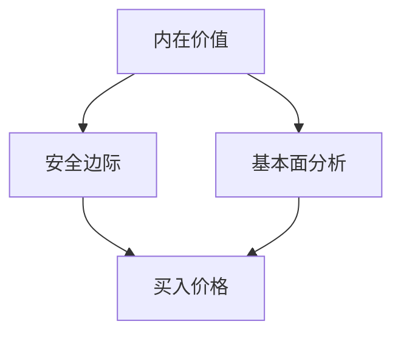
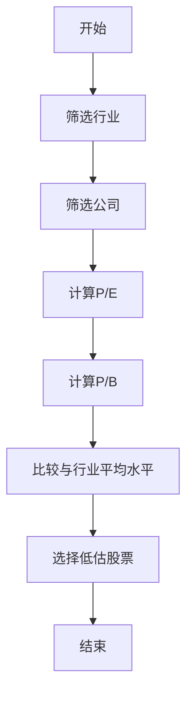
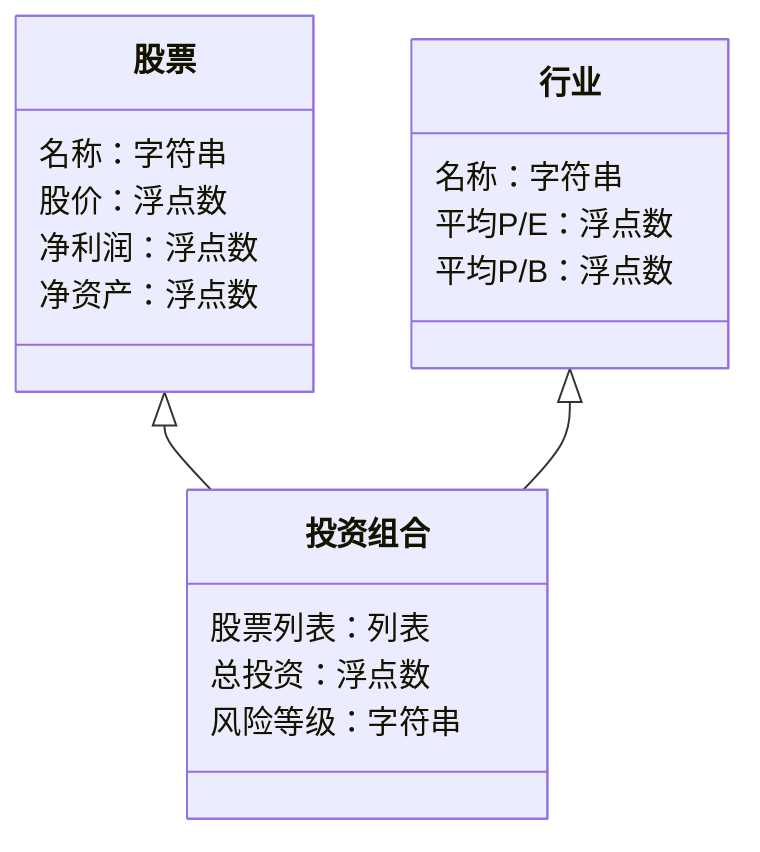
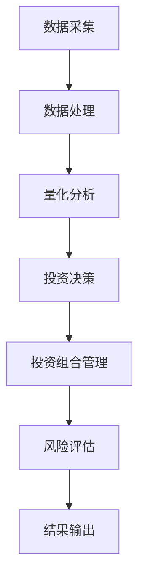
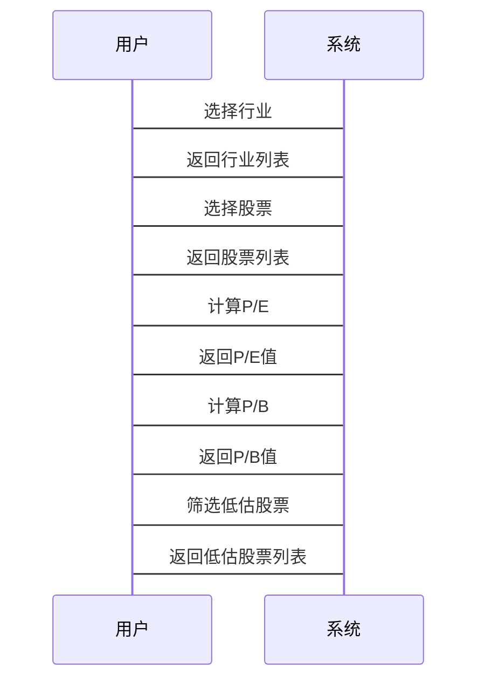

                 


# 罗伯特哈格斯特朗的新兴市场价值投资

> 关键词：价值投资，新兴市场，哈格斯特朗，投资策略，风险管理

> 摘要：本文系统地介绍了罗伯特哈格斯特朗的新兴市场价值投资方法，从核心概念、算法原理到系统架构、项目实战，全面剖析了其投资理念和实践策略。通过详细讲解价值投资的定义、分析框架、量化方法、数学模型以及系统架构，帮助读者深入理解如何在新兴市场中寻找低估股票，并构建稳健的投资组合。

---

## 第一部分: 价值投资的基本原理

### 第1章: 价值投资概述

#### 1.1 价值投资的定义与核心理念
##### 1.1.1 价值投资的定义
价值投资是一种以基本面分析为基础的投资策略，旨在通过识别市场价格低于其内在价值的股票，实现长期稳定的收益。其核心理念在于寻找市场中的“烟蒂股”，即具有低估特征的股票。

##### 1.1.2 价值投资的核心理念
- **安全边际**：买入价格低于内在价值，以降低投资风险。
- **长期视角**：关注企业的长期盈利能力，而非短期市场波动。
- **逆向思维**：在市场恐慌时寻找机会，在市场狂热时保持冷静。

##### 1.1.3 价值投资与新兴市场的结合
新兴市场具有高成长性和高波动性的特点，价值投资在其中的应用需要结合市场特性，寻找具有竞争优势的公司，同时注重估值的合理性。

#### 1.2 新兴市场的特点与投资机会
##### 1.2.1 新兴市场的定义与特点
新兴市场通常指那些经济快速增长、但金融市场尚未完全成熟的国家。其特点包括高增长率、高波动性、市场流动性不足等。

##### 1.2.2 新兴市场的投资机会
- **高成长性**：新兴市场的GDP增速通常高于发达市场。
- **低估股票**：新兴市场中许多股票由于信息不对称或市场情绪影响，往往被低估。
- **多样化**：新兴市场涵盖多个行业和领域，提供了丰富的投资选择。

##### 1.2.3 罗伯特哈格斯特朗在新兴市场的投资实践
罗伯特哈格斯特朗以其独特的价值投资方法，在新兴市场中取得了显著的投资业绩。他注重公司基本面分析，寻找具有强大竞争优势且估值合理的企业。

#### 1.3 罗伯特哈格斯特朗的价值投资方法
##### 1.3.1 罗伯特哈格斯特朗的背景介绍
罗伯特哈格斯特朗是新兴市场价值投资领域的权威，其投资理念强调基本面分析和长期视角。

##### 1.3.2 罗伯特哈格斯特朗的价值投资理念
- **注重基本面**：分析企业的财务报表，关注盈利能力、资产负债情况等。
- **寻找低估股票**：通过比较市盈率、市净率等指标，寻找市场价格低于内在价值的股票。
- **分散投资**：通过投资组合的分散化降低风险。

##### 1.3.3 罗伯特哈格斯特朗的投资策略
罗伯特哈格斯特朗的投资策略包括以下几个方面：
1. **行业选择**：关注具有成长性且竞争壁垒高的行业。
2. **个股筛选**：通过量化指标筛选低估股票。
3. **长期持有**：避免频繁交易，降低交易成本。

### 第2章: 价值投资的核心概念与联系

#### 2.1 价值投资的核心要素
##### 2.1.1 核心概念的定义
价值投资的核心要素包括：
- **内在价值**：股票的真实价值，通常通过DCF模型计算。
- **安全边际**：买入价格低于内在价值的部分。
- **基本面分析**：通过财务报表分析企业的盈利能力、财务状况等。

##### 2.1.2 核心要素的特征对比
| 核心要素 | 定义 | 特征 |
|----------|------|------|
| 内在价值 | 股票的真实价值 | 受企业未来现金流影响，需通过模型计算 |
| 安全边际 | 买入价格与内在价值的差额 | 提供风险缓冲，降低投资风险 |
| 基本面分析 | 通过财务报表分析企业 | 强调企业的盈利能力和财务健康 |

##### 2.1.3 核心要素的相互关系
图2-1展示了价值投资核心要素的相互关系：



#### 2.2 价值投资与成长投资的区别与联系
##### 2.2.1 价值投资与成长投资的定义对比
- **价值投资**：寻找市场价格低于内在价值的股票。
- **成长投资**：投资于具有高成长潜力的公司。

##### 2.2.2 价值投资与成长投资的核心区别
| 方面 | 价值投资 | 成长投资 |
|------|----------|----------|
| 投资目标 | 寻找低估股票 | 投资高成长公司 |
| 关注点 | 当前估值 | 未来成长性 |
| 风险承受 | 较低 | 较高 |

##### 2.2.3 价值投资与成长投资的联系
两者都强调基本面分析，但侧重点不同。价值投资注重当前估值，而成长投资注重未来成长潜力。在实际投资中，两者可以结合使用，构建多元化投资组合。

#### 2.3 价值投资组合的构建方法
##### 2.3.1 投资组合的定义与目标
投资组合是指投资者持有的各种资产的组合，目标是通过多元化降低风险并实现收益最大化。

##### 2.3.2 投资组合的构建步骤
1. **确定投资目标**：明确投资期限、风险承受能力。
2. **选择投资策略**：根据目标选择价值投资、成长投资或其他策略。
3. **筛选股票**：通过基本面分析和量化指标筛选股票。
4. **分配资产**：根据风险偏好分配资产比例。
5. **定期调整**：根据市场变化和公司情况调整投资组合。

##### 2.3.3 投资组合的风险管理
- **分散投资**：通过投资不同行业和公司的股票降低风险。
- **止损策略**：设定止损点，避免重大亏损。
- **定期评估**：定期评估投资组合的表现，及时调整。

### 第3章: 价值投资的量化分析方法

#### 3.1 量化分析方法概述
量化分析是通过数学模型和算法对股票进行筛选和评估。常用指标包括市盈率（P/E）、市净率（P/B）、股息率等。

#### 3.2 量化分析的核心算法
##### 3.2.1 市盈率（P/E）计算
市盈率是股票价格与每股收益的比值，公式为：
$$ P/E = \frac{股票价格}{每股收益} $$

##### 3.2.2 市净率（P/B）计算
市净率是股票价格与每股净资产的比值，公式为：
$$ P/B = \frac{股票价格}{每股净资产} $$

##### 3.2.3 股息率计算
股息率是每股股息与股票价格的比值，公式为：
$$ 股息率 = \frac{每股股息}{股票价格} $$

##### 3.2.4 筛选低估股票的流程
图3-1展示了筛选低估股票的流程：



#### 3.3 量化分析的数学模型
##### 3.3.1 现金流折现模型（DCF）
DCF模型用于估算企业的内在价值，公式为：
$$ V = \frac{CF_1}{(1+r)^1} + \frac{CF_2}{(1+r)^2} + \dots + \frac{CF_n}{(1+r)^n} $$

##### 3.3.2 市盈率与市净率的对比
通过比较市盈率和市净率，可以更全面地评估股票的价值。例如，对于一家银行，市净率可能比市盈率更相关。

#### 3.4 量化分析的代码实现
以下是使用Python计算市盈率和市净率的示例代码：

```python
import pandas as pd

# 假设df是包含股票数据的DataFrame，包括股票名称、股价、净利润、净资产
df['P/E'] = df['股价'] / df['净利润']
df['P/B'] = df['股价'] / df['净资产']
# 筛选P/E和P/B均低于行业平均水平的股票
industry_avg_pe = df['行业'].mean()
industry_avg_pb = df['行业'].mean()
undervalued_stocks = df[(df['P/E'] < industry_avg_pe) & (df['P/B'] < industry_avg_pb)]
print(undervalued_stocks)
```

---

## 第二部分: 价值投资的系统架构与实战

### 第4章: 价值投资的系统架构设计

#### 4.1 系统功能设计
##### 4.1.1 领域模型类图
图4-1展示了价值投资系统的核心领域模型类图：



##### 4.1.2 系统架构设计
图4-2展示了系统的整体架构：



#### 4.2 系统交互设计
##### 4.2.1 交互序列图
图4-3展示了用户与系统的交互流程：



### 第5章: 价值投资的项目实战

#### 5.1 项目环境安装
- **工具安装**：安装Python、Pandas、NumPy等工具。
- **数据获取**：通过API获取股票数据。

#### 5.2 核心代码实现
以下是筛选低估股票的核心代码：

```python
import pandas as pd
import requests

# 获取股票数据
def get_stock_data(api_key):
    url = f"https://api.example.com/stock_data?api_key={api_key}"
    response = requests.get(url)
    data = response.json()
    df = pd.DataFrame(data)
    return df

# 计算P/E和P/B
def calculate_valuation Metrics(df):
    df['P/E'] = df['股价'] / df['净利润']
    df['P/B'] = df['股价'] / df['净资产']
    return df

# 筛选低估股票
def screen_undervalued_stocks(df, industry_avg_pe, industry_avg_pb):
    df['是否低估'] = (df['P/E'] < industry_avg_pe) & (df['P/B'] < industry_avg_pb)
    return df

# 主函数
def main():
    api_key = "your_api_key"
    df = get_stock_data(api_key)
    df = calculate_valuation_metrics(df)
    industry_avg_pe = df.groupby('行业')['P/E'].mean()
    industry_avg_pb = df.groupby('行业')['P/B'].mean()
    undervalued_df = screen_undervalued_stocks(df, industry_avg_pe, industry_avg_pb)
    print(undervalued_df)

if __name__ == "__main__":
    main()
```

#### 5.3 项目小结
通过上述代码，我们可以实现对新兴市场中低估股票的筛选。这只是一个基础示例，实际投资中需要考虑更多因素，如行业竞争、管理团队等。

---

## 第三部分: 价值投资的最佳实践

### 第6章: 最佳实践与小结

#### 6.1 最佳实践
- **持续学习**：不断更新知识，关注市场变化。
- **风险管理**：合理控制仓位，设置止损点。
- **分散投资**：避免过度集中，降低风险。

#### 6.2 小结
价值投资是一种长期有效的投资策略，但在新兴市场中需要结合市场特点灵活运用。通过量化分析和系统架构设计，可以帮助投资者更高效地筛选股票，构建稳健的投资组合。

#### 6.3 注意事项
- **信息不对称**：新兴市场信息透明度较低，需谨慎选择数据来源。
- **市场波动**：新兴市场波动较大，需做好心理准备。
- **政策风险**：关注政策变化，避免因政策调整导致的损失。

#### 6.4 拓展阅读
- 《The Intelligent Investor》
- 《新兴市场的投资机会与风险》
- 《量化投资：算法与策略》

---

## 作者信息

作者：AI天才研究院/AI Genius Institute & 禅与计算机程序设计艺术/Zen And The Art of Computer Programming

---

以上是《罗伯特哈格斯特朗的新兴市场价值投资》的技术博客文章大纲，涵盖了从理论到实践的各个方面，适合对价值投资和新兴市场感兴趣的技术读者阅读。

