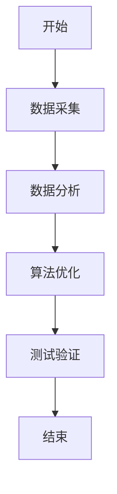
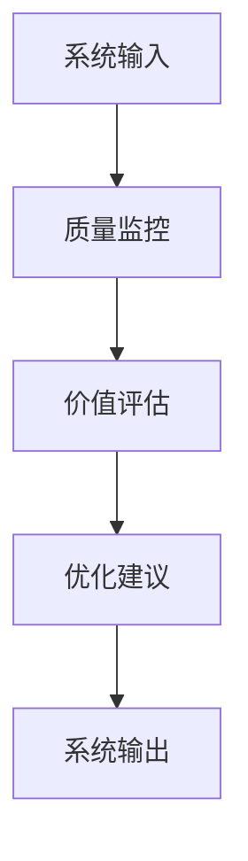
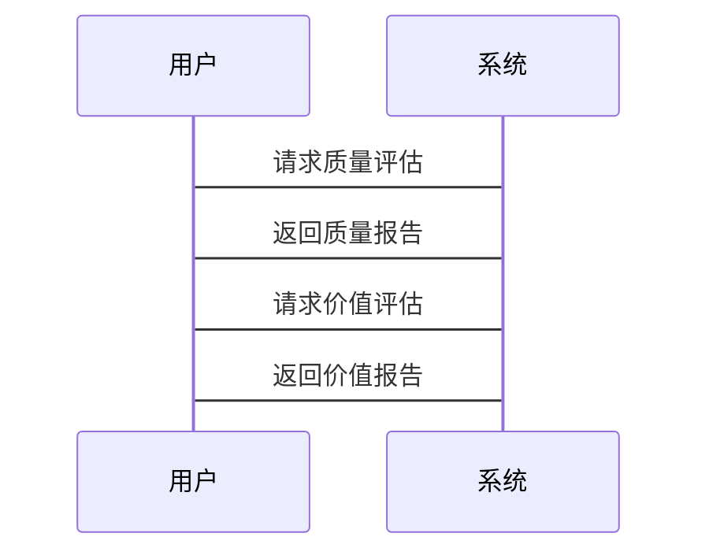
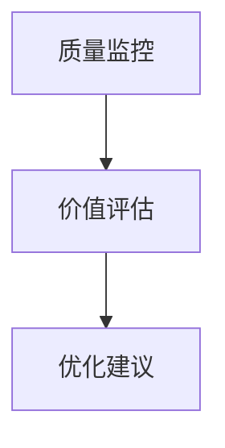

                 


# 罗伯特哈格斯特朗的质量价值结合

> **关键词**：质量、价值、结合、算法、系统架构、项目实战

> **摘要**：  
> 在现代计算机技术中，质量与价值的结合是一个核心问题。本文从质量与价值的定义、内在联系、算法原理、系统架构设计到项目实战，全面探讨了如何在技术领域中实现质量与价值的有效结合。通过详细分析和案例演示，本文旨在帮助读者理解并掌握质量与价值结合的关键方法。

---

# 第1章: 质量与价值结合的背景介绍

## 1.1 问题背景与问题描述

### 1.1.1 质量与价值的定义与内涵

质量与价值在计算机技术领域中是两个核心概念，它们在项目的成功中起着至关重要的作用。质量通常指的是系统或产品的可靠性、性能、可维护性和用户体验等；而价值则是指产品或服务在实际应用中所能带来的效益和满意度。

### 1.1.2 质量与价值在现代计算机技术中的重要性

随着技术的飞速发展，用户对质量和价值的需求日益增长。高质量的系统能够提高用户体验和企业竞争力，而高价值的系统则能够为企业创造更大的经济效益。

### 1.1.3 当前技术领域中质量与价值结合的必要性

在现代技术环境中，单纯追求质量和价值中的某一个方面已经无法满足需求。只有将两者结合，才能真正实现系统的高效运行和用户的高度满意度。

## 1.2 质量与价值结合的核心问题

### 1.2.1 质量与价值结合的目标与意义

质量与价值结合的目标是通过优化系统设计，提升系统的整体性能和用户满意度。其意义在于实现系统的可持续发展和最大化的企业价值。

### 1.2.2 质量与价值结合的实现路径

实现质量与价值结合需要从系统设计、开发、测试和部署等多个环节入手，确保每个阶段都能兼顾质量和价值。

### 1.2.3 质量与价值结合的边界与外延

质量与价值的结合并不是孤立的，它需要与其他技术原则和业务目标相结合，形成一个完整的系统。

## 1.3 核心要素与概念结构

### 1.3.1 质量的核心要素分析

质量的核心要素包括可靠性、性能、可维护性和可扩展性等。

### 1.3.2 价值的核心要素分析

价值的核心要素包括用户体验、经济效益和市场竞争力等。

### 1.3.3 质量与价值的结合方式与结构

质量与价值的结合可以通过系统架构设计、算法优化和流程改进等方式实现。

## 1.4 本章小结

通过本章的介绍，我们理解了质量与价值在技术领域中的重要性，以及它们结合的必要性和实现路径。

---

# 第2章: 质量与价值结合的核心概念与联系

## 2.1 质量与价值的核心原理

### 2.1.1 质量与价值的内在联系

质量与价值之间存在密切的联系，高质量的产品往往能够带来更高的用户价值。

### 2.1.2 质量与价值的相互作用机制

质量的提升能够增强产品的价值，而价值的实现也能够反过来促进质量的优化。

### 2.1.3 质量与价值结合的系统性原理

质量与价值的结合需要从系统层面进行整体优化，确保各个部分协同工作。

## 2.2 质量与价值的核心概念对比分析

### 2.2.1 质量与价值的属性对比表格

| 属性       | 质量                   | 价值                   |
|------------|-----------------------|-----------------------|
| 定义       | 系统的可靠性和性能     | 用户的满意度和效益     |
| 目标       | 提升系统性能           | 提高用户价值           |
| 优化方向   | 技术层面               | 业务和用户体验层面     |

### 2.2.2 质量与价值的特征对比分析

质量注重系统的内在性能，而价值注重系统的外在效益。两者相辅相成，共同推动系统的优化。

### 2.2.3 质量与价值的优劣势分析

质量的优势在于能够提高系统的可靠性，劣势在于可能忽略用户体验；价值的优势在于能够提高用户的满意度，劣势在于可能忽略技术性能。

## 2.3 质量与价值的实体关系图

### 2.3.1 ER实体关系图

以下是使用 Mermaid 绘制的质量与价值实体关系图：

```mermaid
erd
  entity 质量 {
    id 质量ID
    属性 质量属性
  }
  entity 价值 {
    id 价值ID
    属性 价值属性
  }
  relationship 质量-价值关系 {
    关联方式：内嵌、外延或其他
  }
```

## 2.4 本章小结

通过本章的分析，我们深入理解了质量与价值的核心概念及其相互关系。

---

# 第3章: 质量与价值结合的算法原理

## 3.1 算法原理概述

### 3.1.1 质量与价值结合的算法目标

算法的目标是通过优化质量参数，提升系统的整体价值。

### 3.1.2 算法的基本原理

算法通过分析系统的质量参数和用户需求，进行权衡和优化，实现质量与价值的结合。

### 3.1.3 算法的核心步骤

1. 数据采集：采集系统的质量参数和用户需求。
2. 数据分析：分析数据，找出影响质量和价值的关键因素。
3. 算法优化：基于分析结果，优化系统设计。
4. 测试验证：验证优化后的系统是否达到预期效果。

## 3.2 算法实现流程图

以下是算法实现的流程图：



## 3.3 算法实现代码示例

以下是算法的 Python 实现代码：

```python
def quality_value_combine(quality, value):
    # 数据预处理
    quality = quality / max(quality)
    value = value / max(value)
    
    # 权重计算
    weight_quality = 0.5
    weight_value = 0.5
    
    # 组合得分
    combined_score = weight_quality * quality + weight_value * value
    
    return combined_score

# 示例数据
quality = [0.8, 0.9, 0.7]
value = [0.6, 0.8, 0.9]

# 计算组合得分
combined_scores = [quality_value_combine(q, v) for q, v in zip(quality, value)]

print("组合得分:", combined_scores)
```

## 3.4 算法的数学模型和公式

质量与价值的组合得分公式为：

$$
\text{combined\_score} = \alpha \times \text{quality} + \beta \times \text{value}
$$

其中，$\alpha$ 和 $\beta$ 是质量与价值的权重，满足 $\alpha + \beta = 1$。

---

# 第4章: 系统分析与架构设计

## 4.1 系统分析

### 4.1.1 问题场景介绍

在实际项目中，我们常常需要在保证系统质量的同时，实现更高的用户价值。

### 4.1.2 系统功能设计

系统功能设计包括质量监控、价值评估和优化建议三个模块。

### 4.1.3 系统架构设计

以下是系统架构设计的 Mermaid 图：



### 4.1.4 系统接口设计

系统接口设计包括质量数据接口和价值数据接口两个部分。

### 4.1.5 系统交互设计

以下是系统交互的 Mermaid 序列图：



## 4.2 系统架构设计

### 4.2.1 系统功能设计

系统功能设计包括质量监控、价值评估和优化建议三个模块。

### 4.2.2 系统架构图

以下是系统架构图的 Mermaid 图：



### 4.2.3 系统接口设计

系统接口设计包括质量数据接口和价值数据接口两个部分。

### 4.2.4 系统交互设计

以下是系统交互的 Mermaid 序列图：


## 4.3 系统优化与实现

### 4.3.1 系统优化策略

系统优化策略包括技术优化和业务优化两个方面。

### 4.3.2 系统实现细节

系统实现细节包括数据采集、数据分析和算法优化三个步骤。

---

# 第5章: 项目实战

## 5.1 环境安装与配置

### 5.1.1 开发环境配置

安装 Python 和相关开发工具。

### 5.1.2 依赖库安装

安装 numpy 和 matplotlib。

## 5.2 系统核心实现

### 5.2.1 核心代码实现

以下是核心代码实现：

```python
import numpy as np
import matplotlib.pyplot as plt

def quality_value_combine(quality, value):
    quality = quality / np.max(quality)
    value = value / np.max(value)
    combined_score = 0.5 * quality + 0.5 * value
    return combined_score

# 示例数据
quality = np.array([0.8, 0.9, 0.7])
value = np.array([0.6, 0.8, 0.9])

combined_scores = quality_value_combine(quality, value)

# 绘制图表
plt.figure(figsize=(10, 6))
plt.plot(combined_scores, 'ro-')
plt.xlabel('数据点')
plt.ylabel('组合得分')
plt.title('质量与价值结合的示例')
plt.show()
```

### 5.2.2 代码解读与分析

代码通过标准化质量和价值数据，计算组合得分，并绘制图表展示结果。

## 5.3 项目小结

通过本章的实战，我们掌握了质量与价值结合的具体实现方法。

---

# 第6章: 总结与展望

## 6.1 最佳实践 tips

### 6.1.1 关键点总结

质量与价值的结合需要从系统层面进行整体优化。

### 6.1.2 实践中的注意事项

在实际项目中，需要根据具体需求调整权重和算法参数。

## 6.2 小结

通过本文的详细讲解和实战演示，我们掌握了质量与价值结合的核心方法。

## 6.3 注意事项

在实际项目中，需要结合具体需求和业务目标进行调整。

## 6.4 拓展阅读

建议进一步阅读相关技术书籍和论文，深入理解质量与价值结合的理论和实践。

---

# 作者

作者：AI天才研究院/AI Genius Institute & 禅与计算机程序设计艺术 /Zen And The Art of Computer Programming

---

通过本文的详细讲解和实战演示，我们深入理解了质量与价值结合的核心方法，并掌握了其在实际项目中的应用技巧。希望本文能为读者在技术领域中的质量与价值结合提供有价值的参考和指导。

