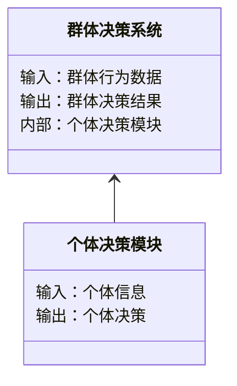

                 


# 羊群效应：理解并避免从众心理陷阱

> 关键词：羊群效应，从众心理，社会心理学，算法原理，系统设计，项目实战

> 摘要：羊群效应是一种常见的社会现象，表现为个体在决策时受到群体影响，倾向于跟随大多数人。本文从技术角度分析羊群效应的原理、算法模型、系统设计，并通过项目实战帮助读者理解如何识别和避免羊群效应的陷阱。

---

## 第一部分：羊群效应的背景与概述

### 第1章：羊群效应的定义与问题背景

#### 1.1 羊群效应的定义与核心概念
- **羊群效应的定义**：羊群效应指个体在决策时受到群体行为的影响，倾向于跟随大多数人，而非独立思考。
- **核心要素**：
  - **个体行为**：个体的决策受群体影响。
  - **群体行为**：群体行为的扩散和强化。
  - **环境因素**：信息不对称、不确定性等环境因素加剧羊群效应。

#### 1.2 羊群效应的背景与问题描述
- **背景**：现代社会信息爆炸，个体决策依赖网络和社交媒体，增加了羊群效应的风险。
- **问题描述**：羊群效应导致群体性错误决策，降低决策效率，加剧市场波动。

### 第2章：羊群效应的典型案例分析

#### 2.1 经济学中的羊群效应
- **案例**：2008年金融危机中的投资者跟风行为。
- **分析**：投资者盲目跟随市场趋势，导致泡沫破裂。

#### 2.2 社会学中的群体性事件
- **案例**：社交媒体上的“#冰桶挑战”引发的模仿潮。
- **分析**：群体性行为的快速传播和放大效应。

---

## 第二部分：羊群效应的核心概念与原理

### 第3章：羊群效应的社会心理学原理

#### 3.1 社会影响力与从众心理
- **社会影响力**：个体行为受群体行为的影响。
- **从众心理**：个体为了融入群体，选择跟随大多数人。

#### 3.2 羊群效应与群体决策偏差
- **认知偏差**：群体决策中常见的确认偏差、 anchoring bias 等。
- **信息过滤**：个体只关注支持群体决策的信息，忽略反对意见。

### 第4章：羊群效应与个体差异

#### 4.1 个体差异对羊群效应的影响
- **性格特征**：外向型个体更易受群体影响。
- **信息处理能力**：信息处理能力强的个体更可能独立决策。

#### 4.2 羊群效应与个体认知差异
- **认知偏差**：个体的认知差异导致对群体决策的接受程度不同。
- **信息获取渠道**：个体获取信息的渠道影响其决策的独立性。

---

## 第三部分：羊群效应的算法原理

### 第5章：羊群效应的数学模型

#### 5.1 羊群效应的概率模型
- **贝叶斯定理**：用于分析个体在群体中的概率决策。
  $$P(A|B) = \frac{P(B|A)P(A)}{P(B)}$$

#### 5.2 群体决策的统计模型
- **群体决策的期望值**：$$E = \sum_{i=1}^{n} p_i x_i$$
  - $p_i$：个体i的影响力权重。
  - $x_i$：个体i的决策值。

### 第6章：羊群效应的算法实现

#### 6.1 羊群效应的模拟算法
- **算法步骤**：
  1. 初始化个体状态。
  2. 计算个体影响力权重。
  3. 更新个体决策值。
  4. 输出群体决策结果。

#### 6.2 羊群效应的避免算法
- **算法步骤**：
  1. 分析群体决策偏差。
  2. 提供独立决策支持。
  3. 引导理性决策。

---

## 第四部分：系统分析与架构设计

### 第7章：系统模型与功能设计

#### 7.1 领域模型


#### 7.2 系统架构设计


### 第8章：系统接口与交互设计

#### 8.1 系统接口设计
- **输入接口**：接收群体行为数据。
- **输出接口**：输出群体决策结果。

#### 8.2 系统交互流程图
```mermaid
sequenceDiagram
    用户 -> 群体决策系统：输入数据
    群体决策系统 -> 数据分析模块：分析数据
    数据分析模块 -> 决策支持模块：生成决策
    决策支持模块 -> 用户：输出结果
```

---

## 第五部分：项目实战

### 第9章：羊群效应识别系统开发

#### 9.1 环境安装与配置
- **工具**：Python、PyTorch、Matplotlib。
- **依赖**：安装必要的库，如pandas、numpy。

#### 9.2 核心代码实现
```python
import numpy as np
import matplotlib.pyplot as plt

def sheep_effect_model(individual_decisions, influence_weights):
    return np.dot(individual_decisions, influence_weights)

# 示例数据
individual_decisions = np.array([1, 1, 0, 0])
influence_weights = np.array([0.3, 0.3, 0.2, 0.2])
result = sheep_effect_model(individual_decisions, influence_weights)
print("群体决策结果：", result)
```

#### 9.3 案例分析与结果解读
- **案例**：模拟金融市场中的羊群效应。
- **结果解读**：群体决策结果偏离个体真实决策。

### 第10章：系统优化与改进

#### 10.1 系统优化方案
- **算法优化**：引入独立决策支持模块。
- **系统改进**：增强数据采集和分析能力。

---

## 第六部分：总结与最佳实践

### 第11章：总结与最佳实践

#### 11.1 核心内容回顾
- 羊群效应的定义、原理、算法模型。
- 系统设计与项目实战经验。

#### 11.2 最佳实践 tips
- **独立思考**：培养独立决策能力。
- **数据驱动**：依赖数据而非盲目跟风。
- **系统优化**：定期检查和优化决策系统。

#### 11.3 未来研究方向
- 羊群效应的算法改进。
- 群体决策的伦理问题。

---

## 作者信息

作者：AI天才研究院/AI Genius Institute & 禅与计算机程序设计艺术 /Zen And The Art of Computer Programming

---

希望这篇技术博客能帮助您深入理解羊群效应，并提供实际的方法来避免从众心理的陷阱。

