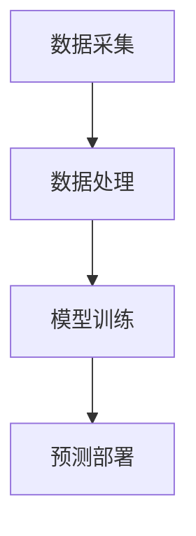
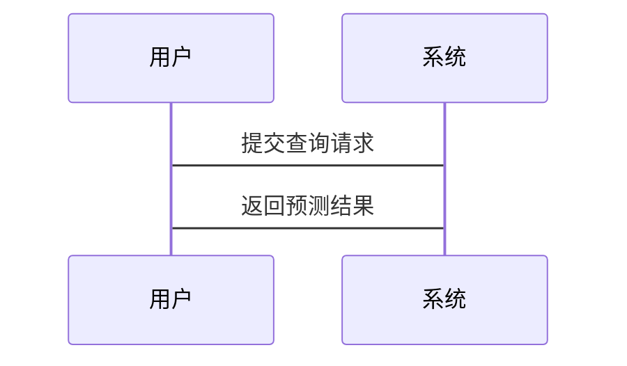
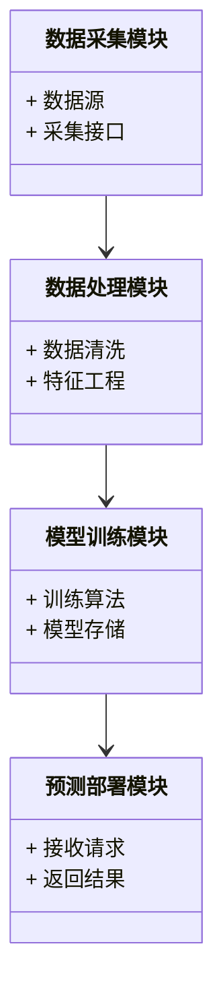
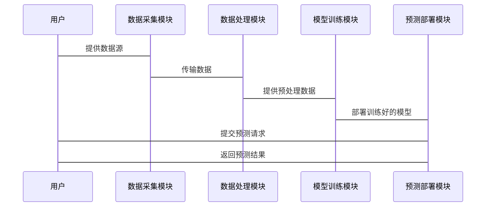
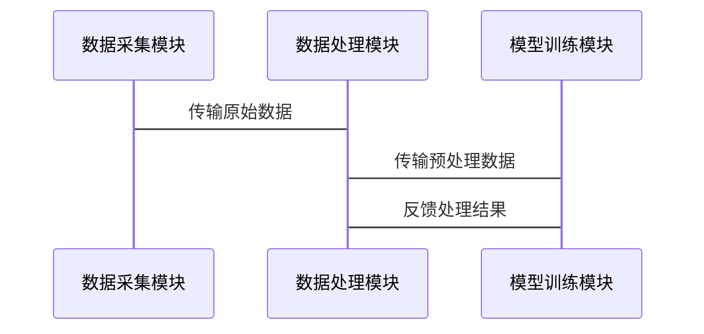

                 


# 第四部分：系统分析与架构设计方案

## 第4章：系统分析与架构设计

### 4.1 问题场景介绍

#### 4.1.1 问题背景
- 美国市场的复杂性和多样性
- 高效、准确的估值预测需求
- 系统化解决方案的必要性

#### 4.1.2 项目介绍
- 项目目标：构建一个高效的市场估值预测系统
- 项目范围：涵盖数据收集、模型训练、预测部署
- 项目需求：准确性、实时性、可扩展性

### 4.2 系统功能设计

#### 4.2.1 功能模块划分
- 数据采集模块：负责从多源数据中抓取市场数据
- 数据处理模块：对数据进行清洗和预处理
- 模型训练模块：基于历史数据训练预测模型
- 预测部署模块：实时接收输入并输出预测结果

#### 4.2.2 功能流程图（Mermaid）


#### 4.2.3 功能交互图（Mermaid）


### 4.3 系统架构设计

#### 4.3.1 架构设计原则
- 高可用性
- 高扩展性
- 易维护性

#### 4.3.2 系统架构图（Mermaid）


#### 4.3.3 系统接口设计
- 数据接口：API接口定义
- 模型接口：训练和预测接口
- 用户接口：HTTP请求接口

### 4.4 系统交互设计

#### 4.4.1 用户与系统交互流程（Mermaid）


#### 4.4.2 系统内部交互流程（Mermaid）


## 第5章：项目实战——基于Python的市场估值预测系统实现

### 5.1 环境安装与配置

#### 5.1.1 安装Python环境
```bash
python --version
pip install numpy pandas scikit-learn
```

#### 5.1.2 数据获取与存储
- 数据源：美国市场历史数据（如股票价格、财务指标等）
- 数据格式：CSV格式
- 数据存储：本地文件或数据库

### 5.2 系统核心实现源代码

#### 5.2.1 数据预处理代码
```python
import pandas as pd

# 读取数据
data = pd.read_csv('market_data.csv')

# 数据清洗
data.dropna(inplace=True)
data = data[~data['date'].isnull()]
data['date'] = pd.to_datetime(data['date'])
data = data.sort_values('date')
```

#### 5.2.2 特征工程代码
```python
import numpy as np

# 特征选择
features = ['open', 'high', 'low', 'volume']
target = 'close'

# 特征标准化
from sklearn.preprocessing import StandardScaler

scaler = StandardScaler()
scaled_features = scaler.fit_transform(data[features])
```

#### 5.2.3 模型训练代码
```python
from sklearn.linear_model import LinearRegression
from sklearn.metrics import mean_squared_error

# 训练模型
model = LinearRegression()
model.fit(scaled_features, data[target])

# 模型评估
predictions = model.predict(scaled_features)
mse = mean_squared_error(data[target], predictions)
print(f'Mean Squared Error: {mse}')
```

#### 5.2.4 模型部署代码
```python
import joblib

# 模型保存
joblib.dump(model, 'market_prediction_model.pkl')
joblib.dump(scaler, 'feature_scaler.pkl')

# 模型加载与预测
loaded_model = joblib.load('market_prediction_model.pkl')
loaded_scaler = joblib.load('feature_scaler.pkl')

# 接收输入并预测
input_data = loaded_scaler.transform(new_data[features])
prediction = loaded_model.predict(input_data)
```

### 5.3 代码应用解读与分析

#### 5.3.1 数据预处理
- 删除缺失值
- 转换日期格式
- 数据排序

#### 5.3.2 特征工程
- 选择相关特征
- 标准化处理

#### 5.3.3 模型训练
- 使用线性回归模型
- 训练模型并评估性能

#### 5.3.4 模型部署
- 模型保存与加载
- 接收新数据并进行预测

### 5.4 实际案例分析与详细解读

#### 5.4.1 数据分析
- 描述性统计分析
- 数据可视化（如折线图、散点图）

#### 5.4.2 模型评估
- �均方误差（MSE）
- 决定系数（R²）
- 回归系数解读

#### 5.4.3 模型优化
- 调整模型参数
- 引入其他算法（如随机森林、神经网络）
- 超参数优化

### 5.5 项目小结

#### 5.5.1 成功经验总结
- 数据预处理的重要性
- 特征选择的有效性
- 模型优化的必要性

#### 5.5.2 项目经验与教训
- 数据质量的关键作用
- 模型选择的灵活性
- 系统设计的合理性

## 第6章：总结与启示

### 6.1 成功经验总结

#### 6.1.1 核心要素总结
- 数据质量
- 模型选择
- 系统设计

#### 6.1.2 问题解决总结
- 数据预处理
- 特征工程
- 模型优化

### 6.2 问题挑战与改进建议

#### 6.2.1 面临的挑战
- 数据实时性
- 模型泛化能力
- 系统可扩展性

#### 6.2.2 改进建议
- 引入实时数据流处理
- 使用更复杂的模型（如深度学习）
- 优化系统架构设计

### 6.3 启示与展望

#### 6.3.1 对未来研究的启示
- 多因子模型研究
- 高频交易策略
- 市场情绪分析

#### 6.3.2 对实践应用的启示
- 数据驱动决策
- 模型迭代优化
- 系统持续改进

### 6.4 最佳实践 Tips

#### 6.4.1 数据处理 Tips
- 数据清洗要彻底
- 特征选择要精准
- 数据预处理要标准化

#### 6.4.2 模型优化 Tips
- 参数调优要系统
- 模型评估要全面
- 算法选择要灵活

#### 6.4.3 系统设计 Tips
- 架构设计要合理
- 模块划分要清晰
- 接口设计要规范

### 6.5 小结

#### 6.5.1 核心内容回顾
- 市场估值预测的核心概念
- 系统设计与实现
- 项目实战与总结

#### 6.5.2 总结与展望
- 成功经验总结
- 未来研究方向
- 实际应用启示

## 作者

作者：AI天才研究院/AI Genius Institute & 禅与计算机程序设计艺术 /Zen And The Art of Computer Programming

---

# 结语

通过本文的系统分析与实践，我们深入探讨了美国市场估值预测的成功经验及其启示。从核心概念的理解，到算法原理的实现，再到系统设计与项目实战，我们逐步构建了一个完整的市场估值预测系统。希望本文能为读者在市场估值预测领域提供有价值的参考与启示。

